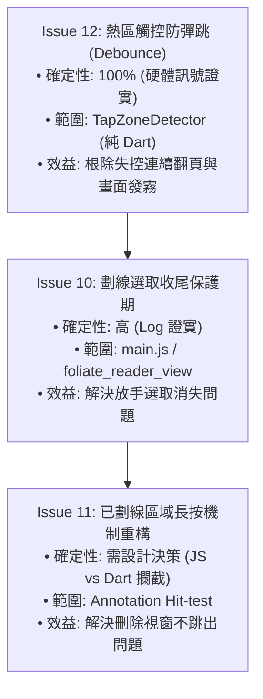

# Epic 27 Issue 10、11、12 — 深入分析與後續實作計畫報告

**文件狀態**：已定案（Final Analysis Report）  
**建立日期**：2026-08-24  
**測試與回報裝置**：
- Mobiscribe WAVE（Android 12，WebView Chrome 91）
- AiPaper Reader C（Android 16，WebView Chrome 150）  
**關聯文件**：
- [`docs/epics/epic-27-reader-device-compat/issues.md`](file:///U:/MyDeveloper/AI/elinkBook/docs/epics/epic-27-reader-device-compat/issues.md)（Issue 9、10、11、12）
- [`docs/epics/epic-27-reader-device-compat/reviews/bugfix-repro.md`](file:///U:/MyDeveloper/AI/elinkBook/docs/epics/epic-27-reader-device-compat/reviews/bugfix-repro.md)（真機日誌與硬體訊號原始記錄）
- [`docs/epics/epic-27-reader-device-compat/plans/plan-issue-9.md`](file:///U:/MyDeveloper/AI/elinkBook/docs/epics/epic-27-reader-device-compat/plans/plan-issue-9.md)（已完成之 Issue 9 實作計畫）

---

## 執行摘要（Executive Summary）

在完成 **Issue 9**（實作 `TapZoneDetector` 的 `onPointerMove` 熔斷機制 ＋ `main.js` 開啟 `no-swipe` 停用內建滑動換頁）後，流式 EPUB 畫線時誤觸翻頁的核心問題已順利解決。

然而，在真機進行高頻度劃線與長按手勢驗證時，進一步浮現了三項操作體驗問題（Issue 10、11、12）。本報告透過 **Chromium Puppeteer 差分測試**、**真機 Logcat 逐行時序分析** 以及 **Linux 核心層 `getevent` 原始硬體訊號側錄**，釐清這三個問題與 Issue 9 的關係，並擬定後續實作策略與優先順序。

---

## 一、 問題與 Issue 9 修改之關聯性矩陣

| 工單 | 症狀核心 | 根因屬性 | 與 Issue 9 的因果關係評估 |
| :--- | :--- | :--- | :--- |
| **Issue 10** | 選字選不到、滑動選完放開手指後選區常常消失 | 瀏覽器原生手勢收尾判定誤判 | **非 Issue 9 造成之迴歸**。<br/>自動化測試證實 `no-swipe` 前後選取維持能力完全一致。當翻頁干擾被消除後，原生 Chromium 將「手指離開控點的微小物理抖動」解讀為「點擊選區外以取消選取」的底層行為浮現。 |
| **Issue 11** | 長按已劃線區域不跳刪除確認，反而跳出建立新劃線工具列 | 原生長按選字 vs SVG Overlayer 點擊衝突 | **既有架構設計衝突**。<br/>自 `epic-25` Issue 4 機制設計以來即存在。原生長按選字在 Android WebView 底層優先建立，導致傳遞給 SVG 標記層的 Click 事件全程 0 次觸發。 |
| **Issue 12** | 手指按住時偶發連續失控自動翻頁、畫面殘影發霧 | 觸控 IC 硬體訊號彈跳（Touch Bounce） | **純硬體/驅動層級現象**。<br/>`adb shell getevent` 抓到 Cypress 觸控 IC 於 1.1 秒內在同座標回報 7 次按下/放開，軟體端忠實判定為多次合法點擊所致。 |

---

## 二、 個別問題深度技術剖析

### 1. Issue 10：流式 EPUB 選字選不到、選完後選取常常消失

#### (1) 真機除錯證據
- **Logcat 時序**：在多台裝置反覆錄得以下典型序列：
  ```text
  [DIAG-issue10] reportSelection: changed, textLength=1 ...
  [DIAG-issue10] reportSelection: changed, textLength=47 ... (選取已擴大至47字)
  [DIAG-issue10] native click fired: elapsedSinceTouchStart=0ms -> 判定為快速點擊攔截
  [DIAG-issue10] reportSelection: cleared/collapsed (選區瞬間清空)
  ```
- **Puppeteer 差分驗證**：在 Headless 環境中模擬選取建立後的小幅拖曳放開，Issue 9 之前（`main.base.js`）與之後（`main.fixed.js`）的選取狀態皆維持 `collapsed: false`，排除 JS 邏輯破壞選取。

#### (2) 機制成因
使用者在選字拖曳結束、手指離開觸控螢幕的瞬間，因電子紙摩擦力或手指微彈，產生了極短時間（<50ms）的微小位移。Chromium 事件處理管線將此判定為「點擊在已選取文字之外」，觸發了瀏覽器內建的取消選取行為（`Selection.removeAllRanges()`）。

#### (3) 建議解法方案
- **選取收尾保護期（Selection Release Guard）**：
  在 `main.js` 或 `foliate_reader_view.dart` 監聽 `touchend` 事件，若放開時 `Selection` 處於非折疊狀態，在接下來的 100~150ms 內抑制任何由外部點擊引發的 `clearSelection` 請求，防止短暫的 click 誤清空選區。

---

### 2. Issue 11：長按已劃線區域完全不會跳出刪除確認視窗

#### (1) 真機除錯證據
- 在真機上對已劃線文字刻意按住超過 1 秒放開，Logcat 顯示：
  - `show-annotation` 事件（`main.js:636`，`#createOverlayer` 命中）**全程 0 次觸發**。
  - 同一時段大量觸發 `reportSelection: changed, textLength=1`。
  - 畫面彈出 Flutter 的 `AnnotationToolbar`（建立新劃線工具列），而非 `_showAnnotationActionDialog`（刪除確認）。

#### (2) 機制成因
- **既有機制限制**：`main.js:830-857`（`epic-25` Issue 4）規定點擊必須按壓超過 700ms 才會放行 click 事件進入 Overlayer 監聽器。
- **底層搶佔**：原生長按選字是由 Chromium 引擎在底層文字節點直接發動，完全不受上層 SVG 疊加層遮擋。當使用者長按已劃線文字時，原生選字機制優先搶先觸發，直接吞噬或中斷了合成 Click 的傳遞鏈路，使得 `show-annotation` 永遠無法被命中。

#### (3) 建議解法方案
- **方案 A（JS 觸控命中直接攔截，推薦）**：
  在 `touchstart` 時，以觸控座標進行 Annotation Bounding Rect 比對；若落點處於已存在之劃線範圍內，主動阻止原生選字事件擴散（`preventDefault`），當放開且時長達標時直接觸發 `show-annotation`。
- **方案 B（Dart 側選區比對轉派發）**：
  當 Dart 端收到 `onSelectionChanged` 時，比對新選取之 CFI 是否完全落在既有 Annotation 的 CFI 範圍內；若是，則隱藏 `AnnotationToolbar`，改為呼叫 `_showAnnotationActionDialog`。

---

### 3. Issue 12：觸控硬體「彈跳」訊號導致連續失控自動翻頁

#### (1) 底層硬體訊號證據（鐵證）
使用 `adb shell getevent -t -l /dev/input/event4` 直接監聽 Cypress `cyttsp5_mt` 觸控 IC：
- **時間段 1（共 1.119 秒）**：
  - 出現 **7 次獨立的 `BTN_TOOL_FINGER DOWN` 事件**，相鄰間隔僅 86～326 毫秒。
  - 觸控座標 X 全程為 842～844（誤差僅 2px），Y 落在 639～713（誤差 <74px）。
- **時間段 2（共 1.016 秒）**：
  - 出現 4 次獨立按下事件，其中一次「放開至再按下」間隔僅 219 毫秒，座標幾乎完全靜止（X: 1358→1365，Y: 1178→1164）。

#### (2) 機制成因
人類手指實體不可能在 80~200ms 的極短間隔內、以 2px 的極高精確度在同一位置反覆抬起與點擊。此為觸控 IC 之硬體雜訊或除彈跳（Debounce）電路特性所致的「硬體彈跳（Touch Bounce）」。
`TapZoneDetector` 與 `_handleZoneAction` 忠實地將每次硬體回報判定為合法快速點擊，連續觸發 3~4 次翻頁；而 E-Ink 電子紙面板在極短時間內承受多次全螢幕/局部刷新，產生了灰霧狀的畫面殘影。

#### (3) 建議解法方案
- **軟體防彈跳（Debounce / Throttling）**：
  在 `TapZoneDetector`（`app/lib/reader/tap_zone_detector.dart`）內記錄前次觸發的 `_lastTapTimeMs`，加入 `tapDebounceMs`（建議預設 150～200ms）防禦：在門檻時間內忽略同一熱區的後續觸發，以純軟體手段完美過濾硬體抖動。

---

## 三、 後續實作計畫規劃與建議優先順序

依據 **「風險低、確定性高、能立即改善真機體驗」** 的工程原則，建議之後續工單依序拆解執行：



### 1. 第一優先：Issue 12（熱區觸控防彈跳 Debounce 機制）
- **優先理由**：根因 100% 明確（有硬體訊號鐵證），實作範圍小、風險極低，可透過純 Dart 單元測試（TDD）完整驗證，能立即根治「壓下去自動連續跳頁、畫面全黑發霧」的嚴重失控體驗。
- **目標檔案**：
  - `app/lib/reader/tap_zone_detector.dart`
  - `app/test/reader/tap_zone_detector_test.dart`

### 2. 第二優先：Issue 10（劃線選取收尾保護期）
- **優先理由**：大幅改善直排/橫排劃線的核心體驗，避免使用者費力拖曳選完字後放手做白工。
- **目標檔案**：
  - `app/android/app/src/main/assets/foliate/main.js`
  - `app/lib/reader/foliate_epub_reader_view.dart`

### 3. 第三優先：Issue 11（長按已劃線區域之互動衝突重構）
- **優先理由**：屬於既有架構之手勢搶佔衝突，需進行專案層級的互動判定決策（選擇方案 A 或方案 B），適合在前兩者基礎穩定後聚焦處理。
- **目標檔案**：
  - `app/android/app/src/main/assets/foliate/main.js`
  - `app/lib/reader/foliate_epub_reader_view.dart`
  - `app/lib/screens/reader_screen.dart`

---

## 四、 結論

本報告證實 Issue 10、11、12 均非 Issue 9 本身引入之程式碼瑕疵，而是 Issue 9 消除外層翻頁衝突後浮現的深層互動問題與硬體特性。後續建議先由 **Issue 12（防彈跳 Debounce）** 著手實作，以最小成本立即收斂真機穩定度。
