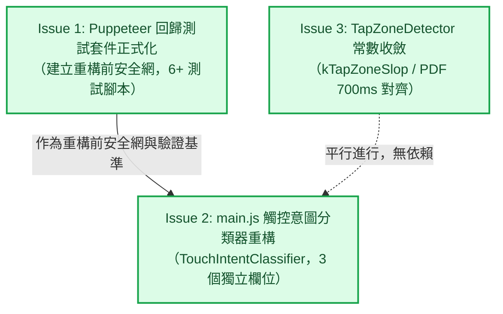

# Epic 31 觸控意圖判讀統一：工單清單審查報告 (Issues Review Report)

**審查對象：** [`docs/epics/epic-31-touch-intent-unification/issues.md`](file:///U:/MyDeveloper/AI/elinkBook/docs/epics/epic-31-touch-intent-unification/issues.md)  
**關聯設計文件：** [`docs/epics/epic-31-touch-intent-unification/design.md`](file:///U:/MyDeveloper/AI/elinkBook/docs/epics/epic-31-touch-intent-unification/design.md)（已核准）  
**審查日期：** 2026-08-25  
**審查性質：** 工單切分與驗收標準審查（Issues & Work Breakdown Review）  

---

## 1. 總結評估（Executive Summary）

**整體評價：Approved（正式核准，可直接展開各工單之 Implementation Plan 撰寫）**

[`issues.md`](file:///U:/MyDeveloper/AI/elinkBook/docs/epics/epic-31-touch-intent-unification/issues.md) 將 Epic 31 精確拆解為 3 個垂直切片（Issue 1 測試安全網建立、Issue 2 main.js 核心分類器重構、Issue 3 Dart 端常數收斂與 PDF 門檻對齊）。工單之間的依賴關係清晰（Issue 2 嚴格依賴 Issue 1 完成作為重構安全網；Issue 3 完全獨立可平行進行），且完整吸納了設計審查階段（`tmp/epic-31/review-design-touch-intent-unification.md`）提出的所有架構、時序與測試防護細節。

工單定義清晰、範圍收斂、驗收條件具備高度可測性與可操作性，審查正式予以核准通過。

---

## 2. 工單切分與依賴關係審查（Work Breakdown & Dependencies）

- **切分顆粒度（Granularity）：** 恰當。3 個 Issue 各自對應單一職責，無過大或模糊的工單範圍。
- **時序安全性（Safety Sequencing）：** 遵循「測試先行（Test-first / Characterization Test）」原則，先在 Issue 1 建立現行行為的自動化安全網，才在 Issue 2 進行大手術般的重構，能有效杜絕歷史 bug 回歸。
- **平行度（Concurrency）：** Issue 3 專注於 Dart/Flutter 端，與 JS 端的 Issue 1/2 完全解耦，可由不同子代理或平行任務同時推進。

---

## 3. 各工單逐項審查意見（Detailed Issue Review）

### Issue 1：Puppeteer 回歸測試套件正式化＋跨機制干擾測試
- **優點：**
  - 明確規範放置於 `app/tool/foliate_touch_harness/`，符合 repo 既有目錄慣例（不混入 `app/test/` Dart 單元測試目錄）。
  - 精確納入 4 個歷史 bug 場景（Issue 47、Epic 25 Issue 1/4、Issue 10、Issue 11）與 2 個跨機制干擾測試。
  - 明確記錄 Headless Chromium CDP 觸控注入限制與因應方案（使用 `page.mouse.click()` 與 DOM API 注入選取）。
- **實作計畫提醒（Implementation Plan Tip）：**
  - 在 `app/tool/foliate_touch_harness/` 建立 `package.json` 與 `npm test` 腳本，方便開發者與 CI 一鍵執行全部 6 支情境測試。

### Issue 2：main.js 觸控意圖分類器重構（TouchIntentClassifier）
- **優點：**
  - 狀態機採用 `TouchIntentClassifier` class 封裝，依章節隔離實例（Look-ahead spine 安全）。
  - 結構化區分 3 個正交欄位（`gesture` 手勢即時態、`lastTouchStartTime` 持久點擊時間戳、`lastNonCollapsedSelectionAtMs` 選取保護時間戳），徹底消除 `touchend` 提早銷毀點擊時間戳的時序盲區。
  - 包含 `console.assert(LONG_PRESS_GATE_MS <= ANNOTATION_CLICK_TAP_MAX_MS)` 程式碼防禦。
  - 驗收條件明確列入 4 項真機手動重測清單，確保不依賴自動化測試單點結案。
- **實作計畫提醒（Implementation Plan Tip）：**
  - 新增之 Class 與方法需依專案規範撰寫繁體中文 JSDoc 註解。

### Issue 3：TapZoneDetector 常數收斂＋PDF 門檻對齊
- **優點：**
  - `kTapZoneSlop` 與 `kTapZoneDebounceMs` 抽常數並設為建構函式預設引數。
  - `tapMaxDurationMs` 刻意保留兩端各自傳值，清晰記錄「EPUB 為真機校準值、PDF 為刻意對齊未驗證值」的脈絡差異。
  - 明確指出需將 `pdf_reader_view_nav_zone_test.dart:141` 之等待時間從 600ms 提升至 800ms，避免測試斷言失效。
- **實作計畫提醒（Implementation Plan Tip）：**
  - 留意 `app/test/reader/tap_zone_detector_test.dart` 內 `wrap()` 測試輔助函式的預設值同步。

---

## 4. 結論與下一步（Conclusion & Next Steps）

[`docs/epics/epic-31-touch-intent-unification/issues.md`](file:///U:/MyDeveloper/AI/elinkBook/docs/epics/epic-31-touch-intent-unification/issues.md) 規劃完善、嚴密無漏洞，審查正式核准。

- [x] **工單清單審查通過（Approved）**
- **下一步：** 展開 Implementation Plan 撰寫（建議優先撰寫 `docs/epics/epic-31-touch-intent-unification/plans/plan-issue-1.md` 與 `plan-issue-3.md`）。
