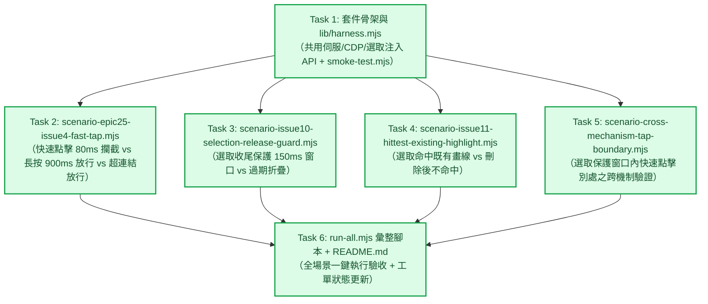

# Epic 31 Issue 1 實作計畫審查報告 (Plan Review Report)

**審查對象：** [`docs/epics/epic-31-touch-intent-unification/plans/plan-issue-1.md`](file:///U:/MyDeveloper/AI/elinkBook/docs/epics/epic-31-touch-intent-unification/plans/plan-issue-1.md)  
**關聯工單：** [`docs/epics/epic-31-touch-intent-unification/issues.md`](file:///U:/MyDeveloper/AI/elinkBook/docs/epics/epic-31-touch-intent-unification/issues.md) 之 **Issue 1：Puppeteer 回歸測試套件正式化＋跨機制干擾測試**  
**關聯設計：** [`docs/epics/epic-31-touch-intent-unification/design.md`](file:///U:/MyDeveloper/AI/elinkBook/docs/epics/epic-31-touch-intent-unification/design.md)  
**審查日期：** 2026-08-25  
**審查性質：** 實作計畫架構與可執行性審查（Implementation Plan Review）  

---

## 1. 總結評估（Executive Summary）

**整體評價：Approved（正式核准，可直接由 Subagent 展開 Task 1~6 執行）**

[`plan-issue-1.md`](file:///U:/MyDeveloper/AI/elinkBook/docs/epics/epic-31-touch-intent-unification/plans/plan-issue-1.md) 針對 Issue 1 規劃了完整且嚴密的 6 個 Task（套件骨架＋共用 harness 函式庫、Epic 25 Issue 4 快速點擊攔截、Issue 10 選取收尾保護、Issue 11 hitTest 命中判斷、跨機制邊界測試、run-all 彙整腳本與文檔）。

計畫結構清晰、任務介面（Produces / Consumes）契約明確，每個 Task 均附帶完整可執行的程式碼、斷言邏輯、驗證指令與 Git Commit 規劃。對於 Headless Chromium CDP 的環境限制亦有透明誠實的範圍劃分（將依賴 `touchmove` 的部分明確交接至 Issue 2 真機重測），完全具備立即可執行的成熟度，審查正式予以核准通過。

---

## 2. 任務拆解與時序流程（Task Breakdown & Workflow）

- **高內聚低耦合：** `lib/harness.mjs` 集中管理 Foliate 資產 Request Interception 與 mock bridge，4 支情境測試彼此完全獨立。
- **測試先行防護：** 所有測試皆直接針對「現行未重構之 `main.js`」執行驗證，建立 Issue 2 重構前的黃金基準線（Golden Baseline）。

---

## 3. 架構優點與設計亮點（Strengths）

1. **嚴謹的目錄結構與環境相容性：**
   - 遵從專案慣例放置於 `app/tool/foliate_touch_harness/`，嚴格區隔 Dart 單元測試目錄 `app/test/`。
   - `lib/harness.mjs` 中的路徑解析（`path.relative(base, full).split(path.sep).join('/')`）與 `run-all.mjs` 中的 `spawnSync` 均已完整處理 Windows / POSIX 跨平台相容性。
2. **明確直觀的測試斷言與退出碼機制：**
   - 每支腳本皆使用統一的 `report(name, passed, detail)` 輸出 `[PASS]`/`[FAIL]`，失敗時正確設定 `process.exitCode = 1`，能無縫整合於 CI 或自動化流程。
3. **誠實且技術可行的邊界處理：**
   - 明確記錄 Headless Chromium CDP 不產生 `touchmove` 至 iframe 的限制，將依賴 `touchmove` 的 Issue 47 劃分給真機重測，避免在自動化測試中強行模擬不可靠訊號而產生偽陽性。
4. **超連結點擊排除的隔離測試：**
   - Task 2 巧妙透過動態注入 `<a>` 標籤測試 `target.closest('a[href]')` 排除邏輯，無需仰賴特定 fixture EPUB 的 HTML 結構，具備極佳的測試穩定度。

---

## 4. 次要建議（Minor Recommendations）

實作過程中可參考以下細節微調（不阻礙計畫執行）：

1. **CDP Session 取得方式（Public API）：**
   - `lib/harness.mjs:182` 使用 `const client = page._client()`，亦可使用 Puppeteer 官方公開的非同步方法 `const client = await page.createCDPSession()`，兩者皆可正常運作。
2. **`package.json` npm scripts：**
   - 可在 `package.json` 的 `scripts` 額外加入 `"smoke": "node smoke-test.mjs"`，方便日常單獨測試 harness 設施本身。

---

## 5. 結論與下一步（Conclusion & Next Steps）

[`plan-issue-1.md`](file:///U:/MyDeveloper/AI/elinkBook/docs/epics/epic-31-touch-intent-unification/plans/plan-issue-1.md) 規劃完善、步驟明確且可驗證性高，審查正式核准。

- [x] **實作計畫審查通過（Approved）**
- **下一步：** 依據計畫指示，啟動 `superpowers:subagent-driven-development` 或 `superpowers:executing-plans` 依序執行 Task 1 至 Task 6。
