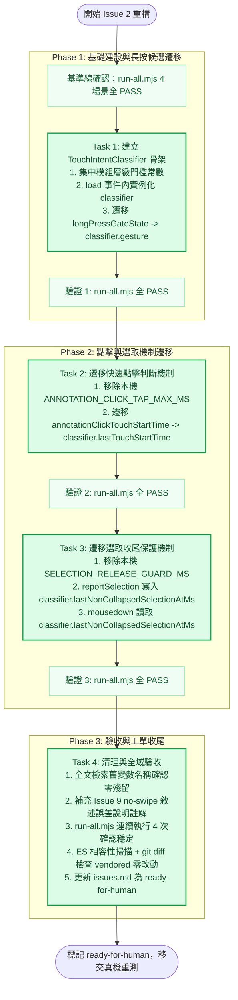

# Epic 31 Issue 2 實作計畫審查報告 (Plan Review Report)

**審查對象：** [`docs/epics/epic-31-touch-intent-unification/plans/plan-issue-2.md`](file:///U:/MyDeveloper/AI/elinkBook/docs/epics/epic-31-touch-intent-unification/plans/plan-issue-2.md)  
**關聯工單：** [`docs/epics/epic-31-touch-intent-unification/issues.md`](file:///U:/MyDeveloper/AI/elinkBook/docs/epics/epic-31-touch-intent-unification/issues.md) 之 **Issue 2：main.js 觸控意圖分類器重構（TouchIntentClassifier）**  
**關聯設計：** [`docs/epics/epic-31-touch-intent-unification/design.md`](file:///U:/MyDeveloper/AI/elinkBook/docs/epics/epic-31-touch-intent-unification/design.md)  
**審查日期：** 2026-08-25  
**審查性質：** 實作計畫架構與執行可行性審查（Implementation Plan Review）  

---

## 1. 總結評估（Executive Summary）

**整體評價：Approved（正式核准，可直接依計畫展開 Task 1~4 執行）**

[`plan-issue-2.md`](file:///U:/MyDeveloper/AI/elinkBook/docs/epics/epic-31-touch-intent-unification/plans/plan-issue-2.md) 針對 Issue 2 規劃了 4 個結構嚴謹、循序漸進的重構任務（Task 1: 狀態機骨架＋長按候選攔截遷移、Task 2: 快速點擊判斷遷移、Task 3: 選取收尾保護遷移、Task 4: 殘留清理＋全域驗收＋工單狀態更新）。

本計畫的核心定位為「行為不可變（Behavior Preserving）的純重構」，經深度比對目前實際的 `app/android/app/src/main/assets/foliate/main.js` 原始碼，所有 Search & Replace 代碼片段與目標行號上下文完全吻合（100% Code Matching）。各關鍵邊界條件（章節預讀隔離、時鐘原點保真、事件傳播攔截保護、ADR 0011/0013 約束）皆獲完整保留，無任何語意偏差或迴歸風險，具備立即可執行的極高成熟度，審查正式予以核准通過。

---

## 2. 任務拆解與時序流程（Task Breakdown & Workflow）

- **重構安全網：** 每個 Task 均以 Issue 1 建立的 `app/tool/foliate_touch_harness/` 作為前後比對基準線，確保每一步更動皆在綠燈保護下推進。
- **高隔離性：** 每次 `load` 事件（含 look-ahead 預讀章節）獨立實例化 `TouchIntentClassifier`，徹底隔離跨章節狀態。

---

## 3. 架構與設計對齊優點（Strengths & Spec Alignment）

1. **實體生命週期隔離（Instance Isolation）：**
   - 明確將 `const classifier = new TouchIntentClassifier()` 宣告於 `view.addEventListener('load', ...)` 內部。這完美契合了 Foliate-js 的「Look-ahead 預讀章節」特性，保證多個 iframe 在背景並行載入時各自持有獨立的狀態機實例，徹底根絕跨章節手勢狀態污染。
2. **時鐘原點一致性保真（Time Origin Consistency）：**
   - Task 3 Step 3 嚴格保留了 `doc.defaultView.performance.now()` 作為 `lastNonCollapsedSelectionAtMs` 的賦值來源，未被誤改為頂層 `performance.now()`，完整防禦了 Issue 10 曾發生的「iframe 與最外層頁面時鐘原點偏差 850ms」歷史陷阱。
3. **事件攔截與合成器防護完整：**
   - Task 1 正確維持了 `{ passive: false }` 設定以及 `evt.preventDefault(); evt.stopImmediatePropagation()` 呼叫順序，確保 Chromium  compositor 不會在 `touchmove` 期間逕自接管為原生捲動。
4. **設計文件敘述誤差之誠實除錯（Spec Discrepancy Auditing）：**
   - Task 4 查證出 `design.md` 提及 Issue 9（`no-swipe`）需「改讀 class 欄位」屬設計文件筆誤（實際為一次性無條件 `setAttribute`），計畫選擇在程式碼中補充清晰註解予以記錄，而非盲目硬套或強行修改代碼，體現高度工程嚴謹性。
5. **嚴格遵循 ADR 與全域約束：**
   - 100% 遵守 ADR 0011（不修改任何 vendored 檔案）、ADR 0013（保留 contextmenu / pointercancel 備援機制），且不新增任何 Dart↔JS 通訊通道。

---

## 4. 問題審查（Issues）

* **Critical（阻礙執行）：** 無
* **Important（架構風險）：** 無
* **Minor（微小建議）：**
  - 在 Task 1 中，手勢重置頻繁採用重新賦值新物件 `{ state: 'idle', startX: 0, startY: 0, startTime: 0 }`。在極端高頻事件中可能產生極微小短暫物件分配，但因僅在 `touchstart`/`touchend`/逃逸時觸發（非每影格 touchmove），在 Vanilla JS 執行環境下對 GC 負擔可忽略不計，維持目前的不可變物件宣告風格完全可接受。

---

## 5. 建議事項（Recommendations）

1. **落實精確程式碼套用：**
   - 計畫書中定義的 Search & Replace 片段已與目前 `main.js` 精確對齊，執行時建議直接參照計畫程式碼區塊替換，避免手動重寫引入拼寫錯誤。
2. **真機重測清單確實交接：**
   - 計畫於 Task 4 結束後將工單狀態設為 `ready-for-human`，精確反映「Chromium CDP 無法自動化測試 touchmove，必須由人類在真機上重測 5 大歷史場景」的架構決定。請確保在 PR 合併前於實體裝置（含 E-Ink 裝置）完成 `issues.md` 所列之真機重測並記錄於 `review-issue-2.md`。

---

## 6. 結論與判定（Conclusion & Next Steps）

[`plan-issue-2.md`](file:///U:/MyDeveloper/AI/elinkBook/docs/epics/epic-31-touch-intent-unification/plans/plan-issue-2.md) 邏輯清晰、防護周全、步驟精確且完全具備可執行性，審查結論為 **Approved**。

- [x] **實作計畫審查通過（Approved）**
- **下一步：** 可直接依據使用者指示，啟動 `/superpowers:subagent-driven-development` 於獨立 worktree（`epic-31-issue-2`）中依序執行 Task 1 至 Task 4。
