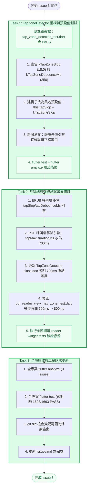

# Epic 31 Issue 3 實作計畫審查報告 (Plan Review Report)

**審查對象：** [`docs/epics/epic-31-touch-intent-unification/plans/plan-issue-3.md`](file:///U:/MyDeveloper/AI/elinkBook/docs/epics/epic-31-touch-intent-unification/plans/plan-issue-3.md)  
**關聯工單：** [`docs/epics/epic-31-touch-intent-unification/issues.md`](file:///U:/MyDeveloper/AI/elinkBook/docs/epics/epic-31-touch-intent-unification/issues.md) 之 **Issue 3：TapZoneDetector 常數收斂＋PDF 門檻對齊**  
**關聯設計：** [`docs/epics/epic-31-touch-intent-unification/design.md`](file:///U:/MyDeveloper/AI/elinkBook/docs/epics/epic-31-touch-intent-unification/design.md)  
**審查日期：** 2026-08-25  
**審查性質：** 實作計畫架構與執行可行性審查（Implementation Plan Review）  

---

## 1. 總結評估（Executive Summary）

**整體評價：Approved（正式核准，可直接展開 Task 1~3 實作）**

[`plan-issue-3.md`](file:///U:/MyDeveloper/AI/elinkBook/docs/epics/epic-31-touch-intent-unification/plans/plan-issue-3.md) 針對 Issue 3 規劃了 3 個結構嚴謹、循序漸進的實作任務：
1. **Task 1**：`TapZoneDetector` 新增共用常數（`kTapZoneSlop`、`kTapZoneDebounceMs`）與建構子預設值，並加入專屬測試驗證預設值行為。
2. **Task 2**：EPUB 與 PDF 呼叫端移除字面值傳遞，PDF 端 `tapMaxDurationMs` 對齊至 700ms，同步修正因門檻拉長而受影響的既有 PDF Nav Zone 邊界測試。
3. **Task 3**：全專案驗收（`flutter analyze` 與 `flutter test`）與工單收尾。

本計畫精準貫徹了 `design.md` 的核心設計心智：明確區分「本質相同且重複的常數」（`tapSlop`、`tapDebounceMs`）與「數值剛好相同但校準狀態與脈絡不同」（`tapMaxDurationMs`）。在將 `tapSlop`／`tapDebounceMs` 抽為預設值的同時，嚴格保留 `tapMaxDurationMs` 為 `required` 參數並於兩端各自傳入字面值 700ms，且在 class doc 與呼叫端註解中保留詳細的決策原因。

各步驟目標代碼片段與目前實際原始碼（`tap_zone_detector.dart`、`foliate_reader_view.dart`、`pdf_reader_view.dart` 及測試檔）100% 精確吻合，審查正式予以核准通過。

---

## 2. 任務拆解與時序流程（Task Breakdown & Workflow）

---

## 3. 架構與設計對齊優點（Strengths & Spec Alignment）

1. **嚴格遵守架構約束與校準狀態區隔**：
   - 清楚區隔「定義重複」與「脈絡差異」。EPUB 的 700ms 是經真機六輪診斷校準的值，PDF 的 700ms 是本次刻意對齊、未經真機校準的決定。計畫未將 `tapMaxDurationMs` 盲目收斂為共用常數，而是刻意維持 `required` 與兩端字面值，精準守住了架構防線。
2. **極高水準的測試邊界敏銳度**：
   - 在 Task 2 Step 6 中，計畫敏銳地指出 `pdf_reader_view_nav_zone_test.dart` 既有的「按壓超過門檻不觸發」測試中使用的 `pump(600ms)`，在門檻由 400ms 改為 700ms 後，會因為 600ms < 700ms 而從「超時不觸發」變成「合格點擊觸發」而導致測試失敗。計畫預先規劃將其調整為 `800ms`，徹底避免了測試回歸。
3. **優雅的預設值驗證測試設計**：
   - Task 1 Step 3 的測試案例刻意不使用測試輔助函式，而是直接實例化 `TapZoneDetector` 且不傳入 `tapSlop`，精確測試建構子預設值的生效機制與超出 1px 的邊界阻擋。
4. **註解階段性維護避免文件失真**：
   - 在 Task 1 與 Task 2 分兩階段更新 `tap_zone_detector.dart` 的 class doc，確保在 Task 1 結束的 Git 歷史節點上，文件與實際代碼仍然一致，不會出現提前或滯後描述。

---

## 4. 問題審查（Issues）

經完整比對目前程式碼庫與規範：
- **Critical Issues（嚴重缺陷）：** 無
- **Important Issues（重要風險）：** 無
- **Minor Issues（輕微建議）：** 無

各檔案路徑、代碼上下文字串、常數命名（`kTapZoneSlop`、`kTapZoneDebounceMs`）與型別宣告皆完全吻合現行專案規範。

---

## 5. 建議事項（Recommendations）

1. **執行方式：**
   - 依計畫建議，可建立獨立 worktree 與分支（如 `epic-31-issue-3`），並使用 `/superpowers:subagent-driven-development` 依序執行 Task 1 至 Task 3。
2. **無真機驗證之風險控管：**
   - 計畫與工單均已明確標註 PDF 端 700ms「未經真機驗證」。實作完成後若使用者後續在實體裝置上操作 PDF 時發現長按反應與預期不符，可另立工單進行真機診斷與獨立調校。

---

## 6. 結論與判定（Conclusion）

**判定結果：Approved（審查通過）**

[`plan-issue-3.md`](file:///U:/MyDeveloper/AI/elinkBook/docs/epics/epic-31-touch-intent-unification/plans/plan-issue-3.md) 無任何邏輯缺陷或架構風險，步驟具體完整，已可直接啟動實作。
