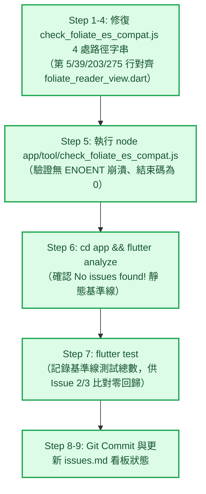

# Epic 32 Issue 1 實作計畫審查報告 (Plan Review Report)

**審查對象：** [`docs/epics/epic-32-foliate-js-paginator-sync/plans/plan-issue-1.md`](file:///U:/MyDeveloper/AI/elinkBook/docs/epics/epic-32-foliate-js-paginator-sync/plans/plan-issue-1.md)  
**關聯工單：** [`docs/epics/epic-32-foliate-js-paginator-sync/issues.md`](file:///U:/MyDeveloper/AI/elinkBook/docs/epics/epic-32-foliate-js-paginator-sync/issues.md) 之 **Issue 1：修復 ES 相容性掃描工具＋確認基準線**  
**關聯設計：** [`docs/epics/epic-32-foliate-js-paginator-sync/design.md`](file:///U:/MyDeveloper/AI/elinkBook/docs/epics/epic-32-foliate-js-paginator-sync/design.md)  
**審查日期：** 2026-08-25  
**審查性質：** 實作計畫架構與可執行性審查（Implementation Plan Review）  

---

## 1. 總結評估（Executive Summary）

**整體評價：Approved（正式核准，可直接由 Subagent 展開 Task 1 實作執行）**

[`plan-issue-1.md`](file:///U:/MyDeveloper/AI/elinkBook/docs/epics/epic-32-foliate-js-paginator-sync/plans/plan-issue-1.md) 針對 Issue 1 的先決條件修復與基準線確認，規劃了精準、單純且高度收斂的單一 Task（共 9 個循序步驟）。

計畫內容精確指出 `app/tool/check_foliate_es_compat.js` 內 4 處過時 Dart 檔案路徑（第 5、39、203、275 行），並規劃了工具執行驗證、`flutter analyze` 靜態檢查、`flutter test` 基準線測試總數記錄、標準 Commit 與工單狀態更新。邊界清晰、無越界行為，完全符合專案架構規範（[ADR 0011](file:///U:/MyDeveloper/AI/elinkBook/docs/adr/0011-readium-vendoring-and-customization-boundary.md)），審查正式予以核准通過。

---

## 2. 任務拆解與執行時序（Task & Workflow）

---

## 3. 架構優點與審查亮點（Strengths）

1. **極高精確度的字串修改定位**：
   - 經原始碼實地核對，計畫列出的 4 處修改（JSDoc 註解、`POLYFILL_SOURCE_FILE` 常數、正則失敗錯誤訊息、修復指引提示）行數與前後文逐字完全一致，無任何落差。
2. **恪守單一職責與邊界約束**：
   - 明確將「替換 `paginator.js`」隔離於 Issue 2，本工單僅針對現況執行基準線確認，不夾帶任何上游同步或程式碼變更。
3. **健全的量化基準線防線**：
   - 包含 `flutter test` 現況總測試數記錄，為後續 Issue 2 升級 `paginator.js` 提供了客觀的無回歸檢驗標準。

---

## 4. 結論與下一步（Conclusion & Next Steps）

[`plan-issue-1.md`](file:///U:/MyDeveloper/AI/elinkBook/docs/epics/epic-32-foliate-js-paginator-sync/plans/plan-issue-1.md) 步驟明確、無風險、可執行性高，審查正式核准。

- [x] **實作計畫審查通過（Approved）**
- **下一步：** 依據計畫指示，啟動 `superpowers:subagent-driven-development` 或 `superpowers:executing-plans` 執行 Task 1。
