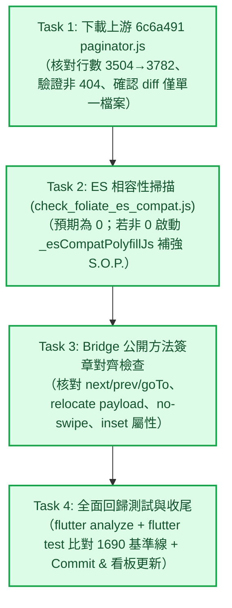

# Epic 32 Issue 2 實作計畫審查報告 (Plan Review Report)

**審查對象：** [`docs/epics/epic-32-foliate-js-paginator-sync/plans/plan-issue-2.md`](file:///U:/MyDeveloper/AI/elinkBook/docs/epics/epic-32-foliate-js-paginator-sync/plans/plan-issue-2.md)  
**關聯工單：** [`docs/epics/epic-32-foliate-js-paginator-sync/issues.md`](file:///U:/MyDeveloper/AI/elinkBook/docs/epics/epic-32-foliate-js-paginator-sync/issues.md) 之 **Issue 2：同步 `paginator.js` 至 `6c6a491`**  
**關聯設計：** [`docs/epics/epic-32-foliate-js-paginator-sync/design.md`](file:///U:/MyDeveloper/AI/elinkBook/docs/epics/epic-32-foliate-js-paginator-sync/design.md)  
**審查日期：** 2026-08-25  
**審查性質：** 實作計畫架構、安全性與可執行性審查（Implementation Plan Review）  

---

## 1. 總結評估（Executive Summary）

**整體評價：Approved（正式核准，附帶 Windows/pwsh 執行提示，可由 Agent 展開實作）**

[`plan-issue-2.md`](file:///U:/MyDeveloper/AI/elinkBook/docs/epics/epic-32-foliate-js-paginator-sync/plans/plan-issue-2.md) 為同步上游 `readest/foliate-js` commit `6c6a491`（觸控核心重構）制定了極為周全且分層嚴密的 4 個 Task。

計畫嚴格恪守 [ADR 0011](file:///U:/MyDeveloper/AI/elinkBook/docs/adr/0011-readium-vendoring-and-customization-boundary.md) 的 Vendoring 邊界原則（單檔整份覆蓋、嚴禁手動修改原始碼），並建立了「**下載驗證 → ES 相容性掃描 → Bridge 公開簽章對齊 → 全面回歸測試**」的四層安全防線，對齊了 Issue 1 甫建立的 1690 項測試基準線。審查給予正式核准。

---

## 2. 任務結構與驗證管線（Task Workflow）

---

## 3. 架構優點與審查亮點（Strengths）

1. **嚴格遵循 ADR 0011 Vendoring 規範**：
   - 明確鎖定 `https://raw.githubusercontent.com/readest/foliate-js/6c6a491/paginator.js` 進行整體置換，不對 vendor 檔案做任何就地竄改；其餘 11 個 vendored 檔案與專案自建 bridge 檔案嚴格保持不動。
2. **三層防禦性驗證機制**：
   - **靜態防線**：下載前後行數比對（3504 → 3782）、關鍵特徵碼 grep（`layeredGesture`、`turn-gesture-left-inset`、`#rejectLayeredGesture`）。
   - **執行期相容防線**：使用 Issue 1 修復的 `check_foliate_es_compat.js` 掃描，且備有合規的 Polyfill 補強指引（嚴禁 ES2021+ 語法以防 Chromium 83 崩潰）。
   - **契約防線**：逐一核對 `main.js` 與 `Paginator` 之間的 4 處契約（`next/prev/goTo`、`relocate` 事件結構、`no-swipe` 屬性、`turn-gesture-left-inset` 未設定確認）。
3. **客觀量化的零回歸檢驗**：
   - Task 4 明確要求比對 Issue 1 記錄的 **1690 項測試基準線**，標準明確無模糊空間。

---

## 4. 跨平台執行提示（Platform / Tooling Notes）

以下為 Windows / PowerShell 環境下的執行建議，不影響計畫本身的邏輯架構：

1. **Unix 指令替代方案（Task 1 & Task 3）**：
   - 若 Windows 終端機環境未包含 `grep` / `wc` / `head`，執行時可使用 PowerShell 原生指令或 Node.js：
     - `wc -l` $\rightarrow$ `(Get-Content <file>).Length` 或 Node.js
     - `head -c 200` $\rightarrow$ `Get-Content <file> -TotalCount 5` 或 Node.js
     - `grep -n "..."` $\rightarrow$ `Select-String -Path <file> -Pattern "..."` 或 Node.js
2. **多行 Git Commit 語法（Task 4 Step 3）**：
   - Bash 的 `cat <<'EOF'` 在 pwsh 下不適用，執行時請使用多個 `-m` 參數（例如 `git commit -m "chore(epic-32): ..." -m "詳細說明..."`）或 PowerShell multiline string `@'...'@`。
3. **`flutter test` 執行穩定度**：
   - 延續 Issue 1 的實務經驗，在 Windows 環境下建議使用 `flutter test --concurrency=1`，避免多個 worker 同時存取 Temp 目錄造成檔案鎖定（OS Error 32）。

---

## 5. 結論與下一步（Conclusion & Next Steps）

- [x] **實作計畫審查通過（Approved）**
- **下一步：** 依據計畫指示，可以使用 `/superpowers:executing-plans` 或 `/superpowers:subagent-driven-development` 展開 Issue 2 的開發。
