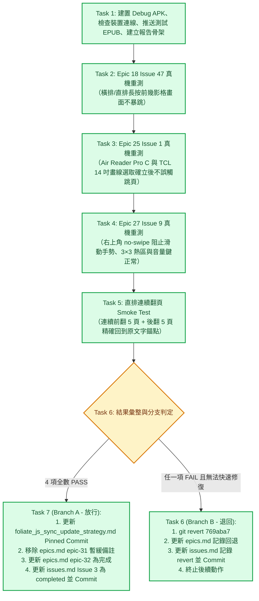

# Epic 32 Issue 3 實作計畫審查報告 (Plan Review Report)

**審查對象：** [`docs/epics/epic-32-foliate-js-paginator-sync/plans/plan-issue-3.md`](file:///U:/MyDeveloper/AI/elinkBook/docs/epics/epic-32-foliate-js-paginator-sync/plans/plan-issue-3.md)  
**關聯工單：** [`docs/epics/epic-32-foliate-js-paginator-sync/issues.md`](file:///U:/MyDeveloper/AI/elinkBook/docs/epics/epic-32-foliate-js-paginator-sync/issues.md) 之 **Issue 3：真機 QA＋文件收尾**  
**關聯設計：** [`docs/epics/epic-32-foliate-js-paginator-sync/design.md`](file:///U:/MyDeveloper/AI/elinkBook/docs/epics/epic-32-foliate-js-paginator-sync/design.md)  
**審查日期：** 2026-08-25  
**審查性質：** 實作計畫架構、安全性與可執行性審查（Implementation Plan Review）  

---

## 1. 總結評估（Executive Summary）

**整體評價：Approved（正式核准，附帶 Windows/pwsh 執行提示，可由 Agent 引導人類展開真機 QA）**

[`plan-issue-3.md`](file:///U:/MyDeveloper/AI/elinkBook/docs/epics/epic-32-foliate-js-paginator-sync/plans/plan-issue-3.md) 為 Epic 32 的最終驗收與收尾制定了非常清晰、務實且嚴謹的 7 個 Task。

計畫完全對齊了 [`design.md`](file:///U:/MyDeveloper/AI/elinkBook/docs/epics/epic-32-foliate-js-paginator-sync/design.md) 的測試策略，明確區分了「**人機協作分工**（Agent 準備環境與素材、人類拿實體機操作觀察）」與「**分支判定機制**（全數通過走 Branch A 文件收尾；任一回歸走 Branch B 乾淨 revert `769aba7`）」。引用的本地 Commit SHA（`3e82e23`、`769aba7`）與上游 Commit SHA（`6c6a491...`）皆與實際 repository 記錄 100% 精準吻合。審查給予正式核准。

---

## 2. 測試流程與雙分支架構（Workflow & Decision Tree）

---

## 3. 審查優點與架構亮點（Strengths）

1. **務實且正確的人機協作定位**：
   - 計畫在 Global Constraints 明確指出「禁止使用 adb 合成觸控事件代替人類」，因為歷史上的 3 個修法本質是真實硬體觸控按壓/滑動時長與邊界判定（尤其是電子紙與大尺寸平板的不同觸控反應），必須由人類操作觀察並回報。
2. **精確的 Commit SHA 鏈條對齊**：
   - Task 1 & Task 6 準確引用了 Issue 2 產生的本地真實 Commit SHA `769aba7`（而非無效的遠端 Hash）。
   - Task 7 準確對齊了 Issue 1 的 `3e82e23` 與 Issue 2 的 `769aba7`，並提供上游完整的 40 碼 SHA `6c6a491cf540696182d6fae70d6e26879b1e8369` (2026-07-25)。
3. **明確的分支退路（Rollback Strategy）**：
   - 恪守 design.md「不在時間壓力下硬修」的指導原則，定義了完整的 Branch B revert S.O.P.，包括維持 `epic-31` 暫緩標記與更新 `epics.md`，防禦性極高。
4. **客觀的文字比對檢驗（Task 5）**：
   - 直排連續翻頁 smoke test 要求前後 5 頁翻動後「逐字比對起始文字錨點」，避免主觀模糊判定。

---

## 4. 跨平台執行提示（Platform Notes）

- **Commit 訊息格式相容性（Task 6 Step 5 & Task 7 Step 5）**：
  - 計畫範例中的 `cat <<'EOF'` 為 Bash 專用語法。在 Windows PowerShell（pwsh）下，執行 git commit 時請使用多個 `-m` 參數（例如 `git commit -m "docs(epic-32): ..." -m "詳細說明..."`）或 PowerShell 多行字串 `@'...'@` 避免語法錯誤。

---

## 5. 結論與下一步（Conclusion & Next Steps）

- [x] **實作計畫審查通過（Approved）**
- **下一步：** 可以使用 `/superpowers:executing-plans` 或 `/superpowers:subagent-driven-development` 展開 Issue 3 的建置與引導測試！
