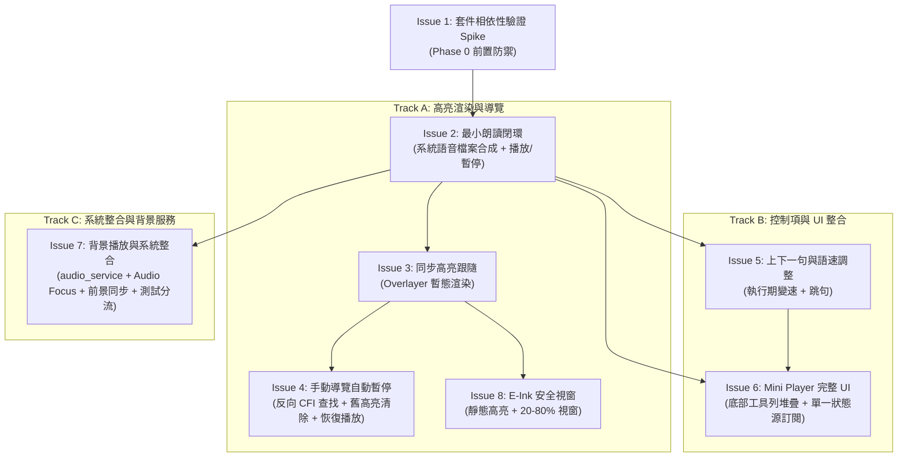

# Epic 34 TTS 語音朗讀與同步高亮（Read-along）：工單清單審查報告 (Issues Review Report)

**審查對象：** [`docs/epics/epic-34-tts-readalong/issues.md`](file:///U:/MyDeveloper/AI/elinkBook/docs/epics/epic-34-tts-readalong/issues.md)  
**對應工單：** `epic-34-tts-readalong`（Phase 0 + Phase 1 共 8 個垂直切片工單）  
**診斷依據：** 
- [`docs/epics/epic-34-tts-readalong/spec.md`](file:///U:/MyDeveloper/AI/elinkBook/docs/epics/epic-34-tts-readalong/spec.md)（核心介面/型別唯一事實來源）
- [`docs/epics/epic-34-tts-readalong/design.md`](file:///U:/MyDeveloper/AI/elinkBook/docs/epics/epic-34-tts-readalong/design.md)（Discovery 決策文件）
- [`docs/epics/epic-34-tts-readalong/reviews/review-spec.md`](file:///U:/MyDeveloper/AI/elinkBook/docs/epics/epic-34-tts-readalong/reviews/review-spec.md)（規格審查修訂報告）
- [`docs/adr/0026-tts-highlight-ephemeral-not-persisted.md`](file:///U:/MyDeveloper/AI/elinkBook/docs/adr/0026-tts-highlight-ephemeral-not-persisted.md)  
**審查日期：** 2026-08-26（初審：20:06，複審核准：20:16）  
**審查性質：** 工單垂直切片合理性、依賴拓撲（DAG）分析、規格驗收對齊與測試可行性審查（Scrum Master Issues Review）  

---

## 1. 總結評估（Executive Summary）

**整體評價：Approved（正式核准，可直接推進至 Implementation 實作計畫撰寫與執行階段）**

本工單清單（`issues.md`）已針對初審提出的所有實作細節（手動導覽暫停時主動清除舊高亮、Mini Player 單一事實來源訂閱、背景與系統中斷之測試分流策略）完成 100% 完整且精準的修訂。

修訂後的工單清單具備以下極佳的工程品質：
1. **最小閉環先行（Minimum Viable Loop First）**：以 Issue 1（相依性 Spike）為前置防禦，隨後以 Issue 2（逐句朗讀＋手動播放/暫停）建立最小可運行的播放閉環，完全解耦高亮與背景服務，大幅降低首期落地難度與驗收阻力。
2. **依賴拓撲清晰且具備高度平行性（Clean DAG & Parallel Tracks）**：以 Issue 2 為主幹核心，後續拆分為「高亮與導覽線（Issue 3 → 4, 8）」、「控制與 UI 線（Issue 5 → 6）」與「系統與背景服務線（Issue 7）」，各分支責任單一、上下文隔離，極利於 Subagent 平行或循序推進。
3. **規格與審查意見 100% 貫穿落地（Full Spec Traceability）**：
   - 檔案合成管線、跨標籤切句 CFI 測試、暫存檔索引覆寫與生命週期清理（Issue 2）；
   - ADR 0026 暫態高亮與 ADR 0011/0013 零原始碼改動（Issue 3）；
   - `lookupSegmentByCfi` 反向索引契約與暫停時清除舊高亮（Issue 4）；
   - 執行期變速 vs 合成語速分離（Issue 5）；
   - Mini Player 堆疊層級連動與單一狀態源訂閱（Issue 6）；
   - 前景恢復主動高亮重送、Audio Focus 狀態機與自動化/手動測試分流（Issue 7）；
   - E-Ink 安全視窗（Issue 8）。
4. **測試邊界分明（Pragmatic Test Seams）**：每個 Issue 皆明確訂定純 Dart 單元測試（`test/`）、Widget 整合測試（`reader_screen_test.dart`）或真機整合測試（`integration_test/`）之範圍，且斷言均鎖定外部可觀察行為。

所有審查意見均已圓滿收斂，工單清單正式予以複審核准通過。

---

## 2. 審查意見修訂對照表（Review Findings Resolution）

| 項目編號 | 類別 | 初審審查意見摘要 | 修訂狀況與技術確認 | 複審結果 |
|---|---|---|---|:---:|
| **Important 1** | 高亮清除 | Issue 4 手動導覽觸發自動暫停時需主動清除舊高亮避免殘影 | 已於 Issue 4 設計要點（Line 115）與驗收標準（Line 122）補齊：手動導覽觸發自動暫停時，`TtsController` 主動清除畫面上的暫態高亮，待按播放鍵時才在新位置重新繪製。 | **✅ Resolved** |
| **Important 2** | 測試分流 | Issue 7 系統廣播（耳機拔除/來電）需區分自動化 Mock 與手動真機清單 | 已於 Issue 7 測試要求（Line 198–206）明確分流為「自動化層（Widget / Mock 事件注入）」與「手動真機驗收清單（實體耳機插拔、來電通話、YouTube 搶佔、背景恢復高亮同步）」。 | **✅ Resolved** |
| **Minor 1** | 狀態同步 | Issue 6 Mini Player 需與背景通知欄控制保持單一事實來源同步 | 已於 Issue 6 設計要點（Line 168）明確規範：Mini Player 嚴格訂閱 `TtsController` 暴露的播放狀態，不自行維護私有狀態變數，達成 100% 雙向同步。 | **✅ Resolved** |

---

## 3. 工單依賴拓撲分析（Dependency DAG）

- **阻塞瓶頸（Critical Path）**：`Issue 1` → `Issue 2` → `Issue 3` → `Issue 4`。
- **可平行區間**：在 `Issue 2` 完成後，Track A（Issue 3）、Track B（Issue 5）與 Track C（Issue 7）可完全獨立並行開發，無跨分支共用狀態。

---

## 4. 結論與下一步（Conclusion & Next Steps）

工單清單所有審查意見均已圓滿修訂並通過複審。

- [x] **工單清單審查正式通過（Approved）**
- **下一步：** 啟動 **Implementation 階段**，依序由 `Issue 1` 開始撰寫實作計畫（`docs/epics/epic-34-tts-readalong/plans/plan-issue-1.md`）並展開實作。
