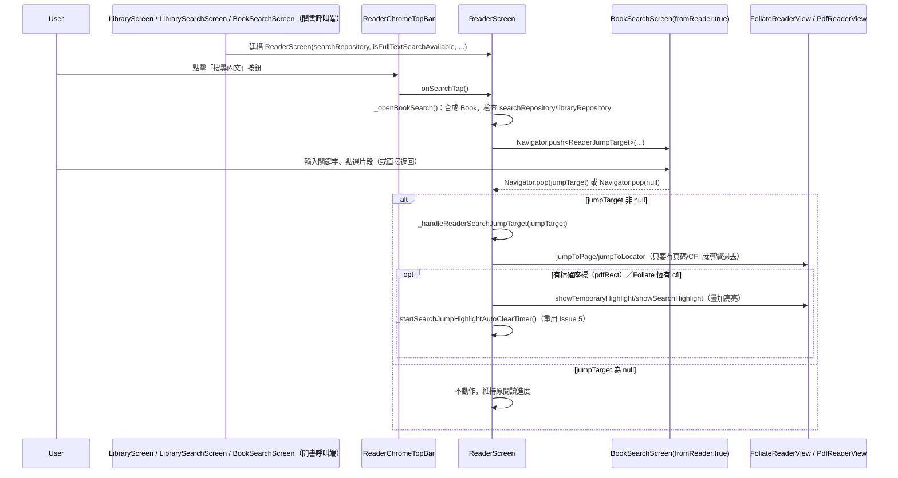

# Issue 8：閱讀器 TopBar「搜尋內文」接線與就地跳轉 Implementation Plan

> **For agentic workers:** REQUIRED SUB-SKILL: Use superpowers:subagent-driven-development to implement this plan task-by-task. Steps use checkbox (`- [x]`) syntax for tracking.

> **【`reviews/review-plan-issue-8.md` 複審修訂】** 初版計畫「只修改 `reader_screen.dart` 一個檔案」的假設經審查（C-1／I-1／I-2）證實錯誤：漏接三個既有「開啟 `ReaderScreen`」呼叫端，會導致搜尋入口在真機上恆定顯示「暫時無法使用」；PDF 就地跳轉在缺 `pdfRect` 時會整段放棄跳轉，而非依既有優雅降級契約只是不畫高亮。本版已依審查意見修訂 Global Constraints 與 Task 1／Task 2 內容，並在 I-2 的具體修法上提出替代方案（見 Global Constraints 說明），其餘 5 項意見照原建議採納。

**Goal:** 讓閱讀器頂部工具列的「搜尋內文」按鈕（`reader_chrome_search_button`）正式接上 Issue 7 的 `BookSearchScreen`，使用者從閱讀器開啟本書搜尋、選取片段後直接在原本的閱讀器 session 就地跳轉並顯示 3 秒暫態高亮，不銷毀重建閱讀畫面——且這條路徑在書架開書／全庫搜尋開書／單書搜尋開書三種既有進入 `ReaderScreen` 的方式下都要能真正運作，不只是在直接建構 `ReaderScreen` 的單元測試裡可用。

**Architecture:** 本工單分兩層交付：(1) `ReaderScreen` 新增 `searchRepository`／`isFullTextSearchAvailable` 兩個欄位，`onSearchTap` 從目前的「功能開發中」SnackBar 改為就地合成一個 `Book` 物件（`ReaderScreen` 本身不持有完整 `Book` 記錄，只有零散欄位）並以 `fromReader: true` 推入 `BookSearchScreen`，等待其 `Navigator.pop` 回傳的 `ReaderJumpTarget?`；同時把這兩個新欄位接上三個既有「開啟 `ReaderScreen`」的生產程式碼呼叫端（`library_screen.dart`／`library_search_screen.dart`／`book_search_screen.dart`），否則真實使用者路徑下這兩個欄位永遠是預設值。(2) 收到非 null 的 `ReaderJumpTarget` 後，重用 Issue 5 已交付的暫態高亮機制（`_searchJumpHighlightTimer`/`_clearSearchJumpHighlight`），新增一個「跳頁與疊加高亮各自獨立判斷」的方法（PDF 只要有 `pdfPageIndex` 就必須跳頁，`pdfRect` 只影響是否額外疊加高亮，兩者不可用同一個 `return` 綁死）。`BookSearchScreen`（Issue 7）、`ReaderJumpTarget`、`FoliateReaderView`/`PdfReaderView` 的跳轉/高亮 API 皆已存在，本工單不修改它們的公開介面。

**Architecture Diagram:**



**Tech Stack:** Flutter、既有 `Navigator.push<T>`/`Navigator.pop(T)` 型別化導覽、`GlobalKey<State<T>>` 靜態 helper 呼叫模式（`FoliateReaderView`/`PdfReaderView` 既有慣例）

**Spec:** [`docs/epics/epic-10-search/spec.md`](../spec.md) §9.4

## Global Constraints

- `flutter analyze` 必須乾淨才能提交。
- Android minSdk 24。
- 不引入新的外部 `pubspec.yaml` 依賴。
- 繁體中文用於程式碼註解與使用者可見文字。
- **需要修改的檔案不只 `reader_screen.dart` 一個**（`reviews/review-plan-issue-8.md` I-1）：`ReaderScreen` 新增的 `searchRepository`／`isFullTextSearchAvailable` 兩個欄位，若沒有同步接上全部三個既有「開啟 `ReaderScreen`」的生產程式碼呼叫端——`app/lib/screens/library_screen.dart`（`_openBook`，一般書架開書）、`app/lib/screens/library_search_screen.dart`（`_openBook`，全庫搜尋開書）、`app/lib/screens/book_search_screen.dart`（`_handleSnippetTap` 的 `fromReader: false` 分支，單書搜尋開書）——這兩個欄位在真實使用者路徑下永遠是建構子預設值（`null`／`true`），搜尋入口在真機上會恆定顯示「搜尋功能暫時無法使用」。這三處的接線是 Task 1 範圍的一部分，不是可以省略的收尾細節。`BookSearchScreen`（Issue 7）、`ReaderJumpTarget`、`FoliateReaderView`、`PdfReaderView`、`LibraryReaderFeatureRepositories`/`LibrarySyncDependencies` 本身的公開介面皆已存在且完整，不需要、也不應該修改。
- **`isFullTextSearchAvailable` 一律以「上層具名參數往下傳遞的 `bool`」形式取得，不對 `LibraryRepository` 做執行期型別判斷**（`review-plan-issue-8.md` I-2 的修法有更貼合既有架構的替代方案，見下方說明）：全專案既有慣例是 `main.dart` 唯一一處讀取具體型別 `SqliteLibraryRepository.isFullTextSearchAvailable`，計算後包進 `LibraryReaderFeatureRepositories.isFullTextSearchAvailable`（純 `bool`）逐層往下傳遞，`LibraryScreen`／`LibrarySearchScreen`／`BookSearchScreen` 沿途都只轉送這個 `bool`，從未對抽象的 `LibraryRepository` 介面做 `is SqliteLibraryRepository` 型別判斷還原這個值——這正是 `LibraryRepository` 保持抽象、讓測試可注入 `FakeLibraryRepository` 的意義所在。若在 `ReaderScreen._openBookSearch()` 內對 `widget.libraryRepository` 做型別轉換取值，會是全專案唯一一處繞過抽象介面探測具體型別的地方，且對既有大量注入 `FakeLibraryRepository` 的測試呼叫端會靜默固定落入「未知型別」的 fallback 分支，掩蓋「呼叫端根本沒有帶這個旗標」與「這個旗標確實是 `true`」兩種不同情況的差異。**本計畫改為新增 `ReaderScreen.isFullTextSearchAvailable`（`bool`，預設 `true`，與 `LibraryReaderFeatureRepositories` 同名欄位預設值一致）欄位，比照 `searchRepository` 由三個呼叫端各自從 `widget.readerFeatureRepositories.isFullTextSearchAvailable` 往下傳遞**——與 I-1 的修法同一種模式，不另外引入例外規則。
- **`ReaderScreen` 目前沒有 `Book`/`_currentBook` 欄位**（規劃階段查證：全檔 `grep` 零命中），只有零散的 `bookId`/`bookTitle`/`bookAuthor`/`bookProgress`/`filePath`/`isFixedLayout`（`widget.isFixedLayout`，可能為 `null`，見下一條）個別欄位。本工單**就地在 `_openBookSearch()` 內合成一個 `Book` 物件**餵給 `BookSearchScreen.book`，不新增 `Book` 型別欄位到 `ReaderScreen`——`BookSearchScreen` 實際只讀取 `book.id`／`book.title`／`book.author`／`book.format`／`book.filePath`／`book.progress`（以及透過 `book.format` 間接使用的 `fromContentLocator`），其餘 `Book` 必填欄位（`source`／`createTime`／`lastReadTime`）填入無意義佔位值即可，不影響任何實際行為。
- **合成 `Book.isFixedLayout` 時讀取 `_isFixedLayout`（State 內部欄位），不讀取 `widget.isFixedLayout`**（`review-plan-issue-8.md` M-2）：`widget.isFixedLayout`（`bool?`）是開書當下從資料庫帶入的既有判斷結果，既有書籍可能是 `null`（尚未判斷過）；`_isFixedLayout`（`bool`，預設 `false`）是 State 內部欄位，會在執行期 `_handleFoliateLayoutResolved`／`onLayoutResolved` 等既有回呼中被回寫成當下真正解析出的值（見 `reader_screen.dart:311` 宣告處與 `:553`/`:1657` 兩處回寫點），對「使用者當下正在讀哪一種版面」是更即時準確的來源。
- **格式轉換**：`detectBookFormat()`（`reader/book_format.dart`）回傳 `BookFormat`，但 `Book.format`／`ReaderJumpTarget.fromContentLocator()` 要求 `BookFileFormat`（`library/models/library_enums.dart`）——兩者是完全獨立的兩個列舉、目前 codebase 中**沒有**現成轉換函式（規劃階段查證：全檔 `grep` 零命中）。本工單新增一個純轉換方法 `_toBookFileFormat()`；兩列舉成員名稱刻意一一對應（`epub`/`pdf`/`azw3`/`cbz`/`txt`/`md`），只有 `BookFormat.unknown` 沒有對應值，回傳 `null`——呼叫端據此停用搜尋入口，語意對齊既有「不支援的檔案格式」畫面分支。
- **就地跳轉時，「跳頁」與「疊加高亮」必須獨立判斷，不可用同一個 `return` 綁死**（`review-plan-issue-8.md` C-1）：依 [`ReaderJumpTarget.fromContentLocator()`](../../../../app/lib/reader/reader_jump_target.dart) 的既有設計註解，PDF 命中片段的 `rect` 解析失敗時會**優雅降級**成「只有 `pdfPageIndex`、`pdfRect` 為 `null`」——這是系統刻意設計的正常狀態，不是異常。Issue 5（開書當下）用同一個 `return` 判斷是安全的，因為那時頁面早已透過 `initialPageIndex` 於建構時定位好，`pdfRect == null` 只代表「不畫高亮」；但 Issue 8 是使用者當下停在別的頁面的**就地跳轉**，若沿用同一段判斷，`pdfRect == null` 時會連 `PdfReaderView.jumpToPage` 都不執行，使用者點了搜尋結果卻完全沒有任何跳轉反應。本工單新增的 `_handleReaderSearchJumpTarget()` 必須把「有 `pageIndex` 就跳頁」與「有 `rect` 才疊加高亮」拆成兩個獨立判斷。
- **`FoliateReaderView.jumpToLocator()` 直接吃 `ReaderJumpTarget.cfi`（raw CFI 字串）即可，不需要另外包裝成 locator JSON**：`jumpToLocator()` 內部呼叫 `extractCfi(locatorJson)`，而 `extractCfi()`（`app/lib/reader/foliate_bridge_codec.dart:42-55`）的文件註解明確記載「同時支援直接傳入 raw CFI 字串（如 `epubcfi(...)`，epic-10-search Issue 5 搜尋跳轉傳入之格式）」，遇到 `epubcfi(...)` 開頭結尾的字串會原樣回傳，不會誤判成 Readium Locator JSON 而回傳 `null`。
- **重用 Issue 5 的暫態高亮計時器，不新增第二套計時器機制**：`_searchJumpHighlightTimer`／`_clearSearchJumpHighlight()`／`_handleZoneAction()` 既有的「使用者提前互動即清除」邏輯完全不變；本工單只把「啟動 3 秒計時器」那 4 行程式碼抽成共用方法 `_startSearchJumpHighlightAutoClearTimer()`，供 Issue 5 既有的 `_maybeShowSearchJumpHighlight()`（開書當下）與本工單新增的 `_handleReaderSearchJumpTarget()`（就地跳轉）共用。
- **Foliate 格式的「真的渲染出高亮」驗證留給 `integration_test/`**：比照 Issue 5 既有測試慣例（`flutter test` 環境下 WebView 不會真實渲染），本工單新增的 Foliate 相關 widget test 只驗證「呼叫鏈不拋出例外、`BookSearchScreen` 確實被 pop 掉」，不斷言 WebView 內部視覺高亮效果。

---

### Task 1：`ReaderScreen` 新增 `searchRepository`／`isFullTextSearchAvailable` 欄位，「搜尋內文」按鈕開啟 `BookSearchScreen`，並接上三個既有開書呼叫端

**Files:**
- Modify: [`app/lib/screens/reader_screen.dart`](../../../../app/lib/screens/reader_screen.dart)
- Modify: [`app/lib/screens/library_screen.dart`](../../../../app/lib/screens/library_screen.dart)
- Modify: [`app/lib/screens/library_search_screen.dart`](../../../../app/lib/screens/library_search_screen.dart)
- Modify: [`app/lib/screens/book_search_screen.dart`](../../../../app/lib/screens/book_search_screen.dart)
- Modify: [`app/test/screens/reader_screen_test.dart`](../../../../app/test/screens/reader_screen_test.dart)
- Modify: [`app/test/screens/library_screen_test.dart`](../../../../app/test/screens/library_screen_test.dart)
- Modify: [`app/test/screens/library_search_screen_test.dart`](../../../../app/test/screens/library_search_screen_test.dart)
- Modify: [`app/test/screens/book_search_screen_test.dart`](../../../../app/test/screens/book_search_screen_test.dart)

**Interfaces:**
- Consumes: 既有 `BookSearchScreen`（`book`／`searchRepository`／`prefsManager`／`libraryRepository`／`readerFeatureRepositories`／`syncDependencies`／`isEinkMode`／`fromReader`，見 `app/lib/screens/book_search_screen.dart`）、`LibraryReaderFeatureRepositories`／`LibrarySyncDependencies`（`app/lib/screens/library_screen_dependencies.dart`，前者已有 `searchRepository`／`isFullTextSearchAvailable` 兩個既有欄位）、`ReaderJumpTarget`（`app/lib/reader/reader_jump_target.dart`）、`Book`／`BookSource`／`BookGroup`（`app/lib/library/models/`）、`detectBookFormat()`／`BookFormat`（`app/lib/reader/book_format.dart`）
- Produces: `ReaderScreen.searchRepository`（新欄位，`SearchRepository?`）、`ReaderScreen.isFullTextSearchAvailable`（新欄位，`bool`，預設 `true`）、`_ReaderScreenState._toBookFileFormat(BookFormat)`（`BookFileFormat?`）、`_ReaderScreenState._buildSearchableBook()`（`Book?`）、`_ReaderScreenState._openBookSearch()`（`Future<void>`）——供 Task 2 在收到 pop 回傳值後接續處理；三個既有開書呼叫端皆補上 `searchRepository:`／`isFullTextSearchAvailable:` 兩個具名參數轉發

- [x] **Step 1: 寫「搜尋按鈕接線」的 widget test**

在 [`app/test/screens/reader_screen_test.dart`](../../../../app/test/screens/reader_screen_test.dart) 頂部新增 import（與既有 import 群組並列即可，不需要嚴格排序）：

```diff
 import 'package:elinkbook/library/models/book.dart';
 import 'package:elinkbook/library/models/library_enums.dart';
 import 'package:elinkbook/library/sqlite_library_repository.dart';
+import 'package:elinkbook/screens/book_search_screen.dart';
+import 'package:elinkbook/search/search_repository.dart';
+import '../support/fake_search_repository.dart';
```

在檔案倒數第二個 top-level statement `tearDownAll(() { ... });` **之前**（緊接在 `readerActivityTracker 提供時...` 那個 `testWidgets` 的收尾 `});` 之後），新增一個新的 `group`：

```dart
  group('epic-10-search Issue 8：閱讀器 TopBar 搜尋接線', () {
    testWidgets(
        'searchRepository／libraryRepository 皆存在時，點擊搜尋按鈕推入 BookSearchScreen（fromReader: true，帶入合成的 Book）',
        (tester) async {
      final searchRepository = FakeSearchRepository();
      final libraryRepository = FakeLibraryRepository();

      await tester.pumpWidget(
        MaterialApp(
          theme: resolveThemeData(theme: AppTheme.light, isEinkMode: false),
          home: ReaderScreen(
            filePath: 'test/fixtures/sample.epub',
            bookId: 'b_search_entry',
            bookTitle: '搜尋接線測試書',
            prefsManager: FakeReaderPrefsManager(),
            searchRepository: searchRepository,
            libraryRepository: libraryRepository,
          ),
        ),
      );
      await tester.pump();
      await tester.runAsync(() => Future.delayed(Duration.zero));
      await tester.pump();

      await tester.tap(find.byKey(const Key('reader_chrome_search_button')));
      await tester.pumpAndSettle();

      expect(find.byType(BookSearchScreen), findsOneWidget);
      final pushed =
          tester.widget<BookSearchScreen>(find.byType(BookSearchScreen));
      expect(pushed.fromReader, isTrue,
          reason: '從閱讀器進入須為 fromReader:true，點選片段才會 pop 而非 push ReaderScreen');
      expect(pushed.book.id, 'b_search_entry');
      expect(pushed.book.title, '搜尋接線測試書');
      expect(pushed.book.format, BookFileFormat.epub);
      expect(pushed.searchRepository, same(searchRepository));
      expect(pushed.libraryRepository, same(libraryRepository));
      expect(pushed.readerFeatureRepositories.isFullTextSearchAvailable, isTrue,
          reason: 'ReaderScreen.isFullTextSearchAvailable 預設 true，未提供時應維持預設值');
    });

    testWidgets(
        'isFullTextSearchAvailable: false 時，推入的 BookSearchScreen 正確帶入 false（不落回預設值 true）',
        (tester) async {
      await tester.pumpWidget(
        MaterialApp(
          theme: resolveThemeData(theme: AppTheme.light, isEinkMode: false),
          home: ReaderScreen(
            filePath: 'test/fixtures/sample.epub',
            bookId: 'b_search_fts_unavailable',
            prefsManager: FakeReaderPrefsManager(),
            searchRepository: FakeSearchRepository(),
            libraryRepository: FakeLibraryRepository(),
            isFullTextSearchAvailable: false,
          ),
        ),
      );
      await tester.pump();
      await tester.runAsync(() => Future.delayed(Duration.zero));
      await tester.pump();

      await tester.tap(find.byKey(const Key('reader_chrome_search_button')));
      await tester.pumpAndSettle();

      final pushed =
          tester.widget<BookSearchScreen>(find.byType(BookSearchScreen));
      expect(pushed.readerFeatureRepositories.isFullTextSearchAvailable, isFalse);
    });

    testWidgets('searchRepository 為 null 時，點擊搜尋按鈕顯示不可用提示，不導覽',
        (tester) async {
      await tester.pumpWidget(
        MaterialApp(
          theme: resolveThemeData(theme: AppTheme.light, isEinkMode: false),
          home: ReaderScreen(
            filePath: 'test/fixtures/sample.epub',
            bookId: 'b_search_unavailable_no_search_repo',
            prefsManager: FakeReaderPrefsManager(),
            libraryRepository: FakeLibraryRepository(),
          ),
        ),
      );
      await tester.pump();
      await tester.runAsync(() => Future.delayed(Duration.zero));
      await tester.pump();

      await tester.tap(find.byKey(const Key('reader_chrome_search_button')));
      await tester.pump();

      expect(
        find.byKey(const Key('reader_chrome_search_unavailable_snackbar')),
        findsOneWidget,
      );
      expect(find.byType(BookSearchScreen), findsNothing);
    });

    testWidgets('libraryRepository 為 null 時，點擊搜尋按鈕顯示不可用提示，不導覽',
        (tester) async {
      await tester.pumpWidget(
        MaterialApp(
          theme: resolveThemeData(theme: AppTheme.light, isEinkMode: false),
          home: ReaderScreen(
            filePath: 'test/fixtures/sample.epub',
            bookId: 'b_search_unavailable_no_library_repo',
            prefsManager: FakeReaderPrefsManager(),
            searchRepository: FakeSearchRepository(),
          ),
        ),
      );
      await tester.pump();
      await tester.runAsync(() => Future.delayed(Duration.zero));
      await tester.pump();

      await tester.tap(find.byKey(const Key('reader_chrome_search_button')));
      await tester.pump();

      expect(
        find.byKey(const Key('reader_chrome_search_unavailable_snackbar')),
        findsOneWidget,
      );
      expect(find.byType(BookSearchScreen), findsNothing);
    });
  });

```

- [x] **Step 2: 執行測試確認失敗**

Run: `cd app && flutter test test/screens/reader_screen_test.dart -v`
Expected: 編譯失敗——`ReaderScreen` 尚無 `searchRepository`／`isFullTextSearchAvailable` 具名參數。

- [x] **Step 3: 新增 import**

在 [`app/lib/screens/reader_screen.dart`](../../../../app/lib/screens/reader_screen.dart) 頂部新增（放在既有 `import '../library/library_repository.dart';` 附近與既有 `screens/`-相對 import 群組附近，不需要嚴格排序）：

```diff
+import '../library/models/book.dart';
+import '../library/models/book_group.dart';
+import '../library/models/library_enums.dart';
 import '../library/library_repository.dart';
```

```diff
 import '../reader/zone_action.dart';
+import '../search/search_repository.dart';
 import '../sync/sync_checkpoint_trigger.dart';
```

```diff
+import 'book_search_screen.dart';
 import 'fxl_settings_sheet.dart';
+import 'library_screen_dependencies.dart';
 import 'layout_preset_book_picker_screen.dart';
```

- [x] **Step 4: 新增 `searchRepository`／`isFullTextSearchAvailable` 欄位與建構子參數**

在 [`app/lib/screens/reader_screen.dart`](../../../../app/lib/screens/reader_screen.dart) 修改 `ReaderScreen` 類別（緊接在既有 `initialJumpTarget` 欄位之後）：

```diff
   final ReaderJumpTarget? initialJumpTarget;

+  /// 全庫搜尋的資料存取層（epic-10-search Issue 8，spec.md §9.4）：供
+  /// TopBar「搜尋內文」按鈕開啟 [BookSearchScreen] 使用。刻意為可選
+  /// 參數——比照 [readerActivityTracker] 既有慣例，未提供時點擊搜尋按鈕
+  /// 顯示「搜尋功能暫時無法使用」提示、不導覽，行為等同本 Issue 之前，
+  /// 零回歸。
+  final SearchRepository? searchRepository;
+
+  /// 本裝置系統 SQLite 是否有 FTS5 模組可用（epic-10-search Issue 6／
+  /// Issue 8，spec.md §9.4）：由呼叫端從
+  /// `LibraryReaderFeatureRepositories.isFullTextSearchAvailable` 往下
+  /// 傳遞，供 [_openBookSearch] 建構 [BookSearchScreen] 的
+  /// `readerFeatureRepositories` 時一併帶入，讓無 FTS5 裝置從閱讀器進入
+  /// 單書搜尋時也能正確顯示「本裝置不支援全文檢索」優雅降級提示，而非
+  /// 靜默落回預設值 `true` 誤發無效 FTS 查詢。非 nullable，預設 `true`
+  /// ——比照 [LibraryReaderFeatureRepositories.isFullTextSearchAvailable]
+  /// 既有預設值，維持既有測試呼叫端零回歸。
+  final bool isFullTextSearchAvailable;
+
   const ReaderScreen({
     super.key,
     required this.filePath,
     required this.bookId,
     required this.prefsManager,
     this.bookmarksRepository,
     this.highlightsRepository,
     this.notesRepository,
     this.bookTitle = '未知書籍',
     this.bookAuthor,
     this.bookProgress = 0.0,
     this.isFixedLayout,
     this.libraryRepository,
     this.customFontsRepository,
     this.layoutPresetRepository,
     this.bookReaderPrefsRepository,
     this.syncCheckpointTrigger,
     this.ttsProvider,
     this.ttsAudioHandler,
     this.ttsAudioFocusSource,
     this.isEinkMode = false,
     this.readerActivityTracker,
     this.initialJumpTarget,
+    this.searchRepository,
+    this.isFullTextSearchAvailable = true,
   });
```

- [x] **Step 5: 新增 `_toBookFileFormat()`／`_buildSearchableBook()`／`_openBookSearch()` 方法**

在 [`app/lib/screens/reader_screen.dart`](../../../../app/lib/screens/reader_screen.dart) 的 `_ReaderScreenState` 類別內，緊接在 `_maybeShowSearchJumpHighlight()`／`_clearSearchJumpHighlight()` 方法之後（Issue 5 既有程式碼）新增：

```dart
  /// [BookFormat]（`reader/book_format.dart`，依副檔名判斷）→
  /// [BookFileFormat]（`library/models/library_enums.dart`，`Book.format`
  /// 型別）的純轉換（epic-10-search Issue 8）——兩者列舉成員名稱刻意
  /// 一一對應，僅 [BookFormat.unknown] 沒有對應值，回傳 `null`，呼叫端
  /// 據此停用搜尋入口。目前 codebase 中沒有其他現成的轉換函式（規劃階段
  /// 查證，見 `plans/plan-issue-8.md`），這裡是唯一一處。
  BookFileFormat? _toBookFileFormat(BookFormat format) {
    switch (format) {
      case BookFormat.epub:
        return BookFileFormat.epub;
      case BookFormat.pdf:
        return BookFileFormat.pdf;
      case BookFormat.azw3:
        return BookFileFormat.azw3;
      case BookFormat.cbz:
        return BookFileFormat.cbz;
      case BookFormat.txt:
        return BookFileFormat.txt;
      case BookFormat.md:
        return BookFileFormat.md;
      case BookFormat.unknown:
        return null;
    }
  }

  /// 供搜尋接線使用的 [Book] 物件（epic-10-search Issue 8）：`ReaderScreen`
  /// 本身不持有完整 [Book] 記錄，只有零散的個別欄位，這裡就地合成一份——
  /// [BookSearchScreen] 實際只讀取 `id`／`title`／`author`／`format`／
  /// `filePath`／`progress`（及透過 `format` 間接使用的
  /// `ReaderJumpTarget.fromContentLocator`），其餘 [Book] 必填欄位
  /// （`source`／`createTime`／`lastReadTime`）填入無意義佔位值即可，不
  /// 影響任何實際行為。`isFixedLayout` 讀取 State 內部已解析的
  /// [_isFixedLayout]（而非可能為 `null`、可能過期的 `widget.isFixedLayout`
  /// ——`review-plan-issue-8.md` M-2），對「使用者當下正在讀哪一種版面」
  /// 是更即時準確的來源。格式無法辨識（[BookFormat.unknown]）時回傳
  /// `null`，呼叫端據此停用搜尋入口，語意對齊既有「不支援的檔案格式」
  /// 畫面分支。
  Book? _buildSearchableBook() {
    final fileFormat = _toBookFileFormat(detectBookFormat(widget.filePath));
    if (fileFormat == null) return null;
    return Book(
      id: widget.bookId,
      title: widget.bookTitle,
      author: widget.bookAuthor,
      format: fileFormat,
      filePath: widget.filePath,
      source: BookSource.local,
      progress: widget.bookProgress,
      isFixedLayout: _isFixedLayout,
      groupName: BookGroup.uncategorized,
      createTime: DateTime.fromMillisecondsSinceEpoch(0),
      lastReadTime: DateTime.fromMillisecondsSinceEpoch(0),
    );
  }

  /// TopBar「搜尋內文」按鈕（`reader_chrome_search_button`）點擊處理
  /// （epic-10-search Issue 8，spec.md §9.4）：`searchRepository`／
  /// `libraryRepository`（`BookSearchScreen.libraryRepository` 為必填，
  /// 但 [ReaderScreen.libraryRepository] 為可選）任一缺席，或本書格式無法
  /// 辨識時，顯示不可用提示、不導覽；否則以 `fromReader: true` 推入
  /// [BookSearchScreen]，等待其 pop 回傳的 [ReaderJumpTarget]。
  Future<void> _openBookSearch() async {
    final searchRepository = widget.searchRepository;
    final libraryRepository = widget.libraryRepository;
    final book = _buildSearchableBook();
    if (searchRepository == null || libraryRepository == null || book == null) {
      ScaffoldMessenger.of(context).showSnackBar(
        const SnackBar(
          key: Key('reader_chrome_search_unavailable_snackbar'),
          content: Text('搜尋功能暫時無法使用'),
        ),
      );
      return;
    }
    await Navigator.of(context).push<ReaderJumpTarget>(
      MaterialPageRoute(
        builder: (_) => BookSearchScreen(
          book: book,
          searchRepository: searchRepository,
          prefsManager: widget.prefsManager,
          libraryRepository: libraryRepository,
          readerFeatureRepositories: LibraryReaderFeatureRepositories(
            bookmarksRepository: widget.bookmarksRepository,
            highlightsRepository: widget.highlightsRepository,
            notesRepository: widget.notesRepository,
            customFontsRepository: widget.customFontsRepository,
            layoutPresetRepository: widget.layoutPresetRepository,
            bookReaderPrefsRepository: widget.bookReaderPrefsRepository,
            ttsProvider: widget.ttsProvider,
            ttsAudioHandler: widget.ttsAudioHandler,
            ttsAudioFocusSource: widget.ttsAudioFocusSource,
            readerActivityTracker: widget.readerActivityTracker,
            searchRepository: searchRepository,
            isFullTextSearchAvailable: widget.isFullTextSearchAvailable,
          ),
          syncDependencies: LibrarySyncDependencies(
            syncCheckpointTrigger: widget.syncCheckpointTrigger,
          ),
          isEinkMode: widget.isEinkMode,
          fromReader: true,
        ),
      ),
    );
  }
```

> [!NOTE]
> 這一步刻意**不**處理 `Navigator.push` 的回傳值——Task 2 會把
> `await Navigator.of(context).push<ReaderJumpTarget>(` 改成
> `final jumpTarget = await Navigator.of(context).push<ReaderJumpTarget>(`
> 並接上跳轉處理，這裡先確保「按鈕能正確開啟 `BookSearchScreen`」這一段
> 獨立可測試、可提交。

- [x] **Step 6: 接上 `onSearchTap`**

在 [`app/lib/screens/reader_screen.dart`](../../../../app/lib/screens/reader_screen.dart) 的 `_buildChromeTopBar()` 方法修改：

```diff
         chapterTitle: '',
-        onSearchTap: () => ScaffoldMessenger.of(context).showSnackBar(
-          const SnackBar(content: Text('功能開發中')),
-        ),
+        onSearchTap: () => unawaited(_openBookSearch()),
```

- [x] **Step 7: 執行測試確認通過**

Run: `cd app && flutter test test/screens/reader_screen_test.dart -v`
Expected: 全數 PASS（含 4 個新增測試；本檔案測試數量龐大，執行需要一些時間，屬正常現象）。

- [x] **Step 8: 寫三個既有開書呼叫端的轉發測試**

在 [`app/test/screens/library_screen_test.dart`](../../../../app/test/screens/library_screen_test.dart)，緊接在既有測試「`LibraryScreen 點開一本書後，ReaderScreen 收到的 ttsAudioHandler／ttsAudioFocusSource 正確貫穿`」之後新增：

```dart
  testWidgets(
      'LibraryScreen 點開一本書後，ReaderScreen 收到的 searchRepository／'
      'isFullTextSearchAvailable 正確貫穿（epic-10-search Issue 8）', (
    tester,
  ) async {
    final book = _testBook(
      id: '1',
      title: '紅樓夢',
      author: '曹雪芹',
      filePath: 'content://example/1.txt',
    );
    final searchRepository = FakeSearchRepository();

    await tester.pumpWidget(
      MaterialApp(
        theme: resolveThemeData(theme: AppTheme.light, isEinkMode: false),
        home: LibraryScreen(
          repository: FakeLibraryRepository(initialBooks: [book]),
          importService: FakeBookImportService(),
          prefsManager: prefsManager,
          readerFeatureRepositories: LibraryReaderFeatureRepositories(
            searchRepository: searchRepository,
            isFullTextSearchAvailable: false,
          ),
        ),
      ),
    );
    await tester.pumpAndSettle();

    await tester.tap(find.byKey(const Key('book_item_1')));
    await tester.pumpAndSettle();

    final readerScreen = tester.widget<ReaderScreen>(find.byType(ReaderScreen));
    expect(readerScreen.searchRepository, same(searchRepository));
    expect(readerScreen.isFullTextSearchAvailable, isFalse);
  });
```

在 [`app/test/screens/library_search_screen_test.dart`](../../../../app/test/screens/library_search_screen_test.dart)，緊接在既有測試「`點擊內容匹配片段開書時，帶入依 locator 解析出的 ReaderJumpTarget`」之後新增：

```dart
  testWidgets(
      '點擊搜尋結果開書時，ReaderScreen 收到的 searchRepository／isFullTextSearchAvailable '
      '正確貫穿（epic-10-search Issue 8）', (tester) async {
    final book = _testBook(id: 'b1', title: '書一');
    final readerSearchRepository = FakeSearchRepository();

    await tester.pumpWidget(
      wrap(LibrarySearchScreen(
        initialQuery: '關鍵字',
        searchRepository: FakeSearchRepository(
          contentResults: [
            BookContentMatches(
              book: book,
              matches: const [
                ContentMatchSnippet(
                  snippet: '含有關鍵字的句子',
                  locator: 'epubcfi(/6/2)',
                ),
              ],
            ),
          ],
        ),
        prefsManager: FakeReaderPrefsManager(),
        libraryRepository: FakeLibraryRepository(),
        readerFeatureRepositories: LibraryReaderFeatureRepositories(
          searchRepository: readerSearchRepository,
          isFullTextSearchAvailable: false,
        ),
      )),
    );
    await tester.pumpAndSettle();

    await tester.tap(
      find.byKey(const Key('library_search_content_snippet_b1_0')),
    );
    await tester.pumpAndSettle();

    final readerScreen = tester.widget<ReaderScreen>(find.byType(ReaderScreen));
    expect(readerScreen.searchRepository, same(readerSearchRepository));
    expect(readerScreen.isFullTextSearchAvailable, isFalse);
  });
```

> [!NOTE]
> 這裡刻意用兩個不同的 `FakeSearchRepository` 實例（`LibrarySearchScreen.searchRepository`
> 本身是「全庫搜尋」的資料來源，`readerFeatureRepositories.searchRepository`
> 是要轉發給 `ReaderScreen`「本書內搜尋」用的資料來源，兩者語意不同但目前
> 剛好是同一份資料——用不同實例＋`same()` 斷言，才能確認轉發的真的是
> `readerFeatureRepositories.searchRepository` 而不是不小心接錯成前者。

在 [`app/test/screens/book_search_screen_test.dart`](../../../../app/test/screens/book_search_screen_test.dart)，緊接在既有測試「`fromReader=false 時點擊片段推入 ReaderScreen`」之後新增：

```dart
  testWidgets(
      'fromReader=false 時，推入的 ReaderScreen 收到的 searchRepository／'
      'isFullTextSearchAvailable 正確貫穿（epic-10-search Issue 8）', (tester) async {
    final readerSearchRepository = FakeSearchRepository();
    final searchRepo = FakeSearchRepository(
      bookSearchDetailResult: _makeResult(matchCount: 1, totalMatches: 1),
    );

    await tester.pumpWidget(_wrap(BookSearchScreen(
      book: _testBook(),
      initialQuery: '關鍵字',
      searchRepository: searchRepo,
      prefsManager: FakeReaderPrefsManager(),
      libraryRepository: FakeLibraryRepository(),
      readerFeatureRepositories: LibraryReaderFeatureRepositories(
        searchRepository: readerSearchRepository,
        isFullTextSearchAvailable: false,
      ),
    )));
    await tester.pumpAndSettle();

    await tester.tap(find.byKey(const Key('book_search_snippet_0')));
    await tester.pumpAndSettle();

    final readerScreen = tester.widget<ReaderScreen>(find.byType(ReaderScreen));
    expect(readerScreen.searchRepository, same(readerSearchRepository));
    expect(readerScreen.isFullTextSearchAvailable, isFalse);
  });
```

- [x] **Step 9: 執行測試確認失敗**

Run: `cd app && flutter test test/screens/library_screen_test.dart test/screens/library_search_screen_test.dart test/screens/book_search_screen_test.dart -v`
Expected: Step 8 新增的 3 個測試 FAIL（`ReaderScreen.searchRepository`／`isFullTextSearchAvailable` 目前恆為預設值，斷言 `same(...)`／`isFalse` 不成立）。

- [x] **Step 10: 接上三個既有開書呼叫端**

在 [`app/lib/screens/library_screen.dart`](../../../../app/lib/screens/library_screen.dart) 修改 `_openBook()`：

```diff
               readerActivityTracker:
                   widget.readerFeatureRepositories.readerActivityTracker,
+              searchRepository:
+                  widget.readerFeatureRepositories.searchRepository,
+              isFullTextSearchAvailable:
+                  widget.readerFeatureRepositories.isFullTextSearchAvailable,
             ),
```

在 [`app/lib/screens/library_search_screen.dart`](../../../../app/lib/screens/library_search_screen.dart) 修改開書處（`_openBook`／`_buildContentGroupCard` 共用的建構處）：

```diff
           readerActivityTracker:
               widget.readerFeatureRepositories.readerActivityTracker,
+          searchRepository: widget.readerFeatureRepositories.searchRepository,
+          isFullTextSearchAvailable:
+              widget.readerFeatureRepositories.isFullTextSearchAvailable,
           // epic-10-search Issue 5：只有內容匹配片段的點擊會帶入
           // jumpTarget（見下方 _buildContentGroupCard 呼叫端），書名/作者
           // 匹配結果維持一般開書路徑（jumpTarget 預設 null）。
           initialJumpTarget: jumpTarget,
```

在 [`app/lib/screens/book_search_screen.dart`](../../../../app/lib/screens/book_search_screen.dart) 修改 `_handleSnippetTap()` 的 `fromReader: false` 分支：

```diff
           readerActivityTracker:
               widget.readerFeatureRepositories.readerActivityTracker,
+          searchRepository: widget.readerFeatureRepositories.searchRepository,
+          isFullTextSearchAvailable:
+              widget.readerFeatureRepositories.isFullTextSearchAvailable,
           initialJumpTarget: jumpTarget,
```

- [x] **Step 11: 執行測試確認通過**

Run: `cd app && flutter test test/screens/reader_screen_test.dart test/screens/library_screen_test.dart test/screens/library_search_screen_test.dart test/screens/book_search_screen_test.dart -v`
Expected: 全數 PASS（含全部新增測試）。

- [x] **Step 12: 執行靜態分析**

Run: `cd app && flutter analyze`
Expected: No issues found。

- [x] **Step 13: Commit**

```bash
cd app && git add lib/screens/reader_screen.dart lib/screens/library_screen.dart lib/screens/library_search_screen.dart lib/screens/book_search_screen.dart test/screens/reader_screen_test.dart test/screens/library_screen_test.dart test/screens/library_search_screen_test.dart test/screens/book_search_screen_test.dart
git commit -m "feat(reader): ReaderScreen 新增 searchRepository/isFullTextSearchAvailable 並接上三個既有開書呼叫端 (epic-10 issue-8 task-1)"
```

---

### Task 2：收到 `ReaderJumpTarget` 後就地跳轉並疊加暫態高亮

**Files:**
- Modify: [`app/lib/screens/reader_screen.dart`](../../../../app/lib/screens/reader_screen.dart)
- Modify: [`app/test/screens/reader_screen_test.dart`](../../../../app/test/screens/reader_screen_test.dart)

**Interfaces:**
- Consumes: Task 1 的 `_openBookSearch()`；既有 `PdfReaderView.jumpToPage()`／`PdfReaderView.showTemporaryHighlight()`／`FoliateReaderView.jumpToLocator()`／`FoliateReaderView.showSearchHighlight()`（皆為既有 `GlobalKey<State<T>>` 靜態方法）；既有 `_searchJumpHighlightTimer`／`_clearSearchJumpHighlight()`（Issue 5）
- Produces: `_ReaderScreenState._startSearchJumpHighlightAutoClearTimer()`（從既有 `_maybeShowSearchJumpHighlight()` 抽出的共用方法）、`_ReaderScreenState._handleReaderSearchJumpTarget(ReaderJumpTarget)`

- [x] **Step 1: 寫「就地跳轉＋暫態高亮」的 widget test**

在 [`app/test/screens/reader_screen_test.dart`](../../../../app/test/screens/reader_screen_test.dart) 頂部新增一個測試用的佔位 `Book` helper 函式（放在檔案既有的 `_ThrowingLayoutPresetRepository` class 定義之後、`void main()` 之前）：

```dart
/// `BookSearchDetailResult.book` 只是型別要求的欄位，`BookSearchScreen`
/// 實際渲染／跳轉行為只讀取 `widget.book`（也就是 `ReaderScreen` 合成的
/// 那一個），不讀取 `result.book`，故這裡用什麼內容皆不影響測試行為，純粹
/// 滿足建構子（epic-10-search Issue 8 規劃階段查證）。
Book _searchResultPlaceholderBook({BookFileFormat format = BookFileFormat.pdf}) {
  return Book(
    id: 'placeholder',
    title: 'placeholder',
    format: format,
    filePath: 'content://placeholder',
    source: BookSource.local,
    createTime: DateTime.fromMillisecondsSinceEpoch(0),
    lastReadTime: DateTime.fromMillisecondsSinceEpoch(0),
  );
}
```

在 Task 1 新增的 `group('epic-10-search Issue 8：閱讀器 TopBar 搜尋接線', () { ... });` 內（緊接在既有 4 個 `testWidgets` 之後、`group` 收尾 `});` 之前）新增：

```dart
    testWidgets(
        'PDF：從搜尋按鈕開啟 BookSearchScreen，選取片段後就地跳轉並顯示暫態高亮，3 秒後自動清除',
        (tester) async {
      final searchRepository = FakeSearchRepository(
        bookSearchDetailResult: BookSearchDetailResult(
          book: _searchResultPlaceholderBook(format: BookFileFormat.pdf),
          matches: const [
            ContentMatchSnippet(
              snippet: '第 3 頁含有搜尋目標文字',
              locator:
                  '{"page":2,"rect":{"left":0.1,"top":0.1,"right":0.5,"bottom":0.2}}',
              chapterIndex: 2,
            ),
          ],
          totalMatches: 1,
          isTruncated: false,
        ),
      );

      await tester.pumpWidget(
        MaterialApp(
          theme: resolveThemeData(theme: AppTheme.light, isEinkMode: false),
          home: ReaderScreen(
            filePath: 'test/fixtures/sample_multi_page.pdf',
            bookId: 'b_search_midsession_pdf',
            prefsManager: FakeReaderPrefsManager(),
            searchRepository: searchRepository,
            libraryRepository: FakeLibraryRepository(),
          ),
        ),
      );
      await tester.pump();
      await tester.runAsync(() => Future.delayed(Duration.zero));
      await tester.pump();
      await pumpUntilPdfReady(tester);

      await tester.tap(find.byKey(const Key('reader_chrome_search_button')));
      await tester.pumpAndSettle();

      await tester.enterText(
        find.byKey(const Key('book_search_screen_field')),
        '搜尋目標',
      );
      await tester.pump(const Duration(milliseconds: 300));
      await tester.pump();

      await tester.tap(find.byKey(const Key('book_search_snippet_0')));
      await tester.pumpAndSettle();

      // BookSearchScreen 已 pop，閱讀器 session 沒有被銷毀重建（同一個
      // ReaderScreen widget tree，只是疊了一層新的暫態高亮）。
      expect(find.byType(BookSearchScreen), findsNothing);
      await pumpUntilPdfReady(
        tester,
        condition: () => find
            .byKey(const Key('pdf_reader_jump_highlight_2'))
            .evaluate()
            .isNotEmpty,
      );
      expect(
        find.byKey(const Key('pdf_reader_jump_highlight_2')),
        findsOneWidget,
      );

      await tester.pump(const Duration(seconds: 3));
      expect(
        find.byKey(const Key('pdf_reader_jump_highlight_2')),
        findsNothing,
      );
    });

    testWidgets(
        'PDF：命中片段缺少 rect（優雅降級情境）時仍正常跳頁，只是不顯示暫態高亮'
        '（review-plan-issue-8.md C-1 回歸測試）', (tester) async {
      final searchRepository = FakeSearchRepository(
        bookSearchDetailResult: BookSearchDetailResult(
          book: _searchResultPlaceholderBook(format: BookFileFormat.pdf),
          matches: const [
            ContentMatchSnippet(
              // 沒有 "rect" 鍵：ReaderJumpTarget.fromContentLocator() 依既有
              // 優雅降級設計，會回傳 pdfPageIndex 非 null、pdfRect 為 null。
              snippet: '第 3 頁含有搜尋目標文字（無精確座標）',
              locator: '{"page":2}',
              chapterIndex: 2,
            ),
          ],
          totalMatches: 1,
          isTruncated: false,
        ),
      );

      await tester.pumpWidget(
        MaterialApp(
          theme: resolveThemeData(theme: AppTheme.light, isEinkMode: false),
          home: ReaderScreen(
            filePath: 'test/fixtures/sample_multi_page.pdf',
            bookId: 'b_search_midsession_pdf_no_rect',
            prefsManager: FakeReaderPrefsManager(),
            searchRepository: searchRepository,
            libraryRepository: FakeLibraryRepository(),
          ),
        ),
      );
      await tester.pump();
      await tester.runAsync(() => Future.delayed(Duration.zero));
      await tester.pump();
      await pumpUntilPdfReady(tester);

      await tester.tap(find.byKey(const Key('reader_chrome_search_button')));
      await tester.pumpAndSettle();
      await tester.enterText(
        find.byKey(const Key('book_search_screen_field')),
        '搜尋目標',
      );
      await tester.pump(const Duration(milliseconds: 300));
      await tester.pump();
      await tester.tap(find.byKey(const Key('book_search_snippet_0')));
      await tester.pumpAndSettle();

      expect(find.byType(BookSearchScreen), findsNothing);
      expect(tester.takeException(), isNull);

      final pdfView = tester.widget<PdfReaderView>(find.byType(PdfReaderView));
      expect(pdfView.initialPageIndex, isNot(2),
          reason: '本測試斷言的是「跳轉方法確實被呼叫」而非重新斷言 initialPageIndex'
              '（那是開書當下的建構參數，跟就地跳轉無關，此行只是排除誤用）');
      // 沒有 rect，就不應該有任何高亮疊加層——但仍應正常跳到第 3 頁（不斷言
      // 底層 pdfrx 是否真的翻頁，那需要 integration_test；此處鎖住的是
      // 「不會因為 rect 缺席就整段提早 return、完全不呼叫 jumpToPage」。
      expect(find.textContaining('pdf_reader_jump_highlight_'), findsNothing);
      await tester.pump(const Duration(seconds: 3));
      expect(tester.takeException(), isNull);
    });

    testWidgets(
        'PDF：就地跳轉後使用者提前點擊畫面（_handleZoneAction）立即清除暫態高亮，不等待 3 秒',
        (tester) async {
      final searchRepository = FakeSearchRepository(
        bookSearchDetailResult: BookSearchDetailResult(
          book: _searchResultPlaceholderBook(format: BookFileFormat.pdf),
          matches: const [
            ContentMatchSnippet(
              snippet: '第 3 頁含有搜尋目標文字',
              locator:
                  '{"page":2,"rect":{"left":0.1,"top":0.1,"right":0.5,"bottom":0.2}}',
              chapterIndex: 2,
            ),
          ],
          totalMatches: 1,
          isTruncated: false,
        ),
      );
      final key = GlobalKey<State<ReaderScreen>>();

      await tester.pumpWidget(
        MaterialApp(
          theme: resolveThemeData(theme: AppTheme.light, isEinkMode: false),
          home: ReaderScreen(
            key: key,
            filePath: 'test/fixtures/sample_multi_page.pdf',
            bookId: 'b_search_midsession_pdf_early_clear',
            prefsManager: FakeReaderPrefsManager(),
            searchRepository: searchRepository,
            libraryRepository: FakeLibraryRepository(),
          ),
        ),
      );
      await tester.pump();
      await tester.runAsync(() => Future.delayed(Duration.zero));
      await tester.pump();
      await pumpUntilPdfReady(tester);

      await tester.tap(find.byKey(const Key('reader_chrome_search_button')));
      await tester.pumpAndSettle();
      await tester.enterText(
        find.byKey(const Key('book_search_screen_field')),
        '搜尋目標',
      );
      await tester.pump(const Duration(milliseconds: 300));
      await tester.pump();
      await tester.tap(find.byKey(const Key('book_search_snippet_0')));
      await tester.pumpAndSettle();

      await pumpUntilPdfReady(
        tester,
        condition: () => find
            .byKey(const Key('pdf_reader_jump_highlight_2'))
            .evaluate()
            .isNotEmpty,
      );
      expect(
        find.byKey(const Key('pdf_reader_jump_highlight_2')),
        findsOneWidget,
      );

      ReaderScreen.triggerZoneAction(key, ZoneAction.menu);
      await tester.pump();

      expect(
        find.byKey(const Key('pdf_reader_jump_highlight_2')),
        findsNothing,
        reason: '重用 Issue 5 既有的 _handleZoneAction 早清除邏輯，不需要另外接線',
      );
    });

    testWidgets(
        'Foliate：從搜尋按鈕開啟 BookSearchScreen，選取片段後就地跳轉不拋出例外'
        '（WebView 真實渲染效果留給 integration_test 驗證）', (tester) async {
      final searchRepository = FakeSearchRepository(
        bookSearchDetailResult: BookSearchDetailResult(
          book: _searchResultPlaceholderBook(format: BookFileFormat.epub),
          matches: const [
            ContentMatchSnippet(
              snippet: '第一章含有搜尋目標文字',
              locator: 'epubcfi(/6/4)',
              chapterIndex: 1,
            ),
          ],
          totalMatches: 1,
          isTruncated: false,
        ),
      );

      await tester.pumpWidget(
        MaterialApp(
          theme: resolveThemeData(theme: AppTheme.light, isEinkMode: false),
          home: ReaderScreen(
            filePath: 'test/fixtures/sample.epub',
            bookId: 'b_search_midsession_epub',
            prefsManager: FakeReaderPrefsManager(),
            searchRepository: searchRepository,
            libraryRepository: FakeLibraryRepository(),
          ),
        ),
      );
      await tester.pump();
      await tester.runAsync(() => Future.delayed(Duration.zero));
      await tester.pump();

      await tester.tap(find.byKey(const Key('reader_chrome_search_button')));
      await tester.pumpAndSettle();

      await tester.enterText(
        find.byKey(const Key('book_search_screen_field')),
        '搜尋目標',
      );
      await tester.pump(const Duration(milliseconds: 300));
      await tester.pump();

      await tester.tap(find.byKey(const Key('book_search_snippet_0')));
      await tester.pumpAndSettle();

      expect(find.byType(BookSearchScreen), findsNothing);
      expect(tester.takeException(), isNull);

      await tester.pump(const Duration(seconds: 3));
      expect(tester.takeException(), isNull);
    });

    testWidgets(
        '使用者未選取任何片段、直接從 BookSearchScreen 返回（pop null）時，'
        '閱讀器不受影響、不拋出例外（review-plan-issue-8.md M-1）', (tester) async {
      final searchRepository = FakeSearchRepository(
        bookSearchDetailResult: BookSearchDetailResult(
          book: _searchResultPlaceholderBook(format: BookFileFormat.pdf),
          matches: const [
            ContentMatchSnippet(
              snippet: '第 3 頁含有搜尋目標文字',
              locator:
                  '{"page":2,"rect":{"left":0.1,"top":0.1,"right":0.5,"bottom":0.2}}',
              chapterIndex: 2,
            ),
          ],
          totalMatches: 1,
          isTruncated: false,
        ),
      );

      await tester.pumpWidget(
        MaterialApp(
          theme: resolveThemeData(theme: AppTheme.light, isEinkMode: false),
          home: ReaderScreen(
            filePath: 'test/fixtures/sample_multi_page.pdf',
            bookId: 'b_search_midsession_pop_null',
            prefsManager: FakeReaderPrefsManager(),
            searchRepository: searchRepository,
            libraryRepository: FakeLibraryRepository(),
          ),
        ),
      );
      await tester.pump();
      await tester.runAsync(() => Future.delayed(Duration.zero));
      await tester.pump();
      await pumpUntilPdfReady(tester);

      await tester.tap(find.byKey(const Key('reader_chrome_search_button')));
      await tester.pumpAndSettle();
      expect(find.byType(BookSearchScreen), findsOneWidget);

      // 直接按系統返回鍵離開 BookSearchScreen，不點選任何片段
      // （Navigator.pop() 不帶值，等同 pop(null)）。
      await tester.pageBack();
      await tester.pumpAndSettle();

      expect(find.byType(BookSearchScreen), findsNothing);
      expect(find.byType(ReaderScreen), findsOneWidget);
      expect(
        find.byKeyPredicate((key) =>
            key is ValueKey<String> &&
            key.value.startsWith('pdf_reader_jump_highlight_')),
        findsNothing,
        reason: 'pop(null) 不應觸發任何跳轉／高亮',
      );
      expect(tester.takeException(), isNull);
    });
```

- [x] **Step 2: 執行測試確認失敗**

Run: `cd app && flutter test test/screens/reader_screen_test.dart -v`
Expected: 新增的測試中，「就地跳轉並顯示暫態高亮」「缺少 rect 仍正常跳頁」「提前點擊立即清除」3 個 FAIL（目前 `_openBookSearch()` 還沒處理 pop 回傳值）；「pop null」與 Foliate 測試因為本來就不觸發任何跳轉／例外，可能已經是 PASS（這是正常的，不是誤判——它們是回歸防護，不是本步驟要修的紅燈）。

- [x] **Step 3: 抽出共用的暫態高亮計時器啟動方法**

在 [`app/lib/screens/reader_screen.dart`](../../../../app/lib/screens/reader_screen.dart) 修改既有 `_maybeShowSearchJumpHighlight()`（Issue 5）：

```diff
     } else {
       return;
     }
-    _searchJumpHighlightTimer?.cancel();
-    // 使用捕捉到的 fake Zone 建立 Timer，避免在 runAsync 真實 Zone 內
-    // 建立導致 tester.pump 無法推進。
-    _searchJumpHighlightTimer =
-        _creationZone.run(() => Timer(
-              const Duration(seconds: 3),
-              _clearSearchJumpHighlight,
-            ));
+    _startSearchJumpHighlightAutoClearTimer();
   }
+
+  /// 啟動（或重新啟動）搜尋跳轉暫態高亮的 3 秒自動清除計時器（epic-10-search
+  /// Issue 5 開書當下高亮／Issue 8 就地跳轉高亮共用同一段邏輯，見
+  /// [_maybeShowSearchJumpHighlight]／[_handleReaderSearchJumpTarget]）。
+  void _startSearchJumpHighlightAutoClearTimer() {
+    _searchJumpHighlightTimer?.cancel();
+    // 使用捕捉到的 fake Zone 建立 Timer，避免在 runAsync 真實 Zone 內
+    // 建立導致 tester.pump 無法推進。
+    _searchJumpHighlightTimer =
+        _creationZone.run(() => Timer(
+              const Duration(seconds: 3),
+              _clearSearchJumpHighlight,
+            ));
+  }
```

> [!IMPORTANT]
> 上面 diff 的第一段刪除／新增發生在 `_maybeShowSearchJumpHighlight()` 方法
> **內部**（`if (format == BookFormat.pdf) {...} else if (isFoliateFormat(format)) {...} else { return; }` 判斷式之後），第二段（`_startSearchJumpHighlightAutoClearTimer` 方法本體）新增在
> 該方法收尾 `}` 之後、`_clearSearchJumpHighlight()` 方法之前。

- [x] **Step 4: 新增 `_handleReaderSearchJumpTarget()` 方法（跳頁與疊加高亮獨立判斷）**

在 [`app/lib/screens/reader_screen.dart`](../../../../app/lib/screens/reader_screen.dart) 的 `_clearSearchJumpHighlight()` 方法之後新增：

```dart
  /// 閱讀器搜尋就地跳轉（epic-10-search Issue 8，spec.md §9.4）：使用者在
  /// [BookSearchScreen]（`fromReader: true`）選取片段、pop 回傳
  /// [jumpTarget] 後，於目前已開啟的閱讀器 session 就地跳轉並疊加暫態
  /// 高亮，不銷毀重建閱讀器。與 Issue 5 的 [_maybeShowSearchJumpHighlight]
  /// 差異有二：(1) Issue 5 開書當下已經是目標位置，只需要疊加高亮；本
  /// 方法使用者當下正讀在別處，需要先真的導覽過去（`jumpToPage`／
  /// `jumpToLocator`）。(2) **跳頁與疊加高亮是兩個獨立判斷**
  /// （`review-plan-issue-8.md` C-1）：`ReaderJumpTarget.fromContentLocator()`
  /// 對 PDF 命中片段的 `rect` 解析失敗時會優雅降級成「只有 `pdfPageIndex`、
  /// `pdfRect` 為 `null`」，這是刻意設計的正常狀態；若跳頁與高亮共用同一個
  /// `pageIndex == null || rect == null` 判斷提早 return，會導致使用者點了
  /// 搜尋結果卻完全沒有任何跳轉反應——只要有 `pageIndex` 就必須跳頁，`rect`
  /// 只決定要不要額外疊加高亮／啟動自動清除計時器。
  void _handleReaderSearchJumpTarget(ReaderJumpTarget jumpTarget) {
    final format = detectBookFormat(widget.filePath);
    if (format == BookFormat.pdf) {
      final pageIndex = jumpTarget.pdfPageIndex;
      if (pageIndex == null) return;
      PdfReaderView.jumpToPage(_pdfReaderViewKey, pageIndex);
      final rect = jumpTarget.pdfRect;
      if (rect == null) return;
      PdfReaderView.showTemporaryHighlight(_pdfReaderViewKey, pageIndex, rect);
    } else if (isFoliateFormat(format)) {
      final cfi = jumpTarget.cfi;
      if (cfi == null) return;
      FoliateReaderView.jumpToLocator(_foliateEpubReaderViewKey, cfi);
      FoliateReaderView.showSearchHighlight(_foliateEpubReaderViewKey, cfi);
    } else {
      return;
    }
    _startSearchJumpHighlightAutoClearTimer();
  }
```

> [!NOTE]
> Foliate 格式沒有「有 CFI 但不疊加高亮」這種中間狀態——`cfi` 為 `null`
> 才會提早 return，非 null 時一定「跳轉＋疊加高亮＋啟動計時器」一次做完，
> 不需要像 PDF 拆成兩段 `return`。

- [x] **Step 5: `_openBookSearch()` 接上 pop 回傳值**

在 [`app/lib/screens/reader_screen.dart`](../../../../app/lib/screens/reader_screen.dart) 修改 Task 1 新增的 `_openBookSearch()`：

```diff
-    await Navigator.of(context).push<ReaderJumpTarget>(
+    final jumpTarget = await Navigator.of(context).push<ReaderJumpTarget>(
       MaterialPageRoute(
         builder: (_) => BookSearchScreen(
           book: book,
           searchRepository: searchRepository,
           prefsManager: widget.prefsManager,
           libraryRepository: libraryRepository,
           readerFeatureRepositories: LibraryReaderFeatureRepositories(
             bookmarksRepository: widget.bookmarksRepository,
             highlightsRepository: widget.highlightsRepository,
             notesRepository: widget.notesRepository,
             customFontsRepository: widget.customFontsRepository,
             layoutPresetRepository: widget.layoutPresetRepository,
             bookReaderPrefsRepository: widget.bookReaderPrefsRepository,
             ttsProvider: widget.ttsProvider,
             ttsAudioHandler: widget.ttsAudioHandler,
             ttsAudioFocusSource: widget.ttsAudioFocusSource,
             readerActivityTracker: widget.readerActivityTracker,
             searchRepository: searchRepository,
             isFullTextSearchAvailable: widget.isFullTextSearchAvailable,
           ),
           syncDependencies: LibrarySyncDependencies(
             syncCheckpointTrigger: widget.syncCheckpointTrigger,
           ),
           isEinkMode: widget.isEinkMode,
           fromReader: true,
         ),
       ),
     );
+    if (!mounted || jumpTarget == null) return;
+    _handleReaderSearchJumpTarget(jumpTarget);
   }
```

- [x] **Step 6: 執行測試確認通過**

Run: `cd app && flutter test test/screens/reader_screen_test.dart -v`
Expected: 全數 PASS（含 Task 1／Task 2 全部新增測試）。

- [x] **Step 7: 執行相關測試確認無回歸**

Run: `cd app && flutter test test/screens/reader_screen_test.dart test/screens/book_search_screen_test.dart test/screens/reader_chrome_top_bar_test.dart test/screens/library_screen_test.dart test/screens/library_search_screen_test.dart -v`
Expected: 全數 PASS。

- [x] **Step 8: 執行靜態分析**

Run: `cd app && flutter analyze`
Expected: No issues found。

- [x] **Step 9: Commit**

```bash
cd app && git add lib/screens/reader_screen.dart test/screens/reader_screen_test.dart
git commit -m "fix(reader): 搜尋跳轉就地跳頁與疊加高亮解耦，pop 回傳後正確處理 (epic-10 issue-8 task-2)"
```

---

### Task 3：全專案回歸驗證與最終提交

**Files:**
- 無新建/修改——純驗證與文件收尾

**Interfaces:**
- Consumes: Task 1–2 全部產出
- Produces: 通過 `flutter analyze` + 全專案 `flutter test`；`issues.md` Issue 8 狀態更新為 completed

- [x] **Step 1: 執行全專案靜態分析**

Run: `cd app && flutter analyze`
Expected: No issues found。

- [x] **Step 2: 執行全專案測試**

Run: `cd app && flutter test`
Expected: 全數 PASS，無失敗。

- [x] **Step 3: 更新 `issues.md` Issue 8 狀態**

在 [`docs/epics/epic-10-search/issues.md`](../../issues.md) 將 Issue 8 的 `Status` 從 `ready-for-agent` 改為 `completed`：

```diff
-**Status:** ready-for-agent
+**Status:** completed（`plans/plan-issue-8.md` 2 個實作 Task（＋1 個驗證收尾 Task）全數完成）
```

- [x] **Step 4: Commit**

```bash
git add docs/epics/epic-10-search/issues.md
git commit -m "docs(search): Issue 8 完成，更新 issues.md 狀態 (epic-10 issue-8 task-3)"
```
