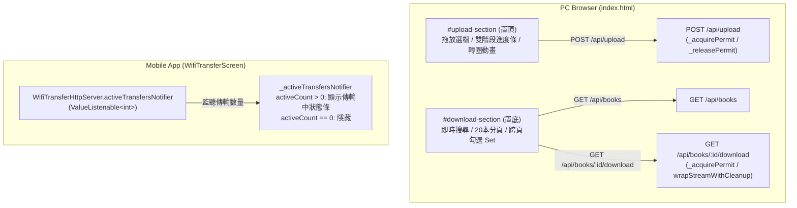

# Epic 44 Issue 4：WiFi 傳書體驗強化 Implementation Plan

> **For agentic workers:** REQUIRED SUB-SKILL: Use superpowers:subagent-driven-development (recommended) or superpowers:executing-plans to implement this plan task-by-task. Steps use checkbox (`- [ ]`) syntax for tracking.

**Goal:** 強化 WiFi 傳書的雙端使用者體驗：手機端即時顯示檔案傳輸中指示條；PC 端網頁將上傳區塊調整至下載區塊上方、加入傳輸容量與雙階段轉圈匯入提示、下載清單加入書名即時搜尋、20 本/頁分頁機制、跨頁勾選記憶與「全選目前頁」「清除勾選」快捷按鈕。

**Architecture:**
- **手機端（`WifiTransferScreen`）**：在 QR Code 下方監聽既有的 `_activeTransfersNotifier`（`ValueListenable<int>`），當 `activeCount > 0` 時渲染微型狀態指示條（含小尺寸 `CircularProgressIndicator` 與「正在傳輸中（N 個檔案）…」文字）；傳輸結束歸零時自動隱藏，維持畫面乾淨清爽。
- **PC 端網頁（`index.html`）**：
  1. **佈局重排**：將 `#upload-section` 調整至 `#download-section` 上方，打開網頁無需滾動即可直接傳書。
  2. **上傳進度與狀態增強**：上傳期間鎖定拖放區與選檔按鈕；XHR 上傳中即時更新傳輸容量與百分比（如 `12.5 MB / 28.0 MB (45%)`）；位元組傳輸達 100% 後進入手機處理匯入階段，切換顯示 CSS 轉圈動畫與「上傳完成，手機端處理匯入中，請稍候…」提示；完成後自動刷新下方書籍清單。
  3. **下載清單即時搜尋與分頁**：純前端 JS 記憶體快取從 `/api/books` 取得的已下載書籍清單；輸入關鍵字即時依書名（不分大小寫）過濾並重置至第 1 頁；每頁固定 20 本，提供上一頁/下一頁與頁碼控制項；使用記憶體 `Set<string>` 保存被勾選的書籍 ID，換頁或搜尋過濾時**跨頁保留已勾選狀態**；提供「全選目前頁」「清除勾選」快捷按鈕與勾選統計，下載時下載所有已勾選的書籍。

**Architecture Diagram:**



**Tech Stack:** Flutter / Dart、HTML5、CSS3、Vanilla JavaScript（100% 離線內嵌、零外部 CDN 依賴）。

**Spec:** `docs/epics/epic-44-wifi-book-transfer/issues.md` (Issue 4)。

## Global Constraints

- 所有程式碼註解、commit message、文件皆使用正體中文（zh-TW），專業術語可保留英文。
- 所有指令在 `app/` 目錄下執行（`flutter pub get`／`flutter analyze`／`flutter test`）。
- 每個 Task 只跑該 Task 實際觸及的測試檔；最後一個 Task 跑完整測試與 `flutter analyze`。
- 不新增任何 `pubspec.yaml` 依賴。
- `app/assets/wifi_transfer/index.html` 必須維持單一自我完備檔案（CSS 與 JS 全內嵌於 HTML 內），嚴禁引用任何外部 CDN、外部字型或外部檔案。
- 下載分頁固定為每頁 20 本（`const PAGE_SIZE = 20;`）。
- 書籍勾選狀態必須使用 `Set` 記憶體跨頁保存，切換頁面或搜尋過濾時不可丟失勾選狀態。

---

### Task 1：手機端動態傳輸狀態條實作（`WifiTransferScreen`）

**Files:**
- Modify: `app/lib/screens/wifi_transfer_screen.dart`
- Modify: `app/test/screens/wifi_transfer_screen_test.dart`

**Interfaces:**
- Consumes: `_activeTransfersNotifier`（既有 `ValueListenable<int>`）。
- Produces: 在 `WifiTransferScreen` 的 QR Code 下方，當 `activeCount > 0` 時渲染 `wifi_transfer_active_transfers_banner`，傳輸歸零時隱藏。

- [x] **Step 1: 寫失敗測試**

Edit `app/test/screens/wifi_transfer_screen_test.dart`，在檔案末尾（最後一個 `testWidgets` 之後、`}` 之前）新增測試：

```dart
  testWidgets(
      'activeTransfersNotifier 狀態變化：activeCount 為 0 時不顯示傳輸中橫幅，'
      '大於 0 時即時顯示傳輸中橫幅與檔案數量（Issue 4）', (tester) async {
    final activeNotifier = ValueNotifier<int>(0);
    await tester.pumpWidget(buildScreen(
      checkNetworkAvailability: () async => const NetworkAvailability(
        kind: NetworkAvailabilityKind.wifiClient,
        ipAddress: '192.168.1.5',
      ),
      activeTransfersNotifierOverride: activeNotifier,
    ));
    await tester.pumpAndSettle();

    // 初始 activeCount 為 0，不顯示橫幅
    expect(
      find.byKey(const Key('wifi_transfer_active_transfers_banner')),
      findsNothing,
    );

    // activeCount 變為 2，顯示橫幅與數量
    activeNotifier.value = 2;
    await tester.pump();

    expect(
      find.byKey(const Key('wifi_transfer_active_transfers_banner')),
      findsOneWidget,
    );
    expect(find.text('正在傳輸中（2 個檔案）…'), findsOneWidget);
    expect(find.byType(CircularProgressIndicator), findsOneWidget);

    // activeCount 歸 0，橫幅自動隱藏
    activeNotifier.value = 0;
    await tester.pump();

    expect(
      find.byKey(const Key('wifi_transfer_active_transfers_banner')),
      findsNothing,
    );
  });

  testWidgets(
      'activeTransfersNotifier 在 E-Ink 高對比主題下正常渲染黑白指示條（Issue 4 / I-1）', (tester) async {
    final activeNotifier = ValueNotifier<int>(1);
    await tester.pumpWidget(MaterialApp(
      theme: ThemeData.light().copyWith(
        colorScheme: const ColorScheme.light(primary: Colors.black),
        scaffoldBackgroundColor: Colors.white,
      ),
      home: Scaffold(
        body: buildScreen(
          checkNetworkAvailability: () async => const NetworkAvailability(
            kind: NetworkAvailabilityKind.wifiClient,
            ipAddress: '192.168.1.5',
          ),
          activeTransfersNotifierOverride: activeNotifier,
        ),
      ),
    ));
    await tester.pumpAndSettle();

    expect(
      find.byKey(const Key('wifi_transfer_active_transfers_banner')),
      findsOneWidget,
    );
    expect(find.text('正在傳輸中（1 個檔案）…'), findsOneWidget);
    final indicator = tester.widget<CircularProgressIndicator>(
      find.byType(CircularProgressIndicator),
    );
    expect(indicator.color, Colors.black);
  });
```

- [x] **Step 2: 執行測試確認失敗**

Run: `flutter test test/screens/wifi_transfer_screen_test.dart`
Expected: FAIL——找不到 `wifi_transfer_active_transfers_banner`。

- [x] **Step 3: 實作手機端傳輸狀態指示條**

Edit `app/lib/screens/wifi_transfer_screen.dart`：
在 `_buildBody()` 中的 `QrImageView` 與其後面的 `SizedBox(height: 16)` 之間新增監聽 `_activeTransfersNotifier` 的組件：

```dart
// 舊：
                  QrImageView(
                    key: const Key('wifi_transfer_qr_code'),
                    data: url,
                    size: 200,
                    backgroundColor: Colors.white,
                  ),
                  const SizedBox(height: 16),
                ],
              ),
            ),
          );
```

```dart
// 新：
                  QrImageView(
                    key: const Key('wifi_transfer_qr_code'),
                    data: url,
                    size: 200,
                    backgroundColor: Colors.white,
                  ),
                  ValueListenableBuilder<int>(
                    valueListenable: _activeTransfersNotifier,
                    builder: (context, activeCount, _) {
                      if (activeCount <= 0) {
                        return const SizedBox.shrink();
                      }
                      final theme = Theme.of(context);
                      // 【`/receiving-code-review` 審查修正 I-1】以亮度與 primary/scaffold 顏色
                      // 推斷 E-Ink 高對比主題；未來若全面重構可改為讀取 AppThemePreferences.isEinkMode。
                      final isEink = theme.brightness == Brightness.light &&
                          theme.colorScheme.primary == Colors.black &&
                          theme.scaffoldBackgroundColor == Colors.white;
                      return Container(
                        key: const Key('wifi_transfer_active_transfers_banner'),
                        margin: const EdgeInsets.only(top: 16),
                        padding: const EdgeInsets.symmetric(
                          horizontal: 16,
                          vertical: 10,
                        ),
                        decoration: BoxDecoration(
                          color: isEink
                              ? Colors.white
                              : theme.colorScheme.surfaceContainerHighest,
                          borderRadius: BorderRadius.circular(8),
                          border: Border.all(
                            color: isEink
                                ? Colors.black
                                : theme.colorScheme.outline.withValues(alpha: 0.35),
                            width: 1.0,
                          ),
                        ),
                        child: Row(
                          mainAxisSize: MainAxisSize.min,
                          children: [
                            SizedBox(
                              width: 16,
                              height: 16,
                              child: CircularProgressIndicator(
                                strokeWidth: 2,
                                color: isEink ? Colors.black : theme.colorScheme.primary,
                              ),
                            ),
                            const SizedBox(width: 10),
                            Text(
                              '正在傳輸中（$activeCount 個檔案）…',
                              key: const Key('wifi_transfer_active_transfers_text'),
                              style: TextStyle(
                                fontWeight: FontWeight.bold,
                                color: isEink
                                    ? Colors.black
                                    : theme.colorScheme.onSurface,
                              ),
                            ),
                          ],
                        ),
                      );
                    },
                  ),
                  const SizedBox(height: 16),
                ],
              ),
            ),
          );
```

- [x] **Step 4: 執行測試確認通過**

Run: `flutter test test/screens/wifi_transfer_screen_test.dart`
Expected: PASS，所有測試（包含新增測試）全數通過。

- [x] **Step 5: `flutter analyze` 確認乾淨**

Run: `flutter analyze lib/screens/wifi_transfer_screen.dart test/screens/wifi_transfer_screen_test.dart`
Expected: `No issues found!`

- [x] **Step 6: Commit**

```bash
git add app/lib/screens/wifi_transfer_screen.dart app/test/screens/wifi_transfer_screen_test.dart
git commit -m "$(cat <<'EOF'
feat(wifi-transfer): 手機端畫面新增傳輸進行中動態指示條

epic-44-wifi-book-transfer Issue 4：在 WifiTransferScreen 的 QR Code 下方
監聽 _activeTransfersNotifier，當 activeCount > 0 時動態顯示
wifi_transfer_active_transfers_banner（含小尺寸 CircularProgressIndicator
與「正在傳輸中（N 個檔案）…」），傳輸結束歸零時自動隱藏，適配 E-Ink 高對比
與一般色彩主題。補齊 Widget 測試驗證 0 與大於 0 的切換行為。

Co-Authored-By: Claude Sonnet 5 <noreply@anthropic.com>
EOF
)"
```

---

### Task 2：PC 端網頁佈局調整與上傳進度狀態增強（`index.html`）

**Files:**
- Modify: `app/test/wifi_transfer/wifi_transfer_http_server_test.dart`
- Modify: `app/assets/wifi_transfer/index.html`

**Interfaces:**
- Consumes: `POST /api/upload`。
- Produces: `#upload-section` 調整至頂部；上傳期間鎖定拖放區；上傳中即時顯示 `已傳輸量 / 總容量 (百分比)`；位元組上傳完畢時顯示轉圈動畫與「上傳完成，手機端處理匯入中，請稍候…」。

- [x] **Step 1: 寫失敗測試**

Edit `app/test/wifi_transfer/wifi_transfer_http_server_test.dart`，在 `GET / 回傳 index.html 內容與正確 Content-Type／Cache-Control` 測試後方新增：

```dart
    test('GET /：HTML 結構中 #upload-section 位於 #download-section 之前（Issue 4 佈局重排）',
        () async {
      final response = await _realGet('http://127.0.0.1:${httpServer.port}/');
      expect(response.statusCode, 200);
      final body = response.body;
      final uploadIndex = body.indexOf('id="upload-section"');
      final downloadIndex = body.indexOf('id="download-section"');
      expect(uploadIndex, greaterThan(-1));
      expect(downloadIndex, greaterThan(-1));
      expect(uploadIndex, lessThan(downloadIndex),
          reason: '上傳區塊應位於下載區塊之前，避免藏書量多時需一直下拉');
    });

    test('GET /：HTML 包含上傳狀態與雙階段進度元素（Issue 4 上傳體驗增強）', () async {
      final response = await _realGet('http://127.0.0.1:${httpServer.port}/');
      expect(response.statusCode, 200);
      final body = response.body;
      expect(body, contains('id="upload-status-text"'));
      expect(body, contains('id="upload-status-spinner"'));
      expect(body, contains('id="upload-bytes-text"'));
      expect(body, contains('formatBytesShort'));
    });
```

- [x] **Step 2: 執行測試確認失敗**

Run: `flutter test test/wifi_transfer/wifi_transfer_http_server_test.dart`
Expected: FAIL——`uploadIndex` 大於 `downloadIndex`，且找不到 `upload-status-text` 等元素。

- [x] **Step 3: 調整 `index.html` 佈局與上傳功能**

Edit `app/assets/wifi_transfer/index.html`：
1. CSS 新增轉圈動畫與禁用樣式：
```css
  .spinner {
    display: inline-block;
    width: 14px;
    height: 14px;
    border: 2px solid rgba(0, 0, 0, 0.2);
    border-top-color: currentColor;
    border-radius: 50%;
    animation: spin 0.8s linear infinite;
    vertical-align: middle;
    margin-right: 6px;
  }
  @keyframes spin { to { transform: rotate(360deg); } }
  #upload-dropzone.disabled {
    opacity: 0.5;
    pointer-events: none;
    cursor: not-allowed;
    background: #f9f9f9;
  }
  #upload-status-container {
    display: none;
    margin-top: 8px;
    font-size: 13px;
    color: #444;
  }
```

2. 調整 `<body>` 內的區塊順序（先 `#upload-section`，後 `#download-section`），並擴充上傳狀態結構：
```html
<body>
  <h1>elinkBook WiFi 傳書</h1>
  <section id="upload-section">
    <h2>上傳書籍</h2>
    <div id="upload-dropzone">
      拖放檔案到此處，或
      <label for="upload-file-input">選擇檔案</label>
    </div>
    <input id="upload-file-input" type="file" multiple style="display: none;">
    <progress id="upload-progress" value="0" max="100"></progress>
    <div id="upload-status-container">
      <span id="upload-status-spinner" class="spinner" style="display: none;"></span>
      <span id="upload-status-text"></span>
      <span id="upload-bytes-text" style="float: right; color: #666;"></span>
      <div style="clear: both;"></div>
    </div>
    <ul id="upload-result-list"></ul>
  </section>
  <section id="download-section">
    <h2>下載書籍</h2>
    <div id="download-list" class="placeholder">載入中…</div>
    <button id="download-selected-button" type="button">下載已勾選書籍</button>
    <p id="download-status" class="placeholder"></p>
  </section>
```

3. 更新 JavaScript 新增 `formatBytesShort` 與強化 `uploadFiles` 函式：
```javascript
    // 【`/receiving-code-review` 審查修正 I-2】無括號短格式容量顯示，供上傳進度列使用
    function formatBytesShort(bytes) {
      if (bytes == null) return '';
      if (bytes < 1024) return bytes + ' B';
      if (bytes < 1024 * 1024) return (bytes / 1024).toFixed(1) + ' KB';
      return (bytes / (1024 * 1024)).toFixed(1) + ' MB';
    }

    function uploadFiles(fileList) {
      if (fileList.length === 0) return;
      const formData = new FormData();
      for (const file of fileList) {
        formData.append('files', file, file.name);
      }
      const dropzoneEl = document.getElementById('upload-dropzone');
      const fileInputEl = document.getElementById('upload-file-input');
      const progressEl = document.getElementById('upload-progress');
      const statusContainer = document.getElementById('upload-status-container');
      const statusSpinner = document.getElementById('upload-status-spinner');
      const statusText = document.getElementById('upload-status-text');
      const bytesText = document.getElementById('upload-bytes-text');
      const resultListEl = document.getElementById('upload-result-list');

      // 【`/receiving-code-review` 審查修正 M-3】設置 aria-disabled
      dropzoneEl.classList.add('disabled');
      dropzoneEl.setAttribute('aria-disabled', 'true');
      fileInputEl.disabled = true;
      progressEl.style.display = '';
      progressEl.value = 0;
      statusContainer.style.display = 'block';
      statusSpinner.style.display = 'none';
      statusText.textContent = '準備上傳…';
      bytesText.textContent = '';
      resultListEl.innerHTML = '';

      const xhr = new XMLHttpRequest();
      xhr.open('POST', '/api/upload');
      xhr.upload.onprogress = (event) => {
        if (event.lengthComputable && event.total > 0) {
          const percent = (event.loaded / event.total) * 100;
          progressEl.value = percent;
          if (event.loaded < event.total) {
            statusText.textContent = '正在上傳… (' + Math.round(percent) + '%)';
            bytesText.textContent = formatBytesShort(event.loaded) + ' / ' + formatBytesShort(event.total);
          } else {
            // 上傳位元組已傳輸完畢，進入手機端計算指紋與匯入階段
            statusSpinner.style.display = 'inline-block';
            statusText.textContent = '上傳完成，手機端處理與匯入中，請稍候…';
            bytesText.textContent = formatBytesShort(event.total);
          }
        } else {
          // 【`/receiving-code-review` 審查修正 I-3】降級處理：無法預知總量時顯示已傳量與不確定進度條
          statusText.textContent = '正在上傳…';
          bytesText.textContent = formatBytesShort(event.loaded) + ' / 未知';
          progressEl.removeAttribute('value');
        }
      };

      const cleanup = () => {
        dropzoneEl.classList.remove('disabled');
        dropzoneEl.removeAttribute('aria-disabled');
        fileInputEl.disabled = false;
        progressEl.style.display = 'none';
        statusContainer.style.display = 'none';
        statusSpinner.style.display = 'none';
      };

      xhr.onload = () => {
        cleanup();
        if (xhr.status >= 200 && xhr.status < 300) {
          try {
            const results = JSON.parse(xhr.responseText);
            if (Array.isArray(results)) {
              let hasImported = false;
              for (const result of results) {
                const li = document.createElement('li');
                const label = UPLOAD_OUTCOME_LABELS[result.outcome] || result.outcome;
                li.textContent = result.originalFileName + '：' + label;
                resultListEl.appendChild(li);
                if (result.outcome === 'imported') hasImported = true;
              }
              if (hasImported) loadDownloadableBooks();
              return;
            }
          } catch (err) {}
        }
        const li = document.createElement('li');
        li.textContent = '上傳失敗：' +
          (xhr.status ? `伺服器回應錯誤 (${xhr.status})` : '無法解析伺服器回應');
        resultListEl.appendChild(li);
      };

      xhr.onerror = () => {
        cleanup();
        const li = document.createElement('li');
        li.textContent = '上傳失敗：網路錯誤';
        resultListEl.appendChild(li);
      };
      xhr.send(formData);
    }
```

- [x] **Step 4: 執行測試確認通過**

Run: `flutter test test/wifi_transfer/wifi_transfer_http_server_test.dart`
Expected: PASS。

- [x] **Step 5: `flutter analyze` 確認乾淨**

Run: `flutter analyze test/wifi_transfer/wifi_transfer_http_server_test.dart`
Expected: `No issues found!`

- [x] **Step 6: Commit**

```bash
git add app/assets/wifi_transfer/index.html app/test/wifi_transfer/wifi_transfer_http_server_test.dart
git commit -m "$(cat <<'EOF'
feat(wifi-transfer): PC 網頁上傳區塊置頂與上傳進度狀態增強

epic-44-wifi-book-transfer Issue 4：
- 將 #upload-section 調整至 #download-section 上方，開頁無需滾動即可傳書。
- 上傳中即時顯示已傳輸容量與百分比（如 12.5 MB / 28.0 MB (45%)）。
- 雙階段狀態：位元組傳輸完畢進入手機端處理匯入時，顯示 CSS 轉圈動畫與「手機端處理與匯入中，請稍候…」提示。
- 上傳期間鎖定拖放區與選檔按鈕，避免重複觸發上傳。

Co-Authored-By: Claude Sonnet 5 <noreply@anthropic.com>
EOF
)"
```

---

### Task 3：PC 端網頁下載清單搜尋、分頁與跨頁勾選（`index.html`）

**Files:**
- Modify: `app/test/wifi_transfer/wifi_transfer_http_server_test.dart`
- Modify: `app/assets/wifi_transfer/index.html`

**Interfaces:**
- Consumes: `GET /api/books`、`GET /api/books/<id>/download`。
- Produces: 搜尋框（即時過濾）、20 本/頁分頁、跨頁勾選 `Set` 記憶、「全選目前頁」「清除勾選」快捷按鈕。

- [x] **Step 1: 寫失敗測試**

Edit `app/test/wifi_transfer/wifi_transfer_http_server_test.dart`，在 Task 2 新增的測試後方追加：

```dart
    test('GET /：HTML 包含書籍清單搜尋、分頁控制項與批次勾選工具列（Issue 4 下載體驗增強）',
        () async {
      final response = await _realGet('http://127.0.0.1:${httpServer.port}/');
      expect(response.statusCode, 200);
      final body = response.body;
      expect(body, contains('id="download-search-input"'));
      expect(body, contains('id="download-search-stats"'));
      expect(body, contains('id="download-select-page-button"'));
      expect(body, contains('id="download-clear-selection-button"'));
      expect(body, contains('id="download-selection-count"'));
      expect(body, contains('id="download-pagination"'));
      expect(body, contains('id="download-prev-page-button"'));
      expect(body, contains('id="download-next-page-button"'));
      expect(body, contains('id="download-page-info"'));
      expect(body, contains('const PAGE_SIZE = 20;'));
      expect(body, contains('new Set()'));
      expect(body, contains('toLowerCase()'));
    });
```

- [x] **Step 2: 執行測試確認失敗**

Run: `flutter test test/wifi_transfer/wifi_transfer_http_server_test.dart`
Expected: FAIL——找不到 `download-search-input` 等元素。

- [x] **Step 3: 實作搜尋、分頁與跨頁勾選邏輯**

Edit `app/assets/wifi_transfer/index.html`：
1. CSS 新增樣式：
```css
  #download-search-input {
    width: 100%;
    box-sizing: border-box;
    padding: 8px 12px;
    font-size: 14px;
    border: 1px solid #ccc;
    border-radius: 6px;
    margin-bottom: 4px;
  }
  .toolbar {
    display: flex;
    align-items: center;
    gap: 8px;
    margin: 8px 0;
    flex-wrap: wrap;
    font-size: 13px;
  }
  .toolbar button {
    font-size: 12px;
    padding: 4px 10px;
    margin: 0;
  }
  .pagination {
    display: flex;
    align-items: center;
    justify-content: space-between;
    margin-top: 12px;
    padding-top: 8px;
    border-top: 1px solid #eee;
    font-size: 13px;
  }
  .pagination button {
    font-size: 12px;
    padding: 4px 12px;
    margin: 0;
  }
```

2. 下載區塊 HTML 結構：
```html
  <section id="download-section">
    <h2>下載書籍</h2>
    <input id="download-search-input" type="text" placeholder="搜尋書名…">
    <div id="download-search-stats" style="font-size: 12px; color: #666; margin-bottom: 8px;"></div>
    <div class="toolbar">
      <button id="download-select-page-button" type="button">全選目前頁</button>
      <button id="download-clear-selection-button" type="button">清除勾選</button>
      <span id="download-selection-count" style="color: #666;">已勾選 0 本</span>
    </div>
    <div id="download-list" class="placeholder">載入中…</div>
    <div id="download-pagination" class="pagination" style="display: none;">
      <button id="download-prev-page-button" type="button">上一頁</button>
      <span id="download-page-info">第 1 / 1 頁</span>
      <button id="download-next-page-button" type="button">下一頁</button>
    </div>
    <div style="margin-top: 12px;">
      <button id="download-selected-button" type="button">下載已勾選書籍</button>
      <p id="download-status" class="placeholder" style="margin: 6px 0 0;"></p>
    </div>
  </section>
```

3. 更新 JavaScript 邏輯：
```javascript
    const PAGE_SIZE = 20;
    let allBooks = [];
    let filteredBooks = [];
    const selectedBookIds = new Set();
    let currentPage = 1;

    function updateSelectionCount() {
      const countEl = document.getElementById('download-selection-count');
      countEl.textContent = '已勾選 ' + selectedBookIds.size + ' 本';
    }

    function renderPage() {
      const listEl = document.getElementById('download-list');
      const paginationEl = document.getElementById('download-pagination');
      const prevBtn = document.getElementById('download-prev-page-button');
      const nextBtn = document.getElementById('download-next-page-button');
      const pageInfo = document.getElementById('download-page-info');

      if (filteredBooks.length === 0) {
        listEl.textContent = allBooks.length === 0 ? '目前沒有可下載的書籍' : '查無符合條件的書籍';
        listEl.className = 'placeholder';
        paginationEl.style.display = 'none';
        updateSelectionCount();
        return;
      }

      listEl.className = '';
      listEl.innerHTML = '';

      const totalPages = Math.ceil(filteredBooks.length / PAGE_SIZE) || 1;
      if (currentPage > totalPages) currentPage = totalPages;
      if (currentPage < 1) currentPage = 1;

      const start = (currentPage - 1) * PAGE_SIZE;
      const pageBooks = filteredBooks.slice(start, start + PAGE_SIZE);

      for (const book of pageBooks) {
        const label = document.createElement('label');
        label.className = 'book-item';
        const checkbox = document.createElement('input');
        checkbox.type = 'checkbox';
        checkbox.value = book.id;
        checkbox.className = 'download-book-checkbox';
        checkbox.checked = selectedBookIds.has(book.id);
        checkbox.addEventListener('change', (e) => {
          if (e.target.checked) {
            selectedBookIds.add(book.id);
          } else {
            selectedBookIds.delete(book.id);
          }
          updateSelectionCount();
        });
        label.appendChild(checkbox);
        label.appendChild(
          document.createTextNode(' ' + book.title + formatBytes(book.sizeBytes))
        );
        listEl.appendChild(label);
      }

      if (totalPages > 1) {
        paginationEl.style.display = 'flex';
        prevBtn.disabled = (currentPage === 1);
        nextBtn.disabled = (currentPage === totalPages);
        pageInfo.textContent = '第 ' + currentPage + ' / ' + totalPages + ' 頁';
      } else {
        paginationEl.style.display = 'none';
      }
      updateSelectionCount();
    }

    function applyFilter() {
      const searchInput = document.getElementById('download-search-input');
      const statsEl = document.getElementById('download-search-stats');
      const query = (searchInput.value || '').trim().toLowerCase();

      if (!query) {
        filteredBooks = allBooks.slice();
        statsEl.textContent = allBooks.length > 0 ? '共 ' + allBooks.length + ' 本書籍' : '';
      } else {
        filteredBooks = allBooks.filter((book) =>
          (book.title || '').toLowerCase().includes(query)
        );
        statsEl.textContent = '符合 ' + filteredBooks.length + ' 本 / 共 ' + allBooks.length + ' 本';
      }
      currentPage = 1;
      renderPage();
      updateSelectionCount();
    }

    async function loadDownloadableBooks() {
      const listEl = document.getElementById('download-list');
      try {
        const response = await fetch('/api/books');
        allBooks = await response.json();
        // 【`/receiving-code-review` 審查修正 I-4】清理已不存在的書籍 ID 勾選
        const freshIds = new Set(allBooks.map((b) => b.id));
        for (const id of [...selectedBookIds]) {
          if (!freshIds.has(id)) {
            selectedBookIds.delete(id);
          }
        }
        applyFilter();
      } catch (err) {
        listEl.textContent = '無法載入書籍清單';
        listEl.className = 'placeholder';
      }
    }

    // 全選目前頁
    document
      .getElementById('download-select-page-button')
      .addEventListener('click', () => {
        const start = (currentPage - 1) * PAGE_SIZE;
        const pageBooks = filteredBooks.slice(start, start + PAGE_SIZE);
        for (const book of pageBooks) {
          selectedBookIds.add(book.id);
        }
        renderPage();
        updateSelectionCount();
      });

    // 清除勾選
    document
      .getElementById('download-clear-selection-button')
      .addEventListener('click', () => {
        selectedBookIds.clear();
        renderPage();
        updateSelectionCount();
      });

    // 上一頁 / 下一頁
    document
      .getElementById('download-prev-page-button')
      .addEventListener('click', () => {
        if (currentPage > 1) {
          currentPage--;
          renderPage();
        }
      });
    document
      .getElementById('download-next-page-button')
      .addEventListener('click', () => {
        const totalPages = Math.ceil(filteredBooks.length / PAGE_SIZE);
        if (currentPage < totalPages) {
          currentPage++;
          renderPage();
        }
      });

    // 搜尋即時輸入過濾
    document
      .getElementById('download-search-input')
      .addEventListener('input', applyFilter);

    // 下載已勾選書籍（從 selectedBookIds 下載所有選中項目，不受當前分頁或過濾限制）
    async function downloadSelectedBooks() {
      const statusEl = document.getElementById('download-status');
      const button = document.getElementById('download-selected-button');
      if (selectedBookIds.size === 0) {
        statusEl.textContent = '請至少勾選一本書';
        return;
      }
      button.disabled = true;
      statusEl.textContent = '下載中…';
      try {
        for (const bookId of selectedBookIds) {
          const link = document.createElement('a');
          link.href = '/api/books/' + encodeURIComponent(bookId) + '/download';
          link.download = '';
          document.body.appendChild(link);
          link.click();
          document.body.removeChild(link);
          await new Promise((resolve) => setTimeout(resolve, 300));
        }
        statusEl.textContent = '已觸發全部下載（共 ' + selectedBookIds.size + ' 本）';
      } finally {
        button.disabled = false;
      }
    }
```

- [x] **Step 4: 執行測試確認通過**

Run: `flutter test test/wifi_transfer/wifi_transfer_http_server_test.dart`
Expected: PASS。

- [x] **Step 5: `flutter analyze` 確認乾淨**

Run: `flutter analyze test/wifi_transfer/wifi_transfer_http_server_test.dart`
Expected: `No issues found!`

- [x] **Step 6: Commit**

```bash
git add app/assets/wifi_transfer/index.html app/test/wifi_transfer/wifi_transfer_http_server_test.dart
git commit -m "$(cat <<'EOF'
feat(wifi-transfer): PC 網頁下載清單新增即時搜尋、20本分頁與跨頁勾選

epic-44-wifi-book-transfer Issue 4：
- 新增即時書名搜尋框，打字即時不分大小寫過濾並顯示符合筆數。
- 純前端分頁機制，每頁固定 20 本，提供上一頁/下一頁與頁碼指示。
- 使用記憶體 Set 跨頁記憶被勾選的書籍，換頁與過濾不遺失選取狀態。
- 提供「全選目前頁」與「清除勾選」快捷按鈕與已勾選計數。
- 下載時下載 Set 中所有選取的書籍，不受當前頁面限制。

Co-Authored-By: Claude Sonnet 5 <noreply@anthropic.com>
EOF
)"
```

---

### Task 4：完整驗證與進度標記

**Files:** 無新增檔案，純驗證與文件進度標記。

- [x] **Step 1: 完整 `flutter analyze`**

Run: `flutter analyze`
Expected: `No issues found!`

- [x] **Step 2: 執行 WiFi 傳書相關單元與 Widget 測試**

Run: `flutter test test/screens/wifi_transfer_screen_test.dart test/wifi_transfer/`
Expected: 全數通過且零失敗（無任何測試失敗或跳過）。

- [x] **Step 3: 更新 Issue 4 與 epics.md 進度**

將 `docs/epics/epic-44-wifi-book-transfer/issues.md` 的 Issue 4 狀態標記為 `completed`，並在 `docs/epics.md` 更新備註。
