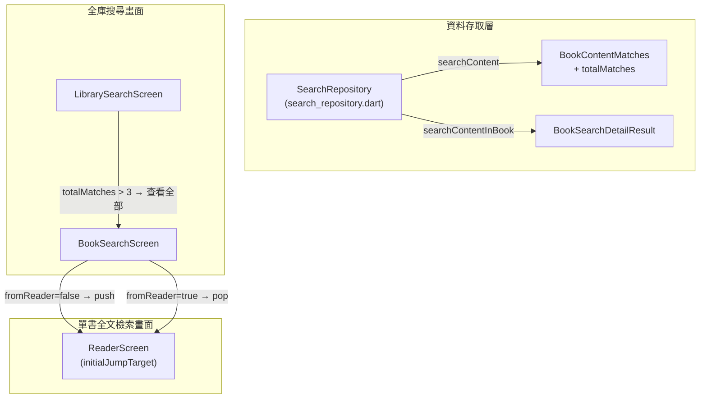

# Issue 7：全庫搜尋書籍結果 Drill-Down 與單書全文檢索畫面 Implementation Plan

> **For agentic workers:** REQUIRED SUB-SKILL: Use superpowers:subagent-driven-development to implement this plan task-by-task. Steps use checkbox (`- [ ]`) syntax for tracking.

**Goal:** 讓使用者從全庫搜尋畫面下鑽至單書全文檢索畫面，檢視一本書的完整命中結果、切換排序、跳轉閱讀。

**Architecture:** 本工單分三層交付：(1) 資料存取層擴充——`ContentMatchSnippet` 新增 `chapterIndex`、`BookContentMatches` 新增 `totalMatches`、`searchContent()` 的 SQL 以視窗函數一併取得總命中筆數；新增 `BookSearchDetailResult` 模型與 `searchContentInBook()` 方法。(2) 全庫搜尋畫面（`LibrarySearchScreen`）修改——書籍卡片底部在命中超過 3 筆時顯示「查看全部」按鈕，導航至新畫面。(3) 新畫面 `BookSearchScreen`——頂部搜尋框 + 排序切換 + 命中片段清單（含位置標籤與關鍵字高亮）+ E-Ink 離散分頁 + 點擊跳轉。

**Architecture Diagram:**



**Tech Stack:** Flutter、sqflite（FTS5 `bm25()` + `ROW_NUMBER() OVER`）、`package:clock`（測試）

**Spec:** [`docs/epics/epic-10-search/spec.md`](file:///U:/MyDeveloper/AI/elinkBook/docs/epics/epic-10-search/spec.md) §9.1–§9.3

## Global Constraints

- `flutter analyze` 必須乾淨才能提交。
- Android minSdk 24。
- 不引入新的外部 `pubspec.yaml` 依賴；關鍵字高亮使用 `RichText`/`TextSpan` 原生實作。
- SQL 不使用 `COUNT(*) FILTER (WHERE ...)` 語法（Android 11 系統 SQLite 3.28 不支援），一律用 `COUNT(CASE WHEN ... THEN 1 END)`。
- `BookSearchScreen` 的 `fromReader` 參數預設 `false`——本工單只實作 `fromReader = false` 路徑（從全庫搜尋進入，點擊推入 `ReaderScreen`）；`fromReader = true`（從閱讀器進入，pop 回傳 `ReaderJumpTarget`）的完整接線屬 Issue 8 範圍，但本工單已預埋分支，Issue 8 只需接線不需改 `BookSearchScreen` 本身。
- 繁體中文用於程式碼註解與使用者可見文字。
- `ReaderJumpTarget.fromContentLocator()` 已存在（Issue 5），直接重用。
- `FakeSearchRepository` 需配合 `SearchRepository` 介面擴充一併更新。
- **偏好設定慣例**：`null` = 不覆寫使用預設值。
- **E-Ink 模式**：比照 `LibrarySearchScreen` 既有 `_buildSection()` + `PagingBar` 離散分頁模式。

---

### Task 1: 資料存取層擴充——模型與 `searchContent()` 改進

**Files:**
- Modify: [`app/lib/search/search_repository.dart`](file:///U:/MyDeveloper/AI/elinkBook/app/lib/search/search_repository.dart)
- Modify: [`app/test/search/search_repository_test.dart`](file:///U:/MyDeveloper/AI/elinkBook/app/test/search/search_repository_test.dart)
- Modify: [`app/test/support/fake_search_repository.dart`](file:///U:/MyDeveloper/AI/elinkBook/app/test/support/fake_search_repository.dart)

**Interfaces:**
- Consumes: 既有 `ContentMatchSnippet`、`BookContentMatches`、`SearchRepository`、`SqliteSearchRepository`
- Produces: 擴充後的 `ContentMatchSnippet`（新增 `chapterIndex`）、`BookContentMatches`（新增 `totalMatches`）、`BookSearchDetailResult` 模型、`SearchRepository.searchContentInBook()` 抽象方法、`SqliteSearchRepository.searchContentInBook()` 實作

> [!IMPORTANT]
> `ContentMatchSnippet` 與 `BookContentMatches` 的欄位擴充會影響所有既有呼叫端。新欄位皆有預設值（`chapterIndex` nullable、`totalMatches` 預設 0），不破壞既有建構式呼叫。

- [ ] **Step 1: 寫 `ContentMatchSnippet.chapterIndex` 與 `BookContentMatches.totalMatches` 的測試**

在 [`app/test/search/search_repository_test.dart`](file:///U:/MyDeveloper/AI/elinkBook/app/test/search/search_repository_test.dart) 的 `group('searchContent', ...)` 底下新增測試：

```dart
    test('searchContent 回傳的 totalMatches 正確反映每本書在資料庫的總命中數'
        '（spec.md §9.1：單書插入 5 筆符合內容，matches.length == 3 但 totalMatches == 5）',
        () async {
      await repository.insertBook(_book('b1', title: '書一'));
      await insertContentRow('b1', '第一段含關鍵詞目標');
      await insertContentRow('b1', '第二段含關鍵詞目標');
      await insertContentRow('b1', '第三段含關鍵詞目標');
      await insertContentRow('b1', '第四段含關鍵詞目標');
      await insertContentRow('b1', '第五段含關鍵詞目標');

      final results = await searchRepository.searchContent(
        '關鍵詞目標',
        perBookLimit: 3,
      );

      expect(results, hasLength(1));
      expect(results.single.matches, hasLength(3));
      expect(results.single.totalMatches, 5);
    });

    test('searchContent 回傳的 ContentMatchSnippet 包含 chapterIndex', () async {
      await repository.insertBook(_book('b1', title: '書一'));
      await insertContentRow('b1', '第三章的內容含搜尋目標', chapterIndex: 3);

      final results = await searchRepository.searchContent('搜尋目標');

      expect(results.single.matches.single.chapterIndex, 3);
    });
```

- [ ] **Step 2: 執行測試確認失敗**

Run: `cd app && flutter test test/search/search_repository_test.dart -v`
Expected: 編譯失敗——`ContentMatchSnippet` 尚無 `chapterIndex`、`BookContentMatches` 尚無 `totalMatches`。

- [ ] **Step 3: 擴充 `ContentMatchSnippet` 與 `BookContentMatches` 模型**

在 [`app/lib/search/search_repository.dart`](file:///U:/MyDeveloper/AI/elinkBook/app/lib/search/search_repository.dart) 修改：

```diff
 class ContentMatchSnippet {
   final String snippet;
   final String locator;
+  final int? chapterIndex;

-  const ContentMatchSnippet({required this.snippet, required this.locator});
+  const ContentMatchSnippet({
+    required this.snippet,
+    required this.locator,
+    this.chapterIndex,
+  });
 }

 class BookContentMatches {
   final Book book;
   final List<ContentMatchSnippet> matches;
+  final int totalMatches;

-  const BookContentMatches({required this.book, required this.matches});
+  const BookContentMatches({
+    required this.book,
+    required this.matches,
+    this.totalMatches = 0,
+  });
 }
```

- [ ] **Step 4: 修改 `SqliteSearchRepository.searchContent()` SQL 加入 `total_count` 與 `chapter_index`**

在 [`app/lib/search/search_repository.dart`](file:///U:/MyDeveloper/AI/elinkBook/app/lib/search/search_repository.dart) 的 `searchContent()` 方法修改 SQL 與結果解析：

```diff
       rows = await _database.rawQuery('''
-        SELECT b.*, sub.locator, sub.raw_text, sub.rn, sub.score
+        SELECT b.*, sub.locator, sub.raw_text, sub.chapter_index,
+               sub.rn, sub.score, sub.total_count
         FROM (
-          SELECT book_id, locator, raw_text, score,
+          SELECT book_id, locator, raw_text, chapter_index, score,
+                 COUNT(*) OVER (PARTITION BY book_id) AS total_count,
                  ROW_NUMBER() OVER (
                    PARTITION BY book_id
                    ORDER BY score
                  ) AS rn
           FROM (
-            SELECT bci.book_id, bci.locator, bci.raw_text,
+            SELECT bci.book_id, bci.locator, bci.raw_text,
+                   bci.chapter_index,
                    bm25(book_content_fts) AS score
             FROM book_content_fts
             JOIN book_content_index bci ON bci.rowid = book_content_fts.rowid
             WHERE book_content_fts MATCH ?
           )
         ) sub
         JOIN books b ON b.id = sub.book_id
         WHERE sub.rn <= ?
         ORDER BY sub.rn, sub.score
       ''', [tokenized, perBookLimit]);
```

> [!NOTE]
> `COUNT(*) OVER (PARTITION BY book_id)` 放在外層子查詢（ROW_NUMBER 同層），在 `rn` 過濾前計算，因此 `total_count` 反映的是該書的**所有**命中筆數，不受 `perBookLimit` 影響。

修改結果解析部分：

```diff
+    final totalMatchesByBookId = <String, int>{};
     for (final row in rows) {
       final bookId = row['id'] as String;
       booksById.putIfAbsent(bookId, () => Book.fromMap(row));
+      totalMatchesByBookId.putIfAbsent(
+        bookId,
+        () => row['total_count'] as int,
+      );
       snippetsByBookId.putIfAbsent(bookId, () => []).add(
             ContentMatchSnippet(
               snippet: _truncate(row['raw_text'] as String, trimmedQuery),
               locator: row['locator'] as String,
+              chapterIndex: row['chapter_index'] as int?,
             ),
           );
     }

     return [
       for (final entry in snippetsByBookId.entries)
-        BookContentMatches(book: booksById[entry.key]!, matches: entry.value),
+        BookContentMatches(
+          book: booksById[entry.key]!,
+          matches: entry.value,
+          totalMatches: totalMatchesByBookId[entry.key] ?? 0,
+        ),
     ];
```

- [ ] **Step 5: 執行測試確認通過**

Run: `cd app && flutter test test/search/search_repository_test.dart -v`
Expected: 全數 PASS（含兩個新增的測試）。

- [ ] **Step 6: 寫 `searchContentInBook()` 的測試**

在 [`app/test/search/search_repository_test.dart`](file:///U:/MyDeveloper/AI/elinkBook/app/test/search/search_repository_test.dart) 新增：

```dart
  group('searchContentInBook', () {
    test('只回傳指定 bookId 的命中結果，不含其他書籍', () async {
      await repository.insertBook(_book('b1', title: '書一'));
      await repository.insertBook(_book('b2', title: '書二'));
      await insertContentRow('b1', '這裡有搜尋目標字');
      await insertContentRow('b2', '這裡也有搜尋目標字');

      final result = await searchRepository.searchContentInBook(
        'b1',
        '搜尋目標字',
      );

      expect(result, isNotNull);
      expect(result!.book.id, 'b1');
      expect(result.matches, hasLength(1));
    });

    test('sortByBookOrder: true 時依 chapter_index ASC 排序', () async {
      await repository.insertBook(_book('b1', title: '書一'));
      await insertContentRow('b1', '第三章的目標關鍵字', chapterIndex: 3);
      await insertContentRow('b1', '第一章的目標關鍵字', chapterIndex: 1);
      await insertContentRow('b1', '第二章的目標關鍵字', chapterIndex: 2);

      final result = await searchRepository.searchContentInBook(
        'b1',
        '目標關鍵字',
        sortByBookOrder: true,
      );

      expect(result, isNotNull);
      expect(result!.matches.map((m) => m.chapterIndex).toList(), [1, 2, 3]);
    });

    test('sortByBookOrder: false 時依 BM25 相關度排序', () async {
      await repository.insertBook(_book('b1', title: '書一'));
      await insertContentRow('b1', '第一章包含搜尋字', chapterIndex: 1);
      await insertContentRow('b1', '第二章包含搜尋字', chapterIndex: 2);

      final result = await searchRepository.searchContentInBook(
        'b1',
        '搜尋字',
        sortByBookOrder: false,
      );

      // BM25 排序結果本身不做精確斷言（兩筆文字長度相近，分數差異可能不大），
      // 只驗證確實回傳了全部命中且 matches 非空。
      expect(result, isNotNull);
      expect(result!.matches, hasLength(2));
    });

    test('命中筆數超過 limit 時 isTruncated 為 true', () async {
      await repository.insertBook(_book('b1', title: '書一'));
      for (var i = 0; i < 5; i++) {
        await insertContentRow('b1', '段落${i}含截斷測試字', chapterIndex: i);
      }

      final result = await searchRepository.searchContentInBook(
        'b1',
        '截斷測試字',
        limit: 3,
      );

      expect(result, isNotNull);
      expect(result!.matches, hasLength(3));
      expect(result.totalMatches, 5);
      expect(result.isTruncated, isTrue);
    });

    test('命中筆數不超過 limit 時 isTruncated 為 false', () async {
      await repository.insertBook(_book('b1', title: '書一'));
      await insertContentRow('b1', '唯一的未截斷目標字');

      final result = await searchRepository.searchContentInBook(
        'b1',
        '未截斷目標字',
        limit: 200,
      );

      expect(result, isNotNull);
      expect(result!.isTruncated, isFalse);
    });

    test('空查詢或 tokenizeForQuery 為空時回傳 null', () async {
      await repository.insertBook(_book('b1', title: '書一'));
      await insertContentRow('b1', '有內容但查詢為空');

      final result = await searchRepository.searchContentInBook('b1', '   ');
      expect(result, isNull);
    });

    test('指定 bookId 不存在時回傳 null', () async {
      final result = await searchRepository.searchContentInBook(
        'nonexistent',
        '任意查詢',
      );
      expect(result, isNull);
    });
  });
```

- [ ] **Step 7: 執行測試確認失敗**

Run: `cd app && flutter test test/search/search_repository_test.dart -v`
Expected: 編譯失敗——`SearchRepository` 尚無 `searchContentInBook` 方法。

- [ ] **Step 8: 實作 `BookSearchDetailResult` 模型與 `searchContentInBook()` 方法**

在 [`app/lib/search/search_repository.dart`](file:///U:/MyDeveloper/AI/elinkBook/app/lib/search/search_repository.dart) 新增模型（放在 `BookContentMatches` class 之後）：

```dart
/// 單書全文檢索結果（epic-10-search Issue 7，spec.md §9.1）。
class BookSearchDetailResult {
  final Book book;
  final List<ContentMatchSnippet> matches;
  final int totalMatches;

  /// 當 [totalMatches] > 查詢時傳入的 `limit` 時為 `true`，UI 據此顯示
  /// 「僅顯示前 N 筆」提示。
  final bool isTruncated;

  const BookSearchDetailResult({
    required this.book,
    required this.matches,
    required this.totalMatches,
    required this.isTruncated,
  });
}
```

在 `SearchRepository` 抽象類別新增方法：

```diff
 abstract class SearchRepository {
   Future<List<Book>> searchTitleAuthor(String query);
   Future<List<BookContentMatches>> searchContent(
     String query, {
     int perBookLimit = 3,
   });
+
+  /// 針對指定書籍查詢全文檢索命中片段（epic-10-search Issue 7，spec.md
+  /// §9.1）。[bookId] 不存在或查詢為空時回傳 `null`。
+  Future<BookSearchDetailResult?> searchContentInBook(
+    String bookId,
+    String query, {
+    int limit = 200,
+    bool sortByBookOrder = true,
+  });
 }
```

在 `SqliteSearchRepository` 實作：

```dart
  @override
  Future<BookSearchDetailResult?> searchContentInBook(
    String bookId,
    String query, {
    int limit = 200,
    bool sortByBookOrder = true,
  }) async {
    final trimmedQuery = query.trim();
    final tokenized = tokenizeForQuery(trimmedQuery);
    if (tokenized.isEmpty) return null;

    // 先查詢該書是否存在，帶出 Book 物件。
    final bookRows = await _database.query(
      'books',
      where: 'id = ?',
      whereArgs: [bookId],
      limit: 1,
    );
    if (bookRows.isEmpty) return null;
    final book = Book.fromMap(bookRows.first);

    // 先取得該書的總命中筆數（不受 limit 限制）。
    int totalMatches;
    try {
      final countRows = await _database.rawQuery('''
        SELECT COUNT(*) AS cnt
        FROM book_content_fts
        JOIN book_content_index bci ON bci.rowid = book_content_fts.rowid
        WHERE book_content_fts MATCH ?
          AND bci.book_id = ?
      ''', [tokenized, bookId]);
      totalMatches = countRows.first['cnt'] as int;
    } on DatabaseException {
      return null;
    }

    if (totalMatches == 0) {
      return BookSearchDetailResult(
        book: book,
        matches: const [],
        totalMatches: 0,
        isTruncated: false,
      );
    }

    // 查詢命中片段，依排序模式決定 ORDER BY。
    final orderClause = sortByBookOrder
        ? 'ORDER BY bci.chapter_index ASC, bci.rowid ASC'
        : 'ORDER BY bm25(book_content_fts) ASC';

    List<Map<String, Object?>> rows;
    try {
      rows = await _database.rawQuery('''
        SELECT bci.locator, bci.raw_text, bci.chapter_index
        FROM book_content_fts
        JOIN book_content_index bci ON bci.rowid = book_content_fts.rowid
        WHERE book_content_fts MATCH ?
          AND bci.book_id = ?
        $orderClause
        LIMIT ?
      ''', [tokenized, bookId, limit]);
    } on DatabaseException {
      return null;
    }

    final matches = rows
        .map((row) => ContentMatchSnippet(
              snippet: _truncate(row['raw_text'] as String, trimmedQuery),
              locator: row['locator'] as String,
              chapterIndex: row['chapter_index'] as int?,
            ))
        .toList();

    return BookSearchDetailResult(
      book: book,
      matches: matches,
      totalMatches: totalMatches,
      isTruncated: totalMatches > limit,
    );
  }
```

- [ ] **Step 9: 更新 `FakeSearchRepository`**

在 [`app/test/support/fake_search_repository.dart`](file:///U:/MyDeveloper/AI/elinkBook/app/test/support/fake_search_repository.dart) 新增：

```diff
 class FakeSearchRepository implements SearchRepository {
   FakeSearchRepository({
     List<Book> titleAuthorResults = const [],
     List<BookContentMatches> contentResults = const [],
+    this.bookSearchDetailResult,
   })  : _titleAuthorResults = titleAuthorResults,
         _contentResults = contentResults;

   final List<Book> _titleAuthorResults;
   final List<BookContentMatches> _contentResults;
+  BookSearchDetailResult? bookSearchDetailResult;

   final List<String> searchTitleAuthorCalls = [];
   final List<String> searchContentCalls = [];
+  final List<String> searchContentInBookCalls = [];

   @override
   Future<List<Book>> searchTitleAuthor(String query) async {
     searchTitleAuthorCalls.add(query);
     return _titleAuthorResults;
   }

   @override
   Future<List<BookContentMatches>> searchContent(
     String query, {
     int perBookLimit = 3,
   }) async {
     searchContentCalls.add(query);
     return _contentResults;
   }
+
+  @override
+  Future<BookSearchDetailResult?> searchContentInBook(
+    String bookId,
+    String query, {
+    int limit = 200,
+    bool sortByBookOrder = true,
+  }) async {
+    searchContentInBookCalls.add(query);
+    return bookSearchDetailResult;
+  }
 }
```

- [ ] **Step 10: 執行全部搜尋相關測試確認通過**

Run: `cd app && flutter test test/search/search_repository_test.dart test/screens/library_search_screen_test.dart -v`
Expected: 全數 PASS。

- [ ] **Step 11: 執行靜態分析**

Run: `cd app && flutter analyze`
Expected: No issues found。

- [ ] **Step 12: Commit**

```bash
cd app && git add lib/search/search_repository.dart test/search/search_repository_test.dart test/support/fake_search_repository.dart
git commit -m "feat(search): 擴充 SearchRepository 支援 totalMatches 與 searchContentInBook (epic-10 issue-7 task-1)"
```

---

### Task 2: 全庫搜尋畫面 Drill-Down 入口

**Files:**
- Modify: [`app/lib/screens/library_search_screen.dart`](file:///U:/MyDeveloper/AI/elinkBook/app/lib/screens/library_search_screen.dart)
- Create: [`app/lib/screens/book_search_screen.dart`](file:///U:/MyDeveloper/AI/elinkBook/app/lib/screens/book_search_screen.dart) (stub，Task 3 完整實作)
- Modify: [`app/test/screens/library_search_screen_test.dart`](file:///U:/MyDeveloper/AI/elinkBook/app/test/screens/library_search_screen_test.dart)

**Interfaces:**
- Consumes: Task 1 的 `BookContentMatches.totalMatches`、`SearchRepository`（含 `searchContentInBook`）
- Produces: `_buildContentGroupCard()` 底部「查看全部」按鈕、`BookSearchScreen` 最小 stub（足以被 `Navigator.push` 建構並渲染一個可找到的 widget）

- [ ] **Step 1: 寫「查看全部」按鈕的 widget test**

在 [`app/test/screens/library_search_screen_test.dart`](file:///U:/MyDeveloper/AI/elinkBook/app/test/screens/library_search_screen_test.dart) 新增：

```dart
  testWidgets('內容匹配卡片：totalMatches > 3 時顯示「查看全部」按鈕，<= 3 時不顯示',
      (tester) async {
    final book5Hits = _testBook(id: 'b1', title: '五筆命中');
    final book2Hits = _testBook(id: 'b2', title: '兩筆命中');
    final searchRepository = FakeSearchRepository(
      titleAuthorResults: const [],
      contentResults: [
        BookContentMatches(
          book: book5Hits,
          matches: [
            for (var i = 0; i < 3; i++)
              ContentMatchSnippet(
                snippet: '片段$i',
                locator: 'epubcfi(/6/$i)',
              ),
          ],
          totalMatches: 5,
        ),
        BookContentMatches(
          book: book2Hits,
          matches: [
            for (var i = 0; i < 2; i++)
              ContentMatchSnippet(
                snippet: '片段$i',
                locator: 'epubcfi(/6/$i)',
              ),
          ],
          totalMatches: 2,
        ),
      ],
    );

    await tester.pumpWidget(
      wrap(LibrarySearchScreen(
        initialQuery: '測試',
        searchRepository: searchRepository,
        prefsManager: FakeReaderPrefsManager(),
        libraryRepository: FakeLibraryRepository(),
        readerFeatureRepositories: const LibraryReaderFeatureRepositories(
          isFullTextSearchAvailable: true,
        ),
      )),
    );
    await tester.pumpAndSettle();

    // b1 有 5 筆命中但只顯示 3 筆，應顯示「查看全部」按鈕
    expect(
      find.byKey(const Key('library_search_drill_down_b1')),
      findsOneWidget,
    );
    // b2 只有 2 筆命中，全數顯示，不需要「查看全部」按鈕
    expect(
      find.byKey(const Key('library_search_drill_down_b2')),
      findsNothing,
    );
  });

  testWidgets('點擊「查看全部」按鈕推入 BookSearchScreen', (tester) async {
    final book = _testBook(id: 'b1', title: '測試書');
    final searchRepository = FakeSearchRepository(
      titleAuthorResults: const [],
      contentResults: [
        BookContentMatches(
          book: book,
          matches: [
            for (var i = 0; i < 3; i++)
              ContentMatchSnippet(
                snippet: '片段$i',
                locator: 'epubcfi(/6/$i)',
              ),
          ],
          totalMatches: 10,
        ),
      ],
    );

    await tester.pumpWidget(
      wrap(LibrarySearchScreen(
        initialQuery: '測試',
        searchRepository: searchRepository,
        prefsManager: FakeReaderPrefsManager(),
        libraryRepository: FakeLibraryRepository(),
        readerFeatureRepositories: const LibraryReaderFeatureRepositories(
          isFullTextSearchAvailable: true,
        ),
      )),
    );
    await tester.pumpAndSettle();

    await tester.tap(find.byKey(const Key('library_search_drill_down_b1')));
    await tester.pumpAndSettle();

    // BookSearchScreen 被推入導覽堆疊
    expect(find.byType(BookSearchScreen), findsOneWidget);
  });
```

- [ ] **Step 2: 執行測試確認失敗**

Run: `cd app && flutter test test/screens/library_search_screen_test.dart -v`
Expected: 編譯失敗——`BookSearchScreen` 不存在、Key `library_search_drill_down_b1` 不存在。

- [ ] **Step 3: 建立 `BookSearchScreen` 最小 stub**

建立 [`app/lib/screens/book_search_screen.dart`](file:///U:/MyDeveloper/AI/elinkBook/app/lib/screens/book_search_screen.dart)：

```dart
// app/lib/screens/book_search_screen.dart
import 'package:flutter/material.dart';

import '../library/models/book.dart';
import '../reader/reader_prefs_manager.dart';
import '../library/library_repository.dart';
import '../search/search_repository.dart';
import 'library_screen_dependencies.dart';

/// 單書全文檢索畫面（epic-10-search Issue 7，spec.md §9.3）。
/// Task 2 只建立最小 stub 供 LibrarySearchScreen drill-down 測試通過；
/// Task 3 完整實作。
class BookSearchScreen extends StatefulWidget {
  final Book book;
  final String initialQuery;
  final SearchRepository searchRepository;
  final ReaderPrefsManager prefsManager;
  final LibraryRepository libraryRepository;
  final LibraryReaderFeatureRepositories readerFeatureRepositories;
  final LibrarySyncDependencies syncDependencies;
  final bool isEinkMode;

  /// `true` 時代表從閱讀器開啟（Issue 8 接線），點選片段 pop 回傳
  /// `ReaderJumpTarget`；`false`（預設）時從全庫搜尋推入，點選片段
  /// 推入 `ReaderScreen`。
  final bool fromReader;

  const BookSearchScreen({
    super.key,
    required this.book,
    this.initialQuery = '',
    required this.searchRepository,
    required this.prefsManager,
    required this.libraryRepository,
    this.readerFeatureRepositories = const LibraryReaderFeatureRepositories(),
    this.syncDependencies = const LibrarySyncDependencies(),
    this.isEinkMode = false,
    this.fromReader = false,
  });

  @override
  State<BookSearchScreen> createState() => _BookSearchScreenState();
}

class _BookSearchScreenState extends State<BookSearchScreen> {
  @override
  Widget build(BuildContext context) {
    return Scaffold(
      appBar: AppBar(title: Text(widget.book.title)),
      body: const Center(child: Text('BookSearchScreen stub')),
    );
  }
}
```

- [ ] **Step 4: 在 `LibrarySearchScreen._buildContentGroupCard()` 底部加入「查看全部」按鈕**

修改 [`app/lib/screens/library_search_screen.dart`](file:///U:/MyDeveloper/AI/elinkBook/app/lib/screens/library_search_screen.dart)，在檔案頂部新增 import：

```diff
+import 'book_search_screen.dart';
```

修改 `_buildContentGroupCard` 方法：

```diff
   Widget _buildContentGroupCard(BookContentMatches group) {
     return EBFieldCard(
       key: Key('library_search_content_group_${group.book.id}'),
       margin: const EdgeInsets.symmetric(horizontal: 12, vertical: 4),
       child: Column(
         crossAxisAlignment: CrossAxisAlignment.start,
         children: [
           ListTile(
             contentPadding: EdgeInsets.zero,
             leading: SizedBox(
               width: 40,
               height: 56,
               child: BookCover(book: group.book),
             ),
             title: Text(
               group.book.title,
               maxLines: 1,
               overflow: TextOverflow.ellipsis,
             ),
             subtitle: Text(
               group.book.author ?? '',
               maxLines: 1,
               overflow: TextOverflow.ellipsis,
             ),
           ),
           for (var i = 0; i < group.matches.length; i++)
             ListTile(
               key: Key(
                 'library_search_content_snippet_${group.book.id}_$i',
               ),
               dense: true,
               title: Text(group.matches[i].snippet),
               onTap: () => _openBook(
                 group.book,
                 jumpTarget: ReaderJumpTarget.fromContentLocator(
                   format: group.book.format,
                   locator: group.matches[i].locator,
                 ),
               ),
             ),
+          if (group.totalMatches > group.matches.length)
+            Padding(
+              padding: const EdgeInsets.only(top: 4, bottom: 8),
+              child: Center(
+                child: TextButton(
+                  key: Key('library_search_drill_down_${group.book.id}'),
+                  onPressed: () => _openBookSearch(group.book),
+                  child: Text(
+                    '查看全部 ${group.totalMatches} 筆結果'
+                    '（還有 ${group.totalMatches - group.matches.length} 筆）',
+                  ),
+                ),
+              ),
+            ),
         ],
       ),
     );
   }
```

新增 `_openBookSearch` 方法（放在 `_openBook` 方法之後）：

```dart
  void _openBookSearch(Book book) {
    _searchFocusNode.unfocus();
    FocusScope.of(context).unfocus();
    Navigator.of(context).push(
      MaterialPageRoute(
        builder: (_) => BookSearchScreen(
          book: book,
          initialQuery: _controller.text.trim(),
          searchRepository: widget.searchRepository,
          prefsManager: widget.prefsManager,
          libraryRepository: widget.libraryRepository,
          readerFeatureRepositories: widget.readerFeatureRepositories,
          syncDependencies: widget.syncDependencies,
          isEinkMode: widget.isEinkMode,
        ),
      ),
    );
  }
```

- [ ] **Step 5: 更新 test import**

在 [`app/test/screens/library_search_screen_test.dart`](file:///U:/MyDeveloper/AI/elinkBook/app/test/screens/library_search_screen_test.dart) 頂部新增：

```diff
+import 'package:elinkbook/screens/book_search_screen.dart';
```

- [ ] **Step 6: 執行測試確認通過**

Run: `cd app && flutter test test/screens/library_search_screen_test.dart -v`
Expected: 全數 PASS（含兩個新增的 drill-down 測試）。

- [ ] **Step 7: 執行靜態分析**

Run: `cd app && flutter analyze`
Expected: No issues found。

- [ ] **Step 8: Commit**

```bash
cd app && git add lib/screens/library_search_screen.dart lib/screens/book_search_screen.dart test/screens/library_search_screen_test.dart
git commit -m "feat(search): 全庫搜尋卡片 Drill-Down 按鈕與 BookSearchScreen stub (epic-10 issue-7 task-2)"
```

---

### Task 3: `BookSearchScreen` 完整實作

**Files:**
- Modify: [`app/lib/screens/book_search_screen.dart`](file:///U:/MyDeveloper/AI/elinkBook/app/lib/screens/book_search_screen.dart) (從 stub 替換為完整實作)
- Create: [`app/test/screens/book_search_screen_test.dart`](file:///U:/MyDeveloper/AI/elinkBook/app/test/screens/book_search_screen_test.dart)

**Interfaces:**
- Consumes: Task 1 的 `SearchRepository.searchContentInBook()`、`BookSearchDetailResult`、`ContentMatchSnippet.chapterIndex`；Issue 5 既有 `ReaderJumpTarget.fromContentLocator()`；既有 `PagingBar`、`LibraryPagingCursor`
- Produces: 完整的 `BookSearchScreen`（搜尋框 + 排序切換 + 關鍵字高亮片段清單 + E-Ink 分頁 + 點擊導航）

> [!IMPORTANT]
> 關鍵字高亮實作：比對 `snippet` 中使用者原始查詢字串的位置（`String.indexOf` case-insensitive），切分成 `[前段, 命中段, 後段]` 的 `TextSpan` 陣列。命中段在非 E-Ink 模式加粗＋淡色背景；E-Ink 模式加粗＋底線。

- [ ] **Step 1: 寫 `BookSearchScreen` 完整 widget test**

建立 [`app/test/screens/book_search_screen_test.dart`](file:///U:/MyDeveloper/AI/elinkBook/app/test/screens/book_search_screen_test.dart)：

```dart
// app/test/screens/book_search_screen_test.dart
import 'package:flutter/material.dart';
import 'package:flutter/services.dart';
import 'package:flutter_test/flutter_test.dart';
import 'package:elinkbook/library/models/book.dart';
import 'package:elinkbook/library/models/book_group.dart';
import 'package:elinkbook/library/models/library_enums.dart';
import 'package:elinkbook/screens/book_search_screen.dart';
import 'package:elinkbook/screens/library_screen_dependencies.dart';
import 'package:elinkbook/screens/reader_screen.dart';
import 'package:elinkbook/search/search_repository.dart';
import 'package:elinkbook/theme/app_theme.dart';
import 'package:elinkbook/theme/app_theme_data.dart';

import '../support/fake_library_repository.dart';
import '../support/fake_reader_prefs_manager.dart';
import '../support/fake_search_repository.dart';

Book _testBook({
  String id = 'b1',
  String title = '測試書',
  String? author = '作者',
  BookFileFormat format = BookFileFormat.epub,
}) {
  return Book(
    id: id,
    title: title,
    author: author,
    format: format,
    filePath: 'content://example/$id.epub',
    source: BookSource.local,
    groupName: BookGroup.uncategorized,
    createTime: DateTime.fromMillisecondsSinceEpoch(1700000000000),
    lastReadTime: DateTime.fromMillisecondsSinceEpoch(1700000000000),
  );
}

Widget _wrap(Widget child) => MaterialApp(
      theme: resolveThemeData(theme: AppTheme.light, isEinkMode: false),
      home: child,
    );

void main() {
  setUpAll(() {
    TestDefaultBinaryMessengerBinding.instance.defaultBinaryMessenger
        .setMockMethodCallHandler(
      const MethodChannel('elinkbook/fullscreen'),
      (_) async => null,
    );
  });

  BookSearchDetailResult _makeResult({
    Book? book,
    int matchCount = 5,
    int totalMatches = 5,
    bool isTruncated = false,
    int startChapter = 1,
  }) {
    final b = book ?? _testBook();
    return BookSearchDetailResult(
      book: b,
      matches: [
        for (var i = 0; i < matchCount; i++)
          ContentMatchSnippet(
            snippet: '第${startChapter + i}章含有搜尋關鍵字的文本片段',
            locator: b.format == BookFileFormat.pdf
                ? '{"page":${startChapter + i},"rect":{"left":0.1,"top":0.2,"right":0.3,"bottom":0.4}}'
                : 'epubcfi(/6/${(startChapter + i) * 2})',
            chapterIndex: startChapter + i,
          ),
      ],
      totalMatches: totalMatches,
      isTruncated: isTruncated,
    );
  }

  testWidgets('初始查詢帶入後自動觸發搜尋並顯示結果', (tester) async {
    final searchRepo = FakeSearchRepository(
      bookSearchDetailResult: _makeResult(),
    );

    await tester.pumpWidget(_wrap(BookSearchScreen(
      book: _testBook(),
      initialQuery: '關鍵字',
      searchRepository: searchRepo,
      prefsManager: FakeReaderPrefsManager(),
      libraryRepository: FakeLibraryRepository(),
    )));
    await tester.pumpAndSettle();

    // 搜尋框帶入初始關鍵字
    final field = tester.widget<TextField>(
      find.byKey(const Key('book_search_screen_field')),
    );
    expect(field.controller!.text, '關鍵字');

    // 結果項目顯示
    expect(find.byKey(const Key('book_search_snippet_0')), findsOneWidget);
  });

  testWidgets('修改搜尋框文字後 300ms debounce 觸發重搜', (tester) async {
    final searchRepo = FakeSearchRepository(
      bookSearchDetailResult: _makeResult(),
    );

    await tester.pumpWidget(_wrap(BookSearchScreen(
      book: _testBook(),
      initialQuery: '關鍵字',
      searchRepository: searchRepo,
      prefsManager: FakeReaderPrefsManager(),
      libraryRepository: FakeLibraryRepository(),
    )));
    await tester.pumpAndSettle();

    searchRepo.searchContentInBookCalls.clear();

    await tester.enterText(
      find.byKey(const Key('book_search_screen_field')),
      '新關鍵字',
    );
    await tester.pump(const Duration(milliseconds: 100));
    expect(searchRepo.searchContentInBookCalls, isEmpty,
        reason: '100ms 內不應觸發查詢');

    await tester.pump(const Duration(milliseconds: 300));
    await tester.pump();
    expect(searchRepo.searchContentInBookCalls, ['新關鍵字']);
  });

  testWidgets('排序切換按鈕在「依書中順序」與「依相關度排序」間切換',
      (tester) async {
    final searchRepo = FakeSearchRepository(
      bookSearchDetailResult: _makeResult(),
    );

    await tester.pumpWidget(_wrap(BookSearchScreen(
      book: _testBook(),
      initialQuery: '關鍵字',
      searchRepository: searchRepo,
      prefsManager: FakeReaderPrefsManager(),
      libraryRepository: FakeLibraryRepository(),
    )));
    await tester.pumpAndSettle();

    // 預設顯示「依書中順序」
    expect(find.text('依書中順序'), findsOneWidget);

    // 點擊切換
    await tester.tap(find.byKey(const Key('book_search_sort_toggle')));
    await tester.pumpAndSettle();

    expect(find.text('依相關度排序'), findsOneWidget);
  });

  testWidgets('EPUB 格式片段顯示「第 X 章」位置標籤', (tester) async {
    final searchRepo = FakeSearchRepository(
      bookSearchDetailResult: _makeResult(
        matchCount: 1,
        totalMatches: 1,
        startChapter: 5,
      ),
    );

    await tester.pumpWidget(_wrap(BookSearchScreen(
      book: _testBook(format: BookFileFormat.epub),
      initialQuery: '關鍵字',
      searchRepository: searchRepo,
      prefsManager: FakeReaderPrefsManager(),
      libraryRepository: FakeLibraryRepository(),
    )));
    await tester.pumpAndSettle();

    expect(find.text('第 6 章'), findsOneWidget);
  });

  testWidgets('PDF 格式片段顯示「第 X 頁」位置標籤', (tester) async {
    final searchRepo = FakeSearchRepository(
      bookSearchDetailResult: _makeResult(
        book: _testBook(format: BookFileFormat.pdf),
        matchCount: 1,
        totalMatches: 1,
        startChapter: 10,
      ),
    );

    await tester.pumpWidget(_wrap(BookSearchScreen(
      book: _testBook(format: BookFileFormat.pdf),
      initialQuery: '關鍵字',
      searchRepository: searchRepo,
      prefsManager: FakeReaderPrefsManager(),
      libraryRepository: FakeLibraryRepository(),
    )));
    await tester.pumpAndSettle();

    expect(find.text('第 11 頁'), findsOneWidget);
  });

  testWidgets('isTruncated 為 true 時顯示「僅顯示前 N 筆」提示', (tester) async {
    final searchRepo = FakeSearchRepository(
      bookSearchDetailResult: _makeResult(
        matchCount: 3,
        totalMatches: 500,
        isTruncated: true,
      ),
    );

    await tester.pumpWidget(_wrap(BookSearchScreen(
      book: _testBook(),
      initialQuery: '關鍵字',
      searchRepository: searchRepo,
      prefsManager: FakeReaderPrefsManager(),
      libraryRepository: FakeLibraryRepository(),
    )));
    await tester.pumpAndSettle();

    expect(find.textContaining('僅顯示前'), findsOneWidget);
  });

  testWidgets('fromReader=false 時點擊片段推入 ReaderScreen', (tester) async {
    final searchRepo = FakeSearchRepository(
      bookSearchDetailResult: _makeResult(matchCount: 1, totalMatches: 1),
    );

    await tester.pumpWidget(_wrap(BookSearchScreen(
      book: _testBook(),
      initialQuery: '關鍵字',
      searchRepository: searchRepo,
      prefsManager: FakeReaderPrefsManager(),
      libraryRepository: FakeLibraryRepository(),
    )));
    await tester.pumpAndSettle();

    await tester.tap(find.byKey(const Key('book_search_snippet_0')));
    await tester.pumpAndSettle();

    expect(find.byType(ReaderScreen), findsOneWidget);
  });

  testWidgets('E-Ink 模式顯示 PagingBar 離散分頁', (tester) async {
    final searchRepo = FakeSearchRepository(
      bookSearchDetailResult: _makeResult(matchCount: 15, totalMatches: 15),
    );

    await tester.pumpWidget(_wrap(BookSearchScreen(
      book: _testBook(),
      initialQuery: '關鍵字',
      searchRepository: searchRepo,
      prefsManager: FakeReaderPrefsManager(),
      libraryRepository: FakeLibraryRepository(),
      isEinkMode: true,
    )));
    await tester.pumpAndSettle();

    expect(
      find.byKey(const Key('book_search_paging_bar')),
      findsOneWidget,
    );
    // 15 筆 / 每頁 10 筆 = 2 頁
    expect(find.text('1 / 2'), findsOneWidget);
  });
}
```

- [ ] **Step 2: 執行測試確認失敗**

Run: `cd app && flutter test test/screens/book_search_screen_test.dart -v`
Expected: 多數測試失敗（stub 未實作完整功能）。

- [ ] **Step 3: 完整實作 `BookSearchScreen`**

以完整實作替換 [`app/lib/screens/book_search_screen.dart`](file:///U:/MyDeveloper/AI/elinkBook/app/lib/screens/book_search_screen.dart) 的 stub 內容：

```dart
// app/lib/screens/book_search_screen.dart
import 'dart:async';

import 'package:flutter/material.dart';

import '../library/models/book.dart';
import '../library/models/library_enums.dart';
import '../library/library_repository.dart';
import '../library/widgets/book_cover.dart';
import '../reader/reader_jump_target.dart';
import '../reader/reader_prefs_manager.dart';
import '../search/search_repository.dart';
import '../theme/elink_tokens.dart';
import 'library_paging.dart';
import 'library_screen_dependencies.dart';
import 'reader_screen.dart';
import 'widgets/paging_bar.dart';

/// 單書全文檢索畫面（epic-10-search Issue 7，spec.md §9.3）：從全庫搜尋
/// drill-down 或閱讀器 TopBar 搜尋按鈕進入，在指定書籍內即時重搜、切換
/// 排序、顯示位置標籤與關鍵字高亮、E-Ink 離散分頁。
class BookSearchScreen extends StatefulWidget {
  final Book book;
  final String initialQuery;
  final SearchRepository searchRepository;
  final ReaderPrefsManager prefsManager;
  final LibraryRepository libraryRepository;
  final LibraryReaderFeatureRepositories readerFeatureRepositories;
  final LibrarySyncDependencies syncDependencies;
  final bool isEinkMode;

  /// `true` 時代表從閱讀器開啟（Issue 8 接線），點選片段 pop 回傳
  /// `ReaderJumpTarget`；`false`（預設）時從全庫搜尋推入，點選片段
  /// 推入 `ReaderScreen`。
  final bool fromReader;

  const BookSearchScreen({
    super.key,
    required this.book,
    this.initialQuery = '',
    required this.searchRepository,
    required this.prefsManager,
    required this.libraryRepository,
    this.readerFeatureRepositories = const LibraryReaderFeatureRepositories(),
    this.syncDependencies = const LibrarySyncDependencies(),
    this.isEinkMode = false,
    this.fromReader = false,
  });

  @override
  State<BookSearchScreen> createState() => _BookSearchScreenState();
}

class _BookSearchScreenState extends State<BookSearchScreen> {
  late final TextEditingController _controller =
      TextEditingController(text: widget.initialQuery);
  final FocusNode _searchFocusNode = FocusNode();
  Timer? _debounce;
  int _searchRequestId = 0;

  BookSearchDetailResult? _result;
  bool _sortByBookOrder = true;

  /// E-Ink 離散分頁游標。
  final _pagingCursor = LibraryPagingCursor();

  /// E-Ink 模式每頁筆數（spec.md §9.3）。
  static const _kEinkItemsPerPage = 10;

  @override
  void initState() {
    super.initState();
    final initial = widget.initialQuery.trim();
    if (initial.isNotEmpty) {
      _runSearch(initial);
    }
  }

  @override
  void dispose() {
    _debounce?.cancel();
    _controller.dispose();
    _searchFocusNode.dispose();
    super.dispose();
  }

  void _handleQueryChanged(String value) {
    _debounce?.cancel();
    final trimmed = value.trim();
    if (trimmed.isEmpty) {
      setState(() => _result = null);
      return;
    }
    _debounce = Timer(
      const Duration(milliseconds: 300),
      () => _runSearch(trimmed),
    );
  }

  Future<void> _runSearch(String trimmedQuery) async {
    final requestId = ++_searchRequestId;
    final result = await widget.searchRepository.searchContentInBook(
      widget.book.id,
      trimmedQuery,
      sortByBookOrder: _sortByBookOrder,
    );
    if (!mounted || requestId != _searchRequestId) return;
    setState(() {
      _result = result;
      _pagingCursor.resetToFirstPage();
    });
  }

  void _toggleSort() {
    setState(() {
      _sortByBookOrder = !_sortByBookOrder;
    });
    final trimmedQuery = _controller.text.trim();
    if (trimmedQuery.isNotEmpty) {
      _runSearch(trimmedQuery);
    }
  }

  void _handleSnippetTap(ContentMatchSnippet snippet) {
    final jumpTarget = ReaderJumpTarget.fromContentLocator(
      format: widget.book.format,
      locator: snippet.locator,
    );

    if (widget.fromReader) {
      // Issue 8 接線：pop 回傳 ReaderJumpTarget 給閱讀器就地跳轉。
      Navigator.of(context).pop(jumpTarget);
      return;
    }

    // 從全庫搜尋推入：開啟 ReaderScreen。
    _searchFocusNode.unfocus();
    FocusScope.of(context).unfocus();
    Navigator.of(context).push(
      MaterialPageRoute(
        builder: (_) => ReaderScreen(
          filePath: widget.book.filePath,
          bookId: widget.book.id,
          prefsManager: widget.prefsManager,
          bookmarksRepository:
              widget.readerFeatureRepositories.bookmarksRepository,
          highlightsRepository:
              widget.readerFeatureRepositories.highlightsRepository,
          notesRepository: widget.readerFeatureRepositories.notesRepository,
          bookTitle: widget.book.title,
          bookAuthor: widget.book.author,
          bookProgress: widget.book.progress,
          isFixedLayout: widget.book.isFixedLayout,
          libraryRepository: widget.libraryRepository,
          customFontsRepository:
              widget.readerFeatureRepositories.customFontsRepository,
          layoutPresetRepository:
              widget.readerFeatureRepositories.layoutPresetRepository,
          bookReaderPrefsRepository:
              widget.readerFeatureRepositories.bookReaderPrefsRepository,
          syncCheckpointTrigger:
              widget.syncDependencies.syncCheckpointTrigger,
          ttsProvider: widget.readerFeatureRepositories.ttsProvider,
          ttsAudioHandler: widget.readerFeatureRepositories.ttsAudioHandler,
          ttsAudioFocusSource:
              widget.readerFeatureRepositories.ttsAudioFocusSource,
          isEinkMode: widget.isEinkMode,
          readerActivityTracker:
              widget.readerFeatureRepositories.readerActivityTracker,
          initialJumpTarget: jumpTarget,
        ),
      ),
    );
  }

  @override
  Widget build(BuildContext context) {
    return Scaffold(
      appBar: AppBar(
        title: Text(
          widget.book.title,
          maxLines: 1,
          overflow: TextOverflow.ellipsis,
        ),
      ),
      body: Column(
        children: [
          // 搜尋輸入框
          Padding(
            padding: const EdgeInsets.all(12),
            child: ListenableBuilder(
              listenable: _controller,
              builder: (context, _) {
                final hasText = _controller.text.isNotEmpty;
                return TextField(
                  key: const Key('book_search_screen_field'),
                  controller: _controller,
                  focusNode: _searchFocusNode,
                  autofocus: false,
                  onChanged: _handleQueryChanged,
                  decoration: InputDecoration(
                    prefixIcon: const Icon(Icons.search),
                    hintText: '在本書中搜尋...',
                    isDense: true,
                    border: const OutlineInputBorder(),
                    suffixIcon: hasText
                        ? IconButton(
                            key: const Key('book_search_screen_clear_button'),
                            icon: const Icon(Icons.close),
                            tooltip: '清除',
                            onPressed: () {
                              _controller.clear();
                              _handleQueryChanged('');
                            },
                          )
                        : null,
                  ),
                );
              },
            ),
          ),
          // 統計摘要與排序切換
          _buildToolbar(),
          // 結果清單
          Expanded(child: _buildResults()),
        ],
      ),
    );
  }

  Widget _buildToolbar() {
    final result = _result;
    if (result == null || result.matches.isEmpty) {
      return const SizedBox.shrink();
    }
    final summaryText = result.isTruncated
        ? '僅顯示前 ${result.matches.length} 筆，共 ${result.totalMatches} 筆'
        : '共 ${result.totalMatches} 筆結果';
    return Padding(
      padding: const EdgeInsets.symmetric(horizontal: 12),
      child: Row(
        children: [
          if (widget.book.author != null && widget.book.author!.isNotEmpty)
            Flexible(
              child: Text(
                widget.book.author!,
                maxLines: 1,
                overflow: TextOverflow.ellipsis,
                style: Theme.of(context).textTheme.bodySmall,
              ),
            ),
          const SizedBox(width: 8),
          Text(
            summaryText,
            key: const Key('book_search_summary'),
            style: Theme.of(context).textTheme.bodySmall,
          ),
          const Spacer(),
          TextButton.icon(
            key: const Key('book_search_sort_toggle'),
            icon: Icon(
              _sortByBookOrder ? Icons.sort : Icons.trending_up,
              size: 18,
            ),
            label: Text(_sortByBookOrder ? '依書中順序' : '依相關度排序'),
            onPressed: _toggleSort,
          ),
        ],
      ),
    );
  }

  Widget _buildResults() {
    final result = _result;
    if (result == null) return const SizedBox.shrink();
    if (result.matches.isEmpty) {
      return const Center(child: Text('查無符合的書內內容'));
    }

    final trimmedQuery = _controller.text.trim();
    final isPdf = widget.book.format == BookFileFormat.pdf;

    if (!widget.isEinkMode) {
      // 非 E-Ink：連續捲動
      return ListView.builder(
        itemCount: result.matches.length,
        itemBuilder: (context, index) => _buildSnippetTile(
          result.matches[index],
          index,
          trimmedQuery,
          isPdf,
        ),
      );
    }

    // E-Ink 模式：離散分頁
    final pageCount = _pagingCursor.clamp(
      itemCount: result.matches.length,
      pageSize: _kEinkItemsPerPage,
    );
    final safePage = _pagingCursor.currentPage;
    final pageStart = safePage * _kEinkItemsPerPage;
    final pageEnd =
        (pageStart + _kEinkItemsPerPage).clamp(0, result.matches.length);

    return Column(
      children: [
        Expanded(
          child: ListView(
            children: [
              for (var i = pageStart; i < pageEnd; i++)
                _buildSnippetTile(result.matches[i], i, trimmedQuery, isPdf),
            ],
          ),
        ),
        PagingBar(
          key: const Key('book_search_paging_bar'),
          currentPage: safePage,
          pageCount: pageCount,
          onPrevious: safePage > 0
              ? () => setState(() => _pagingCursor.goToPreviousPage())
              : null,
          onNext: safePage < pageCount - 1
              ? () => setState(() => _pagingCursor.goToNextPage())
              : null,
          isEinkMode: widget.isEinkMode,
          keyPrefix: 'book_search_paging_bar',
        ),
      ],
    );
  }

  Widget _buildSnippetTile(
    ContentMatchSnippet snippet,
    int index,
    String query,
    bool isPdf,
  ) {
    // 位置標籤：PDF「第 X 頁」，其餘「第 X 章」（chapterIndex 為 0-based）。
    final chapterIndex = snippet.chapterIndex;
    final locationText = chapterIndex != null
        ? (isPdf ? '第 ${chapterIndex + 1} 頁' : '第 ${chapterIndex + 1} 章')
        : null;

    return ListTile(
      key: Key('book_search_snippet_$index'),
      dense: true,
      title: _buildHighlightedText(snippet.snippet, query),
      subtitle: locationText != null ? Text(locationText) : null,
      onTap: () => _handleSnippetTap(snippet),
    );
  }

  /// 關鍵字高亮：在 [text] 中找到 [query] 出現的所有位置（case-insensitive），
  /// 命中段加粗；非 E-Ink 模式搭配淡色背景，E-Ink 模式搭配底線（高對比、
  /// 避免電子紙殘影）。spec.md §9.3。
  Widget _buildHighlightedText(String text, String query) {
    if (query.isEmpty) return Text(text);

    final lowerText = text.toLowerCase();
    final lowerQuery = query.toLowerCase();
    final spans = <TextSpan>[];
    var start = 0;

    while (start < text.length) {
      final matchIndex = lowerText.indexOf(lowerQuery, start);
      if (matchIndex < 0) {
        spans.add(TextSpan(text: text.substring(start)));
        break;
      }
      if (matchIndex > start) {
        spans.add(TextSpan(text: text.substring(start, matchIndex)));
      }
      final matchEnd = matchIndex + query.length;
      spans.add(TextSpan(
        text: text.substring(matchIndex, matchEnd),
        style: TextStyle(
          fontWeight: FontWeight.bold,
          backgroundColor:
              widget.isEinkMode ? null : Theme.of(context).colorScheme.primaryContainer,
          decoration: widget.isEinkMode ? TextDecoration.underline : null,
        ),
      ));
      start = matchEnd;
    }

    if (spans.isEmpty) return Text(text);
    return RichText(
      text: TextSpan(
        style: DefaultTextStyle.of(context).style,
        children: spans,
      ),
    );
  }
}
```

- [ ] **Step 4: 執行測試確認通過**

Run: `cd app && flutter test test/screens/book_search_screen_test.dart -v`
Expected: 全數 PASS。

- [ ] **Step 5: 執行全部相關測試確認無回歸**

Run: `cd app && flutter test test/screens/library_search_screen_test.dart test/screens/book_search_screen_test.dart test/search/search_repository_test.dart -v`
Expected: 全數 PASS。

- [ ] **Step 6: 執行靜態分析**

Run: `cd app && flutter analyze`
Expected: No issues found。

- [ ] **Step 7: Commit**

```bash
cd app && git add lib/screens/book_search_screen.dart test/screens/book_search_screen_test.dart
git commit -m "feat(search): BookSearchScreen 完整實作——排序切換、關鍵字高亮、E-Ink 分頁 (epic-10 issue-7 task-3)"
```

---

### Task 4: 全專案回歸驗證與最終提交

**Files:**
- 無新建/修改——純驗證

**Interfaces:**
- Consumes: Task 1–3 全部產出
- Produces: 通過 `flutter analyze` + 全專案 `flutter test`

- [ ] **Step 1: 執行全專案靜態分析**

Run: `cd app && flutter analyze`
Expected: No issues found。

- [ ] **Step 2: 執行全專案測試**

Run: `cd app && flutter test`
Expected: 全數 PASS，無失敗。

- [ ] **Step 3: 更新 `issues.md` Issue 7 狀態**

在 [`docs/epics/epic-10-search/issues.md`](file:///U:/MyDeveloper/AI/elinkBook/docs/epics/epic-10-search/issues.md) 將 Issue 7 的 `Status` 從 `ready-for-agent` 改為 `completed`，並補上計畫參照與 PR 資訊（格式比照 Issue 0–6 既有慣例）。

```diff
-**Status:** ready-for-agent
+**Status:** completed（`plans/plan-issue-7.md` 4 個 Task 全數完成）
```

- [ ] **Step 4: Commit**

```bash
cd app && git add -A
git commit -m "docs(search): Issue 7 完成，更新 issues.md 狀態 (epic-10 issue-7 task-4)"
```
