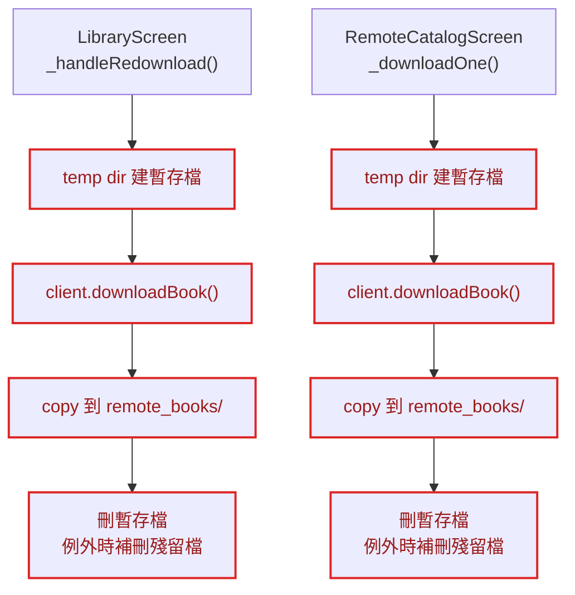
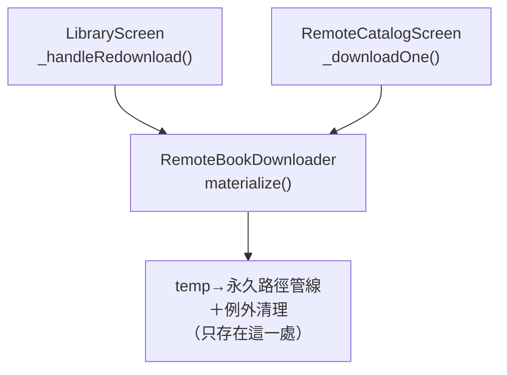
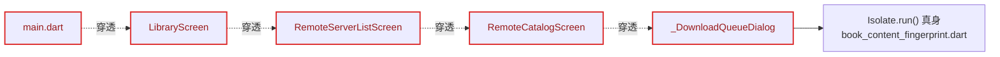

# 架構檢視報告 — LibraryScreen／RemoteCatalogScreen 熱點區域

**日期**：2026-08-19
**範圍**：`app/lib/screens/library_screen.dart`（1410 行，`epic-30-calibre-remote-library` Issue 0/2/3/4/5 幾乎每一個都會動到，是目前全專案 commit 頻率最高的熱點檔案）、`app/lib/screens/remote_catalog_screen.dart`（747 行），以及與這兩者相關的 `app/lib/library/models/book.dart`／`app/lib/library/book_content_fingerprint.dart`／`app/lib/remote/` 對照組
**方法**：依 `/improve-codebase-architecture` 流程，先以 commit 歷史找出熱點檔案，再派一個獨立子代理針對這兩個檔案（含相關模組）進行架構探索，本文為整理後的候選深化機會清單
**詞彙**：module／interface／implementation／depth／deep／shallow／seam／adapter／leverage／locality（見《A Philosophy of Software Design》）

6 個候選深化機會，依建議強度排序陳述；「刪除測試」（deletion test）＝把某段程式碼刪掉後複雜度是會集中顯現、還是根本沒人在意——前者代表值得抽出獨立 module。

---

## 候選 1：抽出「遠端書籍下載器」深 module

**強度：Strong（現存重複，非假設性風險）**
**檔案**：`app/lib/screens/library_screen.dart:580-665`（`_handleRedownload`）／`app/lib/screens/remote_catalog_screen.dart:538-612`（`_DownloadQueueDialogState._downloadOne`）

### Before

### After

**Problem**：「把一筆 OPDS acquisition 落地成永久檔案」這段有狀態、有例外清理邏輯的流程，在兩個畫面各自重寫了一次——`_handleRedownload()` 是 `epic-30` Issue 4 的產物，`_downloadOne()` 是 Issue 2 的產物，兩邊各自補了同一種「複製到一半失敗時要清殘留暫存檔」的防禦註解，證明這段複雜度是真實的，只是沒有被收進共用 module。

**Solution**：把 temp dir／`downloadBook()`／複製到 `remote_books/`／刪暫存檔／例外清理，收進一個 `RemoteBookDownloader` deep module，兩個呼叫端改成呼叫同一個 interface。

**Wins**：
- locality：檔案生命週期 bug 只可能發生在一個地方
- leverage：一個 interface，兩個呼叫端受益
- 刪除測試：把其中一份實作刪掉、改呼叫共用 module，複雜度真的降低——兩邊語意完全相同，不需要 `if (screen == ...)` 分支

---

## 候選 2：LibraryScreen 是扁平的 1410 行 God-Widget

**強度：Strong**
**檔案**：`app/lib/screens/library_screen.dart`（`_LibraryScreenState`，99-1072 行）

### Before／After（cross-section：關注點是否分層）

| | Before | After |
|---|---|---|
| 結構 | 單一 class body 同時裝：書籍載入／排序／分類篩選狀態機、匯入對話框、5 個批次操作、重新下載檔案 I/O 管線（候選 1）、導覽樞紐（建構 `ReaderScreen` 12 參數／`RemoteServerListScreen` 6 參數）、拼貼格 footer 非線性字級縮放數學 | `LibraryScreen` 收斂為呈現＋委派；`LibraryBookListController`／`LibraryBatchActions`／`RemoteBookDownloader`（候選 1）／`BookGridTileMetrics` 各自成為獨立 deep module |
| 深度 | 全部同一扁平深度，沒有內部 module 邊界 | `LibraryScreen` 變薄，複雜度收進各自命名清楚的 module |

**Problem**：書籍載入、5 個批次操作、原始檔案 I/O、導覽接線、像素級版面數學全部塞在同一個 1072 行的 class body，內部沒有畫出任何 module 邊界——interface（widget 建構子）之所以看起來比內部簡單，只是所有 widget 都這樣，不是這個 class 真的把複雜度藏起來了。這正是這個檔案幾乎每個近期 Epic 都要加寬一次的根因：沒有內部邊界可以吸收新複雜度，只能往同一層堆。

**Solution**：依關注點切出獨立 module（書籍清單狀態機、批次操作、下載器、拼貼格版面數學），`LibraryScreen` 收斂為單純呈現＋委派。

**Wins**：
- leverage：每個新 Epic 不必再讓這個檔案變寬
- `test/screens/library_screen_test.dart` 需要 12 個 fake 依賴才能立起一個畫面測試，這件事本身就是 low leverage 的證據

---

## 候選 3：ComputeRemoteFingerprint 這個可測試性 seam 在 5 個不相關的 screen 之間流竄

**強度：Strong**
**檔案**：`app/lib/library/book_content_fingerprint.dart:9-21,47-67` → `main.dart` → `library_screen.dart` → `remote_server_list_screen.dart` → `remote_catalog_screen.dart` → `_DownloadQueueDialog`

**Problem**：「`Isolate.run()` 與 `testWidgets()` 假時間 zone 不相容」這個 bug（`review-issue-2.md` 已記錄：兩次重現皆卡死至 10 分鐘逾時）只活在一個 72 行檔案裡，但它的可測試性修法（一個函式型別 seam `ComputeRemoteFingerprint`）卻要求 5 個彼此無關的 screen 全部宣告、接住、往下傳——locality 完全被打散：想搞懂「指紋到底怎麼算到下載完的檔案上」，要從 `main.dart` 一路跳過 4 個 screen 檔案才找得到真身。

**Solution**：讓指紋比對成為候選 1 提議的 `RemoteBookDownloader` deep module 的內部細節，不再是穿透 5 層 UI 的獨立參數。

> ⚠ **與 ADR 0007 的張力**：ADR 0007 明訂「平行建構子參數、不用 service locator」為全專案的組裝模式——決策本身仍合理，但當時的後果分析只預期 1 個新參數（`prefsRepository`）／3 個檔案；到 `epic-30` 已累積成 3 個相關參數（`computeFingerprint`／`createOpdsClient`／`thumbnailCache`）／6 個檔案，ADR 沒有內建「何時該重新考慮」的門檻。這是值得重開討論的 tension，不是否定原決策。

---

## 候選 4：Book.copyWith() 是 shallow interface，已造成過一次靜默資料遺失

**強度：Worth exploring（已有真實事故佐證，非假設性風險，但影響範圍侷限在單一檔案）**
**檔案**：`app/lib/library/models/book.dart:196-226`（對照 99-281 行的完整 21 欄位）

**Before／After（mass diagram：介面寬度 vs 實作寬度）**：

| | Before | After |
|---|---|---|
| interface | 只開放 4/21 欄位為具名參數（`groupName`／`isFixedLayout`／`filePath`／`isDownloaded`，逐 Issue 陸續加開） | 21 個欄位全部可具名覆寫（或改由 code-gen 產生） |
| implementation | 其餘 17 個欄位要靠手動 `fieldName: fieldName` 逐一背，寫漏一個不會編譯錯，只會在執行期靜默清空 | 遺漏欄位變成編譯期錯誤 |

**Problem**：`copyWith()` 的 interface 看起來很小很安全（4 個具名參數），實際上偷偷閘住其餘 17 個欄位的正確性責任——2026-08-04 曾因此漏帶 `positionSyncedServerUpdatedAt`／`positionUpdatedAt`，任何呼叫 `copyWith()` 的批次操作（例如 `_moveSelectedBooksToGroup`）都會靜默清空同步進度資料，直到後續審查才發現修正。

**Solution**：刪除測試給出明確答案——把 `copyWith()` 刪掉、改成呼叫端逐一寫 `Book(...)` 字面值，這個 bug class 根本不會存在，因為漏寫欄位會直接編譯失敗；比較務實的做法是讓全部 21 欄位皆為具名參數，達到同等效果又不必動每個呼叫點。

**Wins**：
- 把「執行期靜默 null」的 bug class 移到編譯期
- 已有真實事故佐證，優先序高於一般假設性重構，但因影響範圍侷限在單一 model 檔案，標記 Worth exploring 而非 Strong

---

## 候選 5：LibraryScreen 22 參數建構子——ADR 0007 模式的累積成本

**強度：Worth exploring（波及範圍較大，且是既有決策下的合理副作用，非設計錯誤）**
**檔案**：`app/lib/screens/library_screen.dart:45-93`

**Before（純轉送，interface 跟內部一樣寬）**：

`repository`／`importService`／`prefsManager`／`bookmarksRepository`／`highlightsRepository`／`notesRepository`／`customFontsRepository`／`layoutPresetRepository`／`bookReaderPrefsRepository`／`syncAccountRepository`／`syncClient`／`syncCheckpointTrigger`／`remoteServerRepository`／`createOpdsClient`／`computeFingerprint`／`thumbnailCache`／`isMobileDataConnection`／`currentTheme`／`isEinkMode`／`onThemeChanged`／`onEinkModeChanged`／`groupFilter` —— 共 22 個，絕大多數只是原樣往下轉送給 `ReaderScreen`（12 參數）／`RemoteServerListScreen`（6 參數）／`SettingsScreen`，`LibraryScreen` 自己不使用。

**Problem**：刪除測試——把這 22 個參數刪掉、改成在 4 個內部呼叫點（`_openBook`／`_openGroupFilteredView`／遠端書庫入口／設定入口）各自就地建構，複雜度不會集中到任何新地方，只會從「一份寬的參數列」搬成「四份窄的、散落在 `build()` 各處」。這證明目前的建構子沒有藏任何東西，純粹是轉送管線——合理但 low-leverage 的角色。

**Solution**：沒有立即行動項；等候選 2 的 God-Widget 拆分推進後，多數轉送參數會自然收斂到對應的委派 module 建構子上，不需要單獨處理。

> ⚠ **與 ADR 0007 的張力**：與候選 3 同源——ADR 0007 選定的組裝模式本身仍站得住腳，但當時的後果分析沒有評估「N 個 Epic 之後累積到 22 個參數」的情境，門檻已經跨過，值得回頭檢視，不代表要推翻原決策。

---

## 候選 6：5 個近乎相同的批次操作方法骨架

**強度：Speculative（一般性「抽 helper」機會，未對應任何已知事故或跨檔重複）**
**檔案**：`app/lib/screens/library_screen.dart:353-508`（搬移分類／強制 FXL／恢復自動判斷／刪除／移除本機快取）

**Before**：5 個方法重複同一套骨架——capture `_selectedBookIds`／`_books` 到區域變數 → 提早呼叫 `_exitSelectionMode()`（附同一段「為何要在迴圈前退出選取模式以防重入」的註解）→ 過濾迴圈（`if (!selectedIds.contains(book.id)) continue;`）→ repository 呼叫 → `_loadBooks()`。

**After**：抽出共用骨架 `runBatchAction(action)`，5 種操作各自只提供差異化的「單本書該做什麼」。

**Problem**：只有迴圈內的實際 repository 呼叫不同（搬移分類、切換 `isFixedLayout`、刪除檔案、清本機快取…），其餘骨架與註解逐字重複。

**Wins**：省下約 30-40 行重複樣板；因未對應任何已知事故或跨檔重複（不像候選 1 是跨兩個檔案的真實重複），優先序低於上述 Strong／Worth exploring 候選。

---

## 對照組：同一功能區塊裡真正 deep 的 module

`OpdsClient`／`OpdsHttpClient`（`app/lib/remote/opds_client.dart`／`opds_http_client.dart`：分頁循環防護、憑證放行、三層 try/finally 串流清理）與 `RemoteThumbnailCache`（`app/lib/remote/remote_thumbnail_cache.dart`：雙層 LRU＋SHA-256 磁碟快取，並明確記錄了「不做 in-flight 去重」這項刻意取捨）都通過刪除測試——把它們內縮到呼叫端，複雜度會明顯集中回去。這證明上述 6 項候選是 **Screen／Widget 層特有的問題**，不是整個 `remote/` 功能區塊系統性的毛病；重新設計應該聚焦在 Screen 層，`remote/` 底層模組本身不需要動。

---

## Top recommendation

**候選 1 — 抽出「遠端書籍下載器」深 module**

範圍最小、證據最實（兩份重複的 I/O 生命週期程式碼，不是假設性風險，且分別來自 `epic-30` 兩個不同 Issue 的獨立實作），做完立刻同時緩解候選 2（`LibraryScreen` 縮小一塊）與候選 3（`ComputeRemoteFingerprint` 有了收斂的內部歸屬），是後續拆解 God-Widget（候選 2）前最安全、風險最低的第一刀。優先於候選 2/5（範圍較大，建議候選 1 落地後再評估）與候選 4/6（影響範圍侷限、或屬一般性重構機會）。
