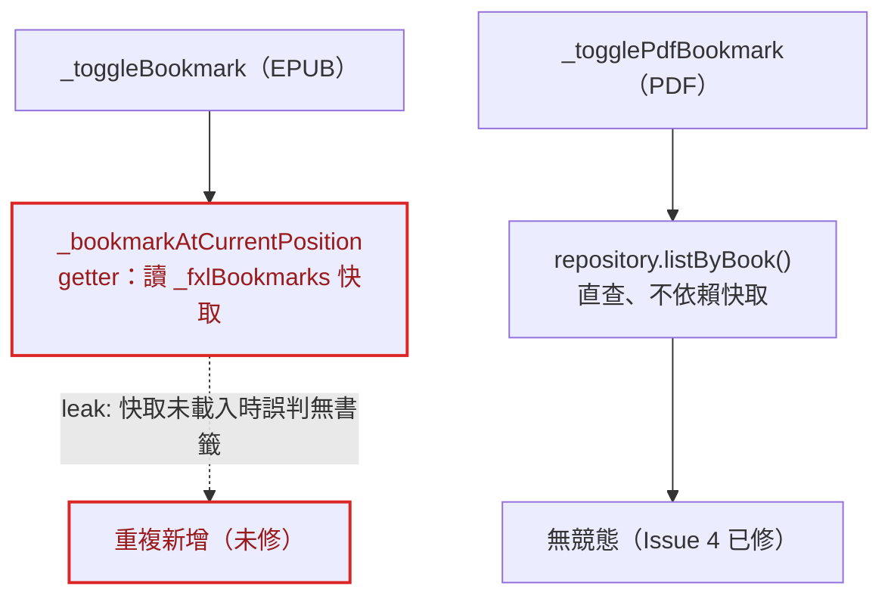
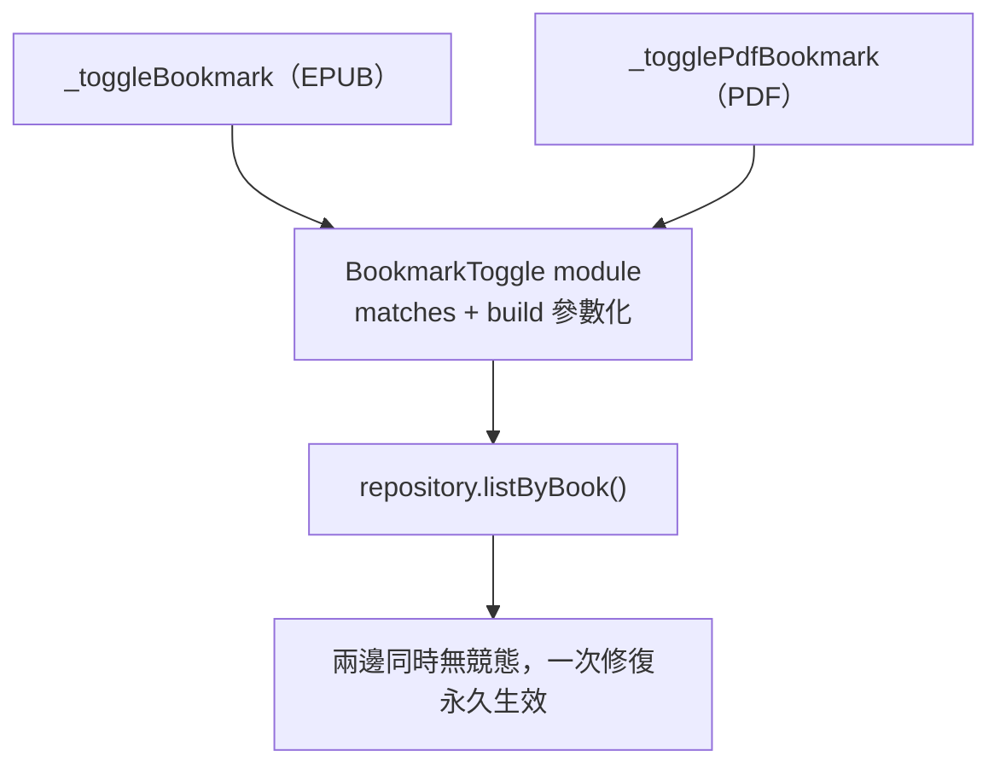
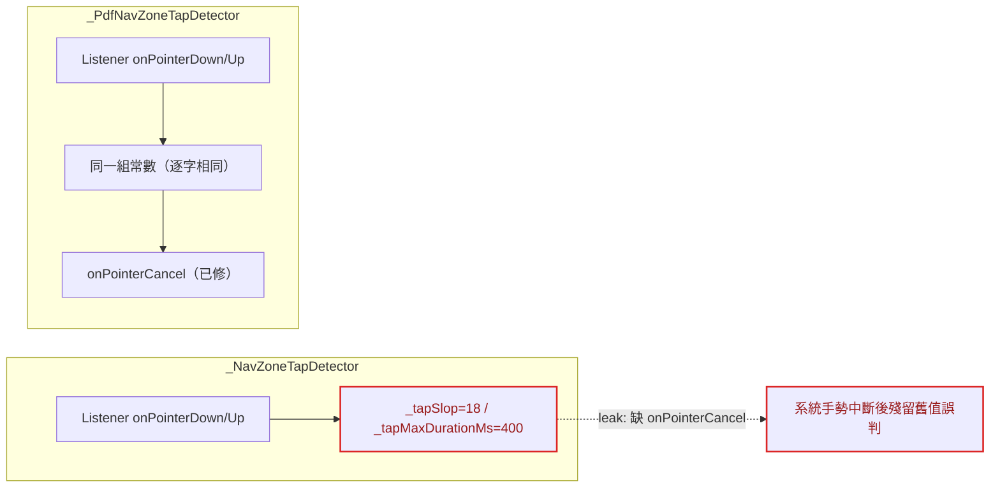
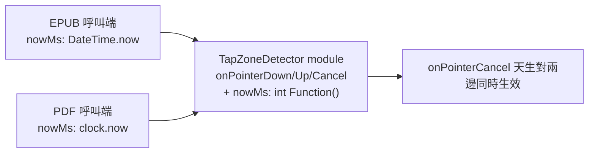
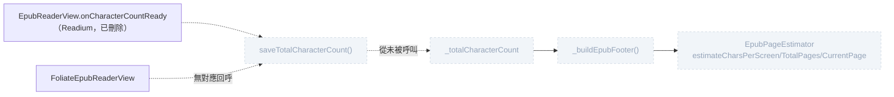

# 架構檢視報告 — 測試套件效率與 EPUB／PDF 底層架構

**日期**：2026-08-11
**範圍**：(1) `app/test/` 測試套件效率、(2) EPUB／PDF 兩條渲染路徑（`foliate-js`／`pdfrx`）遷移後的架構
**方法**：依 `/improve-codebase-architecture` 流程，兩個獨立子代理分別探索「測試套件」與「EPUB/PDF 架構」，本文為整合後的候選深化機會清單
**詞彙**：module／interface／implementation／depth／deep／shallow／seam／adapter／leverage／locality（見《A Philosophy of Software Design》）

7 個候選深化機會，依建議強度排序陳述；「刪除測試」（deletion test）＝把某段程式碼刪掉後複雜度是會集中顯現、還是根本沒人在意——前者代表值得抽出獨立 module。

---

## 候選 1：收斂書籤 toggle 成一個 module

**強度：Strong（現存 bug，非假設性風險）**
**檔案**：`app/lib/screens/reader_screen.dart:736-768`

### Before

### After

**Problem**：兩個 adapter 各自實作同一個 toggle 演算法，PDF 那份修過的競態 bug（快取未載入時查快取誤判無書籤、導致重複新增）EPUB 從未收到。

**Solution**：抽出一個共用 module，用 `bool Function(Bookmark) matches` / `Bookmark Function() build` 參數化「查 repository → 比對 → insert/delete → reload」，EPUB／PDF 各自只傳入比對邏輯（`epubLocatorJson` vs `pdfPageIndex`）。

**Wins**：
- locality：bug 修復集中在一個 module，不再有「PDF 修過、EPUB 沒修」的窗口
- leverage：一個介面，兩個呼叫端
- 刪除測試：把其中一份實作刪掉、改呼叫共用 module，複雜度真的降低——兩邊的競態語意完全相同，不需要 `if (format == pdf)`

---

## 候選 2：深化熱區點擊偵測成一個 module

**強度：Strong**
**檔案**：`app/lib/reader/foliate_epub_reader_view.dart`（`_NavZoneTapDetector`）／`app/lib/reader/pdf_reader_view.dart`（`_PdfNavZoneTapDetector`）

### Before

### After

**Problem**：兩份「刻意各自獨立實作」的 `Listener` 手勢偵測邏輯逐字相同（僅計時 API 不同），且已經各自被 review 抓到過幾乎一樣的 bug。

**Solution**：把「計時來源」抽成注入參數（`nowMs: () => clock.now().millisecondsSinceEpoch` vs 裸 `DateTime.now()`），其餘邏輯收斂成一個 module。

**Wins**：locality（bug 修復天生同步）、leverage（一個介面兩個呼叫端）

> ⚠ **與既有原則的張力**：CLAUDE.md 記載「`PdfReaderView`／`FoliateEpubReaderView` 刻意兩條完全獨立路徑」——但這條原則保護的是**引擎本體**（FFI vs WebView），不是純手勢偵測邏輯；這個 module 不觸碰任何引擎生命週期，兩個 adapter（`DateTime.now`／`clock.now`）恰好證明這是「兩個真正的 adapter」而非假設性 seam，值得作為這條原則的例外處理，不建議重新檢視原則本身。

---

## 候選 3：深化 ReaderScreen 的 chrome 組裝（工具列定位＋FAB 排）

**強度：Strong**
**檔案**：`app/lib/screens/reader_screen.dart:1434-1445, 1656-1662, 1697-1932`

### Before／After（mass diagram：介面 vs 實作寬度）

| | Before | After |
|---|---|---|
| 結構 | 2 個「介面＝實作」重複區塊：EPUB FAB block（~115 行）＋ PDF FAB block（~112 行），逐一對應的 `Positioned(ClipOval(Container(IconButton)))` 樣板 | 1 個深模組 `_positionedFab({key, top, icon, tooltip, onPressed, ...})` ＋ 兩份薄呼叫清單（各自保留啟用條件） |
| 行數 | ~230 行 | ~60-70 行 |
| 工具列定位 | `_annotationToolbarTop`／`_pdfAnnotationToolbarTop` 逐字相同公式，僅讀 `rect` 或 `widgetRect` 不同 | `double _computeToolbarTop(Rect, Size)` 一份純函式，呼叫端各自傳入對應欄位 |

**Problem**：介面幾乎跟實作一樣複雜——每加一顆按鈕都要重複整組 widget 樹；兩條定位公式除了讀哪個欄位外完全相同。

**Solution**：抽出 `double _computeToolbarTop(Rect, Size)` 與 `Widget _positionedFab(...)` 兩個純函式/純 widget module，啟用條件（例如 `_pdfTocLoaded`）等業務邏輯留在各自呼叫端。

**Wins**：
- leverage：一個 module，全部 12 顆按鈕與 2 條定位公式共用
- 刪除測試：純 UI 幾何/組裝，不涉及 PlatformView／WebView／FFI 差異，抽出後不會製造 `if (format == pdf)` 醜陋分支
- 本專案已有成功先例：`ReaderFooter`／`AnnotationToolbar` 本身就是共用元件，證明「純展示層抽 module」走得通

---

## 候選 4：收斂已死的 EPUB 頁次估算管線

**強度：Worth exploring（需要人類先決策範圍，非機械式重構）**
**檔案**：`app/lib/reader/epub_page_estimator.dart`、`EpubCharacterCountRepository`、`app/lib/screens/reader_screen.dart:2044-2074`

**Problem**：`totalCharacterCount` 的唯一寫入來源（Readium 的 `onCharacterCountReady`）已隨 epic-20 移除，`FoliateEpubReaderView` 從未實作替代回呼——`_buildEpubFooter()`、整個 `EpubPageEstimator`、`EpubCharacterCountRepository` 在生產環境對目前唯一的渲染路徑全部不可觸達。與 `epic-18-reader-device-qa` Issue 46 發現的 `pageMargins` 死欄位同源，但範圍比單一欄位大得多。

**Solution**：需要人類先決定：(a) 確認「估算頁碼」已被 `_buildFoliateEpubFooter` 的 foliate-js 原生 `location.current`/`location.total` 取代，整批除役；或 (b) 重新設計 foliate-js 版的字元數回報管道。

**Wins**：locality——目前若有 bug 會藏在一條沒人走到的死路徑裡，刪除後複雜度直接消失、不會集中顯現到別處，這正是「刪除測試」判定為安全移除的訊號。

---

## 候選 5：重新接上斷開的 PDF Fit Mode seam

**強度：Strong（現存 bug，使用者可見）**
**檔案**：`app/lib/screens/pdf_settings_sheet.dart:145-193` ↔ `app/lib/reader/pdf_reader_view.dart`（無匹配）

**Problem**：使用者按下 Fit Mode 三選一，值確實寫進資料庫，但 `PdfReaderView` 從未讀取這個欄位——介面（設定 UI）承諾了一個 seam，實作端從未接上。FR-11（P1）明文要求此功能。追查 `epic-24-pdf-engine-rebuild` 的 Issue 1 記錄，contrast/brightness/dualPageMode 皆已在後續 Issue 補回，唯獨 `pdfFitMode` 從追蹤清單漏掉。

**Solution**：補上 `PdfReaderView` 的 `pdfFitMode` 建構參數與對應 `PdfViewerParams` 接線；或在確認暫不支援前，先在 UI 隱藏/停用這個分段按鈕，避免使用者以為設定生效。

**Wins**：使用者可見的假功能，優先度高於其餘架構型候選項目；不是重複實作問題，是遷移追蹤清單遺漏——建議獨立立案。

---

## 候選 6：深化「等待 PDF 就緒」成一個測試 adapter

**強度：Strong**
**檔案**：36 處，9 個檔案（`reader_screen_test.dart` 16 處／`pdf_reader_view_filters_test.dart` 9 處／其餘 7 個檔案各 1-5 處）

**Before**（cross-section：每個呼叫端各自攤開同一段複雜度）：
- `reader_screen_test.dart`：16 處 30-次輪詢迴圈，逐字重複
- `pdf_reader_view_filters_test.dart`：6 個 `group` 各自重新定義 `waitRendered`
- `pdf_reader_view_test.dart`：5 處，無 helper，原地內嵌
- 其餘 6 個檔案各 1 處

**After**：`test/support/pumpUntilPdfReady(tester, condition)` 一個共用 adapter（`test/support/` 已有 13 個共用 Fake，機制成熟，只是沒延伸到「等待」這個模式）。

**Problem**：「pdfrx 在測試環境下何時真正完成非同步載入」這件事的複雜度，被 36 處幾乎逐字相同的輪詢迴圈攤在每個呼叫端，而非封裝成一個共用測試 adapter。

**Wins**：
- 刪除測試：把 36 處各自的迴圈刪掉、換成共用 helper，行為完全不變——純樣板重複，不是深層邏輯
- locality：36 處 PDF 測試裡最耗時的部分（每則 1-2 秒）收斂成一處可調校的實作

---

## 候選 7：讓 ResolvedPreferences 直接穿過 seam，不在建構邊界打散

**強度：Worth exploring（波及範圍較大）**
**檔案**：`app/lib/reader/foliate_epub_reader_view.dart:379-418`（37 參數）／`app/lib/reader/pdf_reader_view.dart:90-117`（26 參數）

**Before／After（mass diagram：介面寬度 vs 實作）**：

| | Before | After |
|---|---|---|
| 建構參數 | 37／26 個扁平具名參數，介面幾乎跟實作一樣寬 | 1 個 `resolved: ResolvedPreferences` 值物件參數（`filePath`／回呼等非版面欄位獨立保留） |
| 複雜度歸屬 | 外溢到唯一呼叫端與每個組裝測試 widget 的地方 | 實作內部自行解構，介面收窄 |

**Problem**：`ResolvedPreferences` 是已存在、型別完整的深層值物件，卻在 `FoliateEpubReaderView`／`PdfReaderView` 的建構邊界被逐欄位搬移成 37／26 個扁平具名參數——複雜度沒有被介面吸收，外溢到唯一呼叫端與每一個組裝測試 widget 的地方。

**Solution**：兩個 widget 改為接受 `resolved: ResolvedPreferences` 單一參數，內部解構。

> ⚠ 波及範圍較大——兩個 widget 的公開建構子簽章、既有測試的建構呼叫全部要跟著改；標記 Worth exploring 而非 Strong，建議先由候選 1-3、6 建立「抽 module 有效」的信心後再評估。

---

## Top recommendation

**候選 1 — 收斂書籤 toggle 成一個 module**

這是唯一一個「兩個獨立 adapter 導致的正確性缺陷已經發生、不是假設性風險」的候選項目——PDF 端的競態修復從未傳到 EPUB 端。範圍小、風險低、locality 收益直接可驗證：合併後任何一邊修過的 bug，另一邊天生免疫。優先於候選 2/3/6（同類但影響較小）與候選 4/5/7（需要先決策或範圍較大）。
