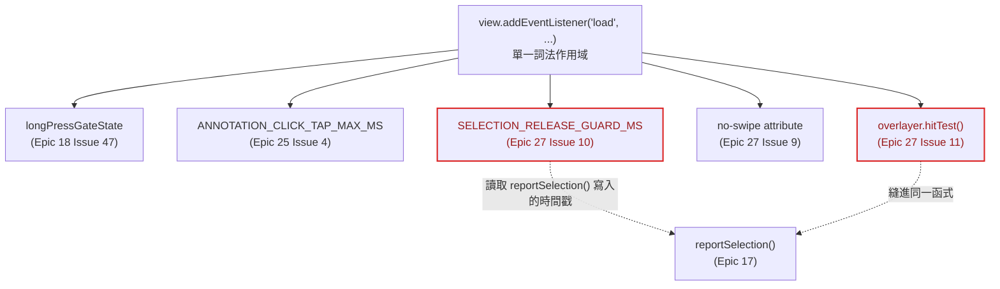
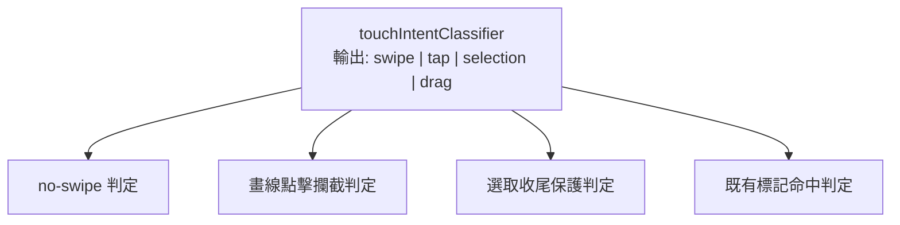
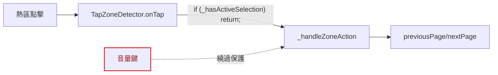
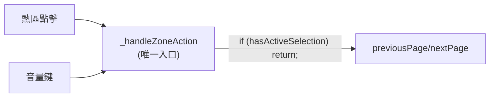
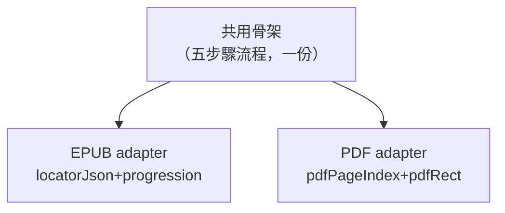
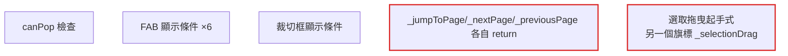
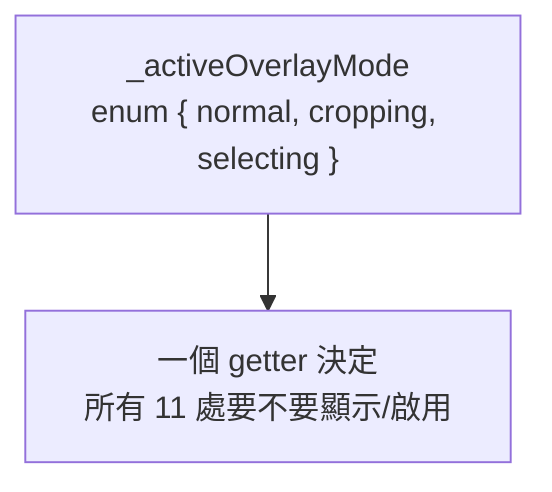
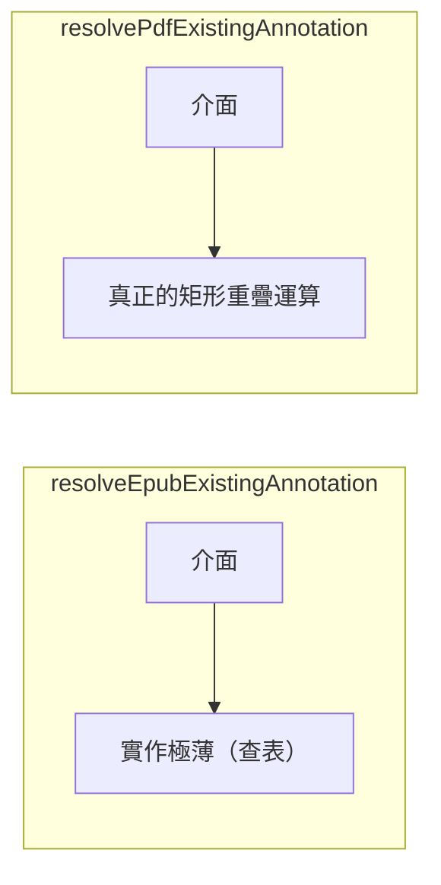
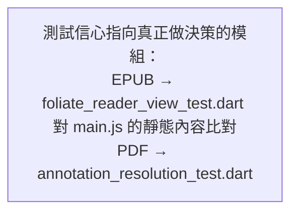

# 架構檢視報告 — 使用者觸控／按壓行為架構

**日期**：2026-08-25
**範圍**：App 內所有觸控、長按、拖曳、音量鍵翻頁相關的模組（EPUB `main.js` 整合層、`TapZoneDetector`、PDF 框選/裁切拖曳、原生 Kotlin 端、`reader_screen.dart` 分派入口）
**方法**：依 `/improve-codebase-architecture` 流程，子代理實地走查程式碼（含原生 Kotlin 端、既有 ADR 與死碼比對），本文為整合後的候選深化機會清單
**詞彙**：module／interface／implementation／depth／deep／shallow／seam／adapter／leverage／locality（見《A Philosophy of Software Design》）

6 個候選深化機會，依建議強度排序陳述；「刪除測試」（deletion test）＝把某段程式碼刪掉後複雜度是會集中顯現、還是根本沒人在意——前者代表值得抽出獨立 module。

**背景脈絡**：`docs/adr/0008-pdf-annotation-long-press-gesture.md` 在最早期就已預見「長按觸發框選與既有手勢之間的手勢競技場（gesture arena）優先權，尚未實測」這個風險。事後看，`epic-27-reader-device-compat` Issue 9/10/11/12（全部是同一類手勢衝突問題）正是這個風險逐一應驗的結果，用的手法是「事後逐個補洞」，未回頭處理架構本身——本報告即是這次回頭處理的第一步。

---

## 候選 1：收斂 `main.js` 觸控意圖判讀為單一狀態機

**強度：Strong**
**檔案**：`app/android/app/src/main/assets/foliate/main.js:641-911`

### Before

### After

**Problem**：五個各自加上去的攔截機制共用同一個詞法作用域，且互相讀取對方的內部狀態——`SELECTION_RELEASE_GUARD_MS` 讀取 `reportSelection()` 寫入的時間戳。這正是 Issue 10 審查抓到「iframe 時鐘 vs 最外層頁面時鐘混用」bug 的根本原因：不是兩個獨立機制混用，是同一個 module 內不同世代的程式碼假設了彼此的時鐘來源一致。

**Solution**：把「這次觸控的意圖是什麼」收斂成一個單一分類器，四個既有機制改成訂閱同一份分類結果，不再各自重新量測時間/位移。不修改任何 vendored 檔案（`paginator.js`／`view.js`／`overlayer.js`）——ADR 0011，分類器仍是 `main.js` 這個整合層自己的程式碼，只呼叫既有公開方法。

**Wins**：
- locality：時序 bug 只可能藏在一個分類器裡
- leverage：一個介面，四個消費端
- interface 縮小，implementation 吸收五個獨立攔截器

---

## 候選 2：刪除 `NavZoneHitTester.kt`——死碼，且文件描述的呼叫者已在 epic-20 移除

**強度：Strong**
**檔案**：`app/android/app/src/main/kotlin/cc/ugotit/elinkbook/NavZoneHitTester.kt`（全檔）／`app/android/app/src/test/kotlin/cc/ugotit/elinkbook/NavZoneHitTesterTest.kt`

### Before

### After

**Problem**：全 `app/android` 搜尋只有它自己引用自己；文件註解宣稱的呼叫者（原生 `InputListener.onTap()`）在 epic-20 Issue 5 移除舊 `EpubReaderView.kt` 時已一併消失，但這個純函式與它「看起來很正常」的單元測試沒有跟著清掉——會讓人誤以為「原生熱區判讀邏輯有測試覆蓋」。

**Solution**：刪除整個檔案與其測試。

**Wins**：
- 刪除測試：刪掉後行為零改變——複雜度沒有被搬走，因為它本來就沒在提供任何複雜度處理
- 移除一份會誤導後續 Epic 的假測試覆蓋

---

## 候選 3：把 `_hasActiveSelection` 保護搬到唯一入口 `_handleZoneAction`

**強度：Strong（本次探查的 Top Recommendation）**
**檔案**：
`app/lib/screens/reader_screen.dart:2719-2775`（`_handleVolumeKeyCall` → `_handleZoneAction`）
`app/lib/reader/foliate_reader_view.dart:826-845`（`_hasActiveSelection` 檢查現址）
`app/lib/reader/foliate_reader_view.dart:467-479`（`previousPage`/`nextPage` static helper，無檢查）

### Before

### After

**Problem**：使用者長按選字中，若這時按下音量鍵，會直接翻頁並清空選取——`_hasActiveSelection` 保護寫在 `TapZoneDetector.onTap` 的 widget 內部回呼裡，音量鍵路徑（`_handleVolumeKeyCall` → `_handleZoneAction` → static helper）完全不經過這一層，繞過保護。PDF 端沒有這個問題，因為它的選取清除邏輯就寫在 `_handleZoneAction` 本體內。

**Solution**：把 `_hasActiveSelection` 暴露成 `FoliateReaderView.hasActiveSelection(key)` static getter，檢查搬進 `_handleZoneAction`——所有翻頁觸發來源（熱區、音量鍵）唯一的匯合點。

**Wins**：
- leverage：一個入口，兩種輸入來源同時受保護
- locality：選字保護只可能在一個地方失效
- 消除一個目前未回報、但機制上真實存在的資料遺失風險

---

## 候選 4：收斂 EPUB／PDF 標註 CRUD handler 的重複骨架

**強度：Strong**
**檔案**：`app/lib/screens/reader_screen.dart` —— `_handleHighlightStyleSelected`/`_handlePdfHighlightStyleSelected`（1571-1585 / 1668-1682）、`_handleNotePressed`/`_handlePdfNotePressed`（1587-1620 / 1684-1717）、`_reloadAnnotationsAndRefreshDecorations`/`_reloadPdfAnnotationsAndSync`、`_handleCloseAnnotationToolbar`/`_handlePdfSelectionCanceled`、`_handleDeleteExistingAnnotation`/`_handlePdfDeleteExistingAnnotation`

### Before

### After

**Problem**：整組「選取→建立劃線→掛備註→重新載入→清空選取」流程，EPUB／PDF 各自維護一份幾乎同構的實作，差異只在定位資料型別與最後呼叫的原生同步方法名稱。`tap_zone_detector.dart` 的文件註解本身承認過同類風險：「PDF 端補過 `onPointerCancel` 防禦性清理、EPUB 端從未收到這個修復」——修復漂移已經在同一個檔案裡發生過一次。

**Solution**：抽出以「locator adapter」參數化的泛型 helper，只留下真正因格式而異的兩小段程式碼。

**Wins**：
- leverage：一份流程邏輯，兩個 adapter
- locality：下一次修復只需要改一個地方，不會再漂移

---

## 候選 5：用單一 `_activeOverlayMode` 取代 11 處散落的 `cropEditModeActive` 檢查

**強度：Strong**
**檔案**：
`app/lib/reader/pdf_reader_view.dart:584, 599, 618, 1132`
`app/lib/screens/reader_screen.dart:1806, 2204, 2220, 2236, 2255, 2282, 2301, 2394`

### Before

### After

**Problem**：沒有任何單一函式回答「目前哪些 UI／手勢該對裁切模式讓路」，同一個布林值被複製貼上檢查了 11 次；PDF 底層 `PdfViewer` 的手勢啟停還用了另一個完全不同的旗標（`_selectionDrag`），兩套互斥機制並存，靠人工保證不衝突。刪除測試：拿掉任一個檢查，程式仍編譯通過、其餘毫無異狀——典型可被個別遺忘的散落複雜度。

**Solution**：收斂成單一 enum getter，11 個檢查點改成讀同一個值。

**Wins**：
- locality：互斥規則變成一張可窮舉的表，不是 11 個各自可能被遺漏的 if

---

## 候選 6：正視 `annotation_resolution.dart` 兩個函式的不對稱複雜度

**強度：Worth exploring**
**檔案**：`app/lib/reader/annotation_resolution.dart:13-79`、`app/android/app/src/main/assets/foliate/main.js:688-701`

### Before

### After

**Problem**：兩個函式的簽章與回傳型別完全對稱，暗示兩邊有等量的可測試複雜度；實際上 `resolveEpubExistingAnnotation` 只是把 `main.js` 已經做完的命中判定包一層查表，`resolvePdfExistingAnnotation` 才是真正在 Dart 端做矩形重疊運算。EPUB 那一半的真正判定邏輯活在 `main.js` 的瀏覽器 layout 引擎裡（`getClientRects()` + `overlayer.hitTest()`），Dart 測試量測不到——只能測到查表。測這個檔案的單元測試套件，只能證明 PDF 那一半的正確性。

**Solution**：不是要改程式碼，是要修正測試策略認知——把「EPUB 標註命中判定」的測試信心來源，指回 `foliate_reader_view_test.dart` 對 `main.js` 的靜態內容比對，不要誤以為 `annotation_resolution_test.dart` 已經覆蓋它。

**Wins**：
- locality：測試信心的宣稱要對應到真正做決策的模組

---

## 整體印象

這一整塊觸控/按壓架構最大的結構性問題，不是疊加了太多門檻值本身——那是真實 bug 逼出來的必要複雜度，deletion test 在候選 1／3／4／5 都證明刪掉後複雜度會原樣浮現，不是憑空消失。真正的問題是：**每一次新增防呆機制時，選擇的落腳點是離最近的症狀最近的那一行程式碼，而不是離系統中正確的權責層最近**。候選 3 是最乾淨的例證——保護邏輯被放進 `TapZoneDetector` 的 tap 回呼，因為那是修復當下最直接能碰到選取狀態的地方，但它的正確歸屬其實是 `_handleZoneAction`，所有翻頁觸發來源的唯一匯合點。候選 1、5 是同一種模式在不同尺度上的重現。

第二個結構性問題是測試策略跟複雜度分布不成比例（候選 2、6）：`NavZoneHitTester.kt` 有測試但沒有呼叫者，`annotation_resolution.dart` 的 EPUB 那一半有測試但測不到真正的判定邏輯。真正高風險、跨時序的部分（`main.js` 整個 `load` 閉包、`TapZoneDetector` 與音量鍵的交互）完全沒有自動化回歸測試。「看起來被測試覆蓋的部分」與「真正容易壞的部分」幾乎是兩個不相交的集合。
