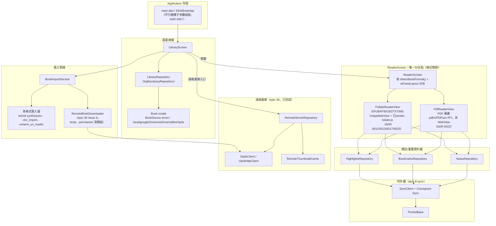

# 架構審視報告：因應 PRD 新增之 TTS／簡繁轉換／OPDS／多語系需求

**日期**：2026-08-19
**目的**：對照參考報告 `docs/research/architecture-command.md`（以下稱「參考架構圖」）與 elinkBook 現行真實程式碼架構，檢視 PRD 新增的 FR-44（遠端書庫）、FR-45～47（TTS）、FR-48（簡繁轉換）、FR-49（多語系介面）該如何嵌入既有架構，並提出漸進式調整原則，供後續 SDD 各 Epic 的 Discovery／Architecting 階段遵循。
**性質**：這是一份跨 Epic 的架構地圖與原則性建議，不是任何單一 Epic 的 `spec.md`——具體技術決策仍留待各功能各自的 `/grill-with-docs`／`/to-spec` 階段定案。

---

## 一、現行真實架構地圖（依專案詞彙，非參考架構圖之泛用命名）

參考架構圖使用了一套泛用的分層命名（`ReaderEngine`／`ReaderBridge`／`Book Manager`／`Sync Manager`……），但這些類別在 elinkBook 實際程式碼中並不存在，也不建議現在補上——elinkBook 有自己一套已經驗證過的真實架構，命名與參考架構圖不同，且部分結構性決策（尤其是「不做統一 Reader 引擎抽象」）是刻意的、有 ADR 記錄理由的。以下是現行真實地圖：

**幾個對後續規劃至關重要的既有事實**：

1. **`ReaderScreen` 是唯一的閱讀器 seam，但底下是兩條完全獨立、刻意不共用抽象介面的渲染路徑**（`PdfReaderView` vs `FoliateReaderView`）。這不是技術債，是連續四份 ADR（0011、0013、0017、0022）逐步確認過的刻意決策——PDF 走 `pdfrx`/PDFium FFI（非 WebView，無 DOM/CFI），Foliate 格式走 `flutter_inappwebview` + 已 vendor 的 `foliate-js`（有 DOM/CFI）。**這兩條路徑的座標系統（CFI vs 頁碼＋頁內座標）本質不同，統一成單一「ReaderEngine」抽象弊大於利**——參考架構圖的 `ReaderEngine`/`ReaderBridge`/`ReaderLocation` 這套統一命名不建議引入 elinkBook。
2. **「書從哪裡來」在 elinkBook 已經是一個真實驗證過的可插拔 seam**，即使目前程式碼裡沒有正式命名為「Book Source Layer」的抽象介面：`Book.source`（`BookSource` enum）＋ `BookImportService.importFiles()` 的可選參數（`source`／`remoteServerId`／`remoteBookIds`／`remoteDownloadUrls`）已經是這個抽象的實際承載點。目前有 2 個真實 adapter（`local`、`calibreOpds`），依「一個 adapter 是假設性 seam，兩個以上才是驗證過的真實 seam」的判準，這個 seam **已經成立**；`googleDrive`／`oneDrive`（尚未實作的 `epic-29-cloud-import`）會是第 3、4 個 adapter，屆時值得考慮是否要把這個隱性 pattern 正式收斂成一個顯式介面（見下方第四節建議）。
3. **文字內容活在 WebView 的 DOM 裡，不是 Dart 端字串**——Foliate 格式的實際文字節點只存在於 `InAppWebView` 內部的 HTML DOM，Dart 端透過 `foliate_native_bridge.dart` 的 `callHandler` 薄封裝與 JS 溝通。任何要「處理文字內容」的新功能（簡繁轉換、TTS 文字擷取）**必然要在 JS 端動手**，不能假設有一個 Dart 端的純文字字串可以攔截處理。已建立的注入機制是 `initialUserScripts`（`AT_DOCUMENT_START`，見 `foliate_reader_view.dart:787-794` 的 `_esCompatPolyfillJs` 先例），這是新增 JS 端能力、又不直接修改已 vendor 原始碼的既定手法。
4. **PDF 沒有 DOM，文字只能透過 `pdfrx.loadStructuredText()` 逐頁取得**（`PdfPageText.fullText` ＋ `charRects`），且沒有 CFI 這種可還原定位的字串表示法，只有「頁碼＋頁內座標」。這代表 PDF 上的任何文字相關新功能（簡繁轉換、TTS）天生就要另立一條實作路徑，不能重用 Foliate 那條。

---

## 二、對照參考架構圖：哪些值得借鏡、哪些不適用

| 參考架構圖概念 | 評估 | 理由 |
|---|---|---|
| **Book Source Layer**（多來源可插拔） | ✅ **值得正式化**，且 elinkBook 已有真實驗證基礎 | 見上方第 1.2 點；`local`＋`calibreOpds` 兩個 adapter 已證明這個抽象是真實需求，不是臆測 |
| **TextTransform Pipeline**（OpenCC/S2T/S2TW/T2S/Sanitizer/CSS/Font 分組） | ⚠️ **抽象位置值得借鏡，但實作載體不對** | 參考圖把它畫成 Dart 端一個獨立管線階段；elinkBook 的等價實作必須發生在 WebView JS 端（見上方第 1.3 點），不是新增一個 Dart 模組 |
| **Speech Pipeline**（Local/Cloud/AI TTS 並列） | ✅ 與 `docs/research/tts_integration_architecture_research.md` 的 Provider 抽象層設計精神一致 | 該報告已詳細設計 `TtsProvider` 介面，本次不重複展開，見第三節 FR-45 |
| **ReaderEngine / ReaderBridge / ReaderLocation**（統一閱讀器抽象） | ❌ **不建議引入** | 與 ADR 0011/0013/0017/0022 刻意分離 Foliate／PDF 兩條路徑的決策矛盾，見上方第 1.1 點 |
| **WebDAV、Obsidian 書源** | ❌ **不在 PRD 範圍，暫不規劃** | PRD 目前僅定義 local／Google Drive／OneDrive／Calibre-OPDS 四種來源，WebDAV/Obsidian 未經 Discovery 討論過，不應該預先出現在架構決策裡（YAGNI） |
| **AI Translation、Summary** | ❌ **不在 PRD 範圍，暫不規劃** | PRD 完全沒有這兩項需求，參考架構圖裡出現純屬該報告自身的泛用假設，非 elinkBook 已定案方向 |
| **Reading Data Manager 統一資料層**（Bookmark/Highlight/Note/Session 統一管理） | ⚠️ **概念已存在，但故意分成三個獨立 Repository** | `HighlightsRepository`／`BookmarksRepository`／`NotesRepository` 是三個獨立介面，對應 CONTEXT.md「書籤」「劃線」「備註」是三個語意完全不同的物件類型（劃線不含備註、備註可獨立存在）；不建議為了「架構整齊」而合併成單一 Manager，會模糊掉這個刻意的語意區分 |
| **Sync Manager → PocketBase → Other Devices** | ✅ 與 elinkBook 實際的 `epic-8-sync`／Checkpoint Sync／PocketBase 架構一致 | 命名不同但概念對應正確，既有架構已驗證可行，無需調整 |

---

## 三、四個新 FR 各自該長在架構地圖的哪個位置

### FR-44｜遠端書庫（OPDS／Calibre）—— 已完成，回顧驗證

已完整落地於「圖書庫層」＋「遠端書庫」兩個既有區塊（見第一節地圖），是「Book Source Layer 抽象化」這個判準的**第二個真實 adapter**（第一個是 `local`）。**這是本次分析裡唯一一個「架構已經跑過一遍真實驗證」的區塊**，後續 `epic-29-cloud-import`（Google Drive／OneDrive）規劃時，應該直接參照 `epic-30` 的既有介面契約（`BookImportService.importFiles()` 的可選參數模式、`findByContentFingerprint()`／`findByRemoteBookId()` 共用觸點、`RemoteBookDownloader` 的 temp→permanent 落地模式），而不是重新設計一套。

### FR-48｜簡繁轉換 —— 應長在「Foliate WebView JS 端」，且只涵蓋 Foliate 格式

- **落點**：`foliate_reader_view.dart` 的 `initialUserScripts` 注入機制（比照 `_esCompatPolyfillJs` 先例），在既有的 `main.js` 渲染管線裡插入一個顯示層文字轉換步驟——**只轉換畫面呈現，不碰 DOM 結構、不寫回原始檔案**。
- **與 CFI 的相容性是核心技術風險，PRD 階段刻意不承諾實作細節**：若用「取代 TextNode.textContent」的方式做字元對照替換（而非拆分/合併 DOM 節點），理論上不影響 CFI（CFI 定位的是節點路徑，非文字內容本身）——但這只是理論推演，必須在該功能的 Architecting 階段用真實 CFI 往返測試驗證，PRD 不做承諾。
- **搜尋（FR-04）的影響待決策**：使用者以簡體字詞搜尋、書本內容為繁體（或反之）時能否搜到，是一個需要在 Discovery 階段明確拍板的產品決策（可能選項：只搜原文、或搜尋時對查詢字串也做雙向轉換再比對），PRD 目前未預設答案。
- **不適用範圍已在 FR-48 本文明確排除 CBZ（無文字）／PDF（非可重排 DOM 架構）**，與上方地圖第 1.4 點的既有限制一致，不需要另外設計 PDF 版本的簡繁轉換。

### FR-45～47｜語音朗讀（TTS）—— 兩份既有研究報告已詳細設計，此處只做架構定位

- **Foliate 格式（FR-45／46）**：落點是「Reader 層」旁掛的一個新子系統（`lib/tts/` 樹狀結構，見 `tts_integration_architecture_research.md` 第 4 節），**刻意重用既有 `overlayer.js`／`epubcfi.js`，不新建平行的高亮/定位機制**——這與上方第二節「TextTransform Pipeline」的評估邏輯一致：能重用 WebView 既有基礎設施的，就不要在 Dart 端另起爐灶。
- **PDF（FR-47）**：落點是 `PdfReaderView` 既有的 `pageOverlaysBuilder` hook（`pdf_tts_integration_architecture_research.md` 第 2.2 節），朗讀高亮**不寫入 `highlights` 資料表**（暫態顯示 vs 持久化標記，兩個不同語意，混用是研究報告特別提醒的風險）。
- **與 FR-48 簡繁轉換的介面關係**：兩者都需要「取得目前章節/頁面的正文文字」，若 FR-48 先落地，FR-45 的句子切分／朗讀文字擷取應該讀取「轉換後顯示的文字」還是「原文」，是一個需要在兩個功能都進入 Architecting 階段時協調的介面問題（建議：朗讀應讀取原文，避免簡繁轉換的字元對照表引入朗讀用字差異；但這只是本報告的建議方向，非拍板決策）。

### FR-49｜多語系介面 —— 完全獨立的「Application 外殼」層級關注點

- **落點**：與上述三者完全不相交，是 `main.dart`／`ElinkBookApp` 與所有 Screen/Widget 的**系統字串**層級，跟「Reader 層文字內容」無關。PRD 本文已明確區分 FR-48（書籍內容）vs FR-49（App 介面）是兩個獨立概念。
- **技術量體提醒**：目前所有既有畫面（`LibraryScreen`、`ReaderScreen`、各 Settings 子畫面……）的使用者可見字串幾乎全部是硬編碼正體中文字面值（本次會話審查過的 `library_screen.dart`／`remote_catalog_screen.dart` 等檔案即為例）。這是一個**橫跨全部既有畫面的大範圍工作**，不是新增一個模組就能完成，建議 Discovery 階段的第一個問題就是分期範圍（先核心書架/閱讀器/系統設定，或是一次性全覆蓋），而非技術選型本身。

---

## 四、漸進式調整原則（供後續 Epic 規劃遵循）

1. **不做大重構，四個新功能都能長在既有結構上**——本次分析沒有發現任何「必須先重寫現有架構才能繼續」的阻塞性問題。`ReaderScreen` 雙路徑分派、`BookImportService` 可選參數模式、`initialUserScripts` JS 注入機制、三個獨立標註 Repository，這些既有 seam 都足以承接四個新 FR，不需要引入參考架構圖裡的統一抽象層。
2. **不要把「Book Source」正式收斂成顯式介面，除非／直到 `epic-29-cloud-import` 真的啟動**——目前用 `BookSource` enum ＋ `BookImportService` 可選參數的隱性 pattern 運作良好（2 個 adapter 已驗證），過早抽象成正式介面是投機性工程；等第 3、4 個 adapter（Google Drive／OneDrive）真的動工時，才是判斷「是否值得正式收斂」的正確時機（屆時可能發現 3-4 個 adapter 之間有更多共通點，也可能發現差異大到不值得硬套同一介面——留給那時候的 Architecting 階段判斷）。
3. **簡繁轉換與 TTS 的文字處理都必須先在各自的 Discovery 階段做一次小規模技術驗證（spike），再進入正式 Architecting**——兩者都涉及「WebView JS 端修改渲染中的文字，同時不能破壞 CFI」這個共同的高風險假設，目前只有理論推演、沒有實測驗證。建議比照本專案既有的 spike 慣例（例如 `epic-11-issue-1-spike-kf8-cbz`）各自先花一個獨立 Issue 做最小可行驗證。
4. **PDF 永遠是獨立第二套實作，不要嘗試讓它「順便」共用 Foliate 端的簡繁轉換／TTS 程式碼**——這是 ADR 0022 既有決策的自然延伸，本報告在 FR-47／FR-48 都已明確排除或另立 PDF 路徑，後續規劃需持續遵守，不要因為「看起來很像」就嘗試合併兩條路徑的實作。
5. **多語系介面（FR-49）與其餘三者的 Discovery／Architecting 應該完全分開排期**——技術棧、風險、工作量都不相交，硬要放在同一個 Epic 規劃只會互相拖累排程。
6. **參考架構圖本身不要直接採用其命名或分層方式寫進任何未來的 `design.md`／`spec.md`**——它是一份通用的參考素材，本報告第二節已逐項標註哪些概念值得借鏡、哪些與 elinkBook 既有決策衝突；後續 Epic 文件應該延續 `CONTEXT.md` 既有詞彙（書籍來源、遠端書庫、Foliate 格式……），不要混用參考圖的泛用命名（`Book Manager`／`Reading Manager` 等），避免在既有詞彙表裡製造第二套同義詞。

---

## 五、建議的後續 SDD 流程順序

四個新 FR 彼此技術上獨立（見第三節），沒有强制先後依賴，可依人類判斷的產品優先序排定，但技術風險層面有以下建議：

1. **FR-48（簡繁轉換）建議排在 FR-45～47（TTS）之前或至少先做技術 spike**——兩者共享「WebView JS 端文字處理是否影響 CFI」這個核心風險，簡繁轉換的驗證範圍較小（純顯示轉換，無音訊/播放控制等額外複雜度），適合作為驗證這個共同風險假設的先鋒。
2. **FR-45～46（Foliate TTS）與 FR-47（PDF TTS）維持兩份研究報告已建議的分期順序**（Foliate 先行，PDF 待 Provider/快取/播放主幹穩定後再接上定位/高亮層）。
3. **FR-49（多語系介面）可以與前三者完全平行推進**，技術上互不依賴，建議獨立立案、獨立排期，不要因為排程方便而綁進同一個 Epic。
4. 上述四者一旦有任一個要正式啟動，第一步依 `docs/agents/sdd-workflow.md`（`sdd-workflow` skill）流程走 `/grill-with-docs` Discovery，本報告只提供架構層級的起點，不取代該階段。
