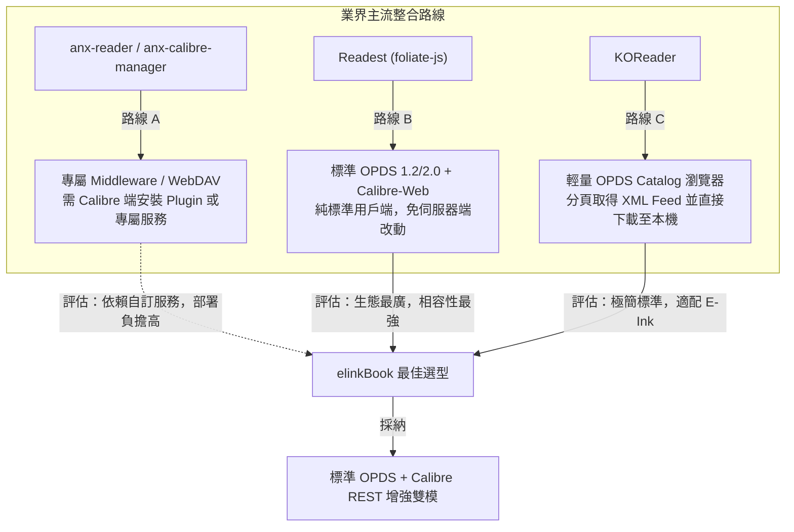
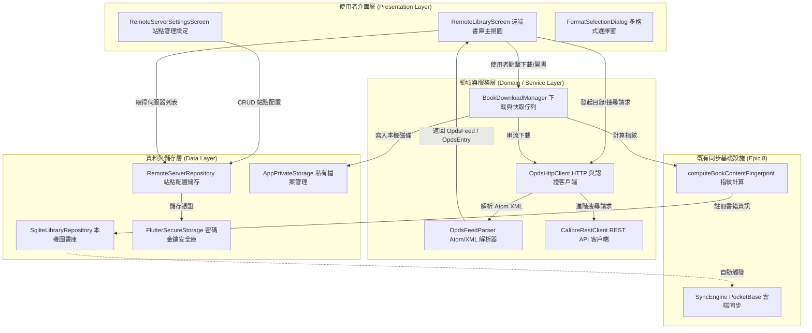
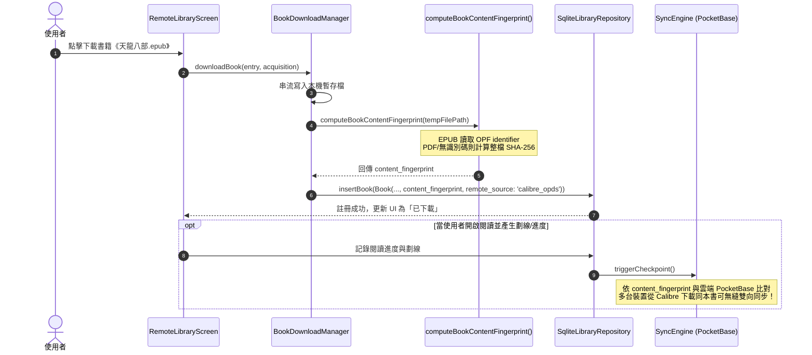
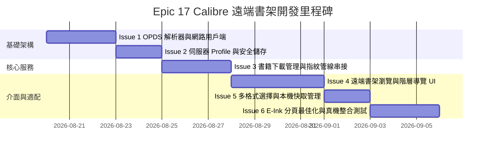

# elinkBook Calibre 遠端書架與 OPDS 整合架構技術研究報告

> **專案定位**：elinkBook — 專注於「直排繁體中文排版」與「E-Ink 電子墨水螢幕最佳化」的 Flutter Android 電子書閱讀器。  
> **核心目標**：研究如何將 Calibre Library / OPDS 目錄整合為 elinkBook 的遠端雲端書架，實現自建 NAS 或遠端書庫的目錄瀏覽、分類搜尋、多格式下載、本機私有快取，並無縫串接既有 PocketBase 跨裝置劃線與閱讀進度同步引擎。
> 
> **範圍界定**：本報告專注於「Calibre Content Server / OPDS 遠端書架」的架構設計、通訊協議選型、資料庫擴充、下載管理與 E-Ink 體驗適配。經訪談決議，**Obsidian Fast Note Sync（筆記雙向/增量同步）** 暫緩，獨立記錄於文末 Backlog 追蹤章節。

---

## 1. 執行摘要 (Executive Summary)

現代電子書愛好者與重度讀者多習慣於居家 NAS（如 Synology DSM、TrueNAS、QNAP）或 VPS 伺服器部署 **Calibre Content Server**、**Calibre-Web** 或 **Kavita** 作為個人數位藏書庫。為了讓 elinkBook 具備直接連線個人雲端書庫的能力，同時維持本機閱讀器「輕量、快速、離線可用」的核心體驗，本報告完成系統性的架構研究與設計。

### 核心架構決策 (Key Architectural Decisions)

| 維度 | 決策結論 | 關鍵技術考量與效益 |
|---|---|---|
| **通訊協議** | **OPDS 1.2/2.0 + Calibre REST API 雙模** | 採標準開放協議，無需在 Calibre 端額外安裝專屬外掛（如 `anx-reader-calibre-plugin`），廣泛相容 Calibre 官方伺服器、Calibre-Web、Kavita 等自架方案。 |
| **快取策略** | **隨選下載＋獨立遠端瀏覽** | 遠端目錄採串流分頁瀏覽，不將海量書庫灌入本機 SQLite 造成啟動延遲；點擊開書或下載後才將檔案載入私有快取並註冊為本機書。 |
| **書籍指紋** | **串接既有 `content_fingerprint` 管線** | 下載時自動經 `computeBookContentFingerprint()`（OPF Identifier / SHA-256），使跨裝置自同一 Calibre 下載的書籍可無縫相容現有 PocketBase 劃線、書籤與進度同步（Epic 8）。 |
| **伺服器管理** | **多 Profile 站點管理＋安全憑證** | 支援多站點配置（家庭 NAS、公網 Calibre-Web、Project Gutenberg 等），帳號密碼透過 Android Keystore / `flutter_secure_storage` 安全加密儲存。 |
| **瀏覽導航** | **階層下鑽＋即時搜尋＋狀態標記** | 支援 OPDS 麵包屑分類下鑽（按作者、系列、標籤）、即時搜尋、網格/清單切換，並即時比對本機已下載狀態（已下載/下載中/雲端）。 |
| **多格式選擇** | **智慧優先序（EPUB > PDF）＋彈窗** | 單一格式直接下載；多格式彈出對話框自選；不支援格式（MOBI/AZW3）置灰提示；已下載者直接點擊開啟閱讀。 |
| **檔案存放** | **App 專屬私有資料目錄** | 存放於 `app_storage/calibre_books/{serverId}/{bookId}.{ext}`，避開 Android Scoped Storage 權限複雜性，並提供「匯出至本機（SAF）」備份功能。 |
| **E-Ink 適配** | **縮圖雙層快取＋離散分頁導航** | 提供實體/虛擬翻頁按鈕避免滾動殘影，封面縮圖支援磁碟與記憶體快取。 |

---

## 2. 業界主流方案剖析與深度對比

在電子書遠端書架整合領域，業界主要有三大開源參考實踐：



### 2.1 Anx Reader & `anx-calibre-manager`
- **架構特點**：由社群提供 `anx-calibre-manager`（獨立 Web 應用）與 `anx-reader-calibre-plugin`（Calibre 桌面端外掛），透過 WebDAV 伺服器與自定義 API 同步書庫與中繼資料。
- **優點**：可深度讀取與雙向修改 Calibre 內部資料庫。
- **缺點**：使用者必須在 NAS 或主機上額外安裝容器或外掛，部署門檻高，且無法直接連線公網標準 OPDS 伺服器。

### 2.2 Readest
- **架構特點**：基於 `readest/foliate-js`，內建 OPDS 用戶端，可連線 Calibre Content Server、Calibre-Web、Kavita 等。
- **優點**：零伺服器端配置負擔，使用者只需輸入 OPDS URL 與帳號密碼即可瀏覽與下載；支援封面獲取與自訂欄位解析。
- **借鑒價值**：elinkBook 採用相同核心（`readest/foliate-js`），其 OPDS 資料模型與 Acquisition Link 解析邏輯極具參考性。

### 2.3 結論與選型定調
elinkBook 採納 **「標準 OPDS 1.2/2.0 協議為骨幹 ＋ Calibre Content Server REST API 增強」** 的雙模架構：
1. **標準相容性**：只要符合 OPDS 規範的伺服器皆可直接連線。
2. **深度功能**：若偵測到為原生 Calibre Content Server，可額外調用 `/ajax/search` 與 `/ajax/categories` 取得作者、系列、標籤之進階搜尋能力。

---

## 3. 系統架構設計 (System Architecture)

### 3.1 模組分層與職責



### 3.2 核心元件與實體模型

#### (1) 伺服器配置模型 (`RemoteServerProfile`)
```dart
enum RemoteServerType {
  opds,          // 標準 OPDS 目錄
  calibreServer, // 原生 Calibre Content Server
  calibreWeb,    // Calibre-Web
}

class RemoteServerProfile {
  final String id;              // UUID
  final String name;            // 站點自訂名稱（如：家用 NAS 書庫）
  final String baseUrl;         // 基礎網址（如：http://192.168.1.100:8080/opds）
  final RemoteServerType type;  // 伺服器類型
  final String? username;       // HTTP Basic Auth 帳號
  final DateTime createdAt;
  final DateTime? lastAccessedAt;
  
  // 密碼獨立存放於 Secure Storage，不隨 Profile 明文傳遞
}
```

#### (2) OPDS 資料模型 (`OpdsFeed` & `OpdsEntry`)
```dart
class OpdsFeed {
  final String id;
  final String title;
  final String? icon;
  final String? nextUrl;      // 下一頁 Feed URL
  final String? prevUrl;      // 上一頁 Feed URL
  final String? searchUrl;    // OpenSearch 模板 URL
  final List<OpdsNavigationLink> navigationLinks; // 目錄節點（By Author, By Series 等）
  final List<OpdsEntry> entries;                 // 書籍項目
}

class OpdsAcquisition {
  final String href;          // 下載連結
  final String mimeType;      // application/epub+zip, application/pdf 等
  final int? length;          // 檔案大小（bytes）
}

class OpdsEntry {
  final String id;
  final String title;
  final String author;
  final String? summary;
  final String? coverUrl;
  final String? thumbnailUrl;
  final List<OpdsAcquisition> acquisitions; // 該書籍提供的各格式下載連結
  final String? seriesName;
  final double? seriesIndex;
  final List<String> tags;
  final DateTime? updated;
}
```

---

## 4. 本機資料庫 Schema 擴充與快取設計

### 4.1 SQLite Schema 遷移 (`books` 資料表)
為了支援遠端來源記錄與追蹤，`books` 表於下一次版本遷移（Schema Migration）中新增可為空欄位，對既有本機書籍零破壞：

```sql
-- SQLite Schema Migration
ALTER TABLE books ADD COLUMN remote_source TEXT;          -- 來源識別，如 'calibre_opds'
ALTER TABLE books ADD COLUMN remote_server_id TEXT;       -- 對應 RemoteServerProfile.id
ALTER TABLE books ADD COLUMN remote_book_id TEXT;         -- Calibre 端書籍 ID / OPDS Entry ID
ALTER TABLE books ADD COLUMN remote_download_url TEXT;    -- 遠端下載 URL
ALTER TABLE books ADD COLUMN is_remote_download INTEGER DEFAULT 0; -- 標記是否為 App 下載快取書
```

### 4.2 本機儲存路徑與命名規範
從 Calibre 遠端下載之檔案存放在 App 私有檔案目錄中，確保不受 Android 系統相簿/媒體掃描器干擾，且解除安裝時能乾淨回收：
- **路徑格式**：  
  `{getApplicationDocumentsDirectory()}/remote_books/{serverId}/{sanitized_remote_book_id}.{ext}`
- **快取清理機制**：
  在書架長按書籍選單提供「移除本機快取（保留雲端紀錄）」或「匯出至本機儲存空間（SAF）」。

---

## 5. 書籍指紋與 PocketBase 跨裝置同步整合

elinkBook 已於 `epic-8-sync` 建立了完整的跨裝置同步引擎（`SyncEngine`），其核心依賴為 `books.content_fingerprint`。

### 5.1 指紋對齊流程 (Fingerprint Alignment Flow)



**架構優勢**：
由於下載落地後立即計算 `content_fingerprint`，使用者在手機 A 與電子紙平板 B 分別從家中的 Calibre 下載同一本書時，兩台裝置會計算出完全相同的書籍指紋。當裝置 A 畫線或翻頁時，裝置 B 能透過現有的 PocketBase 同步引擎即時拉取註記與閱讀位置，達成完美的跨端閱讀體驗。

---

## 6. E-Ink 電子墨水螢幕瀏覽體驗最佳化

針對 E-Ink 裝置（如 BOOX、Readmoo mooInk、TCL 等）更新率低、滾動易殘影的特性，遠端書庫介面進行專屬適配：

1. **離散分頁導航 (Paged Navigation Mode)**：
   - 偵測到 E-Ink 模式時，在清單與網格底部常駐「分頁按鈕列」（`[第一頁] [上一頁] 12/85 [下一頁] [最末頁]`）。
   - 點擊按鈕進行整頁換頁重繪，停用高幀率滑動動畫，徹底消除滾動殘影。
2. **封面縮圖雙層快取 (Two-tier Cover Cache)**：
   - 記憶體快取（LRU 30 張）＋ 本機磁碟快取（`cache/remote_covers/{md5(url)}.jpg`）。
   - E-Ink 模式下自動套用高清晰灰階濾鏡，提升墨水屏上的封面邊緣對比度。
3. **低頻重繪與防抖動**：
   - 搜尋框輸入採用 400ms Debounce 防抖，避免連續發起 XML 請求造成介面頻繁刷新。

---

## 7. 異常處理與邊界情況 (Edge Cases)

| 異常情境 | 防禦與處理機制 |
|---|---|
| **自簽憑證或內網 HTTPS 失敗** | 提供「信任自簽憑證（Allow Insecure SSL）」開關選項；連線逾時（10s）回傳友善錯誤提示。 |
| **下載中途斷網或 App 關閉** | 採用 `.download` 暫存檔機制，未完成前不寫入 SQLite；重新點擊時支援 HTTP Range Header 斷點續傳。 |
| **OPDS XML 格式不規範或缺失欄位** | `OpdsFeedParser` 採用容錯解析模式，缺失 Title 時取檔名，缺失 Author 時標記「未知作者」，不引發例外崩潰。 |
| **同書多格式衝突** | 彈窗提供 `EPUB (12MB)`、`PDF (45MB)` 供選擇；預設標記推薦格式（EPUB 首選）。 |
| **伺服器端書籍已被刪除/更新** | 點擊下載回傳 404 時，提示「遠端書籍已移除」，並自動自當前快取 Feed 中標記無效。 |

---

## 8. 實施階段與工單拆分規劃 (Roadmap & Issue Breakdown)

建議將本功能立項為 **`epic-17-remote-calibre`**，拆分為 6 個循序漸進的垂直切片工單：



- **Issue 1**：OPDS 1.2/2.0 Atom XML 解析器與 `OpdsHttpClient`（純 Dart 單元測試 100% 涵蓋）。
- **Issue 2**：`RemoteServerProfile` 實體、`RemoteServerRepository`、`flutter_secure_storage` 憑證加密與站點管理 UI。
- **Issue 3**：`BookDownloadManager` 下載佇列、本機私有儲存目錄、`computeBookContentFingerprint()` 串接與 SQLite 註冊。
- **Issue 4**：`RemoteLibraryScreen` 主介面（站點切換、麵包屑分類下鑽、即時搜尋、封面網格/詳細清單）。
- **Issue 5**：多格式彈窗選擇（`FormatSelectionDialog`）、已下載狀態即時連動、移除快取與匯出功能。
- **Issue 6**：E-Ink 分頁步進適配、封面高對比處理、Android 實機（手機與電子紙）端到端驗證。

---

## 9. 未來待辦項目 (Backlog)

### 📌 Obsidian Fast Note Sync 筆記雙向/增量同步
- **背景**：將 elinkBook 內的劃線（Highlights）、讀書筆記（Notes）與書籤（Bookmarks）同步至使用者的 Obsidian 知識庫。
- **建議架構**：
  1. **本機 SAF Vault 寫入**：透過 Android SAF 授權指定本機 Obsidian Vault 之書籍筆記目錄（如 `/Vault/Books/`），每本書生成獨立 Markdown 檔案（含 YAML Frontmatter、章節引用與備註）。
  2. **Fast Note Sync / Local REST API 整合**：架構上保留 HTTP API 介面，支援在劃線儲存或 Checkpoint 觸發時將 Markdown payload 自動推送至自建 Fast Note Sync 伺服器或 Obsidian Local REST API 插件。
- **規劃排程**：獨立於後續之專屬 Epic 中進行設計與實作。
