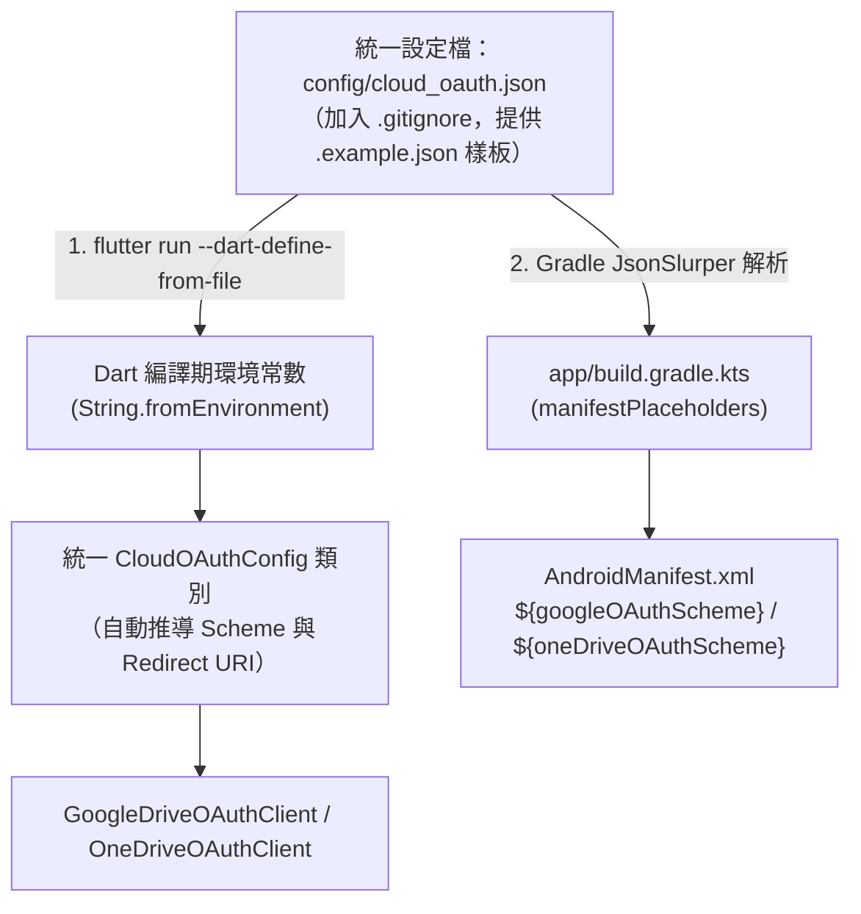

# 雲端服務 OAuth 外部統一設定檔架構設計與管理方案

- **日期**：2026-08-19
- **模組**：`app/lib/cloud_import/`、`app/android/`
- **對照 Epic**：[`docs/epics/epic-29-cloud-import/issues.md`](file:///U:/MyDeveloper/AI/elinkBook/docs/epics/epic-29-cloud-import/issues.md)、[`spec.md`](file:///U:/MyDeveloper/AI/elinkBook/docs/epics/epic-29-cloud-import/spec.md)
- **關聯文件**：[`docs/research/cloud_storage_oauth_setup_guide.md`](file:///U:/MyDeveloper/AI/elinkBook/docs/research/cloud_storage_oauth_setup_guide.md)

---

## 1. 背景與現行痛點

在 Epic 29（Google Drive 與 OneDrive 雲端匯入）初版實作中，OAuth 2.0 Client ID 與 Redirect Scheme 是以常數方式分別寫在各自的 Dart 檔案中，並在 `AndroidManifest.xml` 中手動設定 `intent-filter`：

```
現行分散維護點：
├── app/lib/cloud_import/google_oauth_config.dart    (Google Client ID + Reverse Scheme)
├── app/lib/cloud_import/onedrive_oauth_config.dart  (OneDrive Client ID + MSAL Scheme)
└── app/android/app/src/main/AndroidManifest.xml     (2 組硬編碼的 intent-filter scheme)
```

### 主要痛點
1. **多處同步修改容易遺漏**：更新或切換 Client ID 時，必須同時修改 2 個 Dart 檔案與 1 個 Android XML 清單檔。
2. **手動推導 Scheme 容易出錯**：Google 反向客戶端 ID（`com.googleusercontent.apps.<ID>`）與 Microsoft MSAL scheme（`msal<ID>`）需由開發者手動拼接，大小寫或前綴拼錯將導致授權跳轉攔截失敗。
3. **多環境與團隊協作衝突**：不同開發者的測試憑證或正式環境憑證容易造成 Git 工作區被污染（git dirty），甚至發生個人金鑰誤提交至版本庫的風險。

---

## 2. 統一設定檔架構設計 (Single Source of Truth)

本架構採用 Flutter 官方支援的 **`--dart-define-from-file`**（單一 JSON 設定檔）結合 Android Gradle 的 **`manifestPlaceholders`**，達成 **「單一設定檔、雙層自動編譯注入、Scheme 自動推導」** 的目標。

### 架構流程圖



---

## 3. 詳細實作規範與程式碼範例

### 步驟 3.1：建立統一 JSON 設定檔與範本

在專案目錄 `app/config/` 下建立設定檔：

#### 1. 樣板檔（提交至 Git）：`app/config/cloud_oauth.example.json`
```json
{
  "GOOGLE_OAUTH_CLIENT_ID": "YOUR_GOOGLE_OAUTH_CLIENT_ID.apps.googleusercontent.com",
  "ONEDRIVE_OAUTH_CLIENT_ID": "YOUR_ONEDRIVE_OAUTH_CLIENT_ID"
}
```

#### 2. 本機真實設定檔（加入 `.gitignore`）：`app/config/cloud_oauth.json`
```json
{
  "GOOGLE_OAUTH_CLIENT_ID": "123456789012-abcdefghijklmnopqrstuvwxyz123456.apps.googleusercontent.com",
  "ONEDRIVE_OAUTH_CLIENT_ID": "4a3b2c1d-1234-4321-abcd-ef0123456789"
}
```

#### 3. 配置 `.gitignore`
在專案根目錄 `.gitignore` 或 `app/.gitignore` 加入：
```gitignore
# 雲端服務 OAuth 本機金鑰設定檔
app/config/cloud_oauth.json
```

---

### 步驟 3.2：Dart 端統一設定管理類別

建立 [`app/lib/cloud_import/cloud_oauth_config.dart`](file:///U:/MyDeveloper/AI/elinkBook/app/lib/cloud_import/cloud_oauth_config.dart)，由 Client ID 自動推導所有 Scheme 與 Redirect URI：

```dart
/// 雲端服務 OAuth 2.0 統一環境設定管理器
///
/// 支援從編譯期環境常數（--dart-define-from-file）讀取外部設定，
/// 若未提供則安全回退至預設 placeholder 常數。
abstract class CloudOAuthConfig {
  // ==================== Google Drive ====================

  /// Google OAuth 2.0 Client ID
  static const String googleClientId = String.fromEnvironment(
    'GOOGLE_OAUTH_CLIENT_ID',
    defaultValue: 'YOUR_GOOGLE_OAUTH_CLIENT_ID.apps.googleusercontent.com',
  );

  /// 依 [googleClientId] 自動推導 Google 反向客戶端 Scheme
  static String get googleRedirectScheme {
    final prefix = googleClientId.replaceAll('.apps.googleusercontent.com', '');
    return 'com.googleusercontent.apps.$prefix';
  }

  /// 完整的 Google OAuth Redirect URI
  static String get googleRedirectUri => '$googleRedirectScheme:/oauth2redirect';

  // ==================== OneDrive (Microsoft Graph) ====================

  /// Microsoft Entra ID Application (Client) ID
  static const String oneDriveClientId = String.fromEnvironment(
    'ONEDRIVE_OAUTH_CLIENT_ID',
    defaultValue: 'YOUR_ONEDRIVE_OAUTH_CLIENT_ID',
  );

  /// 依 [oneDriveClientId] 自動推導 MSAL 自訂 Scheme
  static String get oneDriveRedirectScheme => 'msal$oneDriveClientId';

  /// 完整的 OneDrive OAuth Redirect URI
  static String get oneDriveRedirectUri => '$oneDriveRedirectScheme://auth';
}
```

---

### 步驟 3.3：Gradle 解析 JSON 並注入 Manifest Placeholders

修改 [`app/android/app/build.gradle.kts`](file:///U:/MyDeveloper/AI/elinkBook/app/android/app/build.gradle.kts)，在 Gradle 構建時解析 `cloud_oauth.json`，並將推導後的 Scheme 注入 `manifestPlaceholders`：

```kotlin
import groovy.json.JsonSlurper
import java.io.File

// 定義設定檔路徑：優先讀取 app/config/cloud_oauth.json，若無則讀取 example 樣板
val configFile = File(project.rootDir.parentFile, "config/cloud_oauth.json")
val fallbackFile = File(project.rootDir.parentFile, "config/cloud_oauth.example.json")
val targetConfigFile = if (configFile.exists()) configFile else fallbackFile

val configJson: Map<String, Any>? = if (targetConfigFile.exists()) {
    try {
        @Suppress("UNCHECKED_CAST")
        JsonSlurper().parseText(targetConfigFile.readText()) as? Map<String, Any>
    } catch (e: Exception) {
        null
    }
} else null

// 提取 Client ID 與推導 Scheme
val rawGoogleClientId = configJson?.get("GOOGLE_OAUTH_CLIENT_ID") as? String 
    ?: "YOUR_GOOGLE_OAUTH_CLIENT_ID.apps.googleusercontent.com"
val rawOneDriveClientId = configJson?.get("ONEDRIVE_OAUTH_CLIENT_ID") as? String 
    ?: "YOUR_ONEDRIVE_OAUTH_CLIENT_ID"

val googleOAuthScheme = "com.googleusercontent.apps." + rawGoogleClientId.replace(".apps.googleusercontent.com", "")
val oneDriveOAuthScheme = "msal$rawOneDriveClientId"

android {
    ...
    defaultConfig {
        applicationId = "cc.ugotit.elinkbook"
        ...

        // 自動將 Scheme 注入 AndroidManifest.xml
        manifestPlaceholders["googleOAuthScheme"] = googleOAuthScheme
        manifestPlaceholders["oneDriveOAuthScheme"] = oneDriveOAuthScheme
    }
}
```

---

### 步驟 3.4：`AndroidManifest.xml` 採用動態佔位符

更新 [`app/android/app/src/main/AndroidManifest.xml`](file:///U:/MyDeveloper/AI/elinkBook/app/android/app/src/main/AndroidManifest.xml)，將 scheme 改為 `${googleOAuthScheme}` 與 `${oneDriveOAuthScheme}`：

```xml
<activity
    android:name=".MainActivity"
    ...>

    <!-- Google OAuth Redirect Intent Filter -->
    <intent-filter>
        <action android:name="android.intent.action.VIEW"/>
        <category android:name="android.intent.category.DEFAULT"/>
        <category android:name="android.intent.category.BROWSABLE"/>
        <data android:scheme="${googleOAuthScheme}"/>
    </intent-filter>

    <!-- OneDrive MSAL OAuth Redirect Intent Filter -->
    <intent-filter>
        <action android:name="android.intent.action.VIEW"/>
        <category android:name="android.intent.category.DEFAULT"/>
        <category android:name="android.intent.category.BROWSABLE"/>
        <data android:scheme="${oneDriveOAuthScheme}" android:host="auth"/>
    </intent-filter>

</activity>
```

---

## 4. 開發者工作流程與 IDE 設定

### 1. 命令列執行 (CLI)
```bash
# 帶入設定檔執行
cd app
flutter run --dart-define-from-file=config/cloud_oauth.json

# 建置 Release APK
flutter build apk --release --dart-define-from-file=config/cloud_oauth.json
```

### 2. VS Code 設定 (`.vscode/launch.json`)
在專案根目錄 `.vscode/launch.json` 中配置，按下 F5 即可自動帶入設定檔除錯：
```json
{
  "version": "0.2.0",
  "configurations": [
    {
      "name": "elinkBook (Debug with Cloud OAuth)",
      "request": "launch",
      "type": "dart",
      "cwd": "app",
      "args": [
        "--dart-define-from-file=config/cloud_oauth.json"
      ]
    }
  ]
}
```

---

## 5. 效益評估與比較

| 評估項目 | 原寫法（硬編碼於代碼） | 統一設定檔方案（本方案） |
| :--- | :--- | :--- |
| **設定維護點** | 需手動修改 3 個檔案（2 Dart + 1 XML） | **唯一維護點：`cloud_oauth.json`** |
| **Scheme 準確性** | 手動反轉網域，容易出現拼字錯誤 | **程式自動依 Client ID 推導計算** |
| **安全性與版控** | 開發者金鑰容易誤 commit 進 Git | **設定檔進 `.gitignore`，安全隔離** |
| **多環境部署** | 切換環境需搜尋代碼全面置換 | **直接切換指定 JSON（如 `cloud_oauth.prod.json`）** |
| **CI/CD 自動化** | 需要 sed/腳本動態替換原始碼 | **CI 流程直接注入單一 JSON 檔或環境變數** |

---

## 6. 遷移與執行建議

1. **過渡相容性**：Dart 端與 Gradle 端皆保留了 `defaultValue` 與 `fallbackFile` 容錯機制，即使未建立 `cloud_oauth.json`，既有測試套件（`flutter test`）與靜態分析（`flutter analyze`）依然能 100% 正常執行通過。
2. **重構時機**：建議於 Issue 3 開始前或作為獨立的小型 Refactor 切片落地，讓後續的 Issue 3（Google Drive 瀏覽匯入）與 Issue 4（OneDrive 瀏覽匯入）能直接享用乾淨無污染的設定架構。
