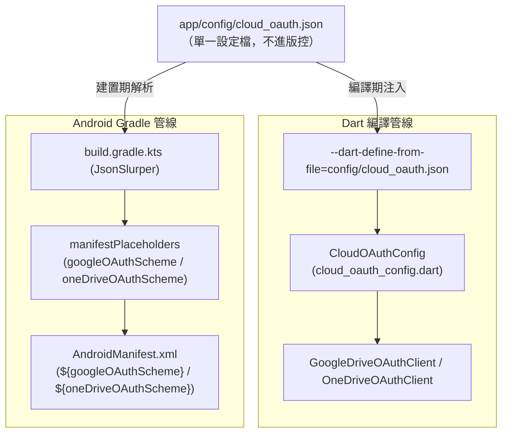
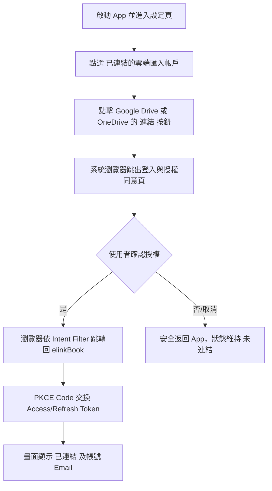

# Google Drive 與 OneDrive 介接服務申請與設定指南 (OAuth 2.0 & PKCE)

本文件依據 [`docs/epics/epic-29-cloud-import/issues.md`](file:///U:/MyDeveloper/AI/elinkBook/docs/epics/epic-29-cloud-import/issues.md)、[`spec.md`](file:///U:/MyDeveloper/AI/elinkBook/docs/epics/epic-29-cloud-import/spec.md) 以及 **Epic 29 Issue 7 統一外部設定檔架構**規範撰寫，提供開發者與維運人員在 **Google Cloud Console** 與 **Microsoft Entra ID (Azure Portal)** 申請、配置雲端 API 憑證，取得用戶端 ID (Client ID)，並透過單一設定檔（`cloud_oauth.json`）整合至 elinkBook 專案的標準作業程序（SOP）。

---

## 1. 架構概述與設定對照表

elinkBook 採用無後端伺服器的公開用戶端架構（Public Client），透過系統瀏覽器發起 **OAuth 2.0 Authorization Code Flow 搭配 PKCE (RFC 7636, S256)** 進行身分驗證，並使用 Android Intent Filter 攔截 Redirect URI 回傳授權碼。

### 統一外部設定檔架構 (Epic 29 Issue 7)

為避免 Client ID 與 Redirect Scheme 分散於多個 Dart 檔案與 Android XML 中導致同步維護困難，專案採用**單一外部設定檔維護點**：



- **單一設定檔維護**：開發者只需在 [`app/config/cloud_oauth.json`](file:///U:/MyDeveloper/AI/elinkBook/app/config/cloud_oauth.json) 設定 Google 與 OneDrive 的 Client ID。
- **Dart 端自動推導**：[`app/lib/cloud_import/cloud_oauth_config.dart`](file:///U:/MyDeveloper/AI/elinkBook/app/lib/cloud_import/cloud_oauth_config.dart) 透過 `String.fromEnvironment` 讀取並自動計算 Redirect Scheme 與 Redirect URI。
- **Android 端自動注入**：[`app/android/app/build.gradle.kts`](file:///U:/MyDeveloper/AI/elinkBook/app/android/app/build.gradle.kts) 於建置時解析同一份 JSON 檔，將推導後的 Scheme 注入 [`AndroidManifest.xml`](file:///U:/MyDeveloper/AI/elinkBook/app/android/app/src/main/AndroidManifest.xml) 的動態佔位符 `${googleOAuthScheme}` 與 `${oneDriveOAuthScheme}`。
- **完全免改程式碼與 XML**：更新憑證時**無需修改任何 Dart 程式碼或 `AndroidManifest.xml`**。

### 專案設定檔案位置對照表

| 項目 | 檔案路徑 | 說明 |
| :--- | :--- | :--- |
| **真實憑證設定檔** | `app/config/cloud_oauth.json` | 開發者本機真實憑證設定檔（已被 `.gitignore` 排除，**不進版控**） |
| **設定檔範本樣板** | [`app/config/cloud_oauth.example.json`](file:///U:/MyDeveloper/AI/elinkBook/app/config/cloud_oauth.example.json) | 提供給新環境複製使用的標準 JSON 樣板檔（已進版控） |
| **Dart 統一設定** | [`app/lib/cloud_import/cloud_oauth_config.dart`](file:///U:/MyDeveloper/AI/elinkBook/app/lib/cloud_import/cloud_oauth_config.dart) | 讀取編譯期環境常數並自動計算兩平台 Redirect Scheme/URI |
| **Gradle 自動注入** | [`app/android/app/build.gradle.kts`](file:///U:/MyDeveloper/AI/elinkBook/app/android/app/build.gradle.kts) | 解析 `cloud_oauth.json` 並寫入 `manifestPlaceholders` |
| **Android 清單** | [`app/android/app/src/main/AndroidManifest.xml`](file:///U:/MyDeveloper/AI/elinkBook/app/android/app/src/main/AndroidManifest.xml) | 透過 `${googleOAuthScheme}` 與 `${oneDriveOAuthScheme}` 宣告 `intent-filter` |
| **套件名稱** | `cc.ugotit.elinkbook` | 定義於 `app/android/app/build.gradle.kts` 的 `applicationId` |

---

## 2. Google Drive 介接申請與取得 Client ID (Google Cloud Console)

### 步驟 2.1：建立 / 選擇 Google Cloud 專案
1. 前往 [Google Cloud Console](https://console.cloud.google.com/)。
2. 登入 Google 帳號，點擊頂部專案下拉選單，選擇「**新增專案 (New Project)**」。
3. 輸入專案名稱（例如 `elinkBook-Cloud-Import`），組織保持預設，點擊「**建立 (Create)**」。

---

### 步驟 2.2：啟用 Google Drive API 與 People API
1. 在左側導覽列點選「**API 和服務 (APIs & Services)**」$\rightarrow$「**程式庫 (Library)**」。
2. 搜尋 `Google Drive API`，點擊進入後點選「**啟用 (Enable)**」。
3. （選用/建議）搜尋 `Google People API`，點擊進入後點選「**啟用 (Enable)**」（供取得帳號 email 與名稱資訊）。

---

### 步驟 2.3：配置 OAuth 同意畫面 (OAuth Consent Screen)
Google 要求發起 OAuth 驗證前必須設定同意畫面：

1. 點選「**API 和服務**」$\rightarrow$「**OAuth 同意畫面 (OAuth consent screen)**」。
2. **使用者類型 (User Type)**：選擇「**外部 (External)**」，點擊「建立」。
3. **應用程式資訊 (App information)**：
   - **應用程式名稱 (App name)**：`elinkBook`
   - **使用者支援電子郵件 (User support email)**：選擇你的開發者信箱。
   - **開發者聯絡資訊 (Developer contact information)**：填入電子郵件地址。
   - 其餘欄位（標誌、網域等）在開發測試階段可先留空，點擊「**儲存並繼續 (Save and Continue)**」。
4. **範圍 (Scopes)**：
   - 點擊「**新增或移除範圍 (Add or Remove Scopes)**」。
   - 勾選以下 Scopes：
     - `.../auth/drive.readonly`（受限權限 Restricted Scope：查看並下載所有 Google 雲端硬碟檔案）
     - `.../auth/userinfo.email`（查看使用者的主要電子郵件地址）
     - `.../auth/userinfo.profile`（查看使用者的個人基本資料）
     - `openid`（與 OpenID Connect 身分驗證相關）
   - 點擊「**更新**」並「**儲存並繼續**」。
5. **測試使用者 (Test users) ——【極為重要】**：
   > [!IMPORTANT]
   > 由於 `drive.readonly` 屬於受限權限（Restricted Scope），在完成 Google 官方正式驗證前，**只有被加入「測試使用者」清單的 Google 帳號才能順利登入**。未加入的帳號在登入時會被 Google 阻擋（顯示 `403: access_denied` 或 `App not verified` 且無繼續按鈕）。
   - 點擊「**ADD USERS**」。
   - 填入你用來測試的 Google 帳號信箱（可新增多個）。
   - 點擊「**儲存並繼續**」完成設定。

---

### 步驟 2.4：建立並取得 OAuth 2.0 用戶端 ID (Client ID)

#### 1. 建立憑證
1. 在左側功能表點選「**API 和服務 (APIs & Services)**」$\rightarrow$「**憑證 (Credentials)**」。
2. 點擊頂部「**+ 建立憑證 (Create Credentials)**」$\rightarrow$ 選擇「**OAuth 用戶端 ID (OAuth client ID)**」。
3. **應用程式類型 (Application type)** 建議與設定方式：
   - **選項 A（Android 應用程式類型，正規推薦）**：
     - 應用程式類型選擇「**Android**」。
     - **名稱**：`elinkBook Android Client`。
     - **套件名稱 (Package name)**：`cc.ugotit.elinkbook`。
     - **SHA-1 簽署憑證指紋 (SHA-1 certificate fingerprint)**：
       - 在專案目錄執行 Gradle 簽署報告指令取得 Debug 憑證指紋：
         ```bash
         cd app/android
         ./gradlew signingReport
         ```
       - 或透過 JDK `keytool` 指令取得本機 debug.keystore 指紋（預設密碼為 `android`）：
         ```bash
         keytool -list -v -keystore ~/.android/debug.keystore -alias androiddebugkey -storepass android -keypass android
         ```
       - 複製輸出中的 `SHA1:` 指紋（例如 `AA:BB:CC:DD:...`）並貼入 Console。
     - 點擊「**建立 (Create)**」。
   - **選項 B（桌面應用程式類型，免 SHA-1 指紋彈性測試用）**：
     - 若希望在不綁定特定 SHA-1 指紋下快速進行測試，亦可建立「**桌面應用程式 (Desktop App)**」類型憑證。
     - 填入名稱後直接點擊「**建立**」。

#### 2. 如何取得與複製 Client ID
完成建立後，有兩種方式可取得 Client ID：

- **方式一（建立完成當下複製）**：
  點擊「建立」後，頁面會自動彈出「**已建立 OAuth 用戶端 (OAuth client created)**」對話方塊。在對話方塊中找到「**用戶端 ID (Client ID)**」，點擊右側的 **「複製 (Copy)」圖示**。
- **方式二（事後隨時查詢與複製）**：
  1. 前往「**API 和服務**」$\rightarrow$「**憑證 (Credentials)**」。
  2. 向下捲動至「**OAuth 2.0 用戶端 ID**」清單。
  3. 找到剛剛建立的用戶端項目（例如 `elinkBook Android Client`）。
  4. 點擊該列最右側的 **「複製用戶端 ID」圖示**（或直接點擊名稱進入詳情頁面，複製右上方的「用戶端 ID」）。

> [!NOTE]
> Google Client ID 的標準格式為：
> `xxxxxxxxxxxx-xxxxxxxxxxxxxxxxxxxxxxxxxxxxxxxx.apps.googleusercontent.com`
> （由「專案數字前綴 - 32 位元英數字元.apps.googleusercontent.com」組成）。

---

### 步驟 2.5：將 Google Client ID 代入專案設定檔

依據 Epic 29 Issue 7 新架構，**不需要修改任何 Dart 程式碼與 `AndroidManifest.xml`**。只需將複製的 Client ID 貼入 `app/config/cloud_oauth.json`：

1. 若專案尚未建立 `app/config/cloud_oauth.json`，請複製樣板檔：
   ```bash
   cp app/config/cloud_oauth.example.json app/config/cloud_oauth.json
   ```
2. 開啟 `app/config/cloud_oauth.json`，將 `GOOGLE_OAUTH_CLIENT_ID` 替換為步驟 2.4 複製的完整 Client ID：
   ```json
   {
     "GOOGLE_OAUTH_CLIENT_ID": "123456789012-abcdefghijklmnopqrstuvwxyz123456.apps.googleusercontent.com",
     "ONEDRIVE_OAUTH_CLIENT_ID": "YOUR_ONEDRIVE_OAUTH_CLIENT_ID"
   }
   ```
3. 專案自動推導與注入機制：
   - **Dart 端**：[`CloudOAuthConfig.googleRedirectScheme`](file:///U:/MyDeveloper/AI/elinkBook/app/lib/cloud_import/cloud_oauth_config.dart) 自動由 Client ID 推導出反向 Scheme：`com.googleusercontent.apps.123456789012-abcdefghijklmnopqrstuvwxyz123456`。
   - **Android 端**：Gradle 建置腳本解析同一份 JSON 檔，將該 Scheme 注入 [`AndroidManifest.xml`](file:///U:/MyDeveloper/AI/elinkBook/app/android/app/src/main/AndroidManifest.xml) 的 `${googleOAuthScheme}` 佔位符。

---

## 3. OneDrive 介接申請與取得 Client ID (Microsoft Entra ID / Azure Portal)

### 步驟 3.1：進入 Azure 應用程式註冊
1. 前往 [Microsoft Entra 系統管理中心](https://entra.microsoft.com/) 或 [Azure Portal](https://portal.azure.com/)。
2. 在左側導覽功能表中，點選「**應用程式 (Applications)**」$\rightarrow$「**應用程式註冊 (App registrations)**」。
3. 點擊頂部的「**+ 新增註冊 (New registration)**」。

---

### 步驟 3.2：新增應用程式註冊 (App Registration)
1. **名稱 (Name)**：輸入應用程式名稱（例如 `elinkBook` 或 `JieLink`）。
2. **支援的帳戶類型 (Supported account types)** ——【極為重要】：
   - 選擇 **「任何組織目錄中的帳戶 (任何 Microsoft Entra ID 目錄 - 多租用戶) 及個人 Microsoft 帳戶 (例如 Skype、Xbox)」**。
   - *(此選項對應 OAuth 端點的 `common` 租戶模式，確保個人 Hotmail/Outlook 與公司/學校帳號皆可順利登入)*。
3. **重新導向 URI (Redirect URI)**：
   - 平台類型下拉選單選擇：**「公用用戶端/原生 (行動裝置和傳統型) (Public client/native (mobile & desktop))」**。
   - 重新導向 URI 填入：`msal<CLIENT_ID>://auth`（若尚未取得 Client ID，可先留空或註冊後於步驟 3.4 補上）。
4. 點擊「**註冊 (Register)**」。

---

### 步驟 3.3：取得用戶端 ID (Client ID)
註冊完成後，在應用程式的「**概觀 (Overview)**」頁面中：
- 找到「**應用程式 (用戶端) 識別碼 (Application (client) ID)**」（格式為 UUID，例如 `e8312c9f-5600-4ce0-9847-73897490584f`）。
- 點擊該欄位旁的 **「複製」圖示**。

---

### 步驟 3.4：配置驗證與公開用戶端流程 (Authentication)

在應用程式頁面左側的「**管理 (Manage)**」選單中，點擊 **「Authentication (Preview)」** 或 **「驗證 (Authentication)」**：

#### 1. 檢查重新導向 URI（Redirect URI）
- 在 **【重新導向 URI 設定】** 索引標籤中：
  - 確認已有「**行動應用程式與桌面應用程式**」平台。
  - 確認包含 Redirect URI：`msal<你的-CLIENT-ID>://auth`（例如 `msale8312c9f-5600-4ce0-9847-73897490584f://auth`）。
  - 若尚未新增，點擊「**+ 新增重新導向 URI**」並選擇行動與傳統型應用程式平台填入。

#### 2. 開啟「允許公用用戶端流程」開關 ——【極為重要】
> [!IMPORTANT]
> 由於 elinkBook 為無後端 Client Secret 的公開用戶端（PKCE 流程），**必須開啟此開關**，否則微軟登入時會報錯 `AADSTS7000218`。

- **在新版 Authentication (Preview) 介面中**：
  1. 點擊上方第三個索引標籤 **【設定 (Settings)】**（位於「重新導向 URI 設定」、「Supported accounts」右側）。
  2. 找到 **「允許公用用戶端流程 (Allow public client flows)」** / **「啟用下列行動裝置和傳統型流程 (Enable the following mobile and desktop flows)」**。
  3. 將開關切換為 **「是 (Yes)」**。
  4. 點擊頂部的 **「儲存 (Save)」**。
- **若使用舊版驗證介面（或點擊切換為舊版體驗）**：
  1. 向下捲動至「**進階設定 (Advanced settings)**」$\rightarrow$「**允許公用用戶端流程**」。
  2. 將「啟用下列行動裝置和傳統型流程」設為 **「是 (Yes)」** 並儲存。

---

### 步驟 3.5：配置 Microsoft Graph API 權限 (API Permissions)

在應用程式頁面左側的「**管理 (Manage)**」選單中，找到 **「API 權限 (API permissions)」**（位於「憑證及秘密」下方、圖示為鎖匙/盾牌）：

1. 點擊左側選單的 **「API 權限 (API permissions)」**。
2. 點擊中央的 **「+ 新增權限 (Add a permission)**」。
3. 在右側滑出的面板中，選擇 **「Microsoft Graph」** $\rightarrow$ 點擊 **「委派的權限 (Delegated permissions)」**。
4. 在搜尋框中依序搜尋並勾選以下 6 項權限：
   - `Files.Read`（讀取使用者的所有檔案與 OneDrive 電子書）
   - `offline_access`（維持對資料的存取權，供取得 Refresh Token 靜默續期——**必選**）
   - `openid`（簽署使用者）
   - `profile`（檢視使用者基本設定檔）
   - `email`（檢視使用者的電子郵件地址）
   - `User.Read`（登入並讀取使用者設定檔，包含 `/v1.0/me` 端點，預設通常已存在）
5. 勾選完畢後，點擊最下方的 **「新增權限 (Add permissions)」** 按鈕。
6. 確認權限清單中上述 6 項權限皆已列出。

---

### 步驟 3.6：將 OneDrive Client ID 代入專案設定檔

依據 Epic 29 Issue 7 新架構，**不需要修改任何 Dart 程式碼與 `AndroidManifest.xml`**。開啟 `app/config/cloud_oauth.json`：

1. 開啟 `app/config/cloud_oauth.json`，將 `ONEDRIVE_OAUTH_CLIENT_ID` 替換為步驟 3.3 複製的 Application (client) ID：
   ```json
   {
     "GOOGLE_OAUTH_CLIENT_ID": "123456789012-abcdefghijklmnopqrstuvwxyz123456.apps.googleusercontent.com",
     "ONEDRIVE_OAUTH_CLIENT_ID": "e8312c9f-5600-4ce0-9847-ffffffffffff"
   }
   ```
2. 專案自動推導與注入機制：
   - **Dart 端**：[`CloudOAuthConfig.oneDriveRedirectScheme`](file:///U:/MyDeveloper/AI/elinkBook/app/lib/cloud_import/cloud_oauth_config.dart) 自動由 Client ID 推導出 `msale8312c9f-5600-4ce0-9847-73897490584f`，Redirect URI 為 `msale8312c9f-5600-4ce0-9847-73897490584f://auth`。
   - **Android 端**：Gradle 建置腳本解析同一份 JSON 檔，將該 Scheme 注入 [`AndroidManifest.xml`](file:///U:/MyDeveloper/AI/elinkBook/app/android/app/src/main/AndroidManifest.xml) 的 `${oneDriveOAuthScheme}` 佔位符。

---

## 4. 端對端整合測試與驗證 SOP

完成上述申請並在 `app/config/cloud_oauth.json` 填妥真實憑證後，請依循以下步驟進行真機或模擬器驗證：



### 驗證步驟清單

1. **帶入設定檔編譯與執行**：
   > [!TIP]
   > 測試真實 OAuth 流程時，必須在 `app/` 目錄下加上 `--dart-define-from-file=config/cloud_oauth.json` 旗標：
   ```bash
   cd app
   flutter run --dart-define-from-file=config/cloud_oauth.json -d <你的-Android-裝置-ID>
   ```
   *(若未加上此旗標，App 會自動回退為樣板 placeholder 值，無法完成真實雲端授權)*。

2. **Google Drive 連結測試**：
   - 進入「**設定 (Settings)**」$\rightarrow$「**已連結的雲端匯入帳戶 (Cloud Accounts)**」。
   - 點擊 Google Drive 旁的「**連結 (Link)**」按鈕。
   - 系統將調用系統瀏覽器開啟 Google 登入畫面。
   - 使用已加入「**測試使用者**」白名單的 Google 帳號登入。
   - 若出現「Google 尚未驗證這個應用程式」警告，點擊「**進階**」$\rightarrow$「**前往 elinkBook (不安全)**」繼續授權。
   - 勾選同意存取 Google 雲端硬碟檔案權限。
   - 授權完成後，瀏覽器自動關閉並返回 elinkBook，畫面應呈現：
     - 狀態更新為「**已連結**」
     - 顯示使用者的 Google Email 地址（例如 `user@gmail.com`）
     - 按鈕變為「**解除連結 (Unlink)**」
3. **OneDrive 連結測試**：
   - 點擊 OneDrive 旁的「**連結 (Link)**」按鈕。
   - 系統瀏覽器開啟 Microsoft 登入畫面。
   - 輸入 Microsoft 帳號並完成登入。
   - 點擊「**接受 (Accept)**」同意授權請求。
   - 授權完成後返回 App，畫面呈現「**已連結**」及 Microsoft 帳號 Email。
4. **解除連結測試**：
   - 點擊「**解除連結**」，彈出確認對話框。
   - 確認解除後，安全儲存區 Token 應被清除，狀態立即更新為「**未連結**」。

---

## 5. 常見問題與錯誤排查 (Troubleshooting)

### Google Drive 常見問題

| 錯誤現象 | 可能原因 | 解決方法 |
| :--- | :--- | :--- |
| **`403: access_denied` / `此應用程式未通過驗證` 且無法點擊繼續** | 測試帳號未加入 OAuth 同意畫面的測試使用者清單。 | 前往 Google Cloud Console $\rightarrow$ OAuth 同意畫面 $\rightarrow$「測試使用者」新增該 Google 帳號。 |
| **`400: redirect_uri_mismatch`** | 執行時未帶入設定檔或 `cloud_oauth.json` 內的 Client ID 有誤。 | 確認執行時有加上 `--dart-define-from-file=config/cloud_oauth.json`，且 JSON 內的 Client ID 與 Google Cloud Console 一致。 |
| **登入成功但瀏覽器卡住未跳回 App** | Gradle 建置時未抓到真實的 `cloud_oauth.json`。 | 確認 `app/config/cloud_oauth.json` 存在於正確路徑（`app/config/`），並重新執行 `flutter clean` 後再重新建置。 |
| **Token 很快過期且無法自動續期** | 發起授權時未取得 Refresh Token。 | 確認 `GoogleDriveOAuthClient` 請求中帶有 `access_type=offline` 與 `prompt=consent`。 |

---

### OneDrive 常見問題

| 錯誤現象 | 可能原因 | 解決方法 |
| :--- | :--- | :--- |
| **`AADSTS50011: The redirect URI specified in the request does not match...`** | Azure 註冊中的 Redirect URI 與 App 發送的 `msal<CLIENT_ID>://auth` 不符。 | 至 Azure/Entra「驗證」頁面確認行動裝置/傳統型應用程式平台下是否有註冊 `msal<CLIENT_ID>://auth`。 |
| **`AADSTS7000218: The request body must contain the following parameter: 'client_assertion' or 'client_secret'`** | Azure 應用程式未開啟公開用戶端流程。 | 至 Entra「Authentication」$\rightarrow$「**設定 (Settings)**」分頁 $\rightarrow$ 將「**允許公用用戶端流程**」設為「**是 (Yes)**」。 |
| **無法取得 Refresh Token** | 授權請求遺漏 `offline_access` scope。 | 確認 API 權限與授權 Scope 中皆包含 `offline_access`。 |
| **Email 顯示為 null 或空白** | 個人微軟帳號的 Graph `/v1.0/me` 回傳中 `mail` 欄位為 null。 | elinkBook 已內建 `userPrincipalName` 備援邏輯，確認 API 權限中已勾選 `User.Read`。 |

---

## 6. 正式發布與應用程式驗證建議 (Production Considerations)

當 elinkBook 準備發布正式版本供大眾使用時，建議注意以下事項：

1. **Release 建置指令**：
   - 正式打包發布 APK / App Bundle 時，務必帶入正式憑證設定檔：
     ```bash
     cd app
     flutter build apk --release --dart-define-from-file=config/cloud_oauth.json
     ```
2. **Google OAuth 應用程式驗證 (Google App Verification)**：
   - 由於使用了受限範圍 `drive.readonly`，將 OAuth 同意畫面從「測試中」推至「正式發布 (In production)」時，Google 會要求提交應用程式驗證。
   - 需準備：
     - 公開的**隱私權政策 (Privacy Policy) 網址**。
     - **展示影片 (YouTube Unlisted)**：錄製 App 內如何使用 Google Drive 匯入書籍的實際操作影片。
     - 說明為何需要存取使用者雲端檔案（例如：提供使用者自行選擇電子書檔案匯入本機離線閱讀）。
     - （可能需要）通過 CASA (Cloud Application Security Assessment) 第一級/第二級安全評估。
3. **Microsoft 應用程式發布**：
   - Azure 應用程式註冊支援多租戶與個人帳戶時無需複雜驗證，但建議於「商標 (Branding & properties)」中填妥官方網址、隱私權條款網址與服務條款，以提供使用者清晰的信任資訊。
