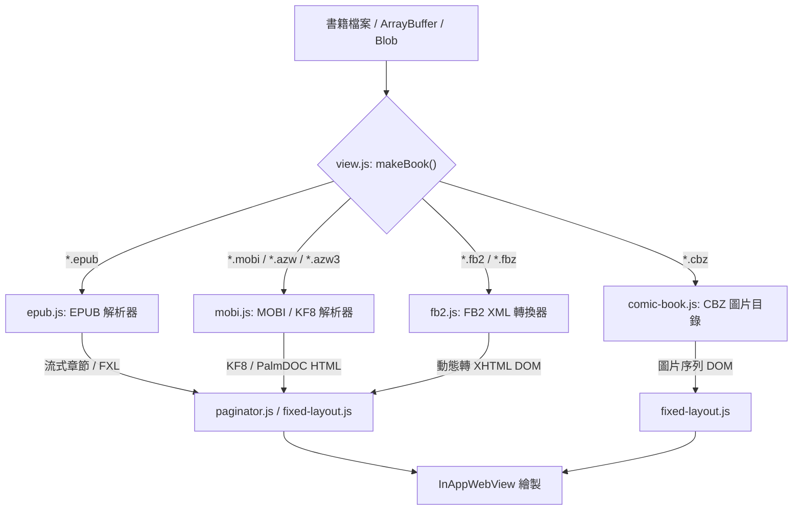
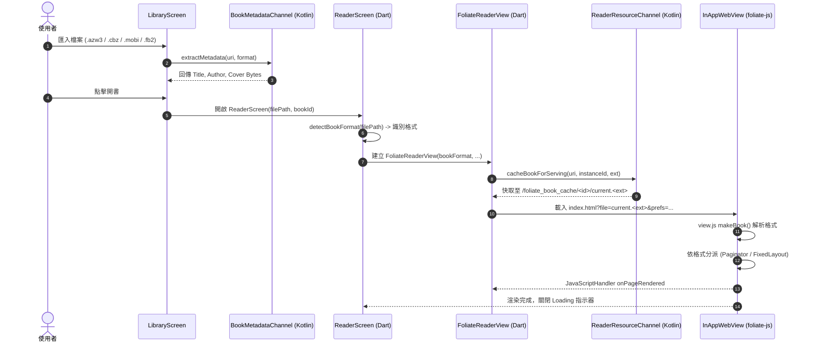

# foliate-js 多格式支援技術研究報告：MOBI, KF8 (AZW3), FB2, CBZ

> **專案定位**：elinkBook — 專注於「直排繁體中文排版」與「E-Ink 電子墨水螢幕最佳化」的 Flutter Android 電子書閱讀器。  
> **核心目標**：評估現行閱讀核心 `readest/foliate-js`（運行於 `flutter_inappwebview`）在現有 EPUB 與 PDF 基礎上，擴充支援 **MOBI**、**KF8 (AZW3)**、**FB2**、**CBZ** 格式的架構可行性、改進路徑、優缺點與適合度。

---

## 1. 執行摘要 (Executive Summary)

`foliate-js`（由 johnfactotum 開發、readest 進行現代化維護）本質上是一個**高度模組化且支援多格式**的客戶端電子書渲染引擎。其內部架構將「格式解析（Book Parser）」與「頁面排版渲染（Paginator / Fixed Layout）」徹底解耦。

本研究針對 elinkBook 專案現狀與核心價值進行了全方位評估：
1. **技術可行性**：**100% 可行**。`foliate-js` 官方原生已具備 `mobi.js`、`fb2.js` 與 `comic-book.js` 模組，現有 `view.js` 的 `makeBook()` 工廠函式已內建各格式的偵測與分派邏輯。
2. **格式適合度與優先順序**：
   - **KF8 (AZW3)**：⭐⭐⭐⭐⭐（**強烈推薦 / 優先度最高**）。具備現代 HTML5/CSS3 特性，對繁體中文直排（`writing-mode: vertical-rl`）、字型替換與自訂樣式支援完美，台灣與華文 Kindle 書籍資源豐富。
   - **CBZ (漫畫壓縮檔)**：⭐⭐⭐⭐（**推薦 / 優先度高**）。E-Ink 設備閱讀漫畫為廣大使用者的剛性需求；走 `fixed-layout.js` 渲染，實作單純且與流式文字互不干擾。
   - **MOBI (舊版 PalmDOC)**：⭐⭐⭐（**建議支援 / 優先度中**）。舊有資源廣泛，但因 HTML 3.2 規範老舊、無 CSS 支援，直排與進階樣式需靠外層強制覆寫，效果次於 KF8/EPUB。
   - **FB2 (FictionBook)**：⭐⭐（**技術可行但價值低 / 優先度低**）。東歐/俄語系格式，繁體中文市場極罕見，可作次要補充。

---

## 2. Upstream foliate-js 格式解析引擎深度剖析

`foliate-js` 透過統一的 **Book Interface** 抽象化各類電子書格式，讓上層的排版渲染器（`paginator.js` / `fixed-layout.js`）無需關心底層檔案來源。



### 2.1 MOBI / KF8 (`mobi.js`)

`mobi.js` 同時處理兩代格式：**舊版 MOBI (MobiPocket 6 / PalmDOC)** 與 **KF8 (Kindle Format 8 / AZW3)**。

1. **底層結構解析**：
   - 讀取 Palm Database (PDB) Record 結構與 PalmDOC / MOBI / EXTH Header。
   - 提取 Metadata（EXTH 欄位：`100` 作者、`503` 標題、`201` 封面位移、`524` 語系、`527` 翻頁方向等）。
2. **解壓縮機制**：
   - **MOBI**：實作純 JS 版 PalmDOC LZ77 演算法與 HUFF/CDIC 霍夫曼字典解壓縮（`huffcdic`）。
   - **KF8 (AZW3)**：依賴 `vendor/fflate.js`（提供 `unzlibSync`）解開 Deflate/zlib 串流。
3. **章節還原與分段 (Section Splitting)**：
   - KF8 本質上是封裝在 PDB 結構中的 EPUB3 資源。`mobi.js` 會讀取 `SKEL`（骨架 HTML）與 `FRAG`（片段），組裝出完整的 XHTML 與 CSS 樣式表。
   - 將龐大的 raw markup 依章節/片段切割為獨立的 sections，交由 `paginator.js` 分段載入，維持高效能與低記憶體佔用。

### 2.2 FB2 (`fb2.js`)

FictionBook 2.0/2.1 是一個基於純語意 XML 的電子書標準（常見於俄國與東歐開源社區）。

1. **XML 語意轉換 (`FB2Converter`)**：
   - `fb2.js` 透過 DOMParser 解析 XML 結構。
   - 將語意標籤對應轉換為標準 XHTML DOM 節點：
     - `<p>` → `<p>`、`<strong>` → `<strong>`、`<emphasis>` → `<em>`
     - `<title><p>` → `<header><h1>`、`<subtitle>` → `<h2>`
     - `<poem><stanza><v>` → `<blockquote><p><br>`
     - `<cite>` / `<epigraph>` → `<blockquote>`
2. **內嵌資源處理**：
   - FB2 的圖片通常以 Base64 編碼存於檔案底部的 `<binary id="...">` 標籤中。
   - `FB2Converter.getImageSrc()` 會自動將 `#id` 轉換為 `data:<mime>;base64,...` 或 Blob URL。
3. **壓縮格式 (`.fbz` / `.fb2.zip`)**：
   - 搭配現有的 `vendor/zip.js`，自動解壓縮並讀取內部的 `.fb2` 主文件。

### 2.3 CBZ (`comic-book.js`)

CBZ 是最普遍的漫畫歸檔格式（本質為包含圖片的 ZIP 壓縮檔）。

1. **圖片序列化載入**：
   - 透過 `vendor/zip.js` 遍歷壓縮檔中的條目。
   - 過濾標準圖片副檔名（`.jpg`, `.jpeg`, `.png`, `.gif`, `.webp`, `.avif`, `.svg` 等），依檔名字母順序進行自然排序（Natural Sort）。
   - 將每一張圖片包裝成獨立的最小 HTML 容器：`<!DOCTYPE html><html><body style="margin:0"></body></html>`。
2. **詮釋資料讀取 (`ComicInfo.xml`)**：
   - `comic-book.js` 支援 Anansi Project 漫畫標準，可自動解析 ZIP 根目錄下的 `ComicInfo.xml`，提取系列名稱（Series）、集數（Number）、書名（Title）、作者（Writer）與出版年（Year）。
3. **固定版面渲染 (`fixed-layout.js`)**：
   - 輸出為固定頁面序列，與 EPUB Fixed Layout (FXL) 走完全相同的渲染管線，支援單頁/雙頁排版。

---

## 3. elinkBook 現有架構落差分析 (Gap Analysis)

在 elinkBook 專案中，目前的 Foliate-js 整合是專為 EPUB（含流式與 FXL）設計的。若要擴充其他格式，存在以下斷點需要改造：

| 層級 | 模組 / 檔案 | 目前現況 | 擴充所需改動 |
| :--- | :--- | :--- | :--- |
| **Frontend Assets** | `app/android/app/src/main/assets/foliate/` | 僅包含 `epub.js`, `view.js`, `paginator.js`, `fixed-layout.js`, `vendor/zip.js` 等 | 需補齊 **`mobi.js`**、**`fb2.js`**、**`comic-book.js`** 與 **`vendor/fflate.js`** |
| **Frontend Entry** | `main.js` (`openBook`) | 寫死載入 `'https://appassets.androidplatform.net/book/current.epub'` | 改為從 URL query string 取得檔名（如 `current.azw3`, `current.cbz`），以利 `makeBook()` 判斷格式 |
| **Native 快取** | `ReaderResourceChannel.kt` | `copyToCache` 固定寫死產生 `current.epub` 暫存檔 | 需依據原始檔案副檔名，寫入 `current.<ext>`，確保 WebView 請求正確路徑 |
| **Metadata 提取** | `BookMetadataChannel.kt` | 僅支援 `epub` (Readium) 與 `pdf` (PdfRenderer) | 需擴充 MOBI/AZW3/CBZ/FB2 的標題、作者與封面提取（可於 Kotlin 端輕量提取或調用 Readium CbzParser） |
| **Dart 領域模型** | `book_format.dart` & `library_enums.dart` | `enum BookFormat { epub, pdf, unknown }` | 擴充為 `epub`, `pdf`, `mobi`, `azw3`, `fb2`, `cbz`, `unknown`；更新副檔名偵測函式 |
| **閱讀器分派** | `reader_screen.dart` | `detectBookFormat` 分流 `FoliateEpubReaderView` 與 `PdfReaderView` | 將 `mobi`, `azw3`, `fb2`, `cbz` 統一導向 Foliate 閱讀核心（通用 `FoliateReaderView`） |
| **偏好設定 UI** | `ReaderSettingsSheet` | 僅有 EPUB 流式排版（字型/行高/直排）與 FXL 設定 | 區分「文字流式格式」（EPUB/AZW3/MOBI/FB2）與「漫畫格式」（CBZ），CBZ 需提供專屬控制面板（翻頁方向、雙頁） |

---

## 4. 全鏈路實作方案與架構設計

### 4.1 端到端資料流架構



### 4.2 各層具體實作步驟

#### Step 1: 前端資產與 Foliate JS 調整
1. 從 upstream `readest/foliate-js`（或 `johnfactotum/foliate-js`）複製以下檔案至 `app/android/app/src/main/assets/foliate/`：
   - `mobi.js`
   - `fb2.js`
   - `comic-book.js`
   - `vendor/fflate.js`
2. **相容性檢查 (ES Compat)**：
   - 執行本專案既有的 `node app/tool/check_foliate_es_compat.js`，確認新增的 JS 模組不包含 ES2021+ 語法（如 `??=`、選用鏈結等在舊版 Chromium 83 會報錯的語法），必要時於 `foliate_epub_reader_view.dart` 的 `_esCompatPolyfillJs` 補強 polyfill。
3. **`main.js` 開書路徑動態化**：
   ```javascript
   // main.js 修改
   const bookFileName = params.get('bookFileName') || 'current.epub'
   async function openBook() {
     try {
       const book = await makeBook(`https://appassets.androidplatform.net/book/${bookFileName}`)
       // ... 既有 writing-mode 與 relocate 邏輯 ...
     }
   }
   ```

#### Step 2: Android Native 資源快取與詮釋資料 (Kotlin)
1. **`ReaderResourceChannel.kt`**：
   - 修改 `cacheBookForServing` 接收 `extension` 參數（例如 `"azw3"`、`"cbz"`）。
   - 快取目標檔案由 `current.epub` 改為 `current.$extension`。
2. **`BookMetadataChannel.kt`（詮釋資料提取）**：
   - **CBZ**：使用 Java `ZipFile` 讀取 `ComicInfo.xml`（提取標題/作者），並讀取排序後的第一張圖片輸出為封面 Bitmap；或直接使用 Readium 的 `CbzParser`。
   - **AZW3 / MOBI**：在 Kotlin 實作輕量 PDB/EXTH 讀取器（僅需讀取前數個 Record 即可獲取 Title 與 Cover Offset 圖片），避免載入完整檔案。
   - **FB2**：透過 Android 內建 `XmlPullParser` 解析 `<description><title-info>` 標籤，並解碼 `<binary id="cover.jpg">` 的 Base64 封面。

#### Step 3: Dart 領域模型與閱讀器整合
1. **擴充 `BookFormat`**：
   ```dart
   enum BookFormat { epub, pdf, mobi, azw3, fb2, cbz, unknown }

   BookFormat detectBookFormat(String path) {
     final lower = path.toLowerCase();
     if (lower.endsWith('.epub')) return BookFormat.epub;
     if (lower.endsWith('.pdf')) return BookFormat.pdf;
     if (lower.endsWith('.azw3') || lower.endsWith('.kf8')) return BookFormat.azw3;
     if (lower.endsWith('.mobi') || lower.endsWith('.azw')) return BookFormat.mobi;
     if (lower.endsWith('.cbz')) return BookFormat.cbz;
     if (lower.endsWith('.fb2') || lower.endsWith('.fbz')) return BookFormat.fb2;
     return BookFormat.unknown;
   }
   ```
2. **重構 `FoliateEpubReaderView` 為通用 `FoliateReaderView`**：
   - 傳遞 `format` 與對應的 `bookFileName`（例如 `current.azw3`）。
   - 保留現有完整的 JS Bridge 契約（`onPageRendered`, `onLocatorChanged`, `onTableOfContentsReady`, `onError`, `onSelectionChanged`）。

#### Step 4: 閱讀器介面與偏好控制分流 (`ReaderScreen`)
1. **文字流式書籍 (EPUB, AZW3, MOBI, FB2)**：
   - 共用現有的 `ReaderSettingsSheet`（字型選擇、字級大小、行高、直橫排切換、邊距、E-Ink 模式）。
   - 依舊支援劃線（Highlights）、註記（Notes）與章節目錄（TOC）。
2. **漫畫固定版面書籍 (CBZ)**：
   - 停用文字相關偏好（字型/字級/行高/直排設定反灰或隱藏）。
   - 啟用漫畫專屬設定面板（比照 FXL Settings Sheet）：
     - **閱讀方向**：日漫（右至左 RTL 翻頁）／ 美漫或條漫（左至右 LTR 翻頁）。
     - **版面配置**：單頁模式 ／ 雙頁合併（Landscape 雙頁展開）。
     - **頁面適配**：等比縮放適配螢幕寬度/高度。

---

## 5. 各格式深度相容性與優缺點分析

### 5.1 KF8 (AZW3) — 評分：⭐⭐⭐⭐⭐ (極佳)

*   **相容性與直排表現**：
    - KF8 架構即為 HTML5+CSS3。在 `foliate-js` 中解出章節後，完全沿用與 EPUB 相同的 `paginator.js` 管道。
    - **直排繁中**：完美相容！CSS `writing-mode: vertical-rl` 注入立即生效，標點符號旋轉、避頭尾與字型替換（如注入思源黑體/宋體）表現與 EPUB 完全一致。
    - **劃線與註記**：支援。解出之 DOM 結構具備完整節點路徑，可產生 CFI 定位點並由 `overlayer.js` 繪製。
*   **優點**：
    - 繁體中文市場（尤其是自 Kindle 商店購買匯出或 Calibre 轉檔者）流通量極大。
    - 排版豐富度高，支援內嵌 CSS 樣式與多欄。
*   **缺點 / 風險**：
    - 僅支援 DRM-Free 檔案（若有 Amazon DRM 需防呆提示「受保護檔案無法開啟」）。
    - 開書時需解壓多個片段，解壓大檔需 `fflate.js` 消耗額外少許 CPU。

### 5.2 CBZ (漫畫壓縮檔) — 評分：⭐⭐⭐⭐ (優秀)

*   **相容性與閱讀表現**：
    - 採用 `fixed-layout.js`（本專案已在 Epic 17/20 累積了 FXL 固定版面的支援經驗）。
    - 圖片以原生解析度載入，完全避免文字排版的繁中直橫排問題。
*   **優點**：
    - 滿足 E-Ink 大螢幕閱讀漫畫的剛性需求。
    - 檔案結構單純（純圖片 ZIP），解析速度快，開書延遲低。
    - `comic-book.js` 支援 `ComicInfo.xml`，能自動辨識作者與系列集數。
*   **缺點 / 風險**：
    - **記憶體控制**：高解析度漫畫圖片在 WebView 內連續載入可能佔用較多記憶體。`comic-book.js` 已有 `URL.revokeObjectURL` 機制，需確保換頁時正常釋放。
    - **功能受限**：不支援文字選取、劃線與字型調整；劃線與字型按鈕需適當在 UI 上隱藏。

### 5.3 MOBI (舊版 PalmDOC) — 評分：⭐⭐⭐ (普通 / 可支援)

*   **相容性與直排表現**：
    - MOBI 格式是 2000 年代初期的產物，基於極精簡的 HTML 3.2 子集，本身不包含任何現代 CSS。
    - **直排繁中**：`foliate-js` 將其文字內容包裹於現代 HTML 容器中，因此透過外層注入 `html, body { writing-mode: vertical-rl !important; }` **依然可以呈現直排**。但在遇到複雜排版、古老標籤（如 `<mbp:pagebreak>`、自訂字元實體）時，版面工整度不如 EPUB/KF8。
    - **目錄與劃線**：MOBI 沒有標準 EPUB CFI，其目錄多為書末/書首的純 HTML 超連結清單；劃線定位精度較低。
*   **優點**：
    - 歷史悠久，老舊電子書、論壇資源相容性高。
*   **缺點**：
    - 排版能力原始，缺乏富文字樣式。
    - 解碼邏輯需依賴古老的 PalmDOC LZ77 / HUFF 演算法，效能較一般純文字略慢。

### 5.4 FB2 (FictionBook) — 評分：⭐⭐ (尚可 / 價值較低)

*   **相容性與直排表現**：
    - 透過 `fb2.js` 轉成語意 XHTML DOM，外層套用直排 CSS 可以正常工作。
    - 圖片內嵌於 XML 造成檔案體積膨脹，解析大檔 XML DOM 時稍微耗時。
*   **優點**：
    - 結構嚴謹，章節結構非常標準。
*   **缺點**：
    - **市場需求極低**：台灣與繁體中文出版界幾乎沒有任何 FB2 資源，實用價值有限。

---

## 6. 功能支援度總覽矩陣 (Feature Support Matrix)

| 格式 | 解析模組 | 渲染核心 | 直排繁中支援 | 自訂字型 | 目錄 (TOC) | 劃線 / 筆記 | 閱讀進度 (CFI) | 建議優先順序 |
| :--- | :--- | :--- | :---: | :---: | :---: | :---: | :---: | :---: |
| **EPUB** *(現有)* | `epub.js` | `paginator.js` / FXL | ✅ **完美** | ✅ 支援 | ✅ 完整 | ✅ 完整 | ✅ 標準 CFI | — (已完成) |
| **KF8 (AZW3)** | `mobi.js` + `fflate.js` | `paginator.js` | ✅ **完美** | ✅ 支援 | ✅ 完整 | ✅ 支援 | ✅ 支援 | **P1 (最優先)** |
| **CBZ** | `comic-book.js` | `fixed-layout.js` | ➖ *不適用(圖片)*| ➖ *不適用* | ⚠️ *依頁碼/XML*| ❌ *不支援* | ✅ 頁碼進度 | **P1 (最優先)** |
| **MOBI** | `mobi.js` | `paginator.js` | ⚠️ *基本直排* | ⚠️ *全域覆寫* | ⚠️ *HTML導航* | ⚠️ *簡易定位*| ⚠️ *Offset進度*| **P2 (次要)** |
| **FB2** | `fb2.js` | `paginator.js` | ⚠️ *基本直排* | ✅ 支援 | ✅ 完整 | ✅ 支援 | ✅ DOM CFI | **P3 (可選)** |

---

## 7. 結論與演進實作建議 (Decision & Recommendation)

### 7.1 核心結論
增加 MOBI, KF8 (AZW3), FB2, CBZ 格式的支援在技術上完全可行，且因為 `foliate-js` 已經將解析器模組化，**不需要引入新的閱讀引擎或切換底層架構**，只要在現有的 `flutter_inappwebview` + `foliate-js` 上進行資產補齊與管線泛化即可達成。

### 7.2 建議實施路徑 (3 階段規劃)

1. **第一階段 (Phase 1) — 核心擴充：KF8 (AZW3) + CBZ 支援**
   - **理由**：KF8 與 CBZ 是繁中與 E-Ink 族群價值最高的格式。
   - **工作項目**：
     - 引入 `mobi.js`、`comic-book.js` 與 `vendor/fflate.js`。
     - 改造 `ReaderResourceChannel.kt` 與 `main.js` 支援動態副檔名。
     - 擴充 `BookFormat.azw3` 與 `BookFormat.cbz`。
     - 在 `ReaderScreen` 針對 CBZ 開放漫畫模式（RTL 日漫右翻與雙頁顯示）。
2. **第二階段 (Phase 2) — 歷史相容：MOBI 支援**
   - **工作項目**：
     - 開放 `.mobi` 副檔名關聯。
     - 驗證老舊 MOBI 的目錄解析與直排 CSS 強制注入效果。
3. **第三階段 (Phase 3) — 次要格式：FB2 支援 (可選)**
   - **工作項目**：
     - 引入 `fb2.js`，補齊 XML 封面與 Metadata 解析。

### 7.3 風險與防範 (Risk & Mitigation)
- **Chromium / Android System WebView 版本相容性**：
  - 新引入的 `mobi.js` / `comic-book.js` / `fflate.js` 必須經過 `check_foliate_es_compat.js` 掃描，避免在舊 E-Ink 設備（如 Chromium 83）因 ES2021+ 語法導致白畫面。
- **CBZ 記憶體控制**：
  - 超大解析度漫畫解壓縮在 WebView 內時，需注意 Android WebView OOM 崩潰問題，應確保每次換頁皆觸發 `URL.revokeObjectURL()` 釋放前頁 Blob 資源。
