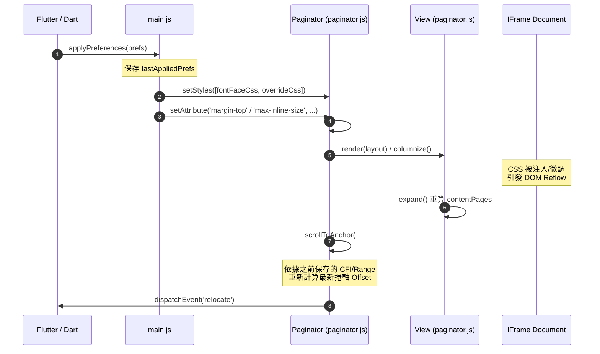
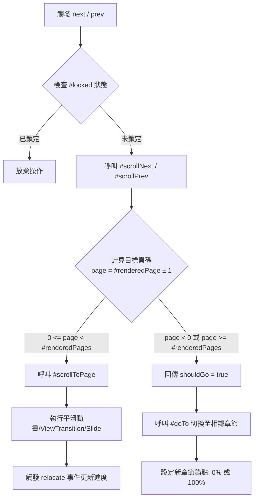

# foliate-js 精準頁次計算與直排排版/動態樣式切換技術研究報告

## 1. 摘要與核心結論 (Executive Summary)

`foliate-js`（由 [readest/foliate-js](https://github.com/readest/foliate-js) 維護）作為現代 Web/EPUB 渲染引擎，其頁次計算與翻頁機制與傳統固定頁數引擎（如將全書轉為 PDF 或事先切塊寫死頁碼）有根本上的不同。`foliate-js` 採用 **純 DOM / CSS Multi-Column 驅動的實體重排版（Reflowable Layout）** 模式。

### 核心結論：
1. **動態頁數計算 (Dynamic Page Count)**：頁碼與總頁數不是靜態屬性，而是由 CSS Column 規格（`column-width`、`column-gap`）結合章節 HTML 內容的實質 DOM 佈局尺寸（`getBoundingClientRect()`）即時計算得出（`contentPages = Math.ceil(contentSize / columnSize)`）。
2. **樣式變更與位置錨定 (Layout Re-anchoring)**：當切換直排 (`vertical-rl`)、放大字級 (`font-size`)、變更行高 (`line-height`) 或邊距 (`margin`) 時，系統先透過 `getVisibleRange()`（利用 `TreeWalker`）記錄當前可視範圍的 **CFI (Canonical Fragment Identifier)** 或 **DOM Range (`#anchor`)**；樣式生效並引發 DOM Reflow (`expand()`) 後，再經由 `scrollToAnchor()` 將該 DOM 節點最新的座標映射回捲軸位置，實現「無論排版如何劇變，當前閱讀位置精準維持不變」的特性。
3. **直排模式 (`vertical-rl`) 專屬適配**：
   - **座標軸向轉置**：在直排模式下，CSS 分欄沿縱向（`height`）堆疊，`getRectMapper()` 將 DOM Rect 的 `top/bottom` 轉置為分頁邏輯上的 `left/right`。
   - **雙階段手勢與動畫 (`slideTurnAnimation`)**：直排書籍的文字閱讀方向為右至左（橫向），但 CSS 捲軸為縱向 (`scrollTop`)。`foliate-js` 透過自訂的雙階段動畫與手勢拖曳偏移 (`dragTranslateX`)，解耦了 DOM 捲軸與視覺滑動方向，實現極致順暢的直排翻頁體驗。
4. **無縫跨章節連續導覽 (Multi-View Continuous Navigation)**：`Paginator` 透過多 `View` 容器（`<iframe>`）維護當前章節與前後預載章節。當章節內翻頁溢出（超出 `[0, pages - 1]`）時，會自動切換至相鄰章節，並將錨點設定於新章節的 0%（下一章）或 100%（上一章末尾），搭配 `Prepend` 捲軸補償，確保閱讀不卡頓。

---

## 2. foliate-js 頁次計算核心機制 (Core Page Calculation)

### 2.1 CSS Multi-Column 動態分欄與 DOM 渲染

在 `paginator.js` 中，每個 EPUB 章節（Section）被載入至獨立的 `<iframe>`（封裝於 `View` 類別內）。`Paginator` 透過對 iframe 內的 `document.documentElement` 設定 CSS Column 屬性來完成分頁：

```javascript
// paginator.js - View.columnize()
setStylesImportant(doc.documentElement, {
    'box-sizing': 'border-box',
    'column-width': `${Math.trunc(columnWidth)}px`,
    'column-gap': vertical ? `${(marginTop + marginBottom) * 1.5}px` : `${horizontalColumnGap}px`,
    'column-fill': 'auto',
    ...(vertical ? { 'width': `${width}px` } : { 'height': `${height}px` }),
    'overflow': 'hidden',
    '-webkit-line-box-contain': 'block glyphs replaced',
})
```

* **橫排 (`horizontal-tb`)**：`height` 固定為容器高度，CSS Column 沿 X 軸（`width`）向右/左延伸。
* **直排 (`vertical-rl`)**：`width` 固定為容器寬度，CSS Column 沿 Y 軸（`height`）向下方延伸。

### 2.2 頁數 (`contentPages`) 與頁面尺寸 (`columnSize`) 的數學計算

`View.expand()` 是計算章節總頁數與調整容器尺寸的核心函式：

```javascript
// paginator.js - View.expand()
if (this.#column) {
    const side = this.#vertical ? 'height' : 'width'
    const otherSide = this.#vertical ? 'width' : 'height'
    const contentRect = this.#contentRange.getBoundingClientRect()
    const rootRect = documentElement.getBoundingClientRect()

    const contentStart = this.#vertical ? 0
        : this.#rtl ? rootRect.right - contentRect.right : contentRect.left - rootRect.left
    const contentSize = (contentStart + contentRect[side]) * this.#zoom

    // 單頁/單欄尺寸 (Single column size)
    const columnSize = this.#size / this.#columnCount
    // 計算該章節在當前排版條件下的實質總頁數
    const pageCount = Math.ceil(contentSize / columnSize)
    this.#contentPages = pageCount
    const expandedSize = pageCount * columnSize

    // 設定 iframe 及外層 View 容器長度
    this.#iframe.style[side] = `${expandedSize}px`
    this.#element.style[side] = `${expandedSize}px`
    documentElement.style[side] = `${columnSize}px`
}
```

* **`this.#size`**：在橫排時為容器總寬度（`width`），直排時為容器總高度（`height`）。
* **`this.#columnCount`**：單畫面顯示的欄數（如單頁模式為 1，雙頁模式為 2）。
* **`columnSize`**：單一頁面（Column）所佔用的邏輯長度。
* **`pageCount`**：`Math.ceil(contentSize / columnSize)` 確保無條件進位算出當前章節的實質頁數。

### 2.3 `getVisibleRange()` 與 TreeWalker 可視範圍偵測

為了得知「目前畫面上正在顯示哪一段文字/哪一頁」，`foliate-js` 不依賴粗暴的捲軸百分比，而是使用 DOM `TreeWalker` 來精準搜尋位於當前 Viewport 視窗邊界內的文字節點：

```javascript
// paginator.js - getVisibleRange()
const acceptNode = node => {
    const name = node.localName?.toLowerCase()
    if (name === 'script' || name === 'style') return FILTER_REJECT
    if (node.nodeType === 1 && node.hasAttribute?.('cfi-inert')) return FILTER_REJECT

    if (node.nodeType === 1) {
        const { left, right } = mapRect(node.getBoundingClientRect())
        if (right < start || left > end) return FILTER_REJECT
        if (left >= start && right <= end) return FILTER_ACCEPT
    } else {
        if (!node.nodeValue?.trim()) return FILTER_SKIP
        const range = doc.createRange()
        range.selectNodeContents(node)
        const { left, right } = mapRect(range.getBoundingClientRect())
        if (right >= start && left <= end) return FILTER_ACCEPT
    }
    return FILTER_SKIP
}
```

* **二分搜尋法 (`bisectNode`)**：確定第一個與最後一個可視節點後，利用二分搜尋精準找到跨越視窗邊界處的字元 Offset，建立出精準的 `Range`。

---

## 3. 排版變更時的頁數動態重算與位置持久化 (Layout Adjustments)

當使用者在閱讀器中執行下列操作時：
1. **切換直排 / 橫排 (`writingMode`)**
2. **放大 / 縮小字級 (`fontSize`)**
3. **變更行高 / 段落間距 (`lineHeight`, `paragraphSpacing`)**
4. **調整邊距 (`marginTop`, `marginBottom`, `marginLeft`, `marginRight`)**
5. **切換單欄 / 雙欄 (`columnMode`)**

`foliate-js` 透過一套完整的生命週期確保頁數精準重新計算且位置不丟失：



### 3.1 樣式動態注入與 CSS 覆蓋 (`buildOverrideCss` & `setStyles`)

在 `main.js` 的 `buildOverrideCss(prefs)` 中，排版變更會轉譯為具備 `!important` 的 CSS 規則：

```javascript
// main.js - buildOverrideCss()
if (prefs.writingMode === 'vertical') {
    rules.push('html, body { writing-mode: vertical-rl !important; }')
}
if (prefs.fontFamily) {
    rules.push(`${selector} { font-family: '${prefs.fontFamily}' !important; }`)
}
if (typeof prefs.fontSize === 'number') {
    rules.push(`html { font-size: ${prefs.fontSize * 100}% !important; }`)
}
if (typeof prefs.lineHeight === 'number') {
    rules.push(`${selector} { line-height: ${Math.max(0.8, prefs.lineHeight)} !important; }`)
}
```

這些樣式透過 `Paginator.setStyles()` 注入到所有已載入的 View Document 中，觸發瀏覽器的 CSS 重新算圖與排版（Reflow）。

### 3.2 視窗與 DOM 尺寸監聽 (`ResizeObserver` & `fontReady`)

為了捕捉非同步發生的字型載入或視窗尺寸變化，`View` 內部與 `Paginator` 外層皆掛載了 `ResizeObserver`：

```javascript
// paginator.js - View.constructor
#observer = new ResizeObserver(() => this.expand())

// main.js - hostResizeObserver
const hostResizeObserver = new ResizeObserver(() => {
    if (resizeDebounceTimer) clearTimeout(resizeDebounceTimer)
    resizeDebounceTimer = setTimeout(() => {
        window.applyPreferences(lastAppliedPrefs)
    }, 200)
})
```

當字型載入完成（`doc.fonts.ready`）或視窗旋轉時，會自動調用 `expand()`，重新測量 `contentRange.getBoundingClientRect()`，進而即時更新 `contentPages`。

### 3.3 基於 CFI / Range 的錨定與捲軸精準定位 (`scrollToAnchor`)

這是在排版條件改變後，閱讀位置 **不迷失** 的最關鍵機制：

1. **滾動/排版前**：`Paginator.#afterScroll` 不斷更新內部 `#anchor`（當前畫面上第一個可見文字的 DOM Range）。
2. **排版改變後**：`Paginator.render()` 在所有 View 完成重算後，呼叫 `this.#scrollToAnchor(this.#anchor)`。
3. **座標重新映射**：

```javascript
// paginator.js - #scrollToAnchor()
const rects = uncollapse(anchor)?.getClientRects?.()
if (rects) {
    const rect = Array.from(rects).find(r => r.width > 0 && r.height > 0) || rects[0]
    await this.#scrollToRect(rect, reason)
}
```

`#scrollToRect` 會將該 Range 最新算出的 `DOMRect` 經由 `#getRectMapper()` 轉換，計算出新的 `containerOffset`，並呼叫 `#scrollToPage(Math.floor(containerOffset / this.size))`。因此，即便字體從 100% 放大到 200% 導致總頁數翻倍，閱讀器依然能精準定位到原本正在閱讀的那一個句子！

---

## 4. 直排閱讀 (`vertical-rl`) 的特殊計算與翻頁適配 (Vertical Writing Adaptation)

直排繁體中文/日文（`writing-mode: vertical-rl`）在 Web 渲染技術上有其特殊的幾何特性：

### 4.1 軸向轉置與 `getDirection()` 判斷

`paginator.js` 中的 `getDirection(doc)` 會解析 HTML Body 或其子元素的 Computed Style：

```javascript
// paginator.js - getDirection()
const vertical = writingMode === 'vertical-rl' || writingMode === 'vertical-lr'
const rtl = writingMode === 'vertical-rl' || doc.body.dir === 'rtl' || direction === 'rtl'
return { vertical, rtl }
```

* **`vertical: true`**：表示文章為直排，區塊延伸軸（Block Axis）變為水平向，行進軸（Inline Axis）變為垂直向。
* **`rtl: true`**：在 `vertical-rl` 模式下，文字行由右向左排列，被認定為廣義的 RTL 進度。

### 4.2 座標系統映射與 Rect Mapper (`getRectMapper`)

由於瀏覽器在直排模式下的原生座標系與分頁方向不同，`#getRectMapper()` 提供了一層抽象，將 Rect 統一轉化為邏輯上的 LTR 水平座標：

```javascript
// paginator.js - #getRectMapper()
return this.#vertical
    ? ({ top, bottom }) => ({ left: top, right: bottom })
    : this.#rtl
        ? ({ left, right }) => ({ left: viewSize - right, right: viewSize - left })
        : f => f
```

對於直排，DOM 的 `top` 與 `bottom` 被映射為邏輯分頁計算上的 `left` 與 `right`。這使得後續的頁碼搜尋與可視範圍計算（`getVisibleRange`）無需針對直排編寫兩套完全不同的數學邏輯。

### 4.3 直排獨立的雙階段滑動動畫 (`slideTurnAnimation` & `dragTranslateX`)

在直排模式下，CSS Column 沿 Y 軸 (Vertical Scroll Axis) 延伸。然而，讀者的翻頁手勢與視覺期望是 **沿 X 軸（左右）滑動**。如果直接對 `scrollTop` 做動畫，畫面會呈現上下滑動，嚴重違背直排閱讀直覺。

`foliate-js` 為此設計了 `slideTurnAnimation`（兩階段水平飛入/飛出動畫）與手勢跟隨 `dragTranslateX`：

```javascript
// paginator.js - slideTurnAnimation()
// Phase 1: 舊頁面沿 X 軸加速飛出 Viewport (translateX)
setAll(`transform ${exitDuration}ms cubic-bezier(0.55, 0, 1, 0.45)`, `translateX(${exitTarget}px)`)

setTimeout(() => {
    // 兩階段中點：當舊頁面完全飛出畫面外時，靜默切換 scrollTop 到新頁面位置
    element[scrollProp] = endValue
    onSwap?.()
    setAll('none', `translateX(${-exitSign * width}px)`)
    element.getBoundingClientRect()
    
    // Phase 2: 新頁面從另一側沿 X 軸減速飛入到位
    setAll(`transform ${half}ms cubic-bezier(0, 0.55, 0.45, 1)`, 'translateX(0px)')
}, exitDuration + 10)
```

當使用者在直排模式下用手指左右拖曳時，`#onTouchMove` 會呼叫 `#dragBy(dx)`，透過修改所有 View 的 `transform: translateX(...)` 實現手勢即時跟隨。鬆手時，`snap()` 判斷拖曳距離與速度，決定觸發 `slideTurnAnimation` 進行翻頁或 `#settleDrag()` 歸位。

### 4.4 直排圖片與分欄上限適配

* **圖片尺寸約束 (`setImageSize`)**：直排時圖片的最大寬高度限制顛倒，`max-height` 設為 100%，`max-width` 設為 `width - (marginLeft + marginRight)`，避免圖片拉伸破版。
* **分欄上限修正 (`max-column-count`)**：`foliate-js` 內建分欄公式為 `maxColumnCount + (vertical ? 1 : 0)`。elinkBook 團隊在 `main.js` 中特別做了修正，當 `currentWritingMode === 'vertical'` 時，將 `max-column-count` 屬性動態設為 `'1'`，確保直排與橫排的有效上限一致為 2 欄，防止在某些長寬比特殊（如 ViWoods E-Ink 裝置）上直排字級被錯誤縮小。

---

## 5. 上下頁切換與跨章節導覽邏輯 (Page Navigation)

### 5.1 章節內翻頁流程

當使用者觸發下一頁（`next()`）或上一頁（`prev()`）時：



1. **`#scrollNext(distance)`**：
   ```javascript
   const page = this.#renderedPage + 1
   const pages = this.#renderedPages
   if (page >= pages) return true // 溢出章節邊界，通知外層需要跨章
   return this.#scrollToPage(page, 'page', true)
   ```
2. **`#scrollToPage(page)`**：將頁碼乘以單頁尺寸 (`this.size * page`) 算得出 target offset，再根據當前設定選擇 CSS Transform、`rafAnimateScroll` 或 `View Transitions API` 執行翻頁動畫。

### 5.2 跨章節無縫切換 (`#goTo` & `#adjacentIndex`)

當章節內翻頁回傳 `true`（代表已達當前章節邊界）時：

```javascript
// paginator.js - #turnPage()
const shouldGo = await (prev ? this.#scrollPrev() : this.#scrollNext())
if (shouldGo) {
    if (this.#fillPromise) await this.#fillPromise // 等待預載完成
    const sorted = this.#sortedViews
    const edgeIndex = prev ? sorted[0][0] : sorted[sorted.length - 1][0]
    await this.#goTo({
        index: this.#adjacentIndex(dir, edgeIndex),
        anchor: prev ? () => 1 : () => 0, // 上章末尾 100% 或 下章開頭 0%
    })
}
```

* **`#adjacentIndex(dir)`**：自動跳過 `linear: 'no'` 的非線性章節（如隱藏的 TOC 或輔助頁面）。
* **錨點定位**：若向前翻頁至上一章，`anchor` 傳入 `() => 1`（定位至該章節最末端文字）；若向後翻頁至下一章，`anchor` 傳入 `() => 0`（定位至開頭）。

### 5.3 多 View 預載與捲軸補償機制 (`#preloadNext` & Prepend Compensation)

為了確保翻頁不出現白塊，`Paginator` 會在背景預先繪製前後章節：

1. **`#preloadNext()`**：當剩餘可讀頁數低於 `minPages`（預設 5 頁）時，自動呼叫 `#loadAdjacentSection(nextIdx)`。
2. **Prepend 捲軸補償**：當向上滾動並在 DOM 前方插入上一章時，瀏覽器的原生的 `scrollTop` 錨定可能會失效。`foliate-js` 特別進行了捲軸修正：
   ```javascript
   if (isPrepend) {
       const addedSize = view.element.getBoundingClientRect()[this.sideProp]
       const correction = startBefore + addedSize - this.#renderedStart
       if (Math.abs(correction) > 0.5)
           this.containerPosition += (this.#vertical ? -1 : 1) * correction
   }
   ```
   這保證了在背景加載前一章時，當前可視區域的內容絕對不會發生視覺跳動。

---

## 6. 對 elinkBook Flutter 端整合的架構建議 (Architectural Insights)

基於上述分析，對 `elinkBook` (Flutter Android App) 的閱讀器整合提供以下架構建議：

1. **維持 Method Channel 的對稱非同步契約**：
   - 由於頁數與 CFI 計算全權由 JS 端 DOM 實時決定，Flutter 端不應嘗試在 Dart 側計算 EPUB 的實體頁碼。
   - 繼續維持 `onLocatorChanged` 與 `onPageRendered` 的事件推播機制，將 JS 端產生的 `location.current` (即 `pageIndex`) 與 `location.total` 作為 UI 頁碼顯示依據。
2. **直排排版偏好同步 (`applyPreferences`)**：
   - 當使用者在 Flutter 端調整字體、行高、邊距或切換直排時，應繼續經由 `InAppWebViewController.evaluateJavascript` 呼叫 `window.applyPreferences(prefs)`。
   - `foliate-js` 內建的 CFI 錨定機制會在 CSS 重排後自動將畫面恢復至原本對應的文字位置，Flutter 端無須額外重新計算捲軸位置。
3. **E-Ink 電子墨水屏適配**：
   - 在 E-Ink 模式下，應維持 `animated` 屬性的停用或設定 `eink` 屬性，促使 `foliate-js` 繞過 CSS/ViewTransition 動畫直接瞬切 `containerPosition`，減輕 E-Ink 螢幕殘影並提升翻頁響應速度。

---
*報告完成日期：2026-08-11*
*研究針對：readest/foliate-js (elinkBook 內建版本)*
