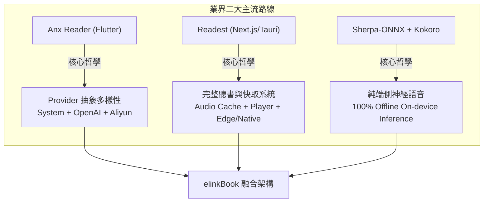
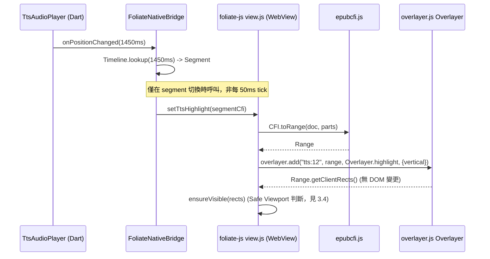
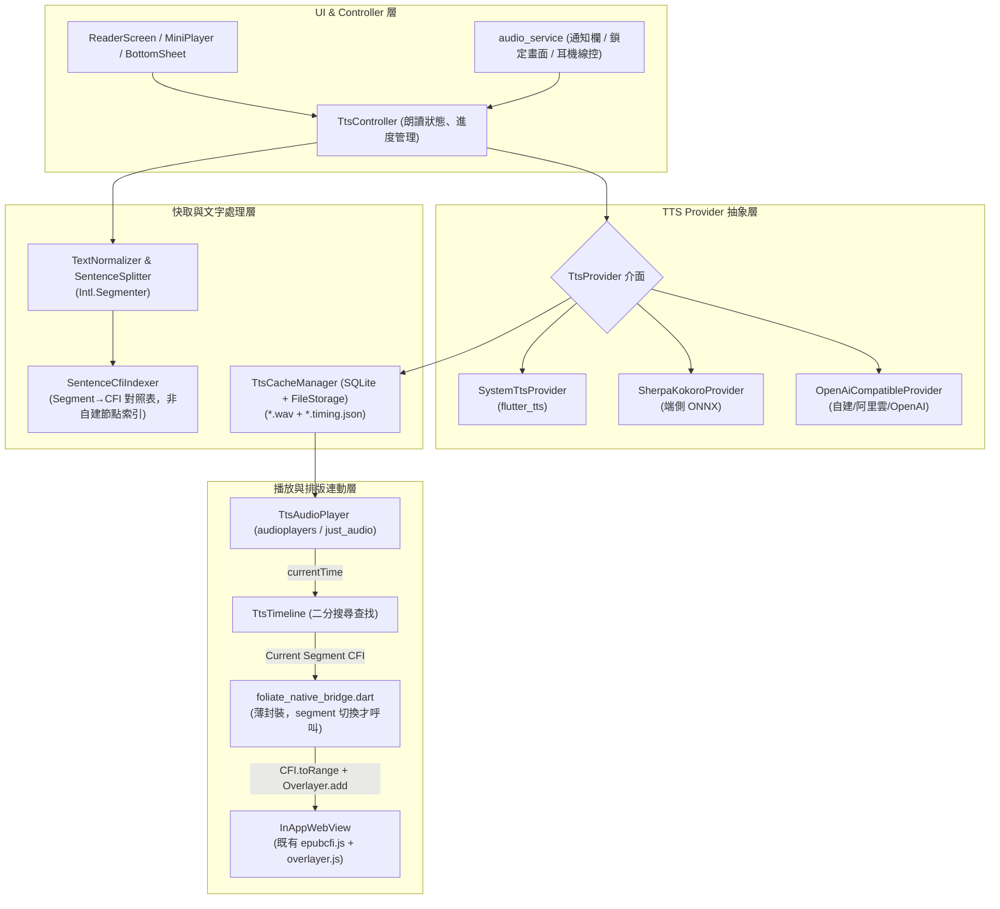
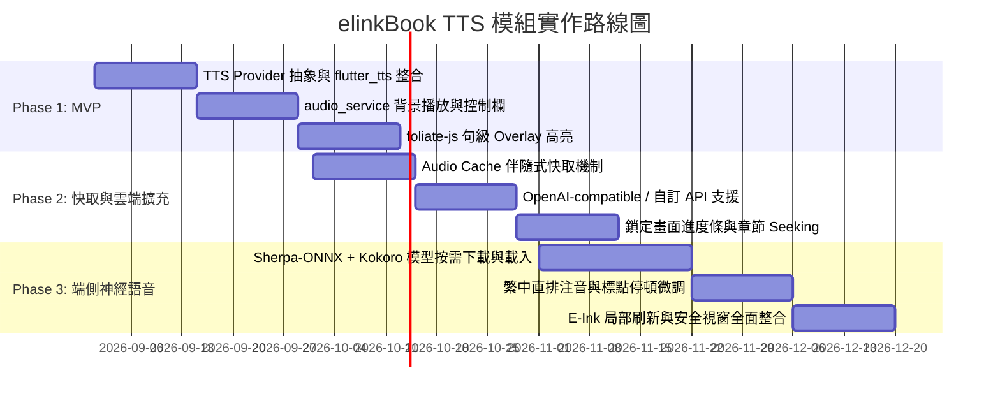

# elinkBook 語音朗讀 (TTS) 與同步高亮 (Read-along) 架構技術研究報告——Foliate 格式篇

> **專案定位**：elinkBook — 專注於「直排繁體中文排版」與「E-Ink 電子墨水螢幕最佳化」的 Flutter Android 電子書閱讀器。  
> **核心目標**：基於現有閱讀核心 `readest/foliate-js`（運行於 `flutter_inappwebview`），評估引入文字轉語音（TTS）與邊聽邊讀（Read-along）功能的技術方案、排版對齊策略、音訊快取機制與落地方案。
>
> **範圍界定**：本報告涵蓋所有「Foliate 格式」——EPUB（流式與 FXL）、KF8(AZW3)、CBZ、TXT、Markdown (MD)。依 `docs/adr/0023-multi-format-foliate-pipeline-txt-route-reversal.md`，`epic-11-multi-format-reader` 已全數完成：TXT／MD 匯入時落地合成為最小合法 EPUB3／XHTML 相容結構（`Book.filePath` 指向合成檔案），之後與一般 EPUB 走完全相同的渲染／分頁／CFI／劃線路徑，因此本報告的 EPUB 架構（CFI、SourceMap、Overlayer 高亮）**直接適用於 TXT／MD，不需要另一套定位系統**；CBZ 為圖像格式，無文字節點可供 TTS 朗讀，不在範圍內。**PDF 因座標系統（頁碼＋頁內 bounding box，而非 DOM/CFI）與本報告完全不同，另立獨立報告**：`docs/research/pdf_tts_integration_architecture_research.md`。

---

## 1. 執行摘要 (Executive Summary)

語音朗讀（Text-to-Speech, TTS）與音文字幕同步高亮（Read-along）已成為現代電子書閱讀器的核心進階功能。然而，在以 **「直排繁體中文」** 與 **「E-Ink 電子墨水螢幕」** 為核心差異化的 elinkBook 專案中，TTS 的引入面臨特殊的工程挑戰：
1. **雙座標系對齊**：CFI（靜態文件 DOM 錨點）與 TTS Word Timing（音訊時間軸）分屬完全不同的座標系，直接以 DOM 注入或每 50ms 搜尋節點會導致嚴重的效能瓶頸與 CFI 失效。此原則對 EPUB／KF8／TXT／MD 一體適用——TXT／MD 匯入時已落地合成為 EPUB3／XHTML 相容結構（見 ADR 0023），執行期與一般 EPUB 完全同一套 DOM／CFI 機制，不需要另外設計。
2. **繁中直排與注音排版**：中文無空格分詞，且直排（`writing-mode: vertical-rl`）包含行間標點、雙行夾註與 `<ruby>` 注音符號，需依賴精確的 CFI 與 DOM Range 轉換（本專案已 vendor 的 `epubcfi.js`/`overlayer.js` 已提供多數所需能力，見第 3 節）。
3. **E-Ink 殘影與閃爍抑制**：E-Ink 螢幕無法承受 LCD/OLED 上常見的「逐字平滑滾動與即時漸變高亮」，必須採取「句級/區塊高亮 + 安全視窗（Safe Viewport）翻頁」的刷新策略。
4. **多端引擎整合**：需要兼顧零配置的系統原生語音、自建/雲端 OpenAI 相容 API，以及 100% 離線運行的端側神經網路語音（On-device Neural TTS）。

### 核心結論：三合一融合架構 (The Hybrid Architecture)
經深度調研開源生態（特別是 **Anx Reader** 與 **Readest**）並對照本專案已 vendor 的 `readest/foliate-js` 原始碼，本報告建議 elinkBook 採納 **「三者融合、盡量重用既有基礎設施」** 的架構：
- **Provider 抽象層（借鑒 Anx Reader）**：將 TTS 定位為多來源 Provider（系統原生 `flutter_tts`、端側神經引擎 `Sherpa-ONNX/Kokoro`、自訂 `OpenAI-compatible / Aliyun` API）。
- **播放與伴隨快取系統（借鑒 Readest）**：建立以「書籍 → 章節 → 句子/段落」為分塊的雙檔原子快取（`chunk.wav` + `chunk.timing.json`），支援離線聽書、背景播放（`audio_service`）、鎖定畫面與耳機線控。
- **排版無損高亮（重用既有 `Overlayer`／CFI 基礎設施，而非另建新機制）**：本專案 vendor 的 `app/android/app/src/main/assets/foliate/overlayer.js` 已提供 `Overlayer` class（`add(key, range, draw, options)`＋`Range.getClientRects()`＋`writingMode`/`vertical` 感知的直排幾何繪製），且 `main.js`/`view.js` 已透過 `view.addAnnotation()` 將它用於劃線/備註功能；`epubcfi.js` 也已匯出 `CFI.fromRange(range)`/`CFI.toRange(doc, parts, filter)` 原生雙向轉換。TTS 高亮應直接**重用這條既有 pipeline**（章節載入時用 `TreeWalker` 建立句子→CFI 的輕量索引，segment 切換時才呼叫一次 `CFI.toRange()` 取 Range 交給 `Overlayer.add()`），而非在 `foliate_native_bridge.dart` 平行新建一整套高亮/Overlay 機制，也不需要每 50ms tick 內解析 CFI。**絕不竄改 EPUB DOM 節點**。

---

## 2. 業界主流方案剖析與深度對比

在電子書閱讀器與 Flutter 語音領域，主要有三大主流開源與技術路線：



### 2.1 Anx Reader (Flutter 生態代表)
- **架構特點**：基於 Flutter 開發，具備成熟的 TTS Provider 抽象層。支援系統 TTS、OpenAI-compatible API、阿里雲（Aliyun）語音服務。
- **優勢**：
  - 架構擴充性極高，用戶可輸入自己的 API Key 或指向自建 Local AI Server（如 FastChat, Kokoro-FastAPI）。
  - 已具備選取文字朗讀、浮動控制器等 UI 互動模式。
- **缺點**：
  - 專案本身未內建端側神經網路模型（如 Kokoro/Piper ONNX runtime），若無網路且系統原生 TTS 欠佳時，無法即時生成高品質擬真語音。

### 2.2 Readest (閱讀器原生體驗代表)
- **架構特點**：基於 Next.js 16 + Tauri v2，底層同樣使用 `foliate-js`。TTS 功能已演進為完整的「聽書子系統」。
- **優勢**：
  - **Per-book Audio Cache**：以書籍/章節為單位快取已生成的語音與時間戳，實現真正的離線聽書。
  - **播放體驗完備**：提供 Mini Player、Full Player、章節尋軌（Seeking）、背景播放、鎖定畫面控制（MediaSession）、CarPlay / Android Auto 適配。
  - **句級高亮＋朗讀中快捷鍵**：官方已證實提供「朗讀句子高亮」與 CarPlay／更可靠的 Android Auto 控制。**單詞級高亮（word timing）仍為推測**——僅在部分公開資料中提及、未能查證到官方明確規格，實作前應視為待驗證假設，不宜直接當作既定架構依據。
- **缺點**：
  - 技術棧為 Web/Tauri，其「Offline」主要仰賴快取已生成音訊或 OS 原生語音，非在裝置本機即時跑 Neural 推論；且早期架構的 Provider 擴充性不如 Anx Reader 開放。

### 2.3 Sherpa-ONNX + Kokoro / Piper (端側神經語音代表)
- **架構特點**：Next-gen Kaldi 生態下的純離線語音框架，透過 ONNX Runtime 在 Android/iOS/Desktop 本地執行。
- **優勢**：
  - **100% 離線**：無需連線、無 API 費用、無隱私洩漏疑慮。
  - **中英雙語**：官方 `hexgrad/Kokoro-82M-v1.1-zh` 模型與 `misaki[zh]` G2P 確有提供中文語音；但社群普遍反饋其中文自然度/韻律仍**明顯不如英文/日文成熟**，與雲端 API 仍有落差，評分不宜與英文並列最高等級（見下方比較矩陣調整）。
  - **官方 Flutter 支援**：提供 Dart FFI / Flutter Package 與官方範例。
- **缺點**：
  - App 體積增加（模型約 80MB~300MB）、佔用執行期 RAM（150MB~400MB）、對低階 Android 晶片有一定 CPU 負載。

### 2.4 方案綜合比較矩陣

| 評估維度 | 系統原生 (`flutter_tts`) | 雲端 API (OpenAI / Aliyun) | 端側神經語音 (Sherpa + Kokoro) | elinkBook 推薦融合方案 |
| :--- | :--- | :--- | :--- | :--- |
| **連線需求** | 離線 (依系統 voice) | 必須連線 (除非有快取) | **完全離線** | **自動回退 (離線本地/線上自由選)** |
| **音質自然度** | ⭐⭐⭐ (機械感較重) | ⭐⭐⭐⭐⭐ (極高) | ⭐⭐⭐⭐ (高) | **⭐⭐⭐⭐⭐ (支援多音質等級)** |
| **繁體中文效果** | 依手機品牌 (Google/三星等) | ⭐⭐⭐⭐⭐ | ⭐⭐⭐ (Kokoro-zh，中文明顯弱於英/日文) | **⭐⭐⭐⭐⭐ (雲端 API 為主，端側為離線備援)** |
| **Word Timing 精準度** | ⚠️ 部份系統僅有進度事件 | 依 API (部分支援 timestamp) | ⭐⭐⭐⭐ (支援 token 對齊) | **支援句級 + 字級自適應** |
| **App 體積增加** | 0 MB | 0 MB | ~80MB - 150MB (模型可按需下載) | **外掛/按需下載模型** |
| **API 成本** | 免費 | 按量計費 (使用者自備 Key) | 免費 | **使用者自選 (零成本優先)** |
| **CPU / RAM 負載** | 極低 | 極低 (僅串流播放) | 中 ~ 高 (推論時) | **快取命中後極低** |
| **實作難度** | ⭐ | ⭐⭐ | ⭐⭐⭐⭐ | **⭐⭐⭐⭐** |

> ⚠️ **套件相依風險**：`app/pubspec.yaml` 目前因 `share_plus`/`file_picker`/`package_info_plus`/`win32` 版本鏈曾爆發過難以三方兼容的相依衝突（見該檔案內詳細註解）。本報告建議新增的 `audio_service`/`just_audio`（或 `audioplayers`）/`sherpa_onnx` 屬於新增套件，Phase 1 啟動前應先做一次 `flutter pub add --dry-run` 或等效相依性試算，確認與現有 `flutter_inappwebview`/`pdfrx`/`sqflite` 相依鏈無衝突，避免重演相同問題。

---

## 3. 核心技術挑戰：CFI ↔ TTS Timeline ↔ 繁中直排

在將 TTS 引入 elinkBook 時，最容易踩坑的並非音訊播放，而是 **「文字、排版與時間軸的三方精確對齊」**。以下原則對所有 Foliate 格式（EPUB／KF8／TXT／MD）一體適用。

### 3.1 座標系分離：避免 50ms 重新計算，並直接複用既有 `epubcfi.js`

```text
【持久化 / 導航座標】         【執行期文字座標】                  【語音時間座標】
     CFI 1.1                 Segment → CFI 對照表              TTS Timeline
/6/14!/4/2/10/2/1:37  <--->  Segment #12 -> "/6/14!/4/2/10/2/1:5"  <--->  Time: 1250ms ~ 1680ms
(儲存書籤/跨版本容錯)         (句子切分時一次性計算)              (二分搜尋快速查找)
```

1. **不可在音訊 Tick 中解析 CFI**：CFI 解析與 DOM 尋址成本高，每 50ms 若重複計算會導致 WebView 卡頓與掉幀——但這不代表要迴避 CFI，而是要控制呼叫頻率。
2. **本專案已 vendor `epubcfi.js`，內建雙向轉換，不需要自建節點索引系統**：`epubcfi.js` 已匯出 `CFI.fromRange(range)`／`CFI.toRange(doc, parts, filter)`。分工原則因此可以簡化為：
   - **章節載入時（一次性）**：用 `TreeWalker` 掃過章節純文字、依標點/`Intl.Segmenter` 切出句子邊界後，對每個句子呼叫一次 `CFI.fromRange()`，得到 `Segment -> CFI 字串` 的輕量對照表（不需要記錄逐節點 `nodeIndex`/`nodeOffset`，CFI 字串本身就是可還原的定位資訊）。
   - **音訊播放時（高頻）**：依 `positionMs` 以二分搜尋（Binary Search, $O(\log N)$）命中 `TtsSegment`，只在**目前朗讀 segment 真正切換時**（通常每幾百 ms～數秒一次，遠低於 50ms tick 頻率）才呼叫一次 `CFI.toRange(doc, parts)` 換回 DOM Range，交給下一節的 `Overlayer`。
   - **CFI** 同時身兼「持久化記錄／跳章跳頁導航／書籤錨點」與「TTS segment 定位」雙重用途，不需要另外維護一份平行的 `SourceMap` 索引結構。

### 3.2 高亮實作：重用既有 `Overlayer`／`addAnnotation` pipeline，不要另建新機制

許多初階實作會直接在 HTML 中動態插入 `<span class="tts-highlight">`，這在電子書閱讀器中是**嚴重反模式**：
- **破壞 CFI**：DOM 樹結構改變會使後續所有 CFI 偏移量失效。
- **觸發重新排版 (Reflow)**：頻繁拆分 TextNode 會導致排版引擎反覆計算，造成直排文字跳動。

**本專案已有現成、已上線驗證的解法，不需要新建 Overlay 機制**：`app/android/app/src/main/assets/foliate/overlayer.js` 的 `Overlayer` class 已提供 `add(key, range, draw, options)`——內部用 `#splitRange()` 把 `Range` 拆成逐 TextNode 子範圍再呼叫 `Range.getClientRects()`（避免整段 Range 誤把區塊元素的空白也框進高亮），且 `Overlayer.highlight()`/`underline()` 已原生支援 `vertical`/`writingMode` 參數、正確處理直排幾何。`main.js`／`view.js` 更已經透過 `view.addAnnotation(index, {value, range}, draw, options)` ＋ `draw-annotation` 事件把它接上劃線/備註功能（見 `main.js` 第 577-599 行）。TTS 高亮應該：
1. 用一個獨立的 annotation `value`（例如 `"tts:" + segmentId`）呼叫既有 `view.addAnnotation()`／`Overlayer.add()`，`draw` 傳 `Overlayer.highlight`，`options` 依目前 `currentWritingMode` 組裝 `vertical: boolean`（與劃線功能同一套邏輯，見 `main.js` 594-597 行）。
2. E-Ink 模式可透過 `options.color`／CSS 變數 `--overlayer-highlight-opacity` 切換為純色靜態方塊，不需要另外設計繪製邏輯。
3. 播放結束或 segment 切換時呼叫 `overlayer.remove(value)` 清除，不用另寫 `clearHighlight()`。

`foliate_native_bridge.dart` 只需新增「segment 切換時把新的 CFI Range 丟給既有 annotation pipeline」這一條薄封裝，不需要平行打造 `highlightTtsRange`/`clearTtsHighlight`/`ensureTtsVisible` 一整套新 API。



### 3.3 繁體中文直排 (`vertical-rl`) 的特殊排版處理

直排繁體中文在 TTS Read-along 中具備以下特殊性：
1. **無空格分詞**：
   - 英文可透過空白切割單詞，中文則是字字相連。句子切分建議優先採用 `Intl.Segmenter(locale, { granularity: 'sentence' })`（Chromium/Android System WebView 已支援，屬瀏覽器原生 API），比自建 regex 更能正確處理中文標點/引號內的句界，且與既有 `_esCompatPolyfillJs` 較新 ES API 檢核機制（`app/tool/check_foliate_es_compat.js`）相容。
   - 若 TTS 引擎未提供精確的音素/字元級時間戳（Phoneme/Character Timing），**應預設採用「句級高亮（Sentence Highlighting）」**，切忌依字數比例線性估算時間，否則在遇標點、破折號或語調起伏時會產生嚴重的「字音不同步」。
2. **行進方向與幾何包圍盒**：
   - 直排下，文字行是由**右向左**排列，字元由**上向下**延伸。這個問題**在本專案已有現成解法**：`Overlayer.highlight()`/`underline()`/`strikethrough()` 皆已原生支援 `vertical`/`writingMode` 參數並正確處理直排幾何（見 `overlayer.js`），劃線功能已在用；TTS 高亮沿用同一參數即可，不需要重新處理 `getClientRects()` 矩形轉向邏輯。
3. **Ruby 注音/拼音標記 (`<ruby><rt>`)**：
   - 繁體中文童書或古籍常有注音標籤 `<ruby>漢<rt>ㄏㄢˋ</rt></ruby>`。
   - 建立句子→CFI 對照表時的 `TreeWalker` 必須**過濾 `<rt>` 節點**，僅提取正文文字傳送給 TTS 引擎，`CFI.fromRange()` 天然只錨定在實際選取的正文 TextNode 上，不會誤含 `<rt>` 內容。
4. **跨標籤節點 (`<em>`, `<span>`, `<a>`)**：
   - 一句話可能被樣式拆成 `<p>這是<em>重要</em>概念</p>`。這正是 `CFI.fromRange()`/`CFI.toRange()` 原生要解決的問題——CFI 本身就是可以跨節點定位的字串表示法，不需要另外設計 `(nodeIndex, offset)` 索引結構。

### 3.4 E-Ink 電子墨水螢幕最佳化策略

E-Ink 螢幕的物理特性（黑白顆粒翻轉延遲、殘影問題）與一般 LCD/OLED 大不相同：
1. **停用逐字漸變動畫**：避免任何 CSS transition/opacity 動畫。
2. **句級高亮 + 靜態對比**：採用淡灰色背景區塊（如 `#E0E0E0` 或黑白線框）標示目前句子，朗讀中途不刷新，直至進入下一句。
3. **安全視窗滾動/翻頁 (Safe Zone Viewport)**：
   - 不在每句開始時都觸發滾動。
   - 設定 Safe Zone（如畫面中央 20%~80% 區域）。只有當前高亮超出安全視窗時，才觸發一次性的整頁翻頁或跳躍滾動，並配合 elinkBook 現有的 E-Ink 局部刷新（A2/Regal mode）旗標。

---

## 4. elinkBook TTS 系統架構設計



### 4.1 模組劃分與職責

1. **`lib/tts/providers/` (Provider 抽象層)**：
   - 定義標準 `TtsProvider` 介面：`synthesize(text, voice, speed)`、`getVoices()`。
   - 實作 `SystemTtsProvider`、`SherpaKokoroProvider`、`OpenAiCompatibleProvider`。
2. **`lib/tts/cache/` (伴隨式音訊快取)**：
   - 依據 `bookId`、`chapterId`、`segmentIndex` 分塊快取。
   - Cache Key 為 `SHA256(text + voiceId + speed + pitch)`。
   - **音訊與時間戳原子綁定**：每個分塊由 `segment_<hash>.wav` 與 `segment_<hash>.json` 組成，確保有音訊就有精確的時間標記。
   - 提供**背景預加載 (Prefetch)**：當前播放第 $N$ 段時，背景自動預生成 $N+1$、$N+2$ 段。
3. **`lib/tts/timeline/` (時間軸與定位)**：
   - 封裝 `TtsTimeline` 與 `TtsSegmentMap`（`Segment -> CFI 字串`，不是逐節點索引）。
   - 提供 $O(\log N)$ 二分搜尋定位：`TtsSegment? lookup(Duration position)`。
4. **`lib/tts/service/` (系統後台播放)**：
   - 整合 `audio_service`，於 Android 系統建立 Foreground Service。
   - 支援耳機拔出自動暫停、藍牙耳機播放/暫停按鈕、通知欄與鎖定螢幕進度條控制。
5. **`lib/reader/foliate_bridge/` (WebView 高亮渲染，薄封裝既有機制)**：
   - 擴充 `foliate_native_bridge.dart`，新增一個方法即可，不需要一整套平行 API：
     - `setTtsHighlight(String segmentCfi)`——JS 端內部呼叫既有 `CFI.toRange()` 換 Range，再呼叫既有 `overlayer.add("tts:" + segmentId, range, Overlayer.highlight, {vertical})`（見 3.2）。
     - `clearTtsHighlight()`——內部呼叫既有 `overlayer.remove(key)`。
   - 不需要新增 `highlightTtsRange(startNode, startOffset, endNode, endOffset)` 這類節點索引參數——CFI 字串已足夠自描述定位。

---

## 5. 核心領域模型與契約設計

### 5.1 Dart 領域模型 (Domain Models)

```dart
/// TTS 語音提供者介面
abstract class TtsProvider {
  String get id;
  String get displayName;
  bool get isOffline;

  Future<List<TtsVoice>> getAvailableVoices();
  
  /// 合成語音並回傳音訊檔案路徑與時間戳
  Future<TtsSynthesisResult> synthesize(
    String text, {
    required TtsVoice voice,
    double speed = 1.0,
    double pitch = 1.0,
  });
}

/// 音訊與時間標記合成結果
class TtsSynthesisResult {
  final String audioFilePath;
  final List<TtsWordTiming> wordTimings;
  final Duration totalDuration;
  final TimingGranularity granularity; // sentence, word, none

  const TtsSynthesisResult({
    required this.audioFilePath,
    required this.wordTimings,
    required this.totalDuration,
    required this.granularity,
  });
}

/// 單字/句子時間戳記
class TtsWordTiming {
  final String text;
  final int startMs;
  final int endMs;
  final int textStartOffset;
  final int textEndOffset;

  const TtsWordTiming({
    required this.text,
    required this.startMs,
    required this.endMs,
    required this.textStartOffset,
    required this.textEndOffset,
  });
}

/// 句子 → CFI 對照表項目（取代自建節點索引；`epubcfi.js` 的
/// `CFI.fromRange()`/`CFI.toRange()` 已提供雙向轉換，見 3.1）
class TtsSegmentCfi {
  final String segmentId;
  final String cfi;
  final int textStartOffset; // 相對本句正規化文字的字元偏移，供字級高亮擴充用
  final int textEndOffset;

  const TtsSegmentCfi({
    required this.segmentId,
    required this.cfi,
    required this.textStartOffset,
    required this.textEndOffset,
  });
}
```

### 5.2 JavaScript Bridge 通訊契約 (`foliate-js`)

沿用 `main.js` 既有的 `window.flutter_inappwebview.callHandler(...)`（見 `main.js` `onLocatorChanged` 一例）通訊慣例，而非另掛一個獨立的全域物件；高亮繪製直接呼叫已 vendor 的 `epubcfi.js`／`overlayer.js`，不重新實作 `TreeWalker`/Range/Rect 邏輯：

```javascript
// 建立本章節「句子 -> CFI」對照表，供 Dart 端 TtsTimeline 使用。
// 僅在章節載入時呼叫一次，不在音訊 tick 中呼叫。
function buildChapterSegmentCfiTable(sectionIndex) {
  const doc = /* 目前章節的 document，取得方式同既有 addAnnotation 邏輯 */;
  const walker = doc.createTreeWalker(doc.body, NodeFilter.SHOW_TEXT, {
    acceptNode: node =>
      // 過濾 <rt> 注音與 <script>；CFI.fromRange() 只錨定實際選取的
      // 正文 TextNode，天然不會誤含 <rt> 內容
      (node.parentElement.tagName === 'RT' || node.parentElement.tagName === 'SCRIPT')
        ? NodeFilter.FILTER_REJECT
        : NodeFilter.FILTER_ACCEPT,
  });

  const sentences = splitIntoSentences(walker); // Intl.Segmenter，見 3.3
  return sentences.map((range, i) => ({
    segmentId: `${sectionIndex}-${i}`,
    // CFI.fromRange 來自已 vendor 的 epubcfi.js，非新實作
    cfi: CFI.joinIndir(book.getCfiBase(sectionIndex), CFI.fromRange(range)),
  }));
}

// segment 切換時呼叫（非每 50ms tick）：換回 Range 並交給既有 Overlayer。
function setTtsHighlight(segmentCfi, isEinkMode) {
  const { doc, parts } = book.resolveCfi(segmentCfi); // 沿用既有 CFI 解析路徑
  const range = CFI.toRange(doc, parts);              // epubcfi.js
  const overlayer = getOverlayerForCurrentSection();   // 與劃線功能共用的取得方式

  overlayer.remove('tts-current');
  overlayer.add('tts-current', range, Overlayer.highlight, {
    vertical: currentWritingMode === 'vertical',
    color: isEinkMode ? '#D0D0D0' : 'rgba(255, 235, 59, 0.4)',
  });

  const rects = overlayer.hitTest ? null : range.getClientRects();
  ensureVisibleWithinSafeZone(rects); // 安全視窗判斷，見 3.4
}

function clearTtsHighlight() {
  getOverlayerForCurrentSection()?.remove('tts-current');
}

// 對外仍走既有 callHandler 慣例回報朗讀進度，不新增平行通訊管道
window.flutter_inappwebview.callHandler('onTtsSegmentReady', JSON.stringify({ segmentId, cfi }));
```

---

## 6. 分階段實作路線圖 (Implementation Roadmap)

為確保專案節奏穩健、符合 SDD 流程規範，建議分三期推進：



### Phase 1：基礎朗讀與句級同步 (MVP)
- **目標**：以最小依賴快速上線可用朗讀功能。
- **範疇**：
  1. 實作 `TtsProvider` 介面與 `SystemTtsProvider`（呼叫 Android 原生 TextToSpeech）。
  2. 整合 `audio_service`，實現基本背景播放、通知欄播放/暫停。
  3. 擴充 `foliate_native_bridge.dart` 薄封裝既有 `epubcfi.js`/`overlayer.js`（見 3.2、5.2），支援**句級高亮**——不新建 Overlay 機制。
  4. 加入 Reader 底部浮動 Mini 控制列。
- **範圍涵蓋**：Phase 1 完成後 EPUB／KF8／TXT／MD 自動一併可用（皆走同一套 `FoliateReaderView`/CFI/Overlayer 路徑，見報告開頭「範圍界定」），不需要額外工作區分格式；CBZ 無文字節點，不適用。

### Phase 2：分塊快取與 OpenAI-compatible API
- **目標**：完善播放體驗與高音質雲端 API 支援。
- **範疇**：
  1. 實作 `TtsCacheManager`，支援段落/句子分塊之 `chunk.wav` + `chunk.timing.json` 快取。
  2. 實作 `OpenAiCompatibleProvider`（相容 OpenAI、Aliyun、FastChat、Self-hosted Kokoro）。
  3. 實作背景預生成（Prefetching，自動快取後續章節）。
  4. 支援章節尋軌（Chapter Seeking）與鎖定畫面完整控制。

### Phase 3：端側神經語音 (On-device Neural TTS) 與直排 E-Ink 深度最佳化
- **目標**：達成 100% 離線高擬真語音與頂級直排體驗。
- **範疇**：
  1. 整合 `sherpa_onnx` Flutter 套件，支援 `Kokoro-zh-en` 多語模型按需下載。
  2. 繁中直排特殊規則調優（過濾 `<rt>` 注音、破折號與引號停頓最佳化）。
  3. E-Ink 專屬模式：結合安全視窗（Safe Viewport）與整頁翻頁刷新通知。

---

## 7. 架構決策與實踐指南 (Key Takeaways)

1. **架構分工**：
   - **Provider 結構參考 Anx Reader**：開放多 Provider 設定，兼顧零配置系統語音與進階自訂 API（Anx Reader 確有 OpenAI-compatible／Aliyun TTS provider，已查證）。
   - **播放與快取參考 Readest**：以「書籍 → 章節 → 句子」小分塊成對快取音訊與時間標記，實現可靠的離線聽書（Readest 確有 CarPlay/Android Auto 與朗讀句子高亮，已查證；**單詞級高亮**未能查證，實作前需另行驗證）。
   - **離線神經引擎次選 Sherpa-ONNX + Kokoro**：中文自然度仍明顯不如英/日文成熟，定位為離線備援而非首選音質來源（見 2.4 比較矩陣調整）。
2. **排版防禦，且盡量重用既有基礎設施而非重造**：
   - 分離 CFI（持久化錨點）與 TtsTimeline（音訊時間軸），但兩者可共用同一份 CFI 字串——不需要另建一套 SourceMap 節點索引，本專案已 vendor 的 `epubcfi.js`（`CFI.fromRange`/`CFI.toRange`）已提供雙向轉換。
   - 嚴禁修改 DOM，所有高亮均重用已 vendor、已用於劃線功能的 `overlayer.js` `Overlayer` class（`add`/`remove`，原生支援 `vertical`/`writingMode`），不新建平行 Overlay 機制。
3. **繁中直排與 E-Ink 本地化**：
   - 預設優先採「句級高亮」，避免中文假字級估算帶來的跳動感；句子切分建議用 `Intl.Segmenter`。
   - E-Ink 模式下停用平滑滾動，採靜態反白與安全視窗翻頁，徹底杜絕殘影與螢幕閃爍。
4. **範圍與風險**：
   - 本報告僅涵蓋 Foliate 格式（EPUB/KF8/TXT/MD）；PDF 需完全不同的頁碼＋頁內座標系統，見獨立報告 `docs/research/pdf_tts_integration_architecture_research.md`。
   - 新增 `audio_service`/`just_audio`/`sherpa_onnx` 等套件前，須先確認與現有 `flutter_inappwebview`/`pdfrx` 相依鏈相容（本專案曾有 `share_plus`/`file_picker`/`win32` 版本鏈衝突先例，見 2.4 節註記）。
