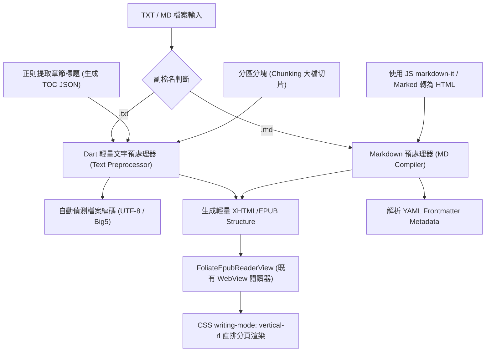

# TXT 與 Markdown 閱讀引擎開源方案研究報告

> **專案**：elinkBook — Flutter Android 電子書閱讀器  
> **核心差異化**：直排繁體中文排版 (Vertical Writing System for Traditional Chinese)  
> **放置路徑**：`tmp/research/txt_md_reader_engines_research.md`  
> **研究日期**：2026-08-09  

---

## 1. 研究背景與技術需求

elinkBook 目前在 EPUB 格式採用 **Foliate-js (WebView)** 引擎，PDF 格式採用 **pdfrx (PDFium FFI)** 引擎。為了擴展閱讀器功能，需評估支援 `.txt` (純文字) 與 `.md` (Markdown) 檔案的閱讀引擎方案。

### 1.1 TXT 與 MD 的核心排版挑戰
相較於 EPUB（天然由 XHTML 與 CSS 構成分頁章節），TXT 與 MD 是無分頁的流式文字（Continuous Text Stream），在電子書閱讀器中面臨以下關鍵技術挑戰：

1. **直排繁體中文分頁 (Vertical-RL Pagination)**：
   - 必須支援 CSS `writing-mode: vertical-rl` 或 Canvas 直排繪製。
   - 需正確處理直排標點符號轉置（括號、破折號、引號轉向）與避頭尾點（Kinsoku Shori / Line-breaking rules）。
2. **大檔案動態分塊與效能 (Stream Chunking & Large File Handling)**：
   - 網路小說 TXT 檔案常達數 MB 至數十 MB（數百萬字），無法一次性全載入 DOM 或記憶體中進行排版。需支援流式讀取與動態章節拆分。
3. **Markdown 多樣化語法混排 (Complex Markdown Rendering)**：
   - Markdown 包含不同高度的標題 (H1-H6)、代碼塊 (Code Block)、表格 (Table)、數學公式 (KaTeX/LaTeX)、圖片與列表。分頁時不能發生元素斷頁截斷或排版錯亂。

---

## 2. 三大開源閱讀引擎方案深度分析

本次研究挑選了三個代表不同技術路線（Web/JS WebView 方案、Android Native Canvas 方案、純 Dart 原生方案）的開源閱讀引擎進行深入比較。

---

### 方案一：Foliate-js (Web/JS Engine via InAppWebView)

* **專案出處**：[johnfactotum/foliate-js](https://github.com/johnfactotum/foliate-js)
* **核心技術**：JavaScript / Web Components / CSS Multi-Column & `writing-mode: vertical-rl`

#### 運作機制
Foliate-js 是知名 Linux 閱讀器 Foliate 的前端核心（亦為 elinkBook EPUB 引擎）。對於 `.txt` 與 `.md` 檔案，Foliate-js 可透過預處理器（Preprocessor）將純文字包裝為語意化 XHTML / EPUB 容器結構，交由基於 Chromium (WebView) 的 Layout Engine 處理，利用 CSS 欄位與 `writing-mode: vertical-rl` 自動實現分頁。Markdown 則可整合 `markdown-it` 或 `marked.js` 先行編譯為 DOM HTML 節點後載入。

#### 優點 (Pros)
1. **零新增原生架構依賴**：elinkBook 目前已建置成熟的 `FoliateEpubReaderView` 與 `foliate_native_bridge.dart`，架構可 100% 重用，無須引進新的原生 C++ 或 NDK 依賴。
2. **繁體中文直排 (`writing-mode: vertical-rl`) 最完美**：完全依賴 Android System WebView (Chromium) 內建強大的 CSS 直排排版引擎，支援直排標點轉置、豎排注音/旁註 (`<ruby>`) 與數字直排 (`text-combine-upright`)。
3. **Markdown 擴充性全場最強**：Web 生態系極為豐富，可無縫支援 KaTeX (數學公式)、Mermaid (圖表)、Highlight.js (程式碼高亮) 與自訂 CSS 主題。
4. **閱讀體驗完美統一**：字型大小、行高、字距、主題（E-Ink 黑白高對比）、劃線筆記與劃詞翻譯，可與既有 EPUB 閱讀器保持一致的操作手感。

#### 缺點 (Cons)
1. **WebView 記憶體與開銷**：WebView 的記憶體佔用（RAM）高於純 Native Canvas。
2. **超大 TXT 檔需要前端分塊預處理**：若 TXT 檔案超過 10MB（數百萬字），若未先於 Dart/JS 層進行章節分區（Section Chunking），一次傳入巨量 HTML 會引發 WebView 記憶體暴增與載入卡頓。

---

### 方案二：Legado (阅读) TXT Engine (Android Native Kotlin Engine)

* **專案出處**：[gedoor/legado](https://github.com/gedoor/legado) (GitHub 32k+ Stars 的 Android 開源閱讀器)
* **核心技術**：Android Native (Kotlin/Java) + `Canvas` / `TextPaint` + 自研動態分頁引擎 (`TextPageFactory`)

#### 運作機制
Legado 擁有一套為小說 TXT 量身打造的 Android 原生渲染引擎。背景線程使用 `RandomAccessFile` / `FileChannel` 進行流式讀取，並透過正則表達式（`ChapterProvider`）自動分析標題構建目錄。排版層直接以 Android Native `Canvas` 配合二分搜尋法計算字數與螢幕高寬，進行高效率分頁繪製。

#### 優點 (Pros)
1. **超大 TXT 檔案瞬間載入**：基於流式 `RandomAccessFile` 讀取與動態分頁，記憶體佔用極低（僅數十 MB），百萬字 TXT 小說載入與跳頁無任何卡頓。
2. **成熟的目錄自動辨識演算法**：內建極度完善的正則表達式目錄提取（如「第 X 章」、「Chapter X」），可自動為無目錄的 TXT 生成 Table of Contents。
3. **E-Ink 電子墨水屏極致優化**：原生 Canvas 繪製可進行像素級優化，支援黑白高對比、無動畫硬切頁與防殘影微刷。

#### 缺點 (Cons)
1. **跨平台與維護成本高**：Legado 為純 Kotlin/Android 專案，若要整合至 Flutter，需封裝為 PlatformView 或抽取其 Core 邏輯，無法直接移植至 iOS 或 Desktop。
2. **Markdown 支援度低**：Legado 的 Canvas Engine 專為純文字小說設計，若遇到 Markdown 的表格、代碼塊、複雜 HTML 標籤，需額外自行實作龐大的 Canvas Layout 邏輯。
3. **直排中文彈性不如 CSS**：Canvas 自行計算直排文字與標點符號轉換時，邊界避頭尾點與複雜字型渲染維護複雜。

---

### 方案三：Flutter Native Engine (flutter_markdown + Custom PagedCanvas / TextPainter)

* **專案出處**：[flutter_markdown](https://pub.dev/packages/flutter_markdown) + [paginated_text](https://pub.dev/packages/paginated_text) / 自研 Dart 分頁器
* **核心技術**：Dart 原生 + Flutter Engine (`TextPainter` / `CustomPainter` / `RenderParagraph`)

#### 運作機制
完全採用 Dart / Flutter 生態系。將 TXT 或 Markdown 在 Dart 層解析為 AST 語法樹，利用 `TextPainter.layout()` 測量在當前 Viewport (視窗大小) 下的行高與字數，計算頁碼切分點後，透過 `PageView` 或自訂 `CustomPainter` 呈現頁面。

#### 優點 (Pros)
1. **100% 純 Dart 實作，零跨語言開銷**：無 WebView、無 C++/Kotlin NDK 綁定，全平台（Android / iOS / Windows / macOS）100% 通用，維護成本最低。
2. **與 Flutter UI 體系無縫整合**：可完美套用 Flutter 的動畫、手勢控制（GestureDetector）、狀態管理（Riverpod / Bloc）與 Widget 樹。
3. **記憶體安全性高**：全部由 Dart VM 記憶體回收（GC）管理，無 Native 記憶體洩漏與跨語言 Bridge 溝通耗時。

#### 缺點 (Cons)
1. **直排中文分頁 (Vertical Layout Pagination) 實現極難**：Flutter 的 `TextPainter` 在直排 (`TextDirection`) 模式下的字形測量、豎排標點符號轉置與避頭尾點（Kinsoku Shori）不如 WebView 完整，需自行編寫大量文字測量與排版演算法。
2. **Markdown 跨頁斷開 (Block Split) 挑戰極高**：Markdown 包含不同高度的標題、程式碼區塊、圖片、表格。要在 Dart Widget 體系中處理跨頁元素的平滑斷開，容易造成頁面底端留白過大或內容被截斷。

---

## 3. 三大方案多維度對比矩陣

| 評估指標 | 方案一：Foliate-js (WebView) | 方案二：Legado Engine (Android Native) | 方案三：Flutter Native (Dart) |
| :--- | :--- | :--- | :--- |
| **核心差異化：繁體直排 (`vertical-rl`)** | ⭐⭐⭐⭐⭐ (原生 CSS 完美支援) | ⭐⭐⭐ (需 Canvas 人工計算) | ⭐⭐ (Dart 測量與標號轉置複雜) |
| **Markdown 語法與富文本支援度** | ⭐⭐⭐⭐⭐ (支援 Code/Math/Table/Mermaid) | ⭐ (僅支援純文字/基礎標題) | ⭐⭐⭐⭐ (支援基礎與延伸 MD 語法) |
| **超大 TXT 檔案載入效能** | ⭐⭐⭐ (需 Dart 分區 Chunking) | ⭐⭐⭐⭐⭐ (流式讀取，極速) | ⭐⭐⭐ (需 Dart 分區 Chunking) |
| **E-Ink 電子墨水屏適配性** | ⭐⭐⭐⭐ (全域 CSS 樣式控制) | ⭐⭐⭐⭐⭐ (Canvas 像素級控制) | ⭐⭐⭐⭐ (Flutter Widget 可控) |
| **elinkBook 既有架構重用性** | ⭐⭐⭐⭐⭐ (已有 Foliate Bridge) | ⭐⭐ (需封裝 Android Native) | ⭐⭐⭐ (需新寫 Dart 閱讀 Widget) |
| **跨平台擴充性 (Android/iOS/Desktop)** | ⭐⭐⭐⭐⭐ (全平台 WebView 通用) | ⭐ (僅限 Android) | ⭐⭐⭐⭐⭐ (全平台 Dart 通用) |
| **維護成本** | **低** | **高** | **中高** |

---

## 4. elinkBook 架構整合建議與實作路線圖

基於 elinkBook **「以直排繁體中文排版為核心差異化」** 以及 **「既有 EPUB 已採用 Foliate-js」** 的架構現況，提出以下整合建議：

### 4.1 推薦採納方案：**方案一 Foliate-js (Web/JS Engine via InAppWebView)**

#### 採納理由
1. **直排品質為核心命脈**：TXT/MD 在 elinkBook 的主要價值是提供「高質感直排閱讀體驗」。Foliate-js 依賴 Chromium 標準 CSS `writing-mode: vertical-rl`，是目前唯一能完美處理繁體中文直排、標點符號轉置與豎排注音的方案。
2. **架構一致性最高**：elinkBook 已經透過 `FoliateEpubReaderView` 建立完整的 JavaScript Bridge、音量鍵翻頁、主題切換與 E-Ink 模式。擴充支援 TXT / MD 可大幅減少開發成本與維護負擔。
3. **Markdown 渲染能力無法替代**：Markdown 的程式碼區塊、表格、LaTeX 公式與標題目錄，透過 JS 生態系 (`markdown-it` + Foliate) 可輕鬆達到專業出版級別排版。

---

### 4.2 建議實作路線圖 (Implementation Roadmap)

#### 具體步驟：
1. **建立 Dart 層 TXT/MD 預處理器 (Preprocessor)**：
   - 針對 TXT：實作編碼自動辨識（UTF-8, Big5），並以正則表達式（如 `^第[一二三四五六七八九十0-9]+章`）預先構建目錄 (TOC)。對於超大檔案，進行 500KB-1MB 的 Section 分區切片。
   - 針對 MD：提取 YAML Frontmatter，使用 `markdown` 庫或傳入 Web 層轉換為標準 HTML 節點。
2. **復用 Foliate 載入介面**：
   - 將預處理後的內容封裝為極簡 XHTML / HTML Data URI 或本機 Server 靜態檔，直接傳給 `foliate-js` 進行渲染。
3. **E-Ink 與直排樣式優化**：
   - 套用專為 TXT/MD 設計的 CSS 樣式表（含代碼塊直排轉橫排/保護、表格橫向滾動保護、黑白高對比主題）。

---
*報告完成，放置於 `@U:\MyDeveloper\AI\elinkBook\tmp\research\txt_md_reader_engines_research.md`*
